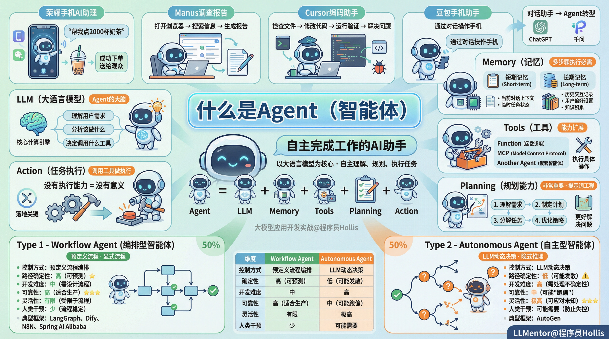
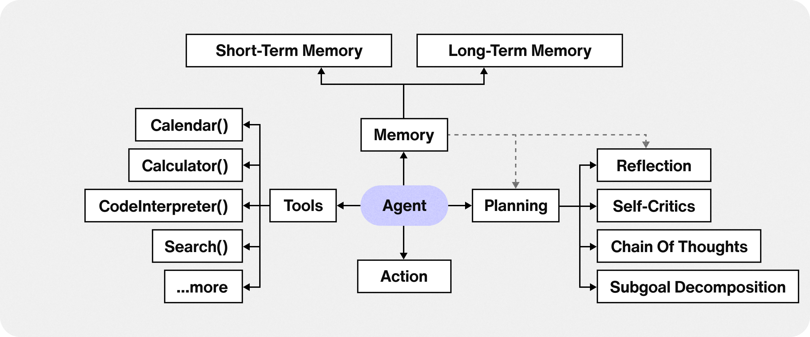
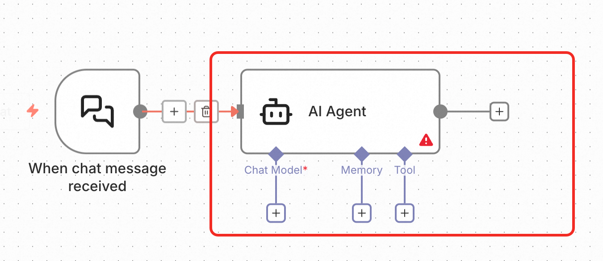

# ✅什么是AI Agent？

  

Agent，翻译成中文叫做智能体，是当前最火的一个词了。举几个大家容易理解的例子。

  

1、在去年荣耀的发布会上，CEO赵明对手机上的AI助理说了一句“帮我点2000杯奶茶”的指令，便成功通过手机下单2000杯奶茶，送给了现场观众。

  

2、去年，Manus横空出世，用户可以通过指令描述告诉他帮忙生成一份调查报告，他就能打开浏览器，搜索相关信息，并生成一份报告。

  

3、我们使用cursor做编码，告知他帮忙实现某个功能，他就能检查文件，找到合适的位置，做代码修改，然后运行验证是否有问题，如果有问题，帮忙解决。

  

4、最近豆包手机助手很火，可以通过对话让他帮忙操作你的手机。

  

还有很多很多，这些都是智能体。所以，所谓的AI Agent，其实就是一个可以自主完成工作的AI助手。

  

其实，现在很多LLM的对话工具，如ChatGPT、千问等，也在从对话助手向Agent转型。

  

如果一定要给他下个定义的话：**Agent是以大语言模型为核心计算引擎，能够自主理解、规划决策、执行负责任务的智能体。**

  

Agent 的四大核心能力：**目标驱动（Planning）**、**工具使用（Tools)**、**记忆保持(Memory）**、**自主决策（Action）**。

Agent = LLM + Memory + Tools + Planning + Action

  

如下面是n8n中AI Agent的定义方式，可以看到他针对AI Agent做了很好的抽象。

  

**LLM**：大语言模型，是Agent的大脑，需要用大模型来理解用户的需求，分析该做什么，决定要调用什么工具等等。

  

**Memory**：记忆，因为AI助理一般需要多个步骤来执行的，所以记忆是必要的。记忆除了我们前面介绍过的短期记忆以外，在agent的实际落地中，还需要长期记忆，这个我们在agent这个部分会重点讲解。

  

**Tools**：工具，agent需要能使用工具，这里的工具可以是我们在介绍spring ai的时候提到的function，也可以是MCP，甚至是另一个agent。

  

**Planning**：规划能力，这个是agent中非常重要的能力，需要理解需求后做规划，这样才能更好的解决问题，这部分需要通过提示词工程来提升模型的理解和规划能力。

  

**Action**：任务执行，这一步也很重要，一般来说就是调用工具做执行。如果agent没有执行能力，那么就一点意义都没有了。

  

基于系统的控制方式，我们将Agent分为两类：Workflow Agent / 编排型智能体、Autonomous Agent / 自主型智能体。

|  |  |  |
| --- | --- | --- |
|  | **Workflow Agent（编排型）** | **Autonomous Agent（自主型）** |
| **控制方式** | 预定义流程编排（显式流程） | LLM动态决策（隐式推理） |
| **路径确定性** | 高（可预测） | 低（可能发散） |
| **开发难度** | 中（需设计流程） | 高（需处理不确定性） |
| **可靠性** | 高（适合生产） | 中（可能“跑偏”） |
| **灵活性** | 有限（受限于流程） | 极高（可应对未知） |
| **典型框架** | **LangGraph、Dify、N8N、Spring AI Alibaba** | **AutoGen** |
| **是否需要人类干预** | 少（流程稳定） | 可能需要（防止失控） |

  

你可以将零散的思绪与文字先整理为草稿
