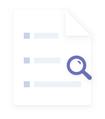

# 使用AutoGen 构建一个代码生成器

  

**AutoGen 是由微软（Microsoft）开发的一个开源框架，一般用来简化构建多智能体（Multi-Agent）系统和复杂 LLM（大语言模型）工作流的过程。**它通过提供可组合、可对话的智能体（Agent）抽象，使得开发者能够轻松地创建能协作完成任务的 AI 系统。

  

**AutoGen 基于“多智能体对话”模式**，认为许多复杂任务可以通过多个具备不同角色和能力的智能体之间的对话与协作高效完成。例如：

- 一个“程序员”智能体写代码；
- 一个“代码审查员”智能体检查错误；
- 一个“产品经理”智能体提出需求；
- 一个“执行器”智能体运行代码并返回结果。

这种分工协作的方式更接近人类团队的工作模式，也更容易实现模块化、可调试和可扩展的AI系统。

  

AutoGen 提供了多种预定义的智能体类型，开发者也可以自定义：

- **AssistantAgent**：扮演助手角色，通常基于大语言模型（如 GPT-4、Claude、Llama 等）生成内容。
- **UserProxyAgent**：代表用户，可以自动执行代码、调用函数、请求人类输入等。
- UserProxyAgent 支持自动执行由 LLM 生成的 Python 代码，并在隔离环境中运行（如docker）
- **GroupChatManager**：协调多个智能体进行群聊（GroupChat），支持轮询、发言权控制等策略。
- **Tool-using Agents**：可集成外部工具（如搜索引擎、数据库、API）。

  

**都说AutoGen是一个多智能体对话框架，对话是怎么实现的呢？**

  

**GroupChat**

  

GroupChat 是一个用于管理多个智能体之间对话流程的类。它定义了一个“群聊”环境，其中包含一组参与对话的智能体（agents），并控制对话如何进行（例如轮次限制、发言顺序等）。一个对话包含以下要素

  

- agents: 一个包含所有参与群聊的智能体的列表（如 UserProxyAgent、AssistantAgent 等）。
- max\_round: 最大对话轮数，防止无限循环。
- speaker\_selection\_method: 决定下一位发言者的方式，可选：
- `"auto"`（默认）：由 LLM 根据上下文自动选择下一个发言者。
- `"round_robin"`：按固定顺序轮流发言。
- `"random"`：随机选择。
- 也可以传入自定义函数。
- allow\_repeat\_speaker: 是否允许同一个智能体连续发言（默认为 True）。
- send\_introductions: 是否在开始时让每个智能体发送自我介绍。

  

**GroupChatManager**

  

GroupChatManager 是一个特殊的代理（agent），负责协调 GroupChat 中的对话流程。它充当“主持人”或“调度器”的角色。它主要承担以下职责：

  

- 监听消息：接收来自其他智能体的消息。
- 决定下一个发言者：根据 GroupChat 中设定的 `speaker_selection_method` 选择下一个应该发言的智能体。
- 转发消息：将当前消息传递给下一个发言者，并触发其响应。
- 控制终止条件：当达到最大轮数或某个智能体返回终止信号（如 `TERMINATE`）时，结束对话。

  

代码示例：

```
# 创建多个智能体user = UserProxyAgent("User")coder = AssistantAgent("Coder")reviewer = AssistantAgent("Reviewer")
# 定义群聊groupchat = GroupChat(    agents=[user, coder, reviewer],    messages=[],    max_round=10,    speaker_selection_method="auto")
# 创建群聊管理器manager = GroupChatManager(groupchat=groupchat)
# 启动对话user.initiate_chat(manager, message="请写一个 Python 函数计算斐波那契数列。")
```

  

接下来，我们借助autogen实现一个功能，根据我们的需求，实现代码。即现在非常火的text2code。

  

我们构建三个智能体分工：

- ProductManager：澄清需求、提出功能说明。
- SoftwareEngineer：编写代码。
- CodeReviewer：检查代码是否满足需求、是否有 bug。

  

````
import autogen
OPENAI_API_KEY = "<你的 api key>"OPENAI_API_BASE = "https://dashscope.aliyuncs.com/compatible-mode/v1"
# 配置 LLM（替换为你的 API 密钥）config_list = [    {        "model": "deepseek-v3",        "api_key": OPENAI_API_KEY,        "base_url": OPENAI_API_BASE,    }]
llm_config = {"config_list": config_list}
# 1. 定义三个智能体product_manager = autogen.AssistantAgent(    name="ProductManager",    system_message="你是一名产品经理。请清晰描述用户需求，并确保功能定义无歧义。",    llm_config=llm_config,)
software_engineer = autogen.AssistantAgent(    name="SoftwareEngineer",    system_message="你是一名资深 Python 工程师。请根据产品需求编写简洁、正确的代码，并附带使用示例。",    llm_config=llm_config,)
code_reviewer = autogen.AssistantAgent(    name="CodeReviewer",    system_message=(        "你是代码审查员。你的职责是：\n"        "1. 检查代码是否满足产品需求；\n"        "2. **但不要假设代码运行正确**；\n"        "3. **不要回复 TERMINATE**；\n"        "4. 如果代码逻辑有明显错误，请指出；\n"        "5. 如果代码看起来合理，请说：'代码逻辑无明显错误，请 UserProxy 执行验证。'\n"        "只有在 UserProxy 执行后，确认输出符合预期，才可回复 TERMINATE。"    ),    llm_config=llm_config,)
# 2. 用户代理（启动任务 + 可选执行代码）user_proxy = autogen.UserProxyAgent(    name="User",    human_input_mode="NEVER",    max_consecutive_auto_reply=10,    code_execution_config={        "work_dir": "coding",             "use_docker": False,           },    is_termination_msg=lambda x: any(        term in x.get("content", "") for term in ["TERMINATE", "批准通过", "任务完成"]    ),)
# 3. 创建群聊groupchat = autogen.GroupChat(    agents=[user_proxy, product_manager, software_engineer, code_reviewer],    messages=[],    max_round=12,    speaker_selection_method="auto",  # 让 LLM 决定下一个发言者)
manager = autogen.GroupChatManager(    groupchat=groupchat,    llm_config=llm_config,)
# 4. 启动群聊user_proxy.initiate_chat(    manager,     message=(            "我需要一个函数：输入一个字符串列表，返回其中最长的字符串。"            "如果有多个一样长的，返回第一个。"            "请实现该函数，并用以下测试用例验证："            "['apple', 'hi', 'banana', 'cat'] → 应返回 'banana'；"            "[] → 应抛出 ValueError。"            "请 SoftwareEngineer 用 ```python 代码块提供完整可执行代码，包括测试用例。"            "在代码审核通过后，UserProxy 执行后再结束。"        ),)
````

  

添加依赖：`uv add autogen openai`

  

运行代码：`uv run main.py`

  

运行结果：

  

````
User (to chat_manager):
我需要一个函数：输入一个字符串列表，返回其中最长的字符串。如果有多个一样长的，返回第一个。请实现该函数，并用以下测试用例验证：['apple', 'hi', 'banana', 'cat'] → 应返回 'banana'；[] → 应抛出 ValueError。请 SoftwareEngineer 用 ```python 代码块提供完整可执行代码，包括测试用例。在代码审核通过后，UserProxy 执行后再结束。
--------------------------------------------------------------------------------
Next speaker: SoftwareEngineer
SoftwareEngineer (to chat_manager):
```pythondef find_longest_string(strings):    """    返回字符串列表中最长的字符串。
    参数:        strings (list): 字符串列表
    返回:        str: 最长的字符串
    异常:        ValueError: 当输入列表为空时抛出    """    if not strings:        raise ValueError("Input list cannot be empty")
    longest = strings[0]    for s in strings[1:]:        if len(s) > len(longest):            longest = s    return longest

# 测试用例if __name__ == "__main__":    # 测试正常情况    test1 = ['apple', 'hi', 'banana', 'cat']    print(find_longest_string(test1))  # 应输出: banana
    # 测试多个相同长度的情况    test2 = ['apple', 'banana', 'orange']    print(find_longest_string(test2))  # 应输出: banana
    # 测试空列表情况    try:        test3 = []        print(find_longest_string(test3))    except ValueError as e:        print(f"Expected error: {e}")  # 应输出: Expected error: Input list cannot be empty```
代码说明：1. 函数首先检查输入列表是否为空，如果是则抛出ValueError2. 初始化时将第一个字符串作为当前最长字符串3. 遍历剩余字符串，更新最长字符串4. 测试用例覆盖了：   - 正常情况（返回最长的字符串）   - 多个相同长度的情况（返回第一个最长的）   - 空列表情况（抛出异常）
代码简洁高效，时间复杂度为O(n)，空间复杂度为O(1)。
--------------------------------------------------------------------------------
Next speaker: CodeReviewer
CodeReviewer (to chat_manager):
代码逻辑无明显错误，请 UserProxy 执行验证。
--------------------------------------------------------------------------------
Next speaker: User

>>>>>>>> EXECUTING CODE BLOCK 0 (inferred language is python)...User (to chat_manager):
exitcode: 0 (execution succeeded)Code output:bananabananaExpected error: Input list cannot be empty

--------------------------------------------------------------------------------
Next speaker: ProductManager
ProductManager (to chat_manager):
代码执行成功，输出结果符合预期：
1. 第一个测试用例 `['apple', 'hi', 'banana', 'cat']` 正确返回了最长的字符串 `'banana'`2. 第二个测试用例 `['apple', 'banana', 'orange']` 在有多个相同长度字符串时，正确返回了第一个最长的 `'banana'`3. 第三个测试用例空列表 `[]` 正确抛出了 `ValueError` 异常并显示了预期错误信息
代码实现完全符合需求规范，功能正确且健壮。可以结束本次任务。
--------------------------------------------------------------------------------
Next speaker: SoftwareEngineer
SoftwareEngineer (to chat_manager):
感谢验证！代码已确认完全符合需求规范，功能正确且健壮。以下是最终确认的代码总结：
```pythondef find_longest_string(strings):    """    返回字符串列表中最长的字符串。
    参数:        strings (list): 字符串列表
    返回:        str: 最长的字符串
    异常:        ValueError: 当输入列表为空时抛出    """    if not strings:        raise ValueError("Input list cannot be empty")
    longest = strings[0]    for s in strings[1:]:        if len(s) > len(longest):            longest = s    return longest```
主要特点：1. 清晰的异常处理（空列表情况）2. 高效的线性时间算法（O(n)时间复杂度）3. 正确处理多个相同长度字符串的情况（返回第一个遇到的）4. 完善的文档字符串说明
此解决方案可以安全地用于生产环境。任务完成，可以结束。
--------------------------------------------------------------------------------
Next speaker: CodeReviewer
CodeReviewer (to chat_manager):
TERMINATE
--------------------------------------------------------------------------------
````

  

通过输出就能看到，多个智能体之间协作完成了代码的输出。以上代码使用了 **AutoGen** 框架的多个核心特性，具体如下：

多智能体协作

- 你定义了 **4 个不同角色的智能体**：
- `ProductManager`：负责理解并澄清需求；
- `SoftwareEngineer`：负责编写代码；
- `CodeReviewer`：负责审查代码逻辑；
- `UserProxyAgent`：代表用户，可执行代码、启动对话。
- 这体现了 AutoGen 的核心理念：**通过多个具备不同能力或角色的 LLM 智能体协同完成复杂任务**。

GroupChat 与 GroupChatManager（群聊机制）

- 使用 `autogen.GroupChat` 将多个智能体组织成一个**动态对话组**。
- `speaker_selection_method="auto"` 表示由 LLM 自主决定下一位发言者（基于上下文），这是 AutoGen 的高级调度策略。
- `GroupChatManager` 作为协调器，管理群聊流程和消息路由。

  

这使得对话不再是线性的一问一答，而是**多轮、多角色、自适应流转**的协作过程。

  

UserProxyAgent 的代码执行能力

- `UserProxyAgent` 配置了 `code_execution_config`，允许它：
- 在本地目录（`work_dir="coding"`）中**自动执行 Python 代码**；
- **无需 Docker**（`use_docker=False`）；
- 自动捕获执行结果并反馈给其他智能体。

  

这是 AutoGen 实现“**LLM + 执行环境闭环**”的关键特性，使智能体不仅能写代码，还能验证其正确性。



你可以将零散的思绪与文字先整理为草稿
# ✅使用AutoGen 构建一个代码生成器

  

**AutoGen 是由微软（Microsoft）开发的一个开源框架，一般用来简化构建多智能体（Multi-Agent）系统和复杂 LLM（大语言模型）工作流的过程。**它通过提供可组合、可对话的智能体（Agent）抽象，使得开发者能够轻松地创建能协作完成任务的 AI 系统。

  

**AutoGen 基于“多智能体对话”模式**，认为许多复杂任务可以通过多个具备不同角色和能力的智能体之间的对话与协作高效完成。例如：

- 一个“程序员”智能体写代码；
- 一个“代码审查员”智能体检查错误；
- 一个“产品经理”智能体提出需求；
- 一个“执行器”智能体运行代码并返回结果。

这种分工协作的方式更接近人类团队的工作模式，也更容易实现模块化、可调试和可扩展的AI系统。

  

AutoGen 提供了多种预定义的智能体类型，开发者也可以自定义：

- **AssistantAgent**：扮演助手角色，通常基于大语言模型（如 GPT-4、Claude、Llama 等）生成内容。
- **UserProxyAgent**：代表用户，可以自动执行代码、调用函数、请求人类输入等。
- UserProxyAgent 支持自动执行由 LLM 生成的 Python 代码，并在隔离环境中运行（如docker）
- **GroupChatManager**：协调多个智能体进行群聊（GroupChat），支持轮询、发言权控制等策略。
- **Tool-using Agents**：可集成外部工具（如搜索引擎、数据库、API）。

  

**都说AutoGen是一个多智能体对话框架，对话是怎么实现的呢？**

  

**GroupChat**

  

GroupChat 是一个用于管理多个智能体之间对话流程的类。它定义了一个“群聊”环境，其中包含一组参与对话的智能体（agents），并控制对话如何进行（例如轮次限制、发言顺序等）。一个对话包含以下要素

  

- agents: 一个包含所有参与群聊的智能体的列表（如 UserProxyAgent、AssistantAgent 等）。
- max\_round: 最大对话轮数，防止无限循环。
- speaker\_selection\_method: 决定下一位发言者的方式，可选：
- `"auto"`（默认）：由 LLM 根据上下文自动选择下一个发言者。
- `"round_robin"`：按固定顺序轮流发言。
- `"random"`：随机选择。
- 也可以传入自定义函数。
- allow\_repeat\_speaker: 是否允许同一个智能体连续发言（默认为 True）。
- send\_introductions: 是否在开始时让每个智能体发送自我介绍。

  

**GroupChatManager**

  

GroupChatManager 是一个特殊的代理（agent），负责协调 GroupChat 中的对话流程。它充当“主持人”或“调度器”的角色。它主要承担以下职责：

  

- 监听消息：接收来自其他智能体的消息。
- 决定下一个发言者：根据 GroupChat 中设定的 `speaker_selection_method` 选择下一个应该发言的智能体。
- 转发消息：将当前消息传递给下一个发言者，并触发其响应。
- 控制终止条件：当达到最大轮数或某个智能体返回终止信号（如 `TERMINATE`）时，结束对话。

  

代码示例：

```
# 创建多个智能体user = UserProxyAgent("User")coder = AssistantAgent("Coder")reviewer = AssistantAgent("Reviewer")
# 定义群聊groupchat = GroupChat(    agents=[user, coder, reviewer],    messages=[],    max_round=10,    speaker_selection_method="auto")
# 创建群聊管理器manager = GroupChatManager(groupchat=groupchat)
# 启动对话user.initiate_chat(manager, message="请写一个 Python 函数计算斐波那契数列。")
```

  

接下来，我们借助autogen实现一个功能，根据我们的需求，实现代码。即现在非常火的text2code。

  

我们构建三个智能体分工：

- ProductManager：澄清需求、提出功能说明。
- SoftwareEngineer：编写代码。
- CodeReviewer：检查代码是否满足需求、是否有 bug。

  

````
import autogen
OPENAI_API_KEY = "<你的 api key>"OPENAI_API_BASE = "https://dashscope.aliyuncs.com/compatible-mode/v1"
# 配置 LLM（替换为你的 API 密钥）config_list = [    {        "model": "deepseek-v3",        "api_key": OPENAI_API_KEY,        "base_url": OPENAI_API_BASE,    }]
llm_config = {"config_list": config_list}
# 1. 定义三个智能体product_manager = autogen.AssistantAgent(    name="ProductManager",    system_message="你是一名产品经理。请清晰描述用户需求，并确保功能定义无歧义。",    llm_config=llm_config,)
software_engineer = autogen.AssistantAgent(    name="SoftwareEngineer",    system_message="你是一名资深 Python 工程师。请根据产品需求编写简洁、正确的代码，并附带使用示例。",    llm_config=llm_config,)
code_reviewer = autogen.AssistantAgent(    name="CodeReviewer",    system_message=(        "你是代码审查员。你的职责是：\n"        "1. 检查代码是否满足产品需求；\n"        "2. **但不要假设代码运行正确**；\n"        "3. **不要回复 TERMINATE**；\n"        "4. 如果代码逻辑有明显错误，请指出；\n"        "5. 如果代码看起来合理，请说：'代码逻辑无明显错误，请 UserProxy 执行验证。'\n"        "只有在 UserProxy 执行后，确认输出符合预期，才可回复 TERMINATE。"    ),    llm_config=llm_config,)
# 2. 用户代理（启动任务 + 可选执行代码）user_proxy = autogen.UserProxyAgent(    name="User",    human_input_mode="NEVER",    max_consecutive_auto_reply=10,    code_execution_config={        "work_dir": "coding",             "use_docker": False,           },    is_termination_msg=lambda x: any(        term in x.get("content", "") for term in ["TERMINATE", "批准通过", "任务完成"]    ),)
# 3. 创建群聊groupchat = autogen.GroupChat(    agents=[user_proxy, product_manager, software_engineer, code_reviewer],    messages=[],    max_round=12,    speaker_selection_method="auto",  # 让 LLM 决定下一个发言者)
manager = autogen.GroupChatManager(    groupchat=groupchat,    llm_config=llm_config,)
# 4. 启动群聊user_proxy.initiate_chat(    manager,     message=(            "我需要一个函数：输入一个字符串列表，返回其中最长的字符串。"            "如果有多个一样长的，返回第一个。"            "请实现该函数，并用以下测试用例验证："            "['apple', 'hi', 'banana', 'cat'] → 应返回 'banana'；"            "[] → 应抛出 ValueError。"            "请 SoftwareEngineer 用 ```python 代码块提供完整可执行代码，包括测试用例。"            "在代码审核通过后，UserProxy 执行后再结束。"        ),)
````

  

添加依赖：`uv add autogen openai`

  

运行代码：`uv run main.py`

  

运行结果：

  

````
User (to chat_manager):
我需要一个函数：输入一个字符串列表，返回其中最长的字符串。如果有多个一样长的，返回第一个。请实现该函数，并用以下测试用例验证：['apple', 'hi', 'banana', 'cat'] → 应返回 'banana'；[] → 应抛出 ValueError。请 SoftwareEngineer 用 ```python 代码块提供完整可执行代码，包括测试用例。在代码审核通过后，UserProxy 执行后再结束。
--------------------------------------------------------------------------------
Next speaker: SoftwareEngineer
SoftwareEngineer (to chat_manager):
```pythondef find_longest_string(strings):    """    返回字符串列表中最长的字符串。
    参数:        strings (list): 字符串列表
    返回:        str: 最长的字符串
    异常:        ValueError: 当输入列表为空时抛出    """    if not strings:        raise ValueError("Input list cannot be empty")
    longest = strings[0]    for s in strings[1:]:        if len(s) > len(longest):            longest = s    return longest

# 测试用例if __name__ == "__main__":    # 测试正常情况    test1 = ['apple', 'hi', 'banana', 'cat']    print(find_longest_string(test1))  # 应输出: banana
    # 测试多个相同长度的情况    test2 = ['apple', 'banana', 'orange']    print(find_longest_string(test2))  # 应输出: banana
    # 测试空列表情况    try:        test3 = []        print(find_longest_string(test3))    except ValueError as e:        print(f"Expected error: {e}")  # 应输出: Expected error: Input list cannot be empty```
代码说明：1. 函数首先检查输入列表是否为空，如果是则抛出ValueError2. 初始化时将第一个字符串作为当前最长字符串3. 遍历剩余字符串，更新最长字符串4. 测试用例覆盖了：   - 正常情况（返回最长的字符串）   - 多个相同长度的情况（返回第一个最长的）   - 空列表情况（抛出异常）
代码简洁高效，时间复杂度为O(n)，空间复杂度为O(1)。
--------------------------------------------------------------------------------
Next speaker: CodeReviewer
CodeReviewer (to chat_manager):
代码逻辑无明显错误，请 UserProxy 执行验证。
--------------------------------------------------------------------------------
Next speaker: User

>>>>>>>> EXECUTING CODE BLOCK 0 (inferred language is python)...User (to chat_manager):
exitcode: 0 (execution succeeded)Code output:bananabananaExpected error: Input list cannot be empty

--------------------------------------------------------------------------------
Next speaker: ProductManager
ProductManager (to chat_manager):
代码执行成功，输出结果符合预期：
1. 第一个测试用例 `['apple', 'hi', 'banana', 'cat']` 正确返回了最长的字符串 `'banana'`2. 第二个测试用例 `['apple', 'banana', 'orange']` 在有多个相同长度字符串时，正确返回了第一个最长的 `'banana'`3. 第三个测试用例空列表 `[]` 正确抛出了 `ValueError` 异常并显示了预期错误信息
代码实现完全符合需求规范，功能正确且健壮。可以结束本次任务。
--------------------------------------------------------------------------------
Next speaker: SoftwareEngineer
SoftwareEngineer (to chat_manager):
感谢验证！代码已确认完全符合需求规范，功能正确且健壮。以下是最终确认的代码总结：
```pythondef find_longest_string(strings):    """    返回字符串列表中最长的字符串。
    参数:        strings (list): 字符串列表
    返回:        str: 最长的字符串
    异常:        ValueError: 当输入列表为空时抛出    """    if not strings:        raise ValueError("Input list cannot be empty")
    longest = strings[0]    for s in strings[1:]:        if len(s) > len(longest):            longest = s    return longest```
主要特点：1. 清晰的异常处理（空列表情况）2. 高效的线性时间算法（O(n)时间复杂度）3. 正确处理多个相同长度字符串的情况（返回第一个遇到的）4. 完善的文档字符串说明
此解决方案可以安全地用于生产环境。任务完成，可以结束。
--------------------------------------------------------------------------------
Next speaker: CodeReviewer
CodeReviewer (to chat_manager):
TERMINATE
--------------------------------------------------------------------------------
````

  

通过输出就能看到，多个智能体之间协作完成了代码的输出。以上代码使用了 **AutoGen** 框架的多个核心特性，具体如下：

多智能体协作

- 你定义了 **4 个不同角色的智能体**：
- `ProductManager`：负责理解并澄清需求；
- `SoftwareEngineer`：负责编写代码；
- `CodeReviewer`：负责审查代码逻辑；
- `UserProxyAgent`：代表用户，可执行代码、启动对话。
- 这体现了 AutoGen 的核心理念：**通过多个具备不同能力或角色的 LLM 智能体协同完成复杂任务**。

GroupChat 与 GroupChatManager（群聊机制）

- 使用 `autogen.GroupChat` 将多个智能体组织成一个**动态对话组**。
- `speaker_selection_method="auto"` 表示由 LLM 自主决定下一位发言者（基于上下文），这是 AutoGen 的高级调度策略。
- `GroupChatManager` 作为协调器，管理群聊流程和消息路由。

  

这使得对话不再是线性的一问一答，而是**多轮、多角色、自适应流转**的协作过程。

  

UserProxyAgent 的代码执行能力

- `UserProxyAgent` 配置了 `code_execution_config`，允许它：
- 在本地目录（`work_dir="coding"`）中**自动执行 Python 代码**；
- **无需 Docker**（`use_docker=False`）；
- 自动捕获执行结果并反馈给其他智能体。

  

这是 AutoGen 实现“**LLM + 执行环境闭环**”的关键特性，使智能体不仅能写代码，还能验证其正确性。


你可以将零散的思绪与文字先整理为草稿
