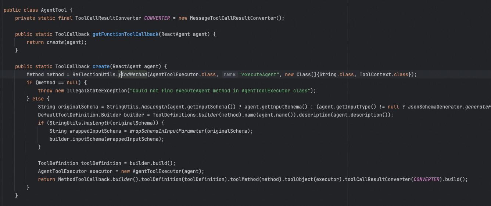
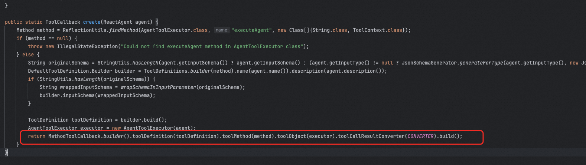
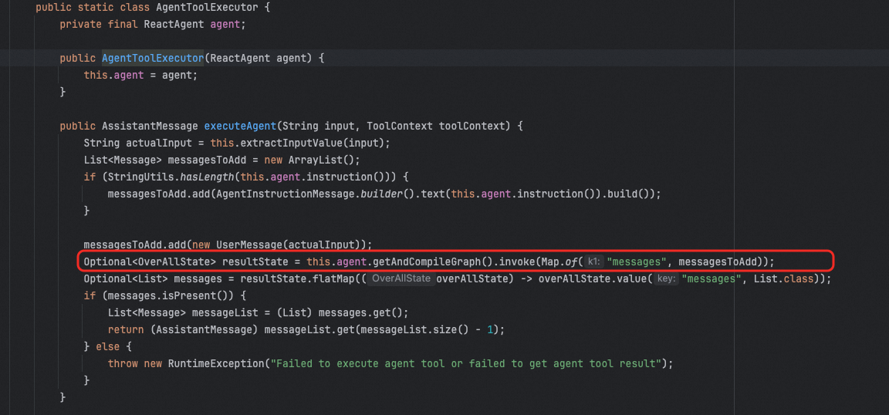
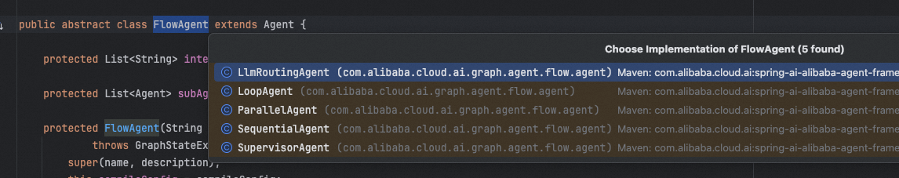

# ✅Spring AI Alibaba中的多智能体支持

除了Python中有很多框架可以实现多智能体以外，Java中的Spring AI Alibaba框架也提供了类似的功能。

  

前面我们介绍的多智能体的各种模式中，Spring AI主要支持了Agent Tool和Hand off两种实现。

  

## Agent Tool

  

Agent Tool的思想就是可以把其他的Agent当做工具，SpringAI Alibaba中定义了AgentTool，来表示一个智能体工具。

  



  

这个类中提供了一个getFunctionToolCallback方法，可以把一个ReactAgent转成ToolCallback

  

有了它， 实现多智能体就简单了。

  

```text
ReactAgent writerAgent = ReactAgent.builder()
        .name("writer_agent")
        .model(chatModel)
        .description("专门负责创作文章和内容生成")
        .instruction("你是一个专业作家，擅长各类文章创作。")
        .build();
// 创建翻译AgentReactAgent translatorAgent = ReactAgent.builder()
        .name("translator_agent")
        .model(chatModel)
        .description("专门负责文本翻译工作")
        .instruction("你是一个专业翻译，能够准确翻译多种语言。")
        .build();
// 创建总结AgentReactAgent summarizerAgent = ReactAgent.builder()
        .name("summarizer_agent")
        .model(chatModel)
        .description("专门负责内容总结和提炼")
        .instruction("你是一个内容总结专家，擅长提炼关键信息。")
        .build();
// 创建主Agent，集成多个工具ReactAgent multiToolAgent = ReactAgent.builder()
        .name("multi_tool_coordinator")
        .model(chatModel)
        .instruction("你可以访问多个专业工具：写作、翻译和总结。" +                     "根据用户需求选择合适的工具来完成任务。")
        .tools(                AgentTool.getFunctionToolCallback(writerAgent),                AgentTool.getFunctionToolCallback(translatorAgent),                AgentTool.getFunctionToolCallback(summarizerAgent)        )
        .build();
// 使用 - 主Agent会根据需求自动选择合适的工具Optional<OverAllState> result = multiToolAgent.invoke(        "请写一篇关于AI的文章，然后翻译成英文，最后给出摘要");


```

  

分别定义三个不同的子Agent，然后再定义一个主Agent，在主Agent中，通过tools设置三个工具，分别是三个子Agent通过AgentTool.getFunctionToolCallback转换出来的工具。

  

### 实现原理

  

AgentTool.getFunctionToolCallback的实现也不复杂，简单看看。

  

关键在最后一步：



  

通过Spring AI中提供的MethodToolCallback构造一个ToolBack，并将agent

的名字和描述作为工具的描述，然后将AgentToolExecutor这个内部类的executeAgent作为方法的工具的实际调用方法。

  

executeAgent中的代码也不复杂，核心就是我框出来这句，也就是直接调用Graph底层的invoke方法做执行。(这个invoke方法，ReactAgent的call在执行的时候也会调。)



  

## Hand off

  

除了上面的Agent Tool这种模式，还有Hand off，这种Spring AI Alibaba也支持。

  

并且官方针对这个Hand off支持了多种交接方式，包括串行、并行、路由、监督等等方式。通过FlowAgent定义的，他有多个实现类：

  



  

SequentialAgent：顺序执行模式，多个Agent按预定义的顺序依次执行。每个Agent的输出成为下一个Agent的输入。

  

```text
SequentialAgent blogAgent = SequentialAgent.builder()
   .name("blog_agent")
  .description("根据用户给定的主题写一篇文章，然后将文章交给评论员进行评论")
  .subAgents(List.of(writerAgent, reviewerAgent))
   .build();


```

  

ParallelAgent：并行执行模式，多个Agent同时处理相同的输入。它们的结果被收集并合并。

  

```text
ParallelAgent parallelAgent = ParallelAgent.builder()
   .name("parallel_creative_agent")
  .description("并行执行多个创作任务，包括写散文、写诗和做总结")
  .mergeOutputKey("merged_results")
   .subAgents(List.of(proseWriterAgent, poemWriterAgent, summaryAgent))
   .mergeStrategy(new ParallelAgent.DefaultMergeStrategy())
   .build();


```

  

LlmRoutingAgent：路由模式，使用LLM动态决定将请求路由到哪个子Agent。

  

```text
LlmRoutingAgent routingAgent = LlmRoutingAgent.builder()
  .name("content_routing_agent")
  .description("根据用户需求智能路由到合适的专家Agent")
  .model(chatModel)
   .subAgents(List.of(writerAgent, reviewerAgent, translatorAgent))
   .build();


```

  

SupervisorAgent：监督者模式，使*用大语言模型（LLM）作为监督者，动态决定将任务路由到哪个子Agent，并支持多步骤循环路由。与 LlmRoutingAgent 不同，SupervisorAgent 支持子Agent执行完成后返回监督者，监督者可以根据执行结果继续路*由到其他Agent或完成任务。

  

```text
SupervisorAgent supervisorAgent = SupervisorAgent.builder()
  .name("content_supervisor")
  .description("内容管理监督者，负责协调写作、翻译等任务")
  .model(chatModel)
   .subAgents(List.of(writerAgent, translatorAgent))
   .build();


```

  

### 实现原理

  

Spring AI Alibaba中的agent离不开graph，底层还是基于graph实现的。不管是串行、还是并行、还是其他的，无非就是画不同的有向图。

  

比如串行，其实就是按照顺序把多个agent的graph画出来就行了。


  

代码实现：

  


  

在顺序流程中，就是按照顺序取出subAgents，然后不断地添加node和edge把他们连起来。

  

## 啰嗦几句

  

其实可以看到，Spring AI Alibaba因为依赖了底层自己抽象出来的Graph，那么就可以非常灵活的做各种有向图的编排，可以快速的实现各种多智能体。

  

虽然用graph带来了一定的学习成本，但是熟练掌握之后，会发现这个方案还是有很多可取之处的。最关键的就是扩展性极强，非常的灵活。