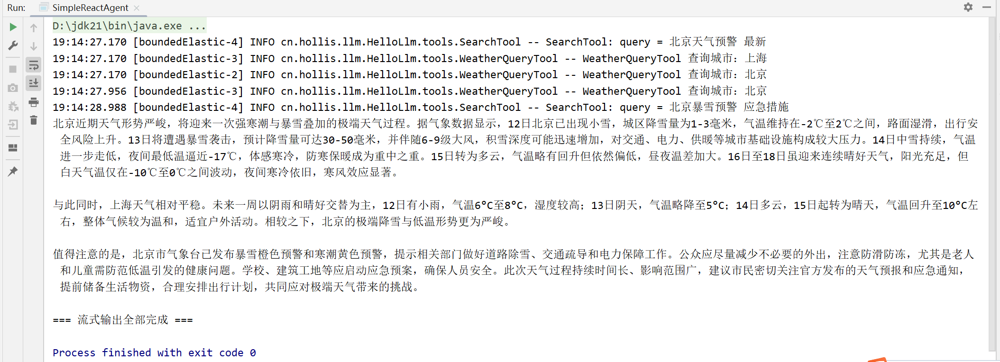
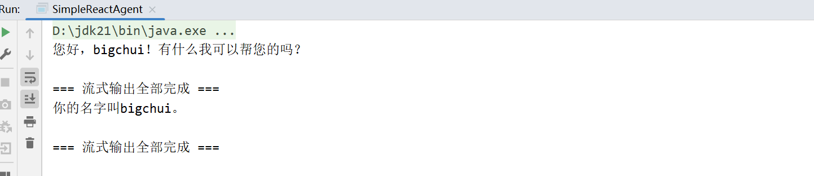

# ✅实战一：手搓 ReactAgent（流式）

在前面的章节中，我们已经通过非流式 `call` 方法完整跑通了一套 ReAct 的核心流程。但一旦把输出方式切换为流式，事情就会明显复杂起来，这也是为什么需要单独用一篇文章来讲 `SimpleReactAgent` 的流式实现。

流式调用的难点并不在于“如何把内容一点点吐给用户”，而在于 **ReAct 在流式场景下的状态如何被正确管理**。在非流式模式中，模型一次性返回完整结果：要么是最终答案，要么是完整的 ToolCall；而在流式模式下，模型的输出被拆成了多个 chunk，文本和 ToolCall 都是分段到达的，如果没有额外的状态管理能力，Agent无法判断当前轮次的模式的。

  

# 状态管理

在流式实现中，`SimpleReactAgent` 需要引入了一个非常关键的概念：**每一轮都有一个独立的执行状态**，也就是 `RoundState`，有点类似于 Alibaba React Agent 的 OverAllState 。这边的设计其实并不复杂，只负责记录三件事情：

- **当前这一轮到底是“最终答案模式”还是“工具调用模式”。**
- **第一块流式数据是否已经处理过。**
- **已经累积到的文本和 ToolCall 信息。**

通过这种方式，Agent 可以在流式数据刚到达的第一时间，就判断出模型这一轮的意图，从而决定后续 chunk 应该如何处理。

```
/** * 每轮执行的状态标记位 */private static class RoundState {    RoundMode mode = RoundMode.UNKNOWN;    // 第一块数据流是否已处理    boolean firstChunkHandled = false;
    // 累积收集的文本和tool_call信息    StringBuilder textBuffer = new StringBuilder();    List<AssistantMessage.ToolCall> toolCalls = Collections.synchronizedList(new ArrayList<>());}
/** * 运行模式：未知、最终答案、工具调用 */private enum RoundMode {    UNKNOWN,    FINAL_ANSWER,    TOOL_CALL}
```

# Stream

`stream`方法就是我们的入口类，返回的是我们很熟悉的 `Flux<String>`，也就是流式输出。 这里主要完成三件事情：

- **初始化上下文消息也就是**`messages`
- **创建用于向外部持续推送内容的**`Sink`
- **以及准备好轮次控制**`roundCounter`**和终止标记**`hasSentFinalResult`

真正的核心逻辑集中在 `scheduleRound` 中。每一轮都会创建一个新的 `RoundState`，并通过 `chatClient.stream()` 订阅模型的流式输出。每当新的 chunk 到来时，统一交由 `processChunk` 处理，而当这一轮流式输出结束时，再由 `finishRound` 决定是否进入下一轮。

```
/** * 流式输出 * * @param question * @return */public Flux<String> stream(String question) {    return streamInternal(null, question);}
// 带会话记忆public Flux<String> stream(String conversationId, String question) {    return streamInternal(conversationId, question);}

public Flux<String> streamInternal(String conversationId, String question) {    List<Message> messages = Collections.synchronizedList(new ArrayList<>());    boolean useMemory = conversationId != null && chatMemory != null;
    // ===== 加载历史记忆 =====    if (useMemory) {        List<Message> history = chatMemory.get(conversationId);        if (history != null && !history.isEmpty()) {            messages.addAll(history);        }    }
    // ===== 加载 System Prompt（仅新会话，防止重复）=====    if (messages.isEmpty()) {        messages.add(new SystemMessage(REACT_AGENT_SYSTEM_PROMPT));        messages.add(new SystemMessage(systemPrompt));    }
    messages.add(new UserMessage("<question>" + question + "</question>"));
    // 添加记忆    if (useMemory) {        chatMemory.add(conversationId, new UserMessage(question));    }
    Sinks.Many<String> sink = Sinks.many().unicast().onBackpressureBuffer();    // 迭代轮次    AtomicLong roundCounter = new AtomicLong(0);    // 是否发送最终结果标记位    AtomicBoolean hasSentFinalResult = new AtomicBoolean(false);
    hasSentFinalResult.set(false);    roundCounter.set(0);
    // 收集最终答案，存储memory    StringBuilder finalAnswerBuffer = new StringBuilder();
    scheduleRound(messages, sink, roundCounter, hasSentFinalResult, finalAnswerBuffer, useMemory, conversationId);
    return sink.asFlux()            // 收集最终答案            .doOnNext(finalAnswerBuffer::append)            .doOnCancel(() -> hasSentFinalResult.set(true));}
private void scheduleRound(List<Message> messages, Sinks.Many<String> sink, AtomicLong roundCounter, AtomicBoolean hasSentFinalResult,                           StringBuilder finalAnswerBuffer, boolean useMemory, String conversationId) {    // 轮次+1    roundCounter.incrementAndGet();    RoundState state = new RoundState();
    chatClient.prompt()            .messages(messages)            .stream()            .chatResponse()            .publishOn(Schedulers.boundedElastic())            .doOnNext(chunk -> processChunk(chunk, sink, state))            .doOnComplete(() -> finishRound(messages, sink, state, roundCounter, hasSentFinalResult, finalAnswerBuffer, useMemory, conversationId))            .doOnError(err -> {                if (!hasSentFinalResult.get()) {                    hasSentFinalResult.set(true);                    sink.tryEmitError(err);                }            })            .subscribe();}
```

`publishOn(Schedulers.boundedElastic())`可以理解为在模型流式输出和 Agent 处理逻辑之间加了一层缓冲区：模型可以持续、快速地把流式结果推送出来，而后续的状态判断、参数拼接、工具调度等处理逻辑，则交由一个专门用于执行可能较慢任务的线程池来消费。这样可以避免 Agent 的处理过程阻塞模型的流式输出，保证流式结果既连续又稳定，是流式 ReactAgent 中非常关键的一步。

# processChunk

`processChunk`的核心职责就是：**在流式输出尚未完整到达时，判断模型这一轮到底想干什么**。

第一块chunk 是整个流式处理中最关键的信号点，因此这里会优先检查是否已经出现 ToolCall：一旦在首个 chunk 中检测到工具调用，就可以立即判定当前轮次进入工具模式，后续所有数据只需要围绕工具参数的补全与收集即可；如果首块 chunk 中没有 ToolCall，则认为模型正在直接生成最终答案，文本就实时推送给用户。**这边需要特别说明：有一些带think推理的模型（如deepseek），这个地方需要做特殊截断处理，因为think 的文本内容会出现在 ToolCall 之前，这边的讲解默认是常规的指令模型。**

在模式确定之后，后续的 chunk 就只做两件非常明确的事情：**如果是最终答案模式，就持续将文本向外流式输出；如果是工具模式，则不对外输出内容，而是不断累积文本和 ToolCall 片段，直到本轮结束再统一处理。**

```
private void processChunk(ChatResponse chunk, Sinks.Many<String> sink, RoundState state) {    if (chunk == null || chunk.getResult() == null || chunk.getResult().getOutput() == null) return;
    Generation gen = chunk.getResult();    String text = gen.getOutput().getText();    List<AssistantMessage.ToolCall> tc = gen.getOutput().getToolCalls();
    // 第一块 chunk：决定模式    if (!state.firstChunkHandled) {        state.firstChunkHandled = true;
        if (tc != null && !tc.isEmpty()) {            state.mode = RoundMode.TOOL_CALL;            state.toolCalls.addAll(tc);            return;        }
        // 否则是最终答案模式        state.mode = RoundMode.FINAL_ANSWER;
        if (text != null)            sink.tryEmitNext(text);        return;    }
    // 后续 chunk    switch (state.mode) {        case FINAL_ANSWER -> {            if (text != null)                sink.tryEmitNext(text);        }        case TOOL_CALL -> {            if (text != null) state.textBuffer.append(text);            if (tc != null && !tc.isEmpty()) state.toolCalls.addAll(tc);        }    }}
```

# finishRound

一轮流式输出结束后，为这一轮 ReAct 做一个**明确的收尾判断**。如果当前轮次被判定为最终答案模式，说明模型已经给出了完整结论，此时 Agent 不再进入任何工具或下一轮推理，而是直接结束流式输出，整个 ReAct 流程自然终止。

如果这一轮是工具模式，Agent 则会把本轮流式过程中收集到的 ToolCall 和文本内容封装成一个完整的 `AssistantMessage`，写回到上下文中，补充模型的行动决策信息。随后，就是执行这些工具调用，并在工具全部完成后，**基于最新的上下文递归调度下一轮推理，也就是递归调用**`scheduleRound`**，就是相当于 call 非流式中的 **`while(true)`。

```
/** * 轮次结束处理工具调用 */private void finishRound(List<Message> messages, Sinks.Many<String> sink, RoundState state, AtomicLong roundCounter,                         AtomicBoolean hasSentFinalResult, StringBuilder finalAnswerBuffer, boolean useMemory, String conversationId) {    if (state.mode == RoundMode.FINAL_ANSWER) {        sink.tryEmitComplete();        hasSentFinalResult.set(true);
        if (useMemory) {            chatMemory.add(conversationId, new AssistantMessage(finalAnswerBuffer.toString()));        }        return;    }
    // 工具模式：将工具调用消息加入上下文    AssistantMessage assistantMsg = AssistantMessage.builder()            .content(state.textBuffer.toString())            .toolCalls(state.toolCalls)            .build();    messages.add(assistantMsg);
    // 判断是否达到最大轮次    if (maxRounds > 0 && roundCounter.get() >= maxRounds) {        log.info("达到最大轮次，结束对话");        if (!hasSentFinalResult.get()) {            // 强制输出结果            forceFinalStream(messages, sink, hasSentFinalResult);        }        return;    }
    // 执行工具并迭代进入下一轮    executeToolCalls(state.toolCalls, messages, hasSentFinalResult, () -> {        if (!hasSentFinalResult.get()) {            scheduleRound(messages, sink, roundCounter, hasSentFinalResult, finalAnswerBuffer, useMemory, conversationId);        }    });}
```

这个地方需要注意的是：`forceFinalStream`**，与非流式一样，他也需要一个达到最大**`maxRounds`**时的强制终止且流数输出的操作，并且同样也需要**`ensureToolCallsClosed`**方法来做兼容，否则会有很大的可能性报错400。**

```
private void forceFinalStream(List<Message> messages, Sinks.Many<String> sink, AtomicBoolean hasSentFinalResult) {    // AssistantMessage包含toolcall，必须后面是ToolResponseMessage，否则会报错400    ensureToolCallsClosed(messages);    messages.add(new UserMessage("""            你已达到最大推理轮次限制。            请基于当前已有的上下文信息，            直接给出最终答案。            禁止再调用任何工具。            如果信息不完整，请合理总结和说明。            """));
    chatClient.prompt()            .messages(messages)            .stream()            .chatResponse()            .publishOn(Schedulers.boundedElastic())            .doOnNext(chunk -> {                if (chunk == null || chunk.getResult() == null || chunk.getResult().getOutput() == null) {                    return;                }
                String text = chunk.getResult()                        .getOutput()                        .getText();
                if (text != null && !hasSentFinalResult.get()) {                    sink.tryEmitNext(text);                }            })            .doOnComplete(() -> {                hasSentFinalResult.set(true);                sink.tryEmitComplete();            })            .doOnError(err -> {                hasSentFinalResult.set(true);                sink.tryEmitError(err);            })            .subscribe();}
```

# executeToolCalls

**将当前轮次中给出的所有 ToolCall 落地执行**。这里并没有按顺序串行调用工具，而是将每一个工具调用都调度到 `boundedElastic` 线程池中并发执行，这样可以避免单个慢工具拖住整个 Agent。每一次工具执行的结果，都会被统一封装为 `ToolResponseMessage` 并写回 `messages`，作为下一轮推理所需的 Observation 输入。为了在并发执行的情况下仍然保持 ReAct 轮次边界的清晰性，这里通过一个计数器来判断本轮工具是否已经全部执行完成。只有当所有 ToolCall 都结束后，才会触发 `onComplete` 回调，进而调度下一轮推理。这样一来，模型始终是基于**完整的工具执行结果**进入下一轮决策。

```
private void executeToolCalls(List<AssistantMessage.ToolCall> toolCalls, List<Message> messages, AtomicBoolean hasSentFinalResult, Runnable onComplete) {    AtomicInteger completedCount = new AtomicInteger(0);    int totalToolCalls = toolCalls.size();
    for (AssistantMessage.ToolCall tc : toolCalls) {        Schedulers.boundedElastic().schedule(() -> {            if (hasSentFinalResult.get()) {                completeToolCall(completedCount, totalToolCalls, onComplete);                return;            }
            String toolName = tc.name();            String argsJson = tc.arguments();
            ToolCallback callback = findTool(toolName);            if (callback == null) {                addErrorToolResponse(messages, tc, "工具未找到：" + toolName);                completeToolCall(completedCount, totalToolCalls, onComplete);                return;            }
            try {                Object result = callback.call(argsJson);                String resultStr = Objects.toString(result, "");                ToolResponseMessage.ToolResponse tr = new ToolResponseMessage.ToolResponse(                        tc.id(), toolName, resultStr);                messages.add(ToolResponseMessage.builder()                        .responses(List.of(tr))                        .build());            } catch (Exception ex) {                addErrorToolResponse(messages, tc, "工具执行失败：" + ex.getMessage());            } finally {                completeToolCall(completedCount, totalToolCalls, onComplete);            }        });    }}
private void completeToolCall(AtomicInteger completedCount, int total, Runnable onComplete) {    int current = completedCount.incrementAndGet();    if (current >= total) {        onComplete.run();    }}
private ToolCallback findTool(String name) {    return tools.stream()            .filter(t -> t.getToolDefinition().name().equals(name))            .findFirst()            .orElse(null);}
```

# 效果演示

与 call 非流式的演示方法类似，我们这边也直接构造2个模拟工具，并使用 blockLast 来阻塞打印流式输出。

```
public static void main(String[] args) {    String baseUrl = "https://dashscope.aliyuncs.com/compatible-mode/";    String apiKey = "sk-XXXXXXXXXXXXXXXXXXXXXXXX";    String modelName = "qwen-plus";
    OpenAiChatOptions opts = new OpenAiChatOptions();    opts.setModel(modelName);    opts.setMaxTokens(3000);    opts.setTemperature(0.7);
    ChatModel chatModel = OpenAiChatModel.builder()            .openAiApi(OpenAiApi.builder()                    .baseUrl(baseUrl)                    .apiKey(new SimpleApiKey(apiKey))                    .build())            .defaultOptions(opts)            .build();
    ToolCallback weatherTool = FunctionToolCallback            .builder("weather", new WeatherQueryTool())            .description("查询指定城市的实时天气和未来一周天气趋势")            .inputType(String.class)            .build();
    ToolCallback searchTool = FunctionToolCallback            .builder("search", new SearchTool())            .description("搜索指定关键词的信息，补充天气分析所需的背景数据")            .inputType(String.class)            .build();        ChatMemory chatMemory = MessageWindowChatMemory.builder().maxMessages(20).build();
    SimpleReactAgent agent = SimpleReactAgent.builder()            .name("simple-agent")            .chatModel(chatModel)            .maxRounds(-1)            .chatMemory(chatMemory)            .tools(weatherTool, searchTool)            .systemPrompt("你是专业的研究分析助手！")            .build();
    String question = """            请你根据北京今天的天气、未来七天的天气趋势、以及上海今天的天气，并搜索北京天气的预警情况，生成一份不少于 600 字的综合分析报告。            """;
//        System.out.println(agent.call(question));
    agent.stream(question)            .doOnNext(chunk -> {                System.out.print(chunk);            })            .doOnError(error -> System.err.println("\n出错：" + error))            .doOnComplete(() -> System.out.println("\n\n=== 流式输出全部完成 ==="))            .blockLast();
}
```



再尝试下历史记忆：

```
agent.stream("123","我的名字叫bigchui")        .doOnNext(chunk -> {            System.out.print(chunk);        })        .doOnError(error -> System.err.println("\n出错：" + error))        .doOnComplete(() -> System.out.println("\n\n=== 流式输出全部完成 ==="))        .blockLast();
agent.stream("123","我的名字叫什么？")        .doOnNext(chunk -> {            System.out.print(chunk);        })        .doOnError(error -> System.err.println("\n出错：" + error))        .doOnComplete(() -> System.out.println("\n\n=== 流式输出全部完成 ==="))        .blockLast();
```



# 总结

通过这一节的学习可以看到，`SimpleReactAgent`的流式实现并没有改变 ReAct 的整体推理结构，而是把原本在非流式模式下一次性完成的判断与决策，拆解成了一个可持续推进的过程。借助 `RoundState`，Agent能在流式 chunk 不断到达的过程中，及时判断当前轮次是最终答案还是工具调用，并据此选择是对外实时输出，还是在内部持续收集参数与上下文。

整体流程依然遵循标准的 ReAct 闭环：模型决策 → Agent 执行工具 → 结果回填 → 进入下一轮推理。不同之处只在于，流式场景下这些步骤被分布在多个回调与轮次中完成，使 Agent 既能保证输出的实时性，又不会破坏 ReAct 推理链路的完整性与可控性。

这里也顺便强调一下一个常见但并不推荐的做法：**假流式输出**。有些实现仍然使用非流式的 `call` 一次性拿到完整结果，然后再把最终字符串按长度切割成多个 chunk，**模拟成“打字机逐段输出”给用户**。这样的实现虽然代码简单，看起来也有流式效果，但本质上结果早已全部生成完成，用户仍然要等待完整推理结束后才能看到内容。

相比之下，真正的流式 ReAct 是**模型在推理过程中边生成、边决策、边输出**，不仅首 token 延迟更低，也能让工具调用、状态判断和用户反馈同时进行。假流式只解决了展示形式的问题，却失去了流式在响应速度和交互体验上的核心价值。
s
