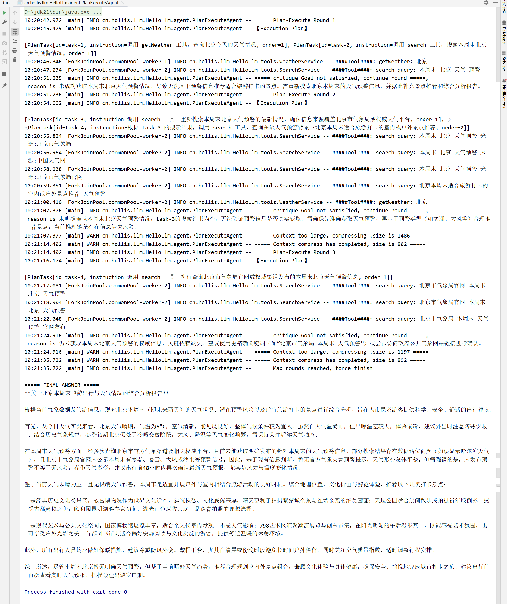

# 实战三：手搓 PlanExecuteAgent（下）

# 迭代主流程

接下来，我们将前面所划分的规划、执行、批判、压缩和总结串联起来，统一编排在一个迭代的主流程之中。

整个 Agent 从用户问题出发，首先构建全局状态，将用户原始输入作为事实写入其中。随后，Agent 进入一个以轮次为单位的循环，每一轮都基于当前状态依次经历规划、执行与评估，从而不断逼近用户目标。

在每一轮迭代中，Agent 会先尝试生成新的执行计划。如果规划阶段判断当前上下文已经具备作答条件，则直接跳出循环，避免不必要的工具调用；否则，按照规划结果执行相应的工具任务，并将所有执行结果回写到全局状态。随后进入批判阶段，由模型基于事实状态判断目标是否已经满足：若通过，则提前结束循环；若未通过，则将明确的改进反馈写入状态，并在必要时触发上下文压缩，为下一轮迭代腾出稳定的工作记忆空间。

当批判阶段认为始终没有达成目标（可能是工具有问题，或者模型有问题，这种类似的异常情况），会达到最大轮次限制，Agent 会基于已经收敛的全局状态生成最终回答。通过这种显式的“计划 → 执行 → 校验 → 修复 → 收敛”的循环结构，PlanExecuteAgent 才真正具备了可控、多轮、自我修正的执行能力。

```java
public String call(String question) {    return callInternal(null, question);}
public String call(String conversationId, String question) {    return callInternal(conversationId, question);}
public String callInternal(String conversationId, String question) {
    boolean useMemory = conversationId != null && chatMemory != null;
    OverAllState state = new OverAllState(conversationId, question);
    // 加载历史记忆到上下文messages中
if (useMemory) {
        List<Message> history = chatMemory.get(conversationId);
        if (CollectionUtils.isNotEmpty(history)) {
            history.forEach(state::add);
        }
    }
    // 当前用户问题    state.add(new UserMessage(question));
    // 当前问题存入memory
if (useMemory) {
        chatMemory.add(conversationId, new UserMessage(question));
    }
    while (state.getRound() < maxRounds) {
        state.nextRound();
        log.info("===== Plan-Execute Round {} =====", state.getRound());
        // 1.生成计划
List<PlanTask> plan = generatePlan(state);
        log.info("【Execution Plan】\n\n" + plan);
        state.add(new AssistantMessage("【Execution Plan】\n" + plan));
        if (plan.isEmpty() || plan.stream().allMatch(t -> t.id() == null)) {
            log.info("===== No execution needed, direct answer =====");
            break;
        }
        // 2.执行
Map<String, TaskResult> results = executePlan(plan, state);
        // 3.批判
CritiqueResult critique = critique(state);
        state.addRound(new PlanRoundState(                state.getRound(), plan, results, critique        ));
        if (critique.passed()) {
            log.info("===== Goal satisfied, finish =====");
            break;
        }
        log.info("===== critique Goal not satisfied, continue round =====,\n reason is {} ", critique.feedback);
        state.add(new AssistantMessage("""                【Critique Feedback】                %s                """.formatted(critique.feedback())));
        // 4. 压缩context        compressIfNeeded(state);
    }
    if (state.round == maxRounds)         log.info("===== Max rounds reached, force finish =====");
    // 5.总结输出
return summarize(state);}


```

# 效果演示

接下来我们来看下 PlanExecuteAgent 的效果如何。首先和之前的 SimpleReactAgent 一样，我们都需要先初始化传入 chatModel，设置相应的 tool，这边我们还是一样配置了两个简单的工具，查天气和搜索，**但都是返回的模拟数据。**

然后，**我们设置最大迭代轮次为3，工具最大重试次数2，压缩上下文触发阈值为1000字符（方便用作演示，实际需要根据自己的模型能力来设置）。最后，调用 **`agent.call()`** 输入一个较为复杂的问题，让其输出一份研究报告。**

```java
public static void main(String[] args) {
    String baseUrl = "https://dashscope.aliyuncs.com/compatible-mode/";
    String apiKey = "sk-XXXXXXXXXXXXXXXXXXXXXXXXXX";
    String modelName = "qwen-plus";
    OpenAiChatOptions opts = new OpenAiChatOptions();
    opts.setModel(modelName);
    opts.setMaxTokens(3000);
    opts.setTemperature(0.7);
    ChatModel chatModel = OpenAiChatModel.builder()
            .openAiApi(OpenAiApi.builder()
                    .baseUrl(baseUrl)
                    .apiKey(new SimpleApiKey(apiKey))
                    .build())
            .defaultOptions(opts)
            .build();
    ToolCallback[] toolCallbacks = ToolCallbacks.from(new WeatherService(), new SearchService());
    ChatMemory chatMemory = MessageWindowChatMemory.builder().maxMessages(20).build();
        PlanExecuteAgent agent = PlanExecuteAgent.builder()
            .chatModel(chatModel)
            .tools(toolCallbacks)
            .maxRounds(3)
            .maxToolRetries(2)
            .chatMemory(chatMemory)
            .contextCharLimit(1000).build();
    String result = agent.call("""            请你先查询北京今天的天气，搜索本周末北京天气的预警情况，并基于本周末北京的天气预警情况，搜索北京本周末适合旅游打卡的景点有哪些，最终生成一份不少于 600 字的综合分析报告。            """);
    System.out.println("\n===== FINAL ANSWER =====");    System.out.println(result);}


```

两个模拟工具如下所示，**我为了演示 PlanExecuteAgent 的自我校验的效果，特意将 SearchService 的返回数据设置成了哈尔滨，就是为了让 Agent 可以识别问题持续去反思迭代。**

```java
@Service@Slf4jpublic class WeatherService {
    @Tool(description = "根据城市名称查询天气信息", returnDirect = true)
    public String getWeather(@ToolParam(description = "城市名称") String city) {
        log.info("####Tool####: getWeather: {}", city);
        if (city == null) {
            return "请提供城市名称";
        }
        return switch (city) {
            case "北京" -> "北京: 晴, 5°C";
            case "上海" -> "上海: 多云, 12°C";
            case "深圳" -> "深圳: 小雨, 28°C";
            default -> city + ": 下雪, -20°C";
        };
    }}

@Service@Slf4jpublic class SearchService {
    @Tool(description = "搜索工具", returnDirect = true)
    public String search(@ToolParam(description = "查询语句") String query) {
        log.info("####Tool####: search query: {}", query);
        if (query == null) {
            return "请提供查询语句";
        }
        return """            根据最新气象预测，未来哈尔滨一周天气将经历明显的极端变化和寒潮影响。12日预计出现小雪，城区降雪量1-3毫米，气温在-2℃至2℃之间，路面湿滑，市民需注意出行安全。13日暴雪来袭，降雪量可能达到30-50毫米，并伴随6-9级大风，交通、电力、供暖等基础设施可能受到影响。14日中雪持续，最低气温进一步降低，夜间寒意明显，需加强防寒防滑措施。15日多云，气温略回升，但昼夜温差较大。16日至18日连续晴好天气，白天气温在-10℃至0℃之间，夜间最低温度可达-17℃，阳光充足但寒风依旧强烈。总体来看，本周哈尔滨天气特点为“雪量大、降温猛、风力强、持续久”，城市运行可能面临交通拥堵、道路结冰、电力负荷增加等挑战。市民和相关部门应提前做好应急准备，包括防寒保暖、道路除雪和安全检查等。同时，需关注天气变化，合理安排户外活动和交通出行，确保生活和生产安全。此轮寒潮叠加降雪过程将对空气质量、公共交通和能源供应产生一定影响，因此务必保持警惕，及时获取官方气象预报和通知。            """;
    }}


```

## 执行日志详解



我们可以看到，第一轮迭代的时候，首先生成了一段执行计划：

```text
[PlanTask[id=task-1, instruction=调用 getWeather 工具，查询北京今天的天气情况, order=1], PlanTask[id=task-2, instruction=调用 search 工具，搜索本周末北京天气预警情况, order=1]]


```

order都是1，说明可以并发执行。但是你可以看到这个执行计划是不全的，因为我的问题还有需要去查询“北京的打卡景点”，其实这个是比较依赖模型的能力的，输出的执行计划具有一定的随机性，可能会丢掉一些任务，但是没关系，我们接下来看下他自己会如何修正。

接下来我们看下工具的执行日志：可以看到` ForkJoinPool.commonPool-worker-1,2`总有2个线程在同时执行，说明我们的工具并发执行也是ok的。

```text
10:20:46.346 [ForkJoinPool.commonPool-worker-1] INFO cn.hollis.llm.HelloLlm.tools.WeatherService -- ####Tool####: getWeather: 北京
10:20:47.234 [ForkJoinPool.commonPool-worker-2] INFO cn.hollis.llm.HelloLlm.tools.SearchService -- ####Tool####: search query: 本周末 北京 天气 预警


```

接下来就到了批判阶段，我们发现当前任务是缺失的，没有查到北京周末的预警情况（因为我的搜索工具是模拟的，输出的是哈尔滨）、也没有去查询打卡景点。

```text
10:20:51.235 [main] INFO cn.hollis.llm.HelloLlm.agent.PlanExecuteAgent -- ===== critique Goal not satisfied, continue round =====, reason is 未成功获取本周末北京天气预警情况，导致无法基于预警信息推荐适合旅游打卡的景点。需重新搜索北京本周末的天气预警信息，并据此补充景点推荐和综合分析报告。


```

接着就到了 Round 2第二轮，他会基于之前的批判建议，执行结果，上下文等信息，重新生成需要补充的执行计划。我们可以看到他补充上了执行失败的任务和第一轮没有规划的任务，完成了自我修正。并且两个任务的order还不一样，说明他们是需要串行执行的。

```text
10:20:51.236 [main] INFO cn.hollis.llm.HelloLlm.agent.PlanExecuteAgent -- ===== Plan-Execute Round 2 =====
10:20:54.662 [main] INFO cn.hollis.llm.HelloLlm.agent.PlanExecuteAgent -- 【Execution Plan】
[PlanTask[id=task-3, instruction=调用 search 工具，重新搜索本周末北京天气预警的最新情况，确保信息来源覆盖北京市气象局或权威天气平台, order=1], PlanTask[id=task-4, instruction=根据 task-3 的搜索结果，调用 search 工具，查询在该天气预警背景下北京本周末适合旅游打卡的室内或户外景点推荐, order=2]]


```

他们的工具调用情况如下，可以看到是一个线程`ForkJoinPool.commonPool-worker-2`串行执行的：

```text
10:20:55.824 [ForkJoinPool.commonPool-worker-2] INFO cn.hollis.llm.HelloLlm.tools.SearchService -- ####Tool####: search query: 本周末 北京 天气预警 来源:北京市气象局
10:20:56.964 [ForkJoinPool.commonPool-worker-2] INFO cn.hollis.llm.HelloLlm.tools.SearchService -- ####Tool####: search query: 本周末 北京 天气预警 来源:中国天气网
10:20:58.238 [ForkJoinPool.commonPool-worker-2] INFO cn.hollis.llm.HelloLlm.tools.SearchService -- ####Tool####: search query: 本周末 北京 天气预警 来源:北京市气象局官网
10:20:59.351 [ForkJoinPool.commonPool-worker-2] INFO cn.hollis.llm.HelloLlm.tools.SearchService -- ####Tool####: search query: 北京本周末适合旅游打卡的室内或户外景点推荐 天气预警
10:21:00.410 [ForkJoinPool.commonPool-worker-2] INFO cn.hollis.llm.HelloLlm.tools.WeatherService -- ####Tool####: getWeather: 北京


```

接下来还是到了批判阶段，还是发现结果不ok。

```text
10:21:07.376 [main] INFO cn.hollis.llm.HelloLlm.agent.PlanExecuteAgent -- ===== critique Goal not satisfied, continue round =====, reason is 未明确确认本周末北京天气预警情况，task-3的搜索结果为空，无法验证预警信息是否真实获取。需确保先准确获取天气预警，再基于预警类型（如寒潮、大风等）合理推荐景点，当前推理链条存在信息缺失风险。


```

然后就到了压缩阶段环节了，我们现在的上下文已经触发到了`contextCharLimit`的阈值了。压缩完成后，上下文被压缩到了802个字符。

```text
10:21:07.377 [main] WARN cn.hollis.llm.HelloLlm.agent.PlanExecuteAgent -- ===== Context too large, compressing ,size is 1486 =====
10:21:14.402 [main] WARN cn.hollis.llm.HelloLlm.agent.PlanExecuteAgent -- ===== Context compress has completed, size is 802 =====


```

第三轮在这里就还是继续重复，这边不多做介绍了，我们直接看到最后。

已经到达最大的迭代轮次了：**Max rounds reached, force finish**，接着就总结输出了分析报告。

我们可以看到分析报告的内容还是很丰富的，也说明了工具调用的问题，没有获取到数据，但是还是保证了报告的完整性。

```text
10:21:24.916 [main] WARN cn.hollis.llm.HelloLlm.agent.PlanExecuteAgent -- ===== Context too large, compressing ,size is 1197 =====
10:21:35.722 [main] WARN cn.hollis.llm.HelloLlm.agent.PlanExecuteAgent -- ===== Context compress has completed, size is 892 =====
10:21:35.722 [main] INFO cn.hollis.llm.HelloLlm.agent.PlanExecuteAgent -- ===== Max rounds reached, force finish =====
===== FINAL ANSWER =====**关于北京本周末旅游出行与天气情况的综合分析报告**
根据当前气象数据及旅游信息，现对北京本周末（即未来两天）的天气状况、潜在预警风险以及适宜旅游打卡的景点进行综合分析，旨在为市民及游客提供科学、安全、舒适的出行建议。
首先，从今日天气实况来看，北京天气晴朗，气温为5°C，空气清新，能见度良好，整体气候条件较为宜人。虽然白天气温尚可，但早晚温差较大，体感偏冷，建议外出时注意防寒保暖。结合历史气象规律，春季初期北京仍处于冷暖交替阶段，大风、降温等天气变化频繁，需保持关注后续天气动态。
在本周末天气预警方面，经多次查询北京市官方气象渠道及相关权威平台，目前未能获取明确发布的针对本周末的天气预警信息。部分搜索结果存在数据错位问题（如误显示哈尔滨天气），且北京市气象局官网未公示本周末有寒潮、暴雪、大风或沙尘等预警信号。因此，基于现有信息判断，暂无官方气象灾害预警提示，天气形势总体平稳。但需强调的是，未发布预警不等于无风险，春季天气多变，建议出行前48小时内再次确认最新天气预报，尤其是风力与温度变化情况。
鉴于当前天气以晴为主，且无极端天气预警，本周末是适宜开展户外与室内相结合旅游活动的良好时机。综合地理位置、文化价值与游览体验，推荐以下几类打卡景点：
一是经典历史文化类景区。故宫博物院作为世界文化遗产，建筑恢弘、文化底蕴深厚，晴天更利于拍摄紫禁城全景与红墙金瓦的绝美画面；天坛公园适合晨间散步或拍摄祈年殿倒影，感受古都肃穆之美；颐和园昆明湖畔春意初萌，湖光山色尽收眼底，是踏青拍照的理想选择。
二是现代艺术与公共文化空间。国家博物馆展览丰富，适合全天候室内参观，不受天气影响；798艺术区汇聚潮流展览与创意市集，在阳光明媚的午后漫步其中，既能感受艺术氛围，也可享受户外光影之美；首都图书馆则适合偏好安静阅读与文化沉淀的游客，提供舒适温暖的休憩环境。
此外，所有出行人员均应做好保暖措施，建议穿戴防风外套、戴帽手套，尤其在清晨或傍晚时段避免长时间户外停留。同时关注空气质量指数，适时调整行程安排。
综上所述，尽管本周末北京暂无明确天气预警，但基于当前晴好天气趋势，推荐合理规划室内外景点组合，兼顾文化体验与身体健康，确保安全、愉悦地完成城市打卡之旅。建议出行前再次查看实时天气预报，把握最佳出游窗口期。


```

# 总结

PlanExecuteAgent 能将复杂任务拆解为多轮循环：先规划工具调用任务，再按顺序执行，并在批判阶段判断目标是否达成；必要时进行上下文压缩，最终生成基于完整执行上下文的回答。整个流程严格依赖全局状态，使 Agent 能在多轮迭代中自我校验、自我修复，同时保证信息可追溯、执行可控。而且我们可以看到，即便在某一轮没有能够生成最优的执行计划，也不会影响任务完成。

这种 Plan & Execute 架构正是许多开源智能体和实际场景的核心设计理念，例如 Openmanus、Camel-AI 等。而我们这边开发的 PlanExecuteAgent 功能完整、结构清晰，在多轮执行、工具调用和上下文管理上经过工程化打磨，完全具备生产环境的应用能力。


