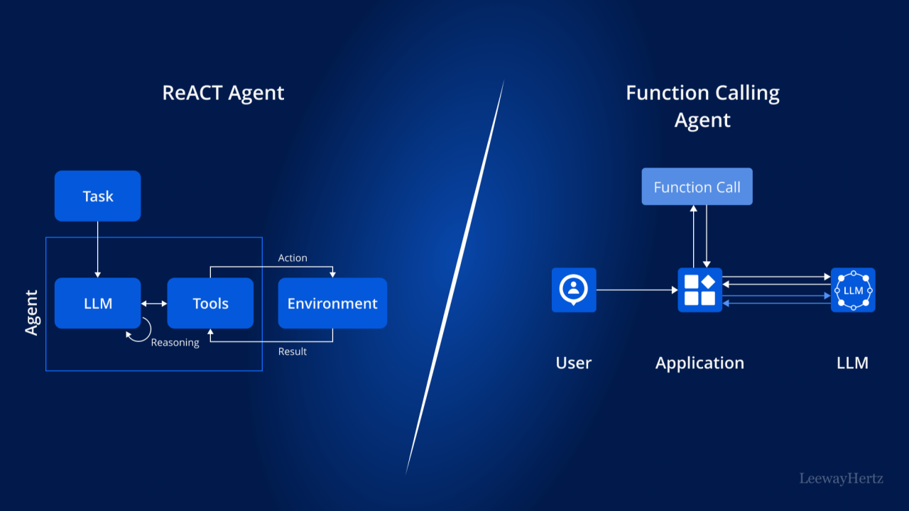

# ✅React Agent的实现方式？


  

想要实现ReAct Agent，有两个关键点：

  

1、要让LLM按照ReAct的方式运行。

2、我们需要通过代码让Agent的"思考结果"、"行动"等串起来。

  



### ReAct Prompt

想要让你的Agent能够按照思考 + 行动 + 观察的思路运行，提示词必须要给出说明，这是至关重要的一步，如果没有这一步，别的做了再多都是白搭。

以下是一个典型的ReAct System Prompt :

```
你是一个基于React架构（Reasoning-Act-Observation）的智能助手，你擅长使用工具帮我解决问题。
你的工作流程是：思考：基于当前获得的信息进行推理和反思，明确下一步行动的目标。行动：用于表示需要调用的工具，每一步行动必须是以下两种之一：  1、工具调用 [Function Calling]：根据任务需要，确定调用工具。  2、Finish[答案]：得出明确答案后使用此操作，返回答案并终止任务。观察：记录前一步行动的结果。
你可以进行多轮推理和检索，但必须严格按照上述格式进行操作，尤其是每一步“行动”只能使用上述两种类型之一。
```

按照以上提示词运行的话，一个LLM每一轮的运行输出结果有两种情况：

  

1、工具调用

2、Finish\[答案\]

如果解决问题的过程中，LLM认为还需要调用工具，则返回具体要调用的工具。如果LLM认为可以回答了，则返回 Finish+答案

  

### ReAct Agent

通过以上Prompt约束之后，模型的输出结果，如果是要调用工具的话，那么就要继续执行，代码做工具调用，把调用结果组装给大模型，然后继续运行。

直到最终大模型输出不需要工具调用的时候，就可以返回了。那么整个运行过程就有以下流程：

```
while (true) {  // 1、（Thought）大模型调用，根据大模型输出，判断是否需要工具调用，调用哪个工具，入参是什么
  if(无需工具调用) {    break;  }
  // 2、（Action）工具调用
  // 3、（Observation）拿到工具调用的执行结果，追加到prompt中，回到1，进行下一轮LLM调用}
```

这部分需要靠代码实现的，因为我们前面讲过的，LLM不会具体调用工具，他只会告诉我们调用哪个工具和入参，所以，整个编排的过程需要靠代码实现。

  

openManus

接下来可以看看open manus中ReAct的实现（https://github.com/FoundationAgents/OpenManus/tree/main ）：

app/agent/base.py中的run方法，核心逻辑就是循环调用`step`方法，执行多步，直至达到最大步数或达到`FINISHED`状态，`step`方法是一个抽象方法，由`BaseAgent`类的子类实现：

  

```
async def run(self, request: Optional[str] = None) -> str:        """Execute the agent's main loop asynchronously.
        Args:            request: Optional initial user request to process.
        Returns:            A string summarizing the execution results.
        Raises:            RuntimeError: If the agent is not in IDLE state at start.        """        if self.state != AgentState.IDLE:            raise RuntimeError(f"Cannot run agent from state: {self.state}")
        if request:            self.update_memory("user", request)
        results: List[str] = []        async with self.state_context(AgentState.RUNNING):            while (                self.current_step < self.max_steps and self.state != AgentState.FINISHED            ):                self.current_step += 1                logger.info(f"Executing step {self.current_step}/{self.max_steps}")                step_result = await self.step()
                # Check for stuck state                if self.is_stuck():                    self.handle_stuck_state()
                results.append(f"Step {self.current_step}: {step_result}")
            if self.current_step >= self.max_steps:                self.current_step = 0                self.state = AgentState.IDLE                results.append(f"Terminated: Reached max steps ({self.max_steps})")        await SANDBOX_CLIENT.cleanup()        return "\n".join(results) if results else "No steps executed"
```

app/agent/react.py 实现了`step`方法，核心逻辑就是实现ReAct框架，在每步执行时，先调用`think`方法进行思考，再调用`act`方法进行行动

```
async def step(self) -> str:      """Execute a single step: think and act."""      should_act = await self.think()      if not should_act:          return "Thinking complete - no action needed"      return await self.act()
```

app/agent/toolcall.py中实现了`think`方法和`act`方法，`think`方法中，基于Tool Call，将可用的工具集和历史消息一并发送给大语言模型，由大语言模型进行思考，返回需要调用的工具和参数，`act`方法中，根据大语言模型返回的结果，调用工具，返回工具执行的结果。

  

类似的实现，在前面我们提到的jd的agent框架中，实现也基本都一样，如run方法：

  

如果映射到java代码的话，大致流程就是这样的：

```
@GetMapping("/chat")public String chat(String conversationId) {    //定义ChatOptions    ChatOptions chatOptions = ToolCallingChatOptions.builder()            //指定工具            .toolCallbacks(ToolCallbacks.from(new StockTools()))            .build();
    //定义提示词，要求按照React架构运行    Prompt prompt = new Prompt(            List.of(new SystemMessage("""                    你是一个基于React架构（Reasoning-Act-Observation）的智能助手，你擅长使用工具帮我解决问题。                                        你的工作流程是：                    思考：基于当前获得的信息进行推理和反思，明确下一步行动的目标。                    行动：用于表示需要调用的工具，每一步行动必须是以下两种之一：                      1、工具调用 [Function Calling]：根据任务需要，确定调用工具。                      2、Finish[答案]：得出明确答案后使用此操作，返回答案并终止任务。                    观察：记录前一步行动的结果。                                        你可以进行多轮推理和检索，但必须严格按照上述格式进行操作，尤其是每一步“行动”只能使用上述两种类型之一。                                        """), new UserMessage("帮我分析最近三个月特斯拉（TSLA）的股价走势，并结合新闻事件解释可能的影响因素。")),            chatOptions);
    //添加提示词到记忆    chatMemory.add(conversationId, prompt.getInstructions());
    Prompt promptWithMemory = new Prompt(chatMemory.get(conversationId), chatOptions);
    //调用模型    ChatResponse chatResponse = chatModel.call(promptWithMemory);
    //添加模型返回结果到记忆    chatMemory.add(conversationId, chatResponse.getResult().getOutput());
    //循环处理工具调用    while (!chatResponse.getResult().getOutput().getText().contains("Finish")) {        //执行工具调用
        //添加工具调用结果到记忆
        //创建新的提示词
        //调用模型
        //添加模型返回结果到记忆    }
    return chatResponse.getResult().getOutput().getText();}
```

以上代码我并没有把所有流程都实现出来，主要是因为这个方案其实并不好，因为他需要根据模型的输出结果判断要不要继续执行action，其实我们可以利用spring ai中的功能，spring ai提供了功能，可以在模型结果中判断是否需要调模型。

  

### Spring AI实现

  

但是需要注意的是，默认情况下spring ai会自动调用工具，所以我们需要把他设置为不自动调用，一个完整的react 的代码如下：

  

```
@GetMapping("/chat")public String chat(String conversationId) {    //定义ChatOptions    ChatOptions chatOptions = ToolCallingChatOptions.builder()            //指定工具            .toolCallbacks(ToolCallbacks.from(new StockTools()))            //指定不自动执行工具            .internalToolExecutionEnabled(false)            .build();
    //定义提示词，要求按照React架构运行    Prompt prompt = new Prompt(            List.of(new SystemMessage("你是一个基于React架构（Reasoning-Act-Observation）的智能助手，你擅长使用工具帮我解决问题。" +                    "你的工作流程是：" +                    "1、思考：先根据用户的提问进行思考，推理出下一步需要进行的具体系统" +                    "2、行动：做具体的行动，这一步可以使用工具" +                    "3、观察：记录前一步行动的结果。你可以进行多轮思考和行动。如果要使用工具，请务必调用工具，不要自己随便捏造结果。"), new UserMessage("帮我分析最近三个月特斯拉（TSLA）的股价走势，并结合新闻事件解释可能的影响因素。")),            chatOptions);
    //添加提示词到记忆    chatMemory.add(conversationId, prompt.getInstructions());
    Prompt promptWithMemory = new Prompt(chatMemory.get(conversationId), chatOptions);
    //调用模型    ChatResponse chatResponse = chatModel.call(promptWithMemory);
    //添加模型返回结果到记忆    chatMemory.add(conversationId, chatResponse.getResult().getOutput());
    //循环处理工具调用    while (chatResponse.hasToolCalls()) {        //执行工具调用        ToolExecutionResult toolExecutionResult = toolCallingManager.executeToolCalls(promptWithMemory,                chatResponse);
        //添加工具调用结果到记忆        chatMemory.add(conversationId, toolExecutionResult.conversationHistory()                .get(toolExecutionResult.conversationHistory().size() - 1));
        //创建新的提示词        promptWithMemory = new Prompt(chatMemory.get(conversationId), chatOptions);
        //调用模型        chatResponse = chatModel.call(promptWithMemory);
        //添加模型返回结果到记忆        chatMemory.add(conversationId, chatResponse.getResult().getOutput());    }
    for (Message message11 : chatMemory.get(conversationId)) {        System.out.println(message11);    }
    return chatResponse.getResult().getOutput().getText();}
```

  

这里首先在prompt中，移除了关于输出要求的内容，并且指定了工具toolCallbacks(ToolCallbacks.from(new StockTools())) ，也设置了工具的不自动执行internalToolExecutionEnabled(false)。

  

详见：https://docs.spring.io/spring-ai/reference/api/tools.html\#\_user\_controlled\_tool\_execution

并且在工具执行后，LLM调用后，都把结果放到记忆中，这样LLM才能观察到之前的结果。

  

### Spring AI Alibaba实现

在spring ai alibaba 的新版本中（\>= 1.1.0.0-RC1） ，已经内置了一个React Agent，可以直接用：

```
@GetMapping("/chat")public String chat(String conversationId) throws GraphRunnerException {
    String systemPrompt = String.format("你是一个基于React架构（Reasoning-Act-Observation）的智能助手，你擅长使用工具帮我解决问题。" +            "你的工作流程是：" +            "1、思考：先根据用户的提问进行思考，推理出下一步需要进行的具体系统" +            "2、行动：做具体的行动，这一步可以使用工具" +            "3、观察：记录前一步行动的结果。你可以进行多轮思考和行动。如果要使用工具，请务必调用工具，不要自己随便捏造结果。");
    ReactAgent agent = ReactAgent.builder()            .name("executor")            .model(chatModel)            .tools(ToolCallbacks.from(new StockTools()))            .systemPrompt(systemPrompt)            .saver(new MemorySaver())            .build();
    RunnableConfig config = RunnableConfig.builder()            .threadId(conversationId)            .build();
    AssistantMessage chatResponse = agent.call("帮我分析最近三个月特斯拉（TSLA）的股价走势，并结合新闻事件解释可能的影响因素。", config);
    return chatResponse.getText();}
```

同样能实现类似的功能。他的原理后面单独讲。

  

但是需要注意的是，这个react agent只能代替我们实现代码部分的功能，即他会自动的根据是否有工具执行来判断是不是要继续执行，以及设置记忆等。但是他无法代替我们的提示词的react的指定，如果没有关于提示词的指定的话，它的输出就不稳定：

```
@GetMapping("/chat")public String chat(String conversationId) throws GraphRunnerException {
    String systemPrompt = String.format("你是一个智能助手，你擅长使用工具帮我解决问题。注意：你应该先查询时间，然后再查询航班帮我解决问题");
    ReactAgent agent = ReactAgent.builder()            .name("executor")            .model(chatModel)            .tools(ToolCallbacks.from(new StockTools()))            .systemPrompt(systemPrompt)            .saver(new MemorySaver())            .build();
    RunnableConfig config = RunnableConfig.builder()            .threadId(conversationId)            .build();
    AssistantMessage chatResponse = agent.call("帮我分析最近三个月特斯拉（TSLA）的股价走势，并结合新闻事件解释可能的影响因素。", config);
    return chatResponse.getText();}
```

  

（ModelScope的实现，我们在ModelScope章节单独介绍）

[✅React Agent的实现方式？](https://thoughts.aliyun.com/workspaces/6963289eb0fc2e001bb052eb/docs/697f10e0c71a890001bbe197#slate-title)

[ReAct Prompt](https://thoughts.aliyun.com/workspaces/6963289eb0fc2e001bb052eb/docs/697f10e0c71a890001bbe197#697f1102f65d21d3edd4da83)

[ReAct Agent](https://thoughts.aliyun.com/workspaces/6963289eb0fc2e001bb052eb/docs/697f10e0c71a890001bbe197#697f1102f65d2120b9d4da8d)

[Spring AI实现](https://thoughts.aliyun.com/workspaces/6963289eb0fc2e001bb052eb/docs/697f10e0c71a890001bbe197#697f1102f65d218da5d4daa2)

[Spring AI Alibaba实现](https://thoughts.aliyun.com/workspaces/6963289eb0fc2e001bb052eb/docs/697f10e0c71a890001bbe197#697f1102f65d21995ad4daad)


你可以将零散的思绪与文字先整理为草稿
