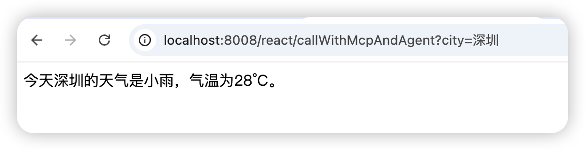

# ✅Alibaba-React Agent 初探

目前，Spring AI Alibaba 1.1 版本正式发布，它已经提供了**生产级 ReactAgent 的实现**。**ReactAgent** 是基于 **Graph 运行时**（Graph Runtime）的概念构建的。这个 Graph 运行时定义了一个结构化的执行流程，使 Agent 的推理和工具调用过程可控、可追溯。所谓 Graph 也就是图，它是由节点（Node）和边（Edge）构成的。

Agent 的核心执行流程是一个**持续的推理和工具调用的循环**，直到满足停止条件（例如，模型输出最终答案或达到预设的最大迭代次数）。在执行过程中，Agent 在以下几种核心节点（Node）之间流转：

- **Model Node（模型节点）**：这是 Agent 的“大脑”。它负责调用大模型，根据当前上下文（包括历史对话、工具描述和最近的观察结果）进行推理和决策，决定下一步是使用哪个工具、使用什么参数，或者直接得出最终结论。
- **Tool Node（工具节点）**：这是 Agent 的“手脚”。当大模型决定使用工具时，此节点会执行实际的工具函数调用，并捕获执行结果。
- **Hook Nodes（钩子节点）**：允许开发者在 Agent 流程的关键位置（如模型调用前、工具调用后）插入自定义的逻辑（例如日志记录、错误处理或动态提示修改），类似 Spring AI 中的 advisor 机制。

通过这种基于图的运行时结构，ReactAgent 能够清晰、高效地管理 LLM 的每一次推理、工具的每一次执行，从而实现复杂任务的自动化处理。


## 如何使用

### 引入依赖

~~首先还是引入依赖，我在使用 1.1.0 的 Spring AI 和 Alibaba 时遇到了兼容性问题，这边阿里官网推荐的 1.1.0.0-M5 版本和 Spring AI 的 1.1.0 版本是不兼容的，所以在官方修复兼容性问题前，我们这边使用 M4 版本进行实验即可。~~

~~**兼容性问题：**~~ ~~https://github.com/alibaba/spring-ai-alibaba/issues/3324~~

使用 spring ai 1.1.0.0 版本。

```xml
<dependency>
  <groupId>com.alibaba.cloud.ai</groupId>
  <artifactId>spring-ai-alibaba-agent-framework</artifactId>
  <version>1.1.0.0</version>
</dependency>

<dependency>
  <groupId>com.alibaba.cloud.ai</groupId>
  <artifactId>spring-ai-alibaba-starter-dashscope</artifactId>
  <version>1.1.0.0</version>
</dependency>


```

### 创建模拟工具

```java
@Slf4j
public class SearchTool implements BiFunction<String, ToolContext, String> {
    @Override
    public String apply(String query, ToolContext context) {
        log.info("SearchTool: query = {}, context = {}", query, context);
        return "搜索结果: 【" + query + "】 — 这是一个模拟结果。";
    }
}


```

### 创建智能体

```java
// 初始化 DashScopeApi
DashScopeApi dashScopeApi = DashScopeApi.builder()
    .apiKey("sk-XXXXXXXXXXXXXXXXXXXXX")
    .build();

// 创建 ChatModel
var chatModel = DashScopeChatModel.builder()
    .dashScopeApi(dashScopeApi)
    .build();

// 创建一个简单工具
var searchTool = FunctionToolCallback.builder("search", new SearchTool())
       .description("简单搜索工具")
       .inputType(String.class)
       .build();

// 创建 Agent
ReactAgent agent = ReactAgent.builder()
        .name("demo_agent")
        .model(chatModel)
        .tools(searchTool)
        .hooks(new LoggingHook())
        .systemPrompt("你是一个助手。如果用户提到需要搜索，就调用 search 工具，否则直接回答。")
        .build();


```

### 非流式输出

```java
String userInput = "帮我搜索 Spring AI 的用途";
var response = agent.call(userInput);
System.out.println("Agent 返回: " + response.getText());


```

### 流式输出

它的流式输出与直接调用 Spring AI 返回的流式输出不同，它的返回结构是：`Flux<NodeOutput>`，因为它是图结构，需要将每个节点的输出都合并成一个流，所以需要判断当前流是否是 `StreamingOutput` 还是普通的节点输出才可以。

```java
@GetMapping("/streamWithSpringAiAlibaba")
public Flux<String> streamWithSpringAiAlibaba(String conversationId) throws GraphRunnerException {

    String systemPrompt = String.format("你是一个基于React架构（Reasoning-Act-Observation）的智能助手，你擅长使用工具帮我解决问题。" +
            "你的工作流程是：" +
            "1、思考：先根据用户的提问进行思考，推理出下一步需要进行的具体系统" +
            "2、行动：做具体的行动，这一步可以使用工具" +
            "3、观察：记录前一步行动的结果。你可以进行多轮思考和行动。如果要使用工具，请务必调用工具，不要自己随便捏造结果。");

    ReactAgent agent = ReactAgent.builder()
            .name("executor")
            .model(chatModel)
            .tools(ToolCallbacks.from(new StockTools()))
            .systemPrompt(systemPrompt)
            .saver(new MemorySaver())
            .build();

    RunnableConfig config = RunnableConfig.builder()
            .threadId(conversationId)
            .build();

    return agent.stream("帮我分析最近三个月特斯拉（TSLA）的股价走势，并结合新闻事件解释可能的影响因素。", config)
            .map(output -> {
                if (output instanceof StreamingOutput) {
                    Message message = ((StreamingOutput<?>) output).message();
                    return message != null ? message.getText() : "";
                } else {
                    String nodeId = output.node();
                    Map<String, Object> state = output.state().data();
                    return "节点 '" + nodeId + "' 执行完成\n";
                }
            })
            .filter(text -> !text.isEmpty());
}


```

### 接入 MCP

Spring AI Alibaba 的底层还是依赖 Spring AI Apache，所以我们还是可以兼容使用之前的做法，构建 `ToolCallback` 即可。

```java
@GetMapping("/callWithMcpAndAgent")
public Mono<String> callWithMcpAndAgent(String city) {
    return Mono.fromCallable(() -> {
        // 配置自定义 HttpClient，增加超时时间和错误处理
        HttpClientStreamableHttpTransport streamableTransport = HttpClientStreamableHttpTransport
                .builder("http://127.0.0.1:8004/stream/test/")
                .endpoint("api/mcp")
                .clientBuilder(HttpClient.newBuilder()
                        .connectTimeout(Duration.ofSeconds(60))  // 连接超时60秒
                        .version(HttpClient.Version.HTTP_1_1))   // 使用 HTTP/1.1 更稳定
                .build();

        McpSyncClient streamableClient = McpClient.sync(streamableTransport)
                .clientInfo(new io.modelcontextprotocol.spec.McpSchema.Implementation("streamable-client", "1.0"))
                .requestTimeout(Duration.ofSeconds(60))  // 增加请求超时到60秒
                .build();

        try {
            // 在弹性调度器中执行阻塞调用
            streamableClient.initialize();
        } catch (Exception e) {
            throw new RuntimeException("MCP Client 初始化失败: " + e.getMessage(), e);
        }

        List<McpSyncClient> clients = List.of(streamableClient);

        SyncMcpToolCallbackProvider provider = SyncMcpToolCallbackProvider.builder()
                .mcpClients(clients)
                .build();

        ToolCallback[] callbacks = provider.getToolCallbacks();

        // 创建 Agent
        ReactAgent agent = ReactAgent.builder()
                .name("demo_agent")
                .model(chatModel)
                .tools(callbacks)
                .systemPrompt("你是一个助手。请根据用户的问题进行回答。")
                .build();

        try {
            return agent.call("今天" + city + "的天气如何？").getText();
        } finally {
            // 关闭 MCP 客户端连接
            try {
                streamableClient.closeGracefully();
            } catch (Exception e) {
                // 忽略关闭异常
            }
        }
    }).subscribeOn(Schedulers.boundedElastic());  // 在弹性调度器上执行阻塞操作
}


```

访问一下我们的 agent 的接口，就能通过远程的 MCP 工具查询天气了。



---

**目录**

- [✅Alibaba-React Agent 初探](#slate-title)
- [如何使用](#69808fbef65d213f02d4f764)
  - [引入依赖](#697f2313297ebf5f37b55d4f)
  - [创建模拟工具](#697f2313297ebf1825b55d53)
  - [创建智能体](#697f2313297ebf52ebb55d55)
  - [非流式输出](#697f2313297ebf85bdb55d57)
  - [流式输出](#697f2313297ebf5d1fb55d59)
  - [接入 MCP](#69809cd1f65d21bf91d4f79a)