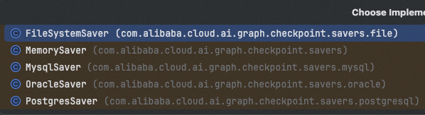
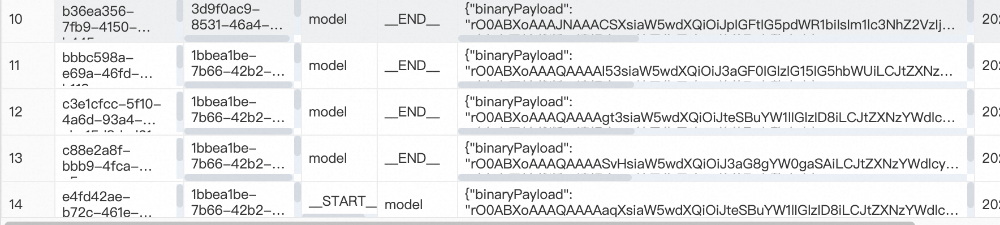

# 如何给Agent增加持久化记忆

  

Spring AI Alibaba中，如果你要直接用chatClient对话的话，就和spring ai用法一样就行了。

  

##### ✅Spring AI 记忆管理技术：持久化记忆

在Spring AI中，我们最熟悉的就是MessageWindowChatMemory ，它默认是一个基于内存的短期记忆实现，它维护最多指定最大大小（默认值：20 条消息）的消息窗口。 当消息数量超过此限制时，较旧的消息会被逐出。这确保对

LLMentor

  

如果你要直接用他里面的agent的话，那么持久化记忆的实现方式可以这样用。

  

我们都知道，想要定义一个ReactAgent，需要传入一个saver用来做记忆：

```
ReactAgent reactAgent = ReactAgent.builder()        .name("memoryAgent")        .model(chatModel)        .saver(new new MemorySaver()).build();
```

之前我们都是直接用的MemorySaver()，这是一个基于内存的记忆，那么Spring ai alibaba中内置了一些实现：



也就是说，我们可以用文件系统、mysql、oracle和postgesql来实现长期记忆。

  

演示一下如何用mysql做长期记忆：

```
@Autowiredprivate DataSource dataSource;
@Autowiredprivate ChatModel chatModel;
@RequestMapping("/chat/alibaba")public String chatAlibaba(String message, String chatId) throws GraphRunnerException {    ReactAgent reactAgent = ReactAgent.builder()            .name("memoryAgent")            .model(chatModel)            .saver(new MysqlSaver.Builder()                    .dataSource(dataSource).build()).build();
    return reactAgent.call(message, RunnableConfig.builder().threadId(chatId).build()).getText();}
```

先通过MysqlSaver定义一个saver，他需要传入一个datasource。接着，在对话的时候，我们需要传一个threadId，用来区分具体是哪一个对话。

这样，在第一次访问这个接口的时候，数据库创建2张表：

  

graph\_checkpoint和graph\_thread这两张表。graph\_thread用于保存线程信息，graph\_checkpoint用来保存对话信息。

  

http://localhost:8010/ai/long\_term\_memory/chat/alibaba?message=my%20name%20is%20Hollis&chatId=456

http://localhost:8010/ai/long\_term\_memory/chat/alibaba?message=my%20name%20is%20&chatId=456

  

两次对话以后，数据库中会保存下来对话信息：

  



同样把应用停掉，重启之后，继续用456这个id来对话，他还是认识我的，说明他是做了长期记忆的。


你可以将零散的思绪与文字先整理为草稿
# ✅如何给Agent增加持久化记忆

  

Spring AI Alibaba中，如果你要直接用chatClient对话的话，就和spring ai用法一样就行了。

  

##### ✅Spring AI 记忆管理技术：持久化记忆

在Spring AI中，我们最熟悉的就是MessageWindowChatMemory ，它默认是一个基于内存的短期记忆实现，它维护最多指定最大大小（默认值：20 条消息）的消息窗口。 当消息数量超过此限制时，较旧的消息会被逐出。这确保对

LLMentor

  

如果你要直接用他里面的agent的话，那么持久化记忆的实现方式可以这样用。

  

我们都知道，想要定义一个ReactAgent，需要传入一个saver用来做记忆：

```
ReactAgent reactAgent = ReactAgent.builder()        .name("memoryAgent")        .model(chatModel)        .saver(new new MemorySaver()).build();
```

之前我们都是直接用的MemorySaver()，这是一个基于内存的记忆，那么Spring ai alibaba中内置了一些实现：


也就是说，我们可以用文件系统、mysql、oracle和postgesql来实现长期记忆。

  

演示一下如何用mysql做长期记忆：

```
@Autowiredprivate DataSource dataSource;
@Autowiredprivate ChatModel chatModel;
@RequestMapping("/chat/alibaba")public String chatAlibaba(String message, String chatId) throws GraphRunnerException {    ReactAgent reactAgent = ReactAgent.builder()            .name("memoryAgent")            .model(chatModel)            .saver(new MysqlSaver.Builder()                    .dataSource(dataSource).build()).build();
    return reactAgent.call(message, RunnableConfig.builder().threadId(chatId).build()).getText();}
```

先通过MysqlSaver定义一个saver，他需要传入一个datasource。接着，在对话的时候，我们需要传一个threadId，用来区分具体是哪一个对话。

这样，在第一次访问这个接口的时候，数据库创建2张表：

  

graph\_checkpoint和graph\_thread这两张表。graph\_thread用于保存线程信息，graph\_checkpoint用来保存对话信息。

  

http://localhost:8010/ai/long\_term\_memory/chat/alibaba?message=my%20name%20is%20Hollis&chatId=456

http://localhost:8010/ai/long\_term\_memory/chat/alibaba?message=my%20name%20is%20&chatId=456

  

两次对话以后，数据库中会保存下来对话信息：

  
