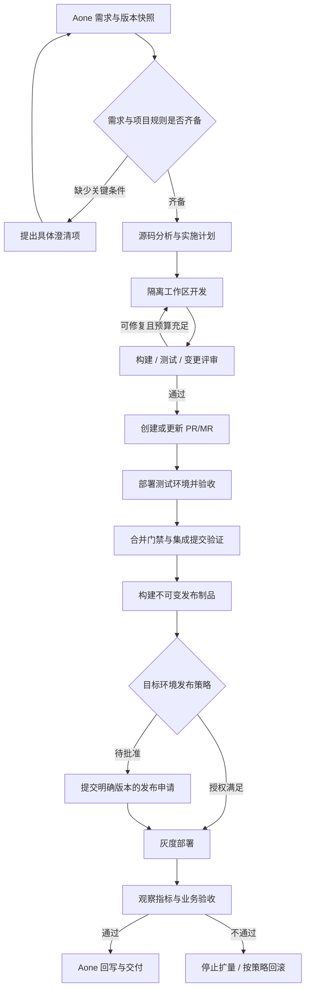

# AutoDev：从 Aone 需求到开发部署

## 定位与来源
用户于 2026-10-05 提出新增 AutoDev：自动根据 Aone 需求开发功能并部署。将其设计为 AgentMate 的研发执行模块，复用产品知识、源码分析、运行诊断和 Aone 协同。
⚠️ raw 缺失，待补充：本页为功能设计，尚无真实 Aone 契约、代码仓库策略、构建流水线或发布平台资料；不代表已经接入或部署。现有 [[AI项目/AgentMate/README]] 为空，框架验证范围见 [[AI项目/AgentMate/wiki/entities/AgentScope-Java验证报告]]。

## 用户体验
在 Aone 需求上选择“交给 AgentMate”，或由项目规则自动领取符合条件的需求；具体按钮、标签、事件能力由内部 Aone 适配确认。
展示同一条执行时间线：需求快照 → 实施计划 → 代码变更 → 测试报告 → PR/MR → 部署记录 → 验收结果。
用户可查看证据、补充需求、暂停后续步骤、取消任务、在必要节点批准具体变更；授权范围内自动连续推进，不要求每一步重复确认。

## 主流程

流程中的合并、发布申请必须检查受保护分支与发布平台的实际规则，箭头不意味着跳过门禁。需求改变、测试失败或工具异常均有独立状态，不能当作成功。

## 需求输入与准备条件
| 输入 | 用途 |
| :--- | :--- |
| Aone ID、revision、标题、描述、附件引用 | 固定任务来源，识别后续变更 |
| 业务目标、范围、验收标准 | 定义何时算完成；不能仅凭标题自行猜测功能 |
| 仓库与目标分支、基础 commit | 绑定开发上下文，多仓逐一固定版本 |
| API/配置/数据兼容要求 | 判断影响、迁移与发布顺序 |
| 项目构建测试契约、基线结果 | 复用既有流水线，区分新增失败与原有失败 |
| 目标环境、发布策略、观察窗、回滚制品 | 自动部署的确定边界 |
| 负责人、执行授权、预算与截止条件 | 限制资源消耗并指定接管人 |

仅阻塞影响正确性或授权的缺口；常规实现细节由 Agent 决策并记录假设。需求内容是业务输入，不能授予仓库、凭证或生产操作权限。

## 实施步骤与交付物
1. 需求解析：提取可执行验收项，生成 requirementId → acceptanceId 映射；澄清相互矛盾的要求。
2. 影响分析：使用源码能力定位模块、调用链、配置、测试、依赖和兼容风险，给出涉及仓库与文件范围。
3. 任务拆分：产出可验证的变更计划；跨仓按依赖顺序建立子任务，定义接口契约与版本约束。
4. 隔离开发：每个 run/仓库使用独立工作区及分支，例如 codex/autodev/<workItemId>-<runId>；不覆盖人的未提交修改。
5. 编码与测试：修改实现并补充与验收对应的测试；基线失败单独报告，禁止通过删除测试或放宽断言来伪造通过。
6. 有界自修复：根据编译、测试和评审反馈修复；轮数、费用或时间达到项目上限后保留变更与失败报告，交给负责人。
7. 变更评审：检查实际 diff、兼容性、权限、依赖变化及回归风险；模型评审是辅助，不能代替受保护分支的必需检查。
8. PR/MR：自动创建或更新同一任务对应的变更单，包含需求链接、实现说明、测试证据、风险与部署建议；不会重复开单。
9. 测试部署：由既有持续集成与交付（CI/CD）流水线部署对应制品，执行冒烟、集成和业务验收并记录环境地址。
10. 合并与发布：门禁通过后合并；对实际集成提交重新构建验证。若主干或补丁改变，旧检查不能冒用。
11. 灰度与观察：按配置策略逐步放量，检查健康、错误率、延迟与需求专属验收指标；观测缺失不能默认通过。
12. 交付回写：关联 PR、commit、流水线、制品摘要、环境和验收报告；满足约定完成口径后再推进 Aone 状态。

## 自动部署策略
| 动作/环境 | 默认设计 |
| :--- | :--- |
| 授权仓库内分析、分支开发、构建测试、创建 PR | 符合项目执行规则后自动进行 |
| 独享临时测试环境 | 通过检查后自动部署，绑定 runId 并设置清理期限 |
| 共享测试/预发环境 | 检查环境占用与租约，再通过流水线部署，防止任务互相覆盖 |
| 合并受保护分支 | 执行项目已有检查与评审规则；满足自动合并规则时自动合并 |
| 生产环境 | 支持预授权的限定自动发布，或一次批准后自动推进灰度；按项目风险策略选择 |
| 数据迁移、破坏性接口变更等高影响操作 | 单独变更计划与专门授权，不包含在普通功能发布的隐式权限中 |

发布授权绑定需求 revision、commit 集合、制品 digest、配置版本、环境、策略版本及有效期；任何实质变化都重新校验。策略明确覆盖的动作不反复询问。
部署使用确定性发布工具和短期作用域凭证；模型给出发布意图与参数，不持有通用生产 Shell 凭证。构建代码执行环境与发布执行器分离。
预发与生产推广同一已验证发布制品，禁止发布时重新打包出不同内容；配置变更独立版本化并纳入验证。

## Java 与 AgentScope 分工
| 模块 | 责任 |
| :--- | :--- |
| agentmate-autodev | DevRun、需求快照、执行计划、门禁、状态与审计 |
| AgentScope 逻辑角色 | 需求分析、源码规划、编码、测试分析、评审；按任务需要调用，不要求部署五个独立服务 |
| WorkspacePort / CodingExecutorPort | 隔离工作区、受控文件变更与构建执行，返回补丁、进程结果和资源用量 |
| GitChangePort | 分支、提交、PR/MR、差异与合并状态 |
| PipelinePort / DeploymentPort | 触发构建、环境租约、制品发布、灰度与回滚；复用已有平台 |
| AcceptancePort / ObservabilityPort | 验收用例、运行指标、部署后观察证据 |
| AonePort | 拉取 revision、关联交付物、条件更新状态与结果回写 |
| 数据库状态机 + Worker | 跨天任务、暂停恢复、幂等执行、重试、外部结果对账 |

编码执行器可由受控的代码工具实现，也可适配团队允许的编码引擎；Java 服务负责统一控制。此次不假定 AgentScope core 自动提供完整编码沙箱；HarnessAgent 的适用性另行验证。

## 状态与一致性
DevRun：RECEIVED → NEED_INFO / PLANNED → CODING → VERIFYING → PR_READY → TEST_DEPLOYING → ACCEPTING → MERGE_PENDING → RELEASE_VERIFYING → RELEASE_PENDING → DEPLOYING → OBSERVING → DELIVERED。
异常状态：BLOCKED、FAILED、CANCELED、ROLLING_BACK、ROLLED_BACK；外部执行结果不明时进入 RECONCILING，不直接重试写动作。
- DevRun 固定 Aone revision、仓库基础 commit、验收项、策略版本与预算；PR、CI、部署状态分别存储。
- 同一需求版本的自动领取使用稳定去重键；显式重跑创建新 attempt，但先对账旧动作，避免重复部署。
- 动作幂等键包含 runId、步骤、目标、内容摘要；写入超时先查外部状态，流水线不支持查询时标记待处理。
- Worker 租约与 fencing token 防止过期进程继续写入；共享环境单独加部署租约，不能只锁 Agent 会话。
- Aone 新 revision 到达后将旧任务标为待重新评估；下一写入前检查任务版本，实质变更使旧验收和授权失效。
- 人类修改了同一分支时先读取实际头提交、保留人工变更，重新验证；禁止强推覆盖。取消不等于撤销已经完成的外部动作。
- 任务完成口径由项目定义为“验收通过”或“目标环境发布且观察通过”；Aone 研发状态与客户工单状态保持独立。

## 多仓与回滚
跨仓产出 ReleaseManifest，记录每个仓库 commit、制品 digest、接口/配置兼容范围、发布顺序、旧版本回滚对象与迁移条件。
多仓不能假设具有原子合并或原子发布能力；优先设计向后兼容的分阶段变更。部分成功时停止后续动作，并按清单处理补偿。
灰度失败先停止放量；在预授权且旧版本仍兼容时回滚到已知制品。数据迁移不可逆、回滚会造成不兼容或回滚失败时，停止自动操作并明确请求负责人接管。
回滚后验证旧版本健康并保留失败证据；任务标记 ROLLED_BACK，不标记 DELIVERED。

## 分期与验收
- 第一阶段：一个仓库、一种需求类型，做到 Aone → 自动开发 → PR → 自动部署独享测试环境；生产部署路径同时定义清楚。
- 第二阶段：打通受保护分支门禁、集成提交验证、预发验收、生产批准后自动灰度、异常回滚与 Aone 回写。
- 第三阶段：经成功率和变更失败率评估后，对符合策略的需求开放生产预授权自动发布，再扩展多仓协同。
- 必测：需求中途变化、基线失败、代码冲突、删除测试绕过、流水线重复通知、发布超时但实际成功、两任务争用环境、观测缺失与回滚失败。
- 验收链：Aone revision → acceptanceId → 测试证据 → PR/commit → 制品 digest → deploymentId → 发布后验收，每一步可追溯。
- 效率指标：从可开发到验收的时间、人工投入、首次验收通过率、人工接管率、单次成功交付成本。
- 质量指标：上线缺陷、变更失败、回滚、重开与权限违规；不能用代码行数或 PR 数替代交付价值。

## 关联
[[AI项目/AgentMate/wiki/concepts/工单与Aone闭环]] · [[AI项目/AgentMate/wiki/concepts/多仓源码与运行证据分析]] · [[AI项目/AgentMate/wiki/entities/AgentMate-Java架构]]
