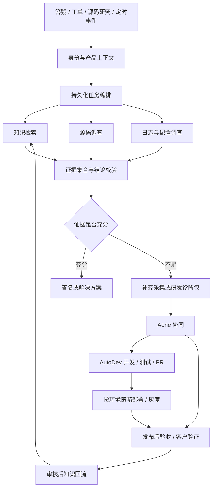

# AgentMate：MSE 产品研发与服务智能体设计

## 设计边界与来源
- 用户需求（2026-10-05 会话）：以日常答疑为知识，支持多仓源码分析、工单诊断、日志查询、Aone 创建与进度同步，基于 Java 覆盖产品研发全流程。
- 仓库入口 [[AI项目/AgentMate/README]] 当前为空，不能作为已实现能力的证据。
- ⚠️ raw 缺失，待补充：本页及关联页面为待评审设计提案，不代表现有实现、MSE 内部架构或已验证收益；会话需求尚未归档为 raw。外部资料仅支持框架能力，不证明内部系统能力。

## 一句话定位
建议将 AgentMate 定义为“以问题和需求为中心、以证据为依据、贯通产品研发与客户服务的协作智能体”。核心交付包括可复用的解决方案、研发诊断包，以及由 AutoDev 从 Aone 需求驱动的开发、测试和部署结果。

## 产品闭环
客户问题 → 补全环境 → 检索已验证知识 → 分析对应版本源码 → 验证日志与配置 → 生成答复或研发诊断包 → 关联/创建 Aone → AutoDev 开发、测试与部署，或跟踪人工研发 → 验证问题解决 → 知识回流。

## 产品界面
| 工作台 | 用户 | 核心交付 |
| :--- | :--- | :--- |
| 答疑助手 | 一线支持、产品经理 | 带来源与适用版本的答案、排查步骤、客户答复草稿 |
| 问题诊断台 | 支持、SRE、研发 | 时间线、候选原因、支持/反对证据、下一步验证 |
| 源码研究台 | 研发、资深支持 | 单仓/跨仓调用路径、机制说明、版本差异、影响面 |
| 研发协同台 | 产品、项目负责人 | Aone 草稿、关联工单、阻塞与逾期、发布后待验证项 |
| AutoDev 工作台 | 研发、测试、发布负责人 | Aone 需求执行、代码变更、测试与部署时间线 |
| 知识运营台 | 知识负责人 | 待审核结论、失效知识、高频问题聚类、文档补全 |

每次任务显示当前阶段、证据、缺失信息、执行动作和责任人；长任务支持离开后恢复。

## 逻辑架构

## Agent 职责划分
这些是逻辑角色，初期在一个服务中按需执行，不必部署为多个独立智能体服务。
| 角色 | 输入与职责 | 必须输出 |
| :--- | :--- | :--- |
| 受理与分流 | 提取产品域、环境、版本、问题类型、严重程度 | 结构化 Case、缺失字段 |
| 知识研究 | 查手册、历史结案、已知问题 | 候选答案及版本、来源 |
| 源码研究 | 解析问题涉及的仓库、符号和调用链 | 固定 commit 的代码证据 |
| 运行诊断 | 按假设查询日志、指标、链路和配置 | 时间窗内的支持与反对证据 |
| 结论审查 | 检查证据覆盖、版本冲突、推断跳跃 | 已确认事实、假设、缺口 |
| 研发协同 | 去重、生成 Aone、同步状态 | 可追溯工作项及下一责任人 |
| AutoDev 执行 | 将已授权 Aone 需求转成代码、测试与发布任务 | PR、验收证据、部署记录与回滚结果 |
| 知识整理 | 从已验证结案提炼可复用知识 | 待审核条目和回归问题 |

编排器使用明确状态与路由规则；模型在限定调查节点内选择下一步工具。限制调用轮数、耗时和查询范围，预算耗尽则交付现有证据并转人工。

## 全生命周期能力扩展
| 阶段 | 功能建议 | 可交付结果 | 优先级 |
| :--- | :--- | :--- | :--- |
| 需求发现 | 工单聚类、重复诉求、客户影响聚合 | 需求候选、频次、证据链接 | P1 |
| 需求分析 | 澄清边界、检查历史承诺与现有实现 | PRD 草稿、验收标准 | P2 |
| 技术设计 | 跨仓影响分析、兼容性与配置评审 | 设计检查清单、依赖清单 | P2 |
| 开发 | AutoDev 自动实施 Aone 需求并有界自修复 | 代码、测试、关联 Aone 的 PR/MR | P1 |
| 代码评审 | 针对实际 diff 检查回归与历史问题 | 带代码位置的评审建议 | P2 |
| 测试 | 工单转用例、版本回归、边界输入生成 | 可执行回归集和验证报告 | P1 |
| 发布 | AutoDev 自动部署测试环境，按策略完成生产灰度 | 不可变制品、验收报告、发布与回滚记录 | P1/P2 |
| 运维 | 告警聚合、变更关联、运行证据采集 | 故障时间线、处置建议 | P1 |
| 客户服务 | 自助答疑、工单诊断、升级研发 | 答复、诊断包、解决步骤 | P0 |
| 产品改进 | 问题复盘、文档缺口、质量趋势 | 改进 Backlog 与知识资产 | P1 |

范围更新（2026-10-05）：新增 AutoDev，明确覆盖自动开发与部署。首先打通测试环境自动交付，再接入生产发布授权与灰度策略；预授权范围内自动执行，超出范围按项目门禁处理。详见 [[AI项目/AgentMate/wiki/concepts/AutoDev需求到部署]]。

## 分阶段交付（示例计划，依赖接入条件）
1. P0 / 第 1—2 周：选一个产品子域；接入已审核答疑、一个源码仓库；确定发布版本与 commit 映射；建立历史工单评测集。
2. P0 / 第 3—5 周：交付带引用的答疑、源码定位、只读日志查询、可恢复诊断流程及人工升级包。
3. P1 / 第 6—8 周：打通 Aone 草稿/创建、去重、定时增量同步、结案知识审核；扩展到相关源码仓库。
4. AutoDev 独立增量：单仓 Aone 需求 → 自动开发与测试 → PR/MR → 测试环境自动部署；复用已验证的框架基础，接入契约齐备后另行估算工期。
5. P2 / 后续迭代：生产灰度与回滚、多仓发布、真实工单回归集、设计评审和需求洞察。

实施前需要的输入：首个试点子域、源码授权范围、版本映射、历史工单样本、日志平台及访问方式、内部 Aone 接口契约、模型部署与数据分级要求。

## 验收方式
先按产品域、难度和版本分层抽取历史工单，再进行影子运行和小范围上线；评测集与知识训练/沉淀样本隔离，避免答案泄漏。
- 有效自助解决率：规定观察窗口内未转研发且未重开的已验证解决工单 / 适用工单。
- 研发穿透率：实际进入研发处理的工单 / 同口径适用工单；不能通过压住升级来提高指标。
- 人工总耗时：支持与研发处理时间合计，比较相似问题上线前后变化。
- 质量：事实正确率、引用支持率、版本匹配率、拒答/升级是否合理、重复 Aone 率、重开率。
- 工程：P50/P95 时延、单次有效解决成本、恢复成功率、越权测试结果。
- 收益目标在基线测量后约定；不预设“降低 80%”一类未经验证的承诺。

## 方案导航
- [[AI项目/AgentMate/wiki/concepts/多仓源码与运行证据分析]]
- [[AI项目/AgentMate/wiki/concepts/工单与Aone闭环]]
- [[AI项目/AgentMate/wiki/entities/AgentMate-Java架构]]

- [[AI项目/AgentMate/wiki/concepts/AutoDev需求到部署]]
