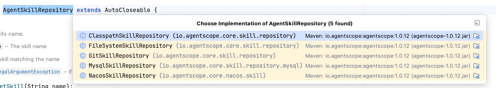

# AgentScope Java进阶：Skill

  

Skill之前我们有专门的讲过，包括Spring Ai Alibaba也介绍过他的支持Skill的原理。

  

ASJ当然也是支持Skill的，并且支持的要比SAA好。

  

### 数据模型

  

前面我们介绍过skill的结构，在ASJ中对应的就是AgentSkill这个类，它包含以下这几个字段：

  

|  |  |  |
| --- | --- | --- |
| 字段 | 说明 | 必填 |
| name | Skill 名称 | 是 |
| description | Skill 描述，决定 LLM 何时触发该 Skill | 是 |
| skillContent | Skill 的实际内容/指令 | 是 |
| metadata | 元数据 Map（含 name、description 及扩展字段） | 是 |
| resources | 资源文件 Map（path -\> content） | 否 |
| source | 来源标识，默认 "custom" | 否 |

  

### Skill创建方式

  

我们有三种方式创建 AgentSkill：

  

**方式一：直接构造**

  

```
AgentSkill skill = new AgentSkill(    "my-skill",    "Does something useful",    "Detailed instructions here...",    Map.of("scripts/run.py", "print('hello')"));
```

**方式二：通过 Builder**

```
AgentSkill skill = AgentSkill.builder()    .name("my-skill")    .description("Does something useful")    .skillContent("Instructions here...")    .addResource("scripts/run.py", "print('hello')")    .build();
```

**方式三：从 Markdown 解析（推荐）**

```
String skillMd = "---\nname: my_skill\ndescription: Does something\n---\nContent here";Map<String, String> resources = Map.of("file1.txt", "content1");AgentSkill skill = SkillUtil.createFrom(skillMd, resources);
```

**方式四：从 ZIP 包加载**

```
AgentSkill skill = SkillUtil.createFromZip(Path.of("my-skill.skill"));
```

SkillUtil中还提供了几个create方法，也都可以用来创建Skill。

  

**方式六：从持久化存储中加载**

  

AgentScope 提供了 Repository 模式来从不同来源加载 Skill，接口为 AgentSkillRepository。

  

```
public interface AgentSkillRepository extends AutoCloseable {    AgentSkill getSkill(String name);    List<String> getAllSkillNames();    List<AgentSkill> getAllSkills();    boolean save(List<AgentSkill> skills, boolean force);    boolean delete(String skillName);    boolean skillExists(String skillName);    String getSource();}
```

  

默认支持以下几种实现：



分别从文件系统、classpath、git、mysql以及nacos上获取skill。

  

如文件系统：

  

```
Path baseDir = Paths.get("/path/to/skills");FileSystemSkillRepository repo = new FileSystemSkillRepository(baseDir);AgentSkill skill = repo.getSkill("my-skill");
```

  

即从/path/to/skills中找到my-skill这个skill。

  

### SkillBox

  

SkillBox 是 Skill 的运行时管理中心，它负责 Skill 的注册、激活、工具绑定和代码执行环境管理。他提供了以下方法：

  

|  |  |
| --- | --- |
| 方法 | 作用 |
| registerSkill(skill) | 注册一个技能 |
| getSkillPrompt() | 生成全部技能的 XML 目录 prompt |
| registerSkillLoadTool() | 向 Toolkit 注load\_skill\_through\_path工具 |
| setSkillActive(skillId, active) | 激活/停用技能（同步 ToolGroup 状态） |
| deactivateAllSkills() | 每次 call 开始时重置为全部未激活 |
| syncToolGroupStates() | 批量同步 ToolGroup 的enable/disable |
| uploadSkillFiles() | 把 resources 写入磁盘供脚本执行 |

  

使用方式：

  

```
Toolkit toolkit = new Toolkit();SkillBox skillBox = new SkillBox(toolkit);// 1. 加载并注册 SkillAgentSkill skill = loadSkillFromSomewhere();skillBox.registerSkill(skill);// 2. 注册 Skill 加载工具（让 Agent 能动态加载 Skill）skillBox.registerSkillLoadTool();// 3. 将 SkillBox 绑定到 AgentReActAgent agent = ReActAgent.builder()    .name("Assistant")    .model(model)    .toolkit(toolkit)    .skillBox(skillBox)    .build();
```

  

### Skill 的系统提示注入

有了Skill之后，需要把他们注入到系统提示词中，这样LLM才能知道有哪些Skill没用。这里的实现主要是基于SkillHook的。在SkillHook中，在PreReasoningEvent阶段会讲将skill提示词注入到系统提示词中。

**先澄清两个容易误解的点：**

1. **不是 ReActAgent 启动时加载，而是每次 `agent.call()` 时动态注入。** 启动（`Builder.build()`）阶段的 `configureSkillBox()` 只做三件事——绑定 Toolkit、注册 `load_skill_through_path` 工具、挂上 `SkillHook`，**并不触碰系统提示词**。真正的注入发生在每次 call 的 `PreReasoningEvent`（推理前）阶段。这样设计的原因：系统提示词在每次 call 前才最终组装，且 Skill 可能在运行期动态注册/停用，每次现拼能保证 LLM 看到的是最新列表。

2. **注入的只是 Skill「目录」，不是 Skill 正文。** 进系统提示词的只有每个 Skill 的 `name` + `description` + `skill-id`（见下方 XML），而 `skillContent`（SKILL.md 的详细指令）和 `resources`（脚本等资源）都不注入，要等 LLM 主动调用 `load_skill_through_path` 时才懒加载。这样即便挂了几十个 Skill，常驻系统提示词的也只有几行 token 的索引，正文按需取用，避免上下文被撑爆。

整体是"**启动时只注册工具和钩子 → 每次 call 推理前把目录 XML 追加进 System Message → LLM 选中后调工具懒加载正文**"的两级机制。注入方式是**追加而非替换**：SkillHook 找到已有的 System Message，把 skillPrompt 作为新的 `TextBlock` 追加到它的 content 列表（in-place merge），原有系统提示词内容不变。

 

```
public <T extends HookEvent> Mono<T> onEvent(T event) {        // Inject skill prompts        if (event instanceof PreReasoningEvent preReasoningEvent) {            String skillPrompt = skillBox.getSkillPrompt();            if (skillPrompt != null && !skillPrompt.isEmpty()) {                List<Msg> inputMessages = preReasoningEvent.getInputMessages();                int systemIndex = findFirstSystemMessageIndex(inputMessages);                if (systemIndex >= 0) {                    // Merge skill prompt into existing system message in-place (structural)                    Msg existingSystem = inputMessages.get(systemIndex);                    List<ContentBlock> mergedContent = new ArrayList<>(existingSystem.getContent());                    mergedContent.add(TextBlock.builder().text(skillPrompt).build());                    Msg mergedMsg =                            Msg.builder()                                    .id(existingSystem.getId())                                    .role(MsgRole.SYSTEM)                                    .name(existingSystem.getName())                                    .content(mergedContent)                                    .metadata(existingSystem.getMetadata())                                    .timestamp(existingSystem.getTimestamp())                                    .build();                    List<Msg> newMessages = new ArrayList<>(inputMessages);                    newMessages.set(systemIndex, mergedMsg);                    preReasoningEvent.setInputMessages(newMessages);			}	}}
```

  

注册之后的提示词在AgentSkillPromptProvider 中能看到，大致长这样：

  

```
## Available Skills<usage>Skills provide specialized capabilities and domain knowledge. Use them when they match your current task.How to use skills:- Load skill: load_skill_through_path(skillId="<skill-id>", path="SKILL.md")- The skill will be activated and its documentation loaded with detailed instructions- Additional resources (scripts, assets, references) can be loaded using the same tool with different pathsExample:1. User asks to analyze data → find a matching skill below (e.g. <skill-id>data-analysis_builtin</skill-id>)2. Load it: load_skill_through_path(skillId="data-analysis_builtin", path="SKILL.md")3. Follow the instructions returned by the skillMetadata is rendered as XML under each <skill> element:- scalar metadata becomes a simple child element- nested maps become nested XML elements- lists become repeated <item> elements- <skill-id> is always appended for tool loading</usage><available_skills><skill>  <name>data-report</name>  <description>Use this skill when...</description>  <skill-id>data-report_filesystem</skill-id></skill></available_skills>
```

  

### load\_skill\_through\_path

  

上面的提示词中，提到了一个工具——load\_skill\_through\_path，他是一个动态生成的 AgentTool，由 SkillToolFactory.createSkillAccessToolAgentTool() 创建。它的职责可以概括为三点：

1. **加载 Skill 内容**——返回 SKILL.md 或资源文件的内容
2. **激活 Skill**——将 Skill 从"休眠"状态切换为"激活"状态
3. **暴露关联工具**——激活后，该 Skill 绑定的工具组才对 LLM 可见

  

在 ReActAgent.Builder.build() 中会针对这个工具做注册，不需要我们自己注册：

  

```
private void configureSkillBox(Toolkit agentToolkit) {    skillBox.bindToolkit(agentToolkit);    skillBox.registerSkillLoadTool();          // 注册 load_skill_through_path    if (skillBox.isAutoUploadSkill()) {        skillBox.uploadSkillFiles();           // 上传资源到工作目录    }    hooks.add(new SkillHook(skillBox));        // 注入 Skill 系统提示}
```

  

完整流程：

  

```
1. Agent 初始化   └── configureSkillBox() 注册 load_skill_through_path 到 Toolkit   2. 每次用户调用 agent.call()   └── SkillHook.onEvent(PreReasoningEvent)       └── 将可用 Skill 列表注入 System Message           └── LLM 看到 <available_skills> XML 提示           3. LLM 决定使用某个 Skill   └── 调用 load_skill_through_path(skillId="...", path="SKILL.md")       └── Skill 被激活       └── 关联工具组被启用       └── 返回 SKILL.md 内容给 LLM       4. LLM 阅读 Skill 内容后   └── 调用该 Skill 暴露的工具（或执行脚本）
```

### Skill 用多了上下文会膨胀吗？

一个自然的疑问：每加载一个 Skill，SKILL.md 正文就作为 ToolResult 进了 Memory，对话越久上下文不就越大？答案是不会失控，但也**不是简单粗暴地"删到只剩目录"**——这件事由两套机制分工负责：

**第一层：SkillBox 管"工具可见性"，不管消息历史。** SkillBox 的 `deactivateAllSkills()` 会在每次 call 开始时把所有 Skill 重置为未激活状态，再通过 `syncToolGroupStates()` 把关联 ToolGroup 置为 disable——于是这些 Skill 的工具不再出现在发给模型的 `tools` 列表里，**省掉的是工具 JSON schema 的 token**。但它不会删除 Memory 里上一轮 load 返回的 SKILL.md 正文；而系统提示词中的 `<available_skills>` 目录由 SkillHook 每轮重新注入，始终常驻。

**第二层：AutoContextMemory 管"消息历史瘦身"（见第 5 篇六级压缩）。** load Skill 返回的正文本质是一条工具结果消息，和普通工具结果一样受压缩策略管辖：

| Skill 正文的大小 / 位置 | 命中策略 | 处理方式 |
| :--- | :--- | :--- |
| SKILL.md 超过 5KB，且在历史轮 | 策略 2/3 | 卸载到 offloadContext，原位替换为 200 字预览 + `<context_offload uuid>`（ToolResult 保留 id/name，仅换 output） |
| 与其他工具调用连成连续序列 | 策略 1 | LLM 摘要为"我加载了 X skill，要点是……" + UUID |
| 当前轮刚加载、正在使用 | 保护，不压 | 策略 2/3 不碰当前轮；策略 5/6 也只在前四级失效后才保守处理 |

最终上下文呈现三段式结构：

```
系统提示词：   <available_skills> 目录     ← SkillHook 每轮重新注入，常驻
历史消息：     200 字预览 + UUID          ← 被 AutoContextMemory 卸载后
offloadContext：SKILL.md 完整原文          ← 按 UUID 可 reload
```

需要正文时有两条等价的找回路径：一是调 `context_offload(uuid)` 拉回被卸载的原文；二是目录还在系统提示词里，直接重新调一次 `load_skill_through_path`，同时完成重新激活和工具组重新可见。

这也解释了为什么 Skill 设计成"每轮重置激活"而非"一次激活永久可用"：工具列表不会随 Skill 数量线性膨胀（几十个 Skill 的工具 schema 不会全量发送），且每轮 LLM 只看到本轮真正加载的 Skill 工具，减少无关工具对 function calling 的干扰。

### Skill 的代码执行环境

  

SkillBox 提供了强大的代码执行配置能力，允许 Skill 中的脚本在受控环境中运行。

  

```
skillBox.codeExecution()    .workDir("/path/to/workdir")          // 工作目录（不设置则创建临时目录）    .withShell()                           // 启用默认 Shell（python, python3, node, nodejs）    .withRead()                            // 启用文件读取    .withWrite()                           // 启用文件写入    .enable();
```

  

### 自定义 Shell 安全策略

```
ShellCommandTool customShell = new ShellCommandTool(    "/path/to/workdir",    Set.of("python3", "node"),             // 允许的命令白名单    command -> askUserApproval(command)     // 审批回调);skillBox.codeExecution()    .withShell(customShell)    .enable();
```

  
