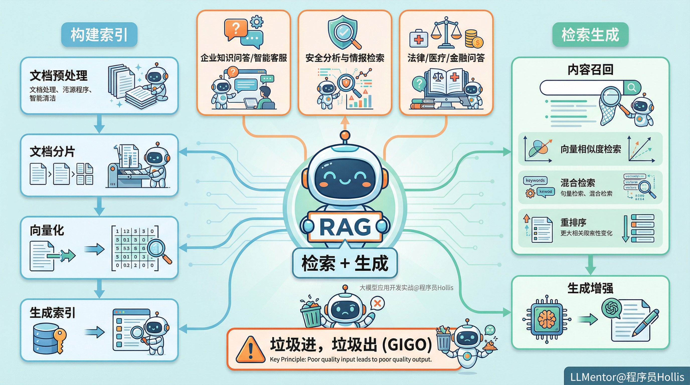

# ✅什么是RAG？

  

在前面的章节中，我们介绍过了大模型的原理，他其实是基于**基于自身的训练语料和概率统计，加上用户的prompt来预测下一个token（词或符号）的出现概率。**这就意味着： **模型输出的文本是“语言上最合理”的，但未必是“事实上的正确”。 **

  

我们也讲过了大模型的局限性，包括幻觉的问题，知识的滞后性的问题、以及知识的局限性等问题。

  

而这些问题，通过RAG技术都可以得到很大程度的改善。

  

# 什么是RAG？

  

**RAG（Retrieval-Augmented Generation，检索增强生成）**是一种让大模型在生成回答前，先从外部知识库中检索相关信息，然后结合这些检索到的内容来生成答案的技术。主要就是为了解决大模型的幻觉问题，提升大模型在某些专业领域回答的准确性。

  

简单来说，他的核心就是** 检索 + 生成**，模型不再“凭自身经验瞎说”，而是“查完资料再说”。

# RAG的使用场景

RAG非常适合用于那些**需要事实性、专业性、时效性知识支撑**的场景。它让大模型具备**“知识更新”和“领域专精”**的能力。常见应用包括：

  

### 企业知识问答 / 智能客服

企业的知识往往比较私有化，不对外公布，大模型的训练数据集也没有相关的训练语料。通过RAG，可以将企业的一些“产品说明书”、“员工行为规范”、“业绩报告”等等这些资料构建为知识库，让客服智能体在回答问题时能够**实时检索企业内部知识**，生成基于事实的专业回答。

  

### 安全分析与情报检索

在网络安全领域，具有大量的威胁情报、漏洞数据、安全日志等知识源，RAG可以构建这些数据的知识库，从而实现大模型对网络安全领域的：

- APT攻击链分析；
- 威胁情报分析；
- CVE安全漏洞解读。

这类应用让安全分析师能够通过自然语言快速检索、分析和生成报告，大幅提升威胁处置效率。

  

### 法律、医疗、金融等专业领域问答

这些行业的专业知识更新快、术语多、错误代价高， 传统大模型受限于训练数据的时间窗口和覆盖范围，往往无法准确反映**最新法规、指南或政策变化**。但通过RAG，我们可以把这些“新知识”持续的灌输给它，作为大模型的一个**“知识外挂”，**实现**持续知识更新**与**高质量领域问答**。

  

# RAG的主要流程

  

  

RAG的整体流程，**以用户提问的时机为分界点**，主要可以分为两步：

  

**第一步**叫 **构建索引，**是指在用户提问前，这一步主要是去离线构建我们的知识库索引，对知识库的相关文档进行一些列的操作，比如：**文档预处理、文档分片、向量化、生成索引**。这一步是我们后续去进行检索生成的基础，知识库索引质量生成的好坏，可以极大的影响到我们后续检索的效果。

  

在构建索引这一环节，有一句**非常经典、非常核心的警示性原则**，那就是：**“垃圾进，垃圾出”（Garbage In, Garbage Out, GIGO），**这句警示，也能够非常直观的表述出在RAG系统中，**构建索引的重要性**，无论你后续的检索环节做了什么非常高深的优化和方案，数据源头的质量才是影响最终检索效果的最重要因素。

  

**第二步**叫 **检索生成，**是指在用户提问时，实时处理用户的问题。首先需要从知识库中匹配出与用户问题**最相似的文本块（chunk）**，再将这些相似的文本块，注入到大模型的上下文之中，为大模型提供一个知识参考。
