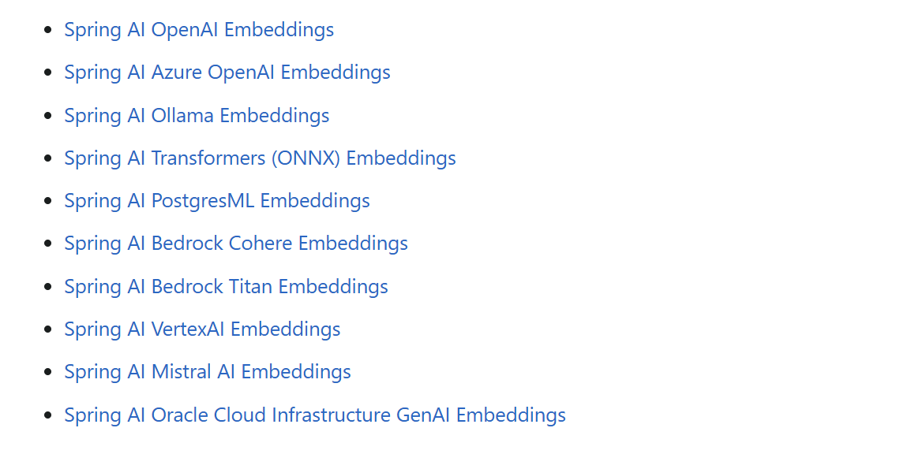
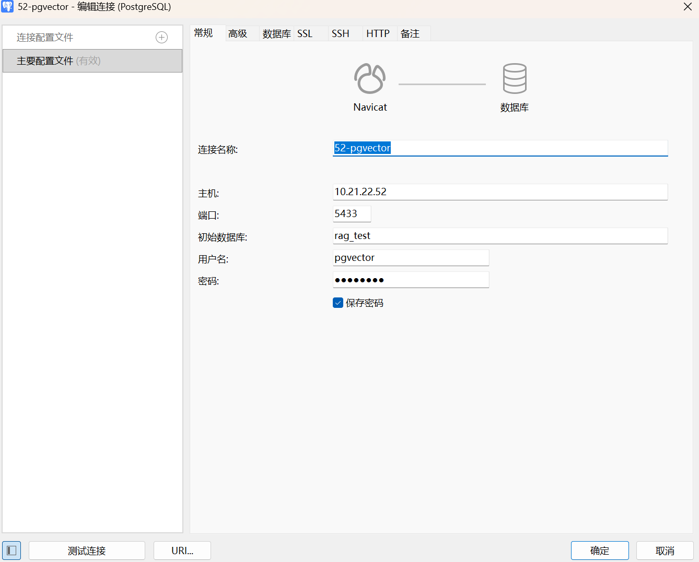
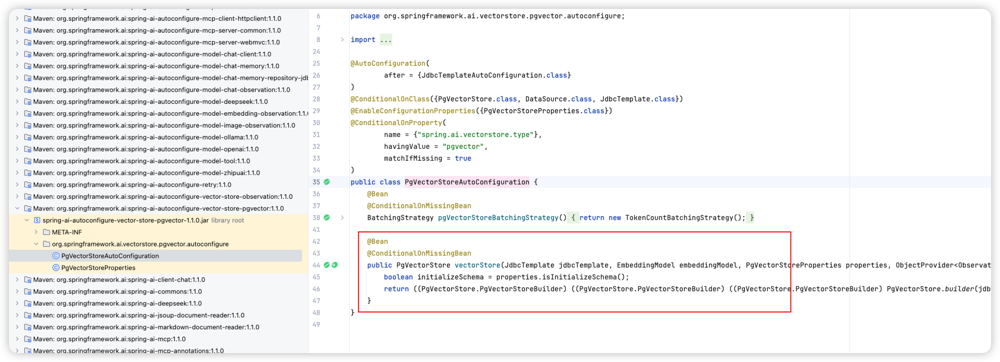
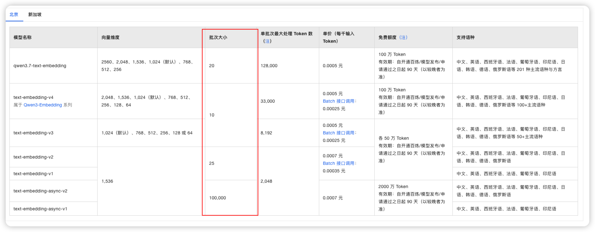
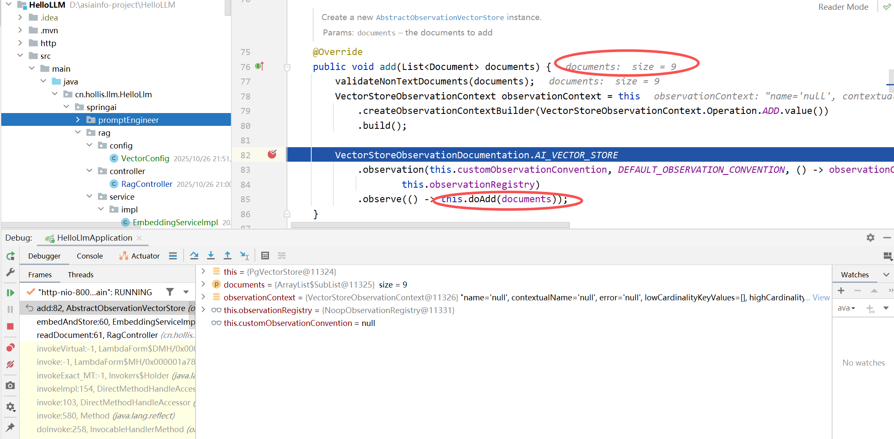
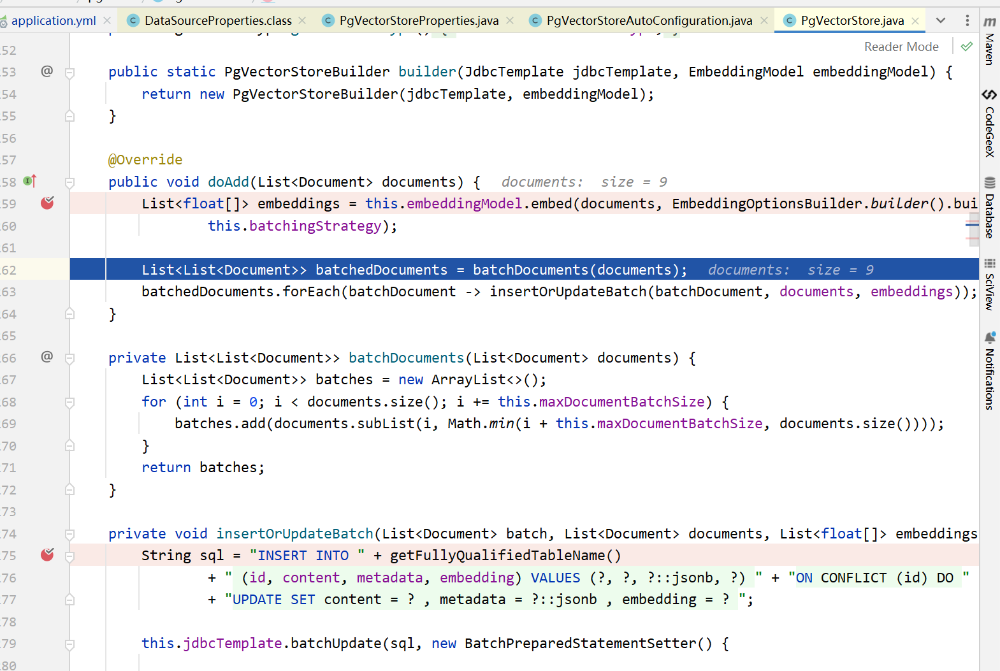
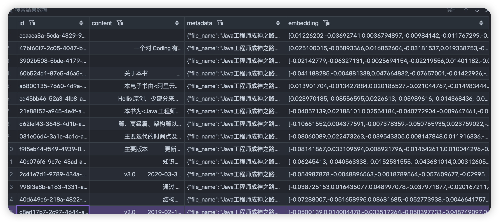

# ✅向量模型&向量数据库&向量存储

经过前面的文档清洗与分片处理，我们已经成功获得了一组**结构化、干净**的 **`List<Document>`** 数据。接下来，我们将继续对这些文档片段进行**向量化**处理，并将其存储到向量数据库中，从而完成索引的构建，搭建起完整的向量知识库。

## 向量模型

Spring AI 提供了 `EmbeddingModel` 接口，用于提供给各个厂商的**离线向量模型**快速接入。同时你也可以使用一些在线的向量模型，可以去百炼平台上选择。

```java
public interface EmbeddingModel extends Model<EmbeddingRequest, EmbeddingResponse> {

    @Override
    EmbeddingResponse call(EmbeddingRequest request);

    /**
     * 将给定文档的内容转换为向量表示。
     * @param document 要进行向量化的文档对象
     * @return 文档对应的向量数组
     */
    float[] embed(Document document);

    /**
     * 将给定文本转换为向量表示。
     * @param text 要进行向量化的文本
     * @return 文本对应的向量数组
     */
    default float[] embed(String text) {
        Assert.notNull(text, "文本不能为空");
        return this.embed(List.of(text)).iterator().next();
    }

    /**
     * 批量将文本列表转换为向量表示。
     * @param texts 待向量化的文本列表
     * @return 每个文本对应的向量数组列表
     */
    default List<float[]> embed(List<String> texts) {
        Assert.notNull(texts, "文本列表不能为空");
        return this.call(new EmbeddingRequest(texts, EmbeddingOptions.EMPTY))
                .getResults()
                .stream()
                .map(Embedding::getOutput)
                .toList();
    }

    /**
     * 批量将文本列表转换为向量，并返回完整的响应对象。
     * @param texts 待向量化的文本列表
     * @return 包含向量及相关信息的 EmbeddingResponse 对象
     */
    default EmbeddingResponse embedForResponse(List<String> texts) {
        Assert.notNull(texts, "文本列表不能为空");
        return this.call(new EmbeddingRequest(texts, EmbeddingOptions.EMPTY));
    }

    /**
     * 获取向量的维度大小（向量长度）。
     * @return 向量维度数量
     */
    default int dimensions() {
        return embed("Test String").size();
    }

}
```

**目前 Spring AI 官方支持以下的向量模型：**



### DashScopeEmbeddingModel

`DashScopeEmbeddingModel` 是百炼中提供的一个 `EmbeddingModel` 的实现，在我们的 Spring 中会默认有这个 Bean，可以直接用。

可以通过以下参数来修改配置信息：

```yaml
spring:
  ai:
    dashscope:
      embedding:
        options:
          model: text-embedding-v4
          dimensions: 768
```

`model` 表示你想用的 embedding 模型，`dimensions` 表示向量的维度，简单理解就是向量化之后的数字有多少个。

### OpenAiEmbeddingModel

另外，也可以选择使用 `OpenAiEmbeddingModel`，这个可以兼容市面上大部分 OpenAI 规范的向量模型。比如通义千问也支持的。（`OpenAiEmbeddingModel` 和 `DashScopeEmbeddingModel` 有一个就行了，如果你已经有了 `DashScopeEmbeddingModel`，这一段可以不看了）

```xml
<dependency>
  <groupId>org.springframework.ai</groupId>
  <artifactId>spring-ai-starter-model-openai</artifactId>
</dependency>
```

```yaml
spring:
  ai:
    openai:
      embedding:
        base-url: https://dashscope.aliyuncs.com/compatible-mode/
        api-key: xxxxxxxxxxxxxxxxxxxxxxxxxxxx
        options:
          dimensions: 768
          model: text-embedding-v4
```

我们可以看到，向量化的过程本质上是对 `List<Document>` **遍历并执行 embed** 操作，最终得到一个 **`List<float[]>`**。换句话说，每个文档都会被表示为一个**浮点数组**，也就是一个**多维向量**，这与我们在介绍 RAG 核心技术原理时所讲的概念完全一致。

```java
public List<float[]> embed(List<Document> documents) {
    if (CollectionUtils.isEmpty(documents)) {
        return new ArrayList<>();
    }

    return documents.stream()
            .map(doc -> openAiEmbeddingModel.embed(doc))
            .collect(Collectors.toList());
}
```

## 向量数据库

市面上目前有非常多类型的向量数据库可供选择，每种都有不同的应用场景和特点。例如：

- **Milvus** 是一款开源的分布式向量数据库，专为大规模、高性能的向量检索设计，适用于海量数据和高并发场景；
- **Elasticsearch** 除了传统的文本检索外，也支持向量检索，常用于混合检索场景；
- **Chroma** 是一款轻量级的向量数据库，优先考虑易用性和开发友好性，适用于小规模应用；
- **PGvector** 是基于 PostgreSQL 的向量扩展，部署简单方便，并且可以通过 Navicat 直接可视化查看，**对 Java 后端程序员非常友好。**

本章节我们选用 **PGvector** 来进行演示，（更多选型参考 ✅向量数据库如何选型？），既方便操作，又容易理解向量存储和检索的流程。

### 安装PGvector

```bash
docker run --name pgvector \
  -e POSTGRES_USER=pgvector \
  -e POSTGRES_PASSWORD=pgvector \
  -e POSTGRES_DB=rag_test \
  -p 5433:5432 \
  -v /home/docker_pgvector:/var/lib/postgresql/data \
  -d ankane/pgvector:v0.5.0
```

数据库名称为 `rag_test`，连接用户和密码均为 `pgvector`，端口映射为主机的 5433（可自行修改）。这边需要注意的是 PGvector 安装启动完成后，默认只能本地进行连接，所以如果你跟我一样是在自己服务器上部署的，想要从本地电脑进行远程连接，那么就需要修改配置。

首先你需要启动命令中指定挂载，将 `/var/lib/postgresql/data` 挂载到你的本地目录上，接着修改这个本地目录中的 `pg_hba.conf` 配置文件，再最后一行加上如下信息。修改完后，重启容器即可。（配置 PostgreSQL 容器的客户端认证方式，以便允许从任意 IP 地址使用密码（SCRAM-SHA-256 方式）连接数据库。）

```
host    all             all        all                     scram-sha-256
```

基于上述的操作，我们就可以本地使用 Navicat 进行远程连接了。



### 引入pgvector

接下来我们就正式构建我们的向量数据库，以下是一些需要的 jar 包和配置。

```xml
<dependency>
    <groupId>org.springframework.ai</groupId>
    <artifactId>spring-ai-starter-vector-store-pgvector</artifactId>
    <version>1.1.0</version>
</dependency>
```

这样会把 pgvector 相关的包依赖进来，同时会有一个 `vectorStore` 的 Bean 被注入：



这个 Bean 有两个关键的 Bean 需要注入，分别是 `JdbcTemplate` 和 `EmbeddingModel`

- `JdbcTemplate` 用于和向量数据库交互，做 CRUD。
- `EmbeddingModel` 用来做 embed，把文本转换成向量表示。

接着可以做一些关于 pgvector 的配置：

```yaml
spring:
  datasource:
    url: jdbc:postgresql://localhost:5433/rag_test
    username: pgvector
    password: pgvector
  ai:
    vectorstore:
      pgvector:
        # 向量索引类型
        index-type: HNSW
        # 距离度量，余弦值
        distance-type: COSINE_DISTANCE
        # 向量维度
        dimensions: 768
        # 批量处理大小
        max-document-batch-size: 9
        # 启动时是否自动创建表
        initialize-schema: true
        # 创建的表名
        table-name: vector_st
```

### 定义EmbeddingService

完成了向量模型和向量数据库的接入之后，就可以把他们串起来了，接着我们定义一个 `EmbeddingService`，定义 2 个方法，分别是 `embed` 方法和 `embedAndStore` 方法：

```java
package cn.hollis.llm.mentor.rag.embedding;

import org.springframework.ai.document.Document;
import org.springframework.ai.embedding.EmbeddingModel;
import org.springframework.ai.vectorstore.VectorStore;
import org.springframework.beans.factory.annotation.Autowired;
import org.springframework.stereotype.Service;

import java.util.ArrayList;
import java.util.List;
import java.util.stream.Collectors;

@Service
public class EmbeddingService {
    @Autowired
    private EmbeddingModel embeddingModel;

    @Autowired
    private VectorStore vectorStore;

    /**
     * 向量化
     */
    public List<float[]> embed(List<Document> documents) {
        return documents.stream()
                .map(document -> embeddingModel.embed(document.getText()))
                .collect(Collectors.toList());
    }

    /**
     * 存储向量库
     */
    public void embedAndStore(List<Document> documents) {

        List<List<Document>> batches = new ArrayList();

        for (int i = 0; i < documents.size(); i += 9) {
            List<Document> batches = documents.subList(i, Math.min(i + 9, documents.size()));
            vectorStore.add(batches);
        }
    }
}
```

- `embed` 方法：使用 `openAiEmbeddingModel` 的 `embed` 方法对 document 做向量化，并把结果返回。
- `embedAndStore` 方法：使用 `vectorStore` 的 `add` 方法完成向量化 + 储存到向量数据库。

### PgVectorStore实现原理

`PgVectorStore` 的 `add()` 这一个方法就其实包含了两个步骤，向量化和存库。这里会分别用到我们前面提过的 `embeddingModel` 和 `JdbcTemplate`

```java
public void doAdd(List<Document> documents) {
    //使用embeddingModel做向量化
    List<float[]> embeddings = this.embeddingModel.embed(documents, EmbeddingOptions.builder().build(), this.batchingStrategy);
    //使用JdbcTemplate做存储
    List<List<Document>> batchedDocuments = this.batchDocuments(documents);
    batchedDocuments.forEach((batchDocument) -> this.insertOrUpdateBatch(batchDocument, documents, embeddings));
}
```

#### 有坑注意

在做向量化的时候，我们需要注意的是，不同的 embedding 模型，都有批次大小的限制，如：



所以上面我们在 `embedAndStore` 中做了个分批，一次只处理 9 个 document。

```java
/**
 * 存储向量库
 */
@Override
public void embedAndStore(List<Document> documents) {
    if (CollectionUtils.isEmpty(documents)) {
        return;
    }
    int batchSize = 9;
    for (int i = 0; i < documents.size(); i += batchSize) {
        List<Document> subList = documents.subList(i, Math.min(i + batchSize, documents.size()));
        vectorStore.add(subList);
    }
}
```

但是，前面我们在做 pgvector 的配置的时候，不是指定了 `max-document-batch-size` 这个属性了么。已经设置为 9 了，这列为啥还需要在设置一次？

因为，这个属性的本意是**一个批次最多发送多少个 document 给向量数据库存储**，但是，他并没有用来控制一次给向量模型多少个批次的文档做向量化。

我们可以 debug 跟进看一下他是怎么做的。



我们可以看到这批次的 documents 的 size 就是 9，然后代码就会进入到 `PgVectorStore` 的 `doAdd` 操作。



可以看到，在 `doAdd` 方法中，`max-document-batch-size` 这个参数，是在 `batchDocuments` 方法中用到的，但是 `embed` 方法是在 `batchDocuments` 之前调用的。如果没有我们前面代码的设置批次为 9，那么仅靠 **`max-document-batch-size`** 是一定控制不住，就会导致**调用向量模型的时候报错**。

## 向量存储

```java
@RequestMapping("embed")
public String embed(String filePath) {

    List<Document> documents;
    try {
        documents = documentReaderFactory.read(new File(filePath));
    } catch (IOException e) {
        throw new RuntimeException(e);
    }
    List<Document> allChunkedDocuments = documents.stream()
            .flatMap(document -> {
                RecursiveCharacterTextSplitter splitter = new RecursiveCharacterTextSplitter(300, new String[]{"\n\n", "\n"});
                return splitter.split(document).stream();
            })
            .collect(Collectors.toList());

    embeddingService.embedAndStore(allChunkedDocuments);

    return "success";
}
```

经过 `VectorStore` 向量化 + 存储这两个步骤，我们可以打开向量数据库查看一下，就会看到如下信息：



我们可以清晰的在 navicat 中查看到文本块的**向量、原始文本、以及元数据（后面会单独讲解其用法）。**到这里，我们就已经成功构建了自己的向量数据库，后面我们会针对这个向量数据库继续进行检索增强。

