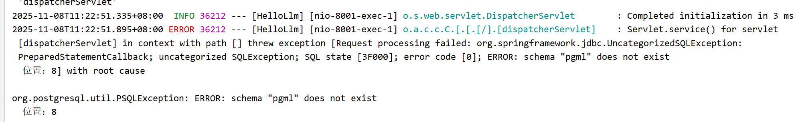
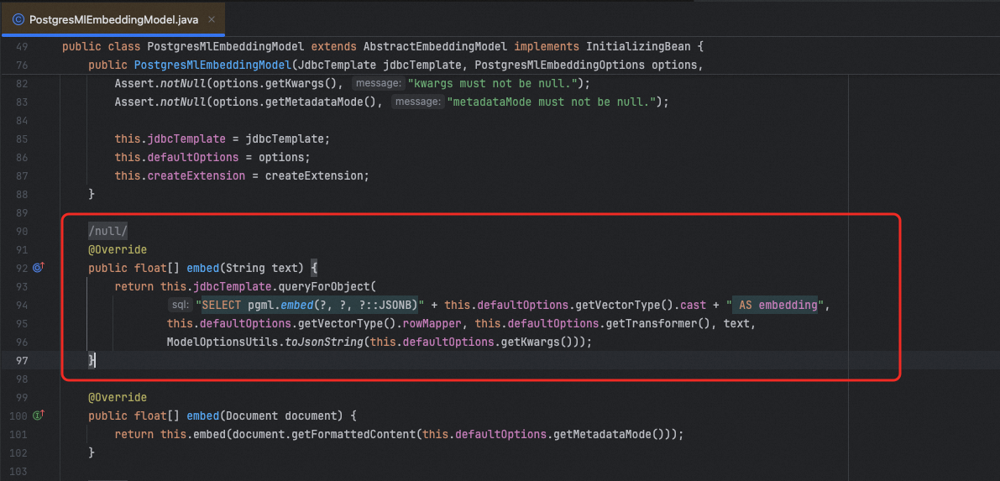
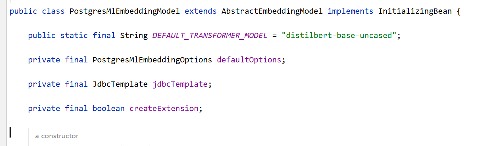
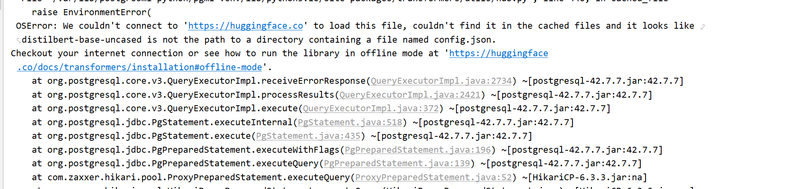

# （选学）PostgresMlEmbeddingModel

  

## **PostgresML**

  

PostgresML（pgml)是一个 PostgreSQL 扩展，用于在数据库内部直接运行机器学习模型（包括生成嵌入向量）。下面我将从原理、组件和执行流程角度详细解释这段代码的工作机制。（https://github.com/postgresml/postgresml ）

  

PostgresML 是一个开源 PostgreSQL 扩展，允许你在数据库内：

- 训练 ML 模型
- **使用预训练模型（如 Hugging Face 的 transformers）**
- **直接调用 **`pgml.embed()`** 生成文本嵌入（embeddings）**
- 所有计算在数据库服务端完成，无需将数据传出到应用层

  

> 它与 pgvector 不同：pgvector 只负责存储和检索向量，而 PGML 负责在 DB 内生成向量。

  

可以通过以下SQL来获取向量：

```
pgml.embed(    transformer TEXT,    "text" TEXT,    kwargs JSONB)
```

  

PGML工作原理：

1. 首次调用时，PGML 会从 Hugging Face 自动下载指定的`transformer` 模型（或使用本地缓存）
2. 在 PostgreSQL 后端进程中加载 PyTorch/TensorFlow 模型（通过嵌入的 Python 运行时）
3. 对输入 `text` 执行前向传播，输出 embedding 向量（如 384 维 float 数组）
4. 返回该向量供 SQL 使用（通常配合 `pgvector` 存储）

  

如：

```
SELECT pgml.embed('sentence-transformers/all-MiniLM-L6-v2', 'Hello world', '{"task": "embedding"}'::JSONB)::vector(384) AS embedding;
```

  

### pgml安装

默认的pgsql不带pgml镜像，需要单独安装，否则直接使用就会报错。

  



带有pgml扩展的PGvecort镜像启动命令：

```
docker run \    -d \     -it \    --name postgresml \    -v postgresml_data:/var/lib/postgresql \    -p 5434:5432 \    -p 8003:8000 \    ghcr.io/postgresml/postgresml:2.10.0 \    sudo -u postgresml psql -d postgresml
```

检查扩展是否可用：

```
// 进入容器docker exec -it postgresml bash// 进入数据库sudo -u postgresml psql -d rag_test// 安装扩展（如果未安装）CREATE EXTENSION IF NOT EXISTS pgml;CREATE EXTENSION IF NOT EXISTS vector;
```

  

## PostgresMlEmbeddingModel

  

PostgresMlEmbeddingModel 是 Spring AI 框架中提供的一个 Embedding 模型实现，它利用 PostgresML 扩展来直接在 PostgreSQL 数据库中生成文本向量嵌入。

  

```
<dependency>    <groupId>org.springframework.ai</groupId>    <artifactId>spring-ai-postgresml</artifactId>    <version>1.1.0</version></dependency>
```

  

- 数据库内嵌入生成：不同于 OpenAI 等外部 API，PostgresMlEmbeddingModel 直接在 PostgreSQL 数据库中完成向量化操作，无需调用外部服务。
- 依赖 PostgresML 扩展：需要在 PostgreSQL 数据库中安装 PostgresML 扩展，这是一个将机器学习能力集成到 PostgreSQL 的开源项目。
- 简单集成：通过 Spring 的依赖注入，只需要传入 JdbcTemplate 即可创建实例。

  

PostgresMlEmbeddingModel中提供了embed方法，他的实现就是通过前面我们提到的SQL来获取向量结果的。



  

Spring AI 中可以按照如下方式使用：

  

先增加配置类，注入PostgresMlEmbeddingModel，将我们之前的数据库配置连接到新的向量库5434端口。

```
@Beanpublic PostgresMlEmbeddingModel postgresMlEmbeddingModel(JdbcTemplate jdbcTemplate) {    return new PostgresMlEmbeddingModel(jdbcTemplate);}
```

```
spring:  application:    name: HelloLlm  datasource:    url: jdbc:postgresql://10.21.22.52:5434/rag_test    username: postgresml    password: postgresml
```

改造我们的service，将之前的OpenAiEmbeddingModel换成PostgresMlEmbeddingModel。

```
@Servicepublic class EmbeddingService {    @Autowired    private PostgresMlEmbeddingModel embeddingModel;    @Autowired    private VectorStore vectorStore;    /**     * 向量化     */    public List<float[]> embed(List<Document> documents) {        return documents.stream().map(document -> embeddingModel.embed(document.getText())).collect(Collectors.toList());    }    /**     * 存储向量库     */    public void embedAndStore(List<Document> documents) {        for (int i = 0; i < documents.size(); i += 9) {            List<Document> batches = documents.subList(i, Math.min(i + 9, documents.size()));            vectorStore.add(batches);        }    }}
```

**做了以上操作，感觉应该是ok了，但实际操作的时候还是不行，非常奇怪，所以我就去查看了相关源码资料。（其实前面也提到过原因）**

  

发现主要是因为PostgresMlEmbeddingModel本质上是一个**向量化桥梁**，它本身**不包含模型权重**，默认实现只支持通过 Hugging Face 的 transformer 名称从 Hub 下载模型。

  

而huggingface需要去科学上网，所以这条路几乎是走不通的，虽然我们有modelscope平台也同样可以去下载模型，但是遗憾的是，Spring AI并没有提供本地模型的配置，如果需要本地加载，则需要去重写相关的代码才可以。

  




