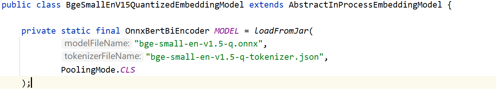
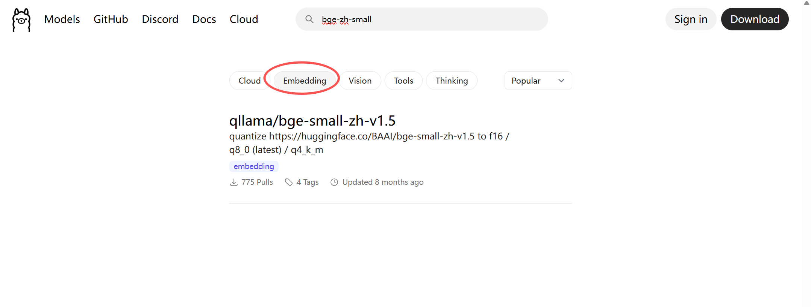
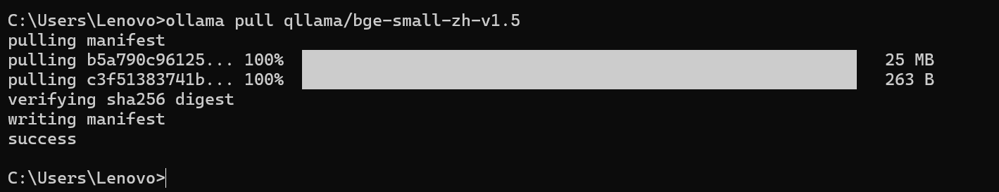
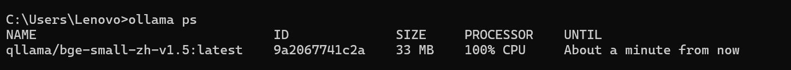
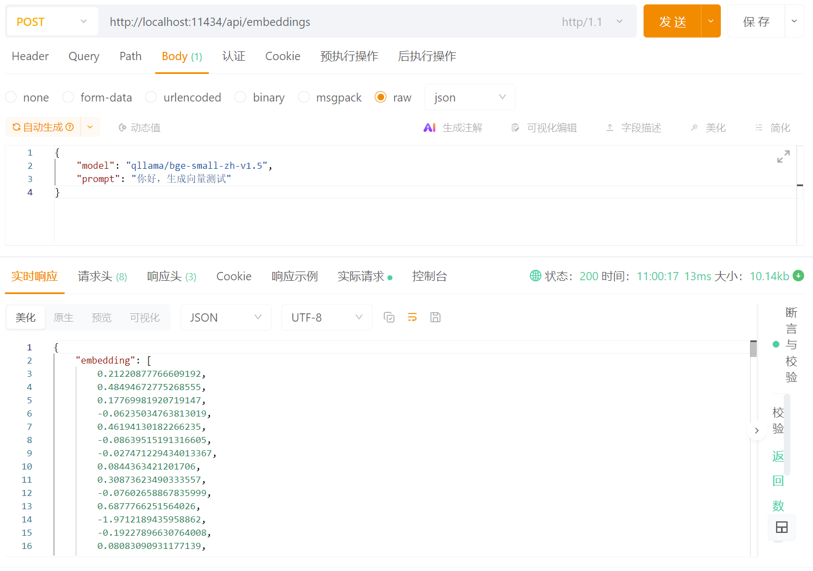

# 如何使用离线向量模型

在前面的介绍中，我们了解到 Embedding 模型就是用于将文本转成可供相似度检索的向量。常用的在线服务，如 OpenAI、百炼等在线向量模型，**它们都需要联网，且如果长期调用，就会存在大量的调用成本，还可能涉及数据泄露的问题**。为了实现**"低成本、离线、数据安全"**的诉求，离线向量模型成为越来越多企业的首选方案。

它可以在本地或企业内网运行，不依赖任何外部服务，数据不出境，不产生 API 费用，非常适合私有化部署、内部系统调用及对安全敏感的场景。接下来，我将介绍两种常见的离线向量模型及使用方式。

# LangChain4j

## BGE 向量模型

```xml
<!-- 英文量化版 -->
<dependency>
    <groupId>dev.langchain4j</groupId>
    <artifactId>langchain4j-embeddings-bge-small-en-v15-q</artifactId>
    <version>1.8.0-beta15</version>
</dependency>

<!-- 英文原版 -->
<dependency>
    <groupId>dev.langchain4j</groupId>
    <artifactId>langchain4j-embeddings-bge-small-en-v15</artifactId>
    <version>1.8.0-beta15</version>
</dependency>

<!-- 中文量化版 -->
<dependency>
    <groupId>dev.langchain4j</groupId>
    <artifactId>langchain4j-embeddings-bge-small-zh-q</artifactId>
    <version>1.8.0-beta15</version>
</dependency>

<!-- 中文原版 -->
<dependency>
    <groupId>dev.langchain4j</groupId>
    <artifactId>langchain4j-embeddings-bge-small-zh</artifactId>
    <version>1.8.0-beta15</version>
</dependency>
```



上面提供了四种离线向量模型，分别是 bge 的英文量化版、英文原版、中文量化版以及中文原版，可以根据的实际场景、语言选择合适的向量模型。

`BgeSmallEnV15QuantizedEmbeddingModel` 是 langchain4j 内置的轻量级离线向量模型，采用了量化后的 bge-small-en-v1.5 版本，可在本地直接运行，无需依赖外部网络或远程向量服务，因此非常适合作为企业内网环境下的私有化向量模型使用。

该模型通过在 JVM 内加载 ONNX 模型，无需 GPU、Python 等环境，内置 `tokenizer.json` 分词器，无需额外配置即可完成文本到向量的转换。向量维度默认固定 384 维，在一些小规模的 RAG 场景是完全够用的了。

> ONNX（Open Neural Network Exchange）是一种用于存储和运行深度学习模型的开放格式，可以被不同的框架（如 PyTorch、TensorFlow）导出并在多种语言或推理引擎中高效执行。换句话说就是可以跨平台执行。langchain4j 对该 ONNX 模型进行了封装，使开发者无需了解 ONNX 运行细节即可直接调用 Embedding 模型生成向量。

**原版模型**保留了完整的参数和精度，通常在效果上最优，但占用资源较大。**量化模型**通过降低权重精度（如从 FP32 转为 INT8 或更低）减少模型大小和计算开销，在推理速度和内存占用上更友好，适合资源有限或对延迟敏感的场景，但可能会带来轻微的精度损失。可根据实际需求在精度与性能之间进行权衡。

```java
@Bean
public EmbeddingModel getEmbeddingModel() {
    return new BgeSmallEnV15QuantizedEmbeddingModel();
}
```

简单实例化 Bean 一下，就可以正常使用了，非常方便，与 Spring 的兼容性也非常好。

# Ollama

当然我们也可以使用 Ollama 自己本地部署一个向量模型来使用，也是非常的简单方便。



在 Ollama 的官网上有很多的模型可供选择，我们可以点击 Embedding 的 tab 页就可以看到很多的向量模型，这里我们还是选用 bge-small-zh 的中文量化版来演示一下怎么用。

## 运行模型

```bash
ollama pull qllama/bge-small-zh-v1.5
```



向量模型无需交互式 run 来启动，我们直接运行 `ollama ps` 就可以看到他已经处于运行状态了。



接下来我们就可以使用 Postman 或者 curl 命令来调用 Ollama 的接口来进行向量化了。



```bash
curl --request POST \
  --url http://localhost:11434/api/embeddings \
  --data '{
    "model": "qllama/bge-small-zh-v1.5",
    "input": [
        "你好，生成向量测试"
    ]
}'
```