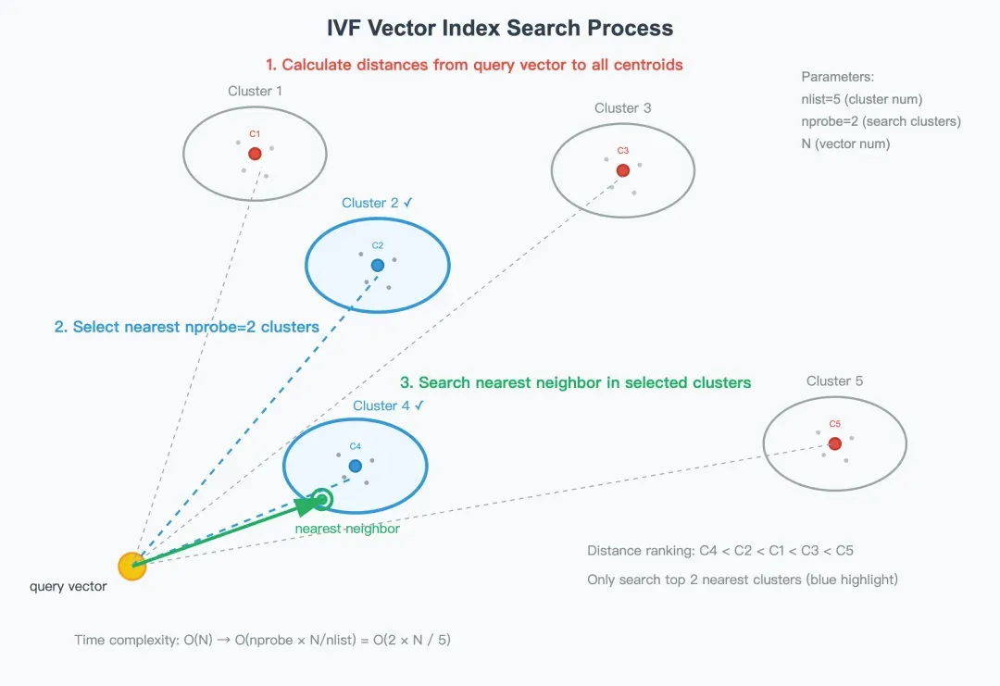
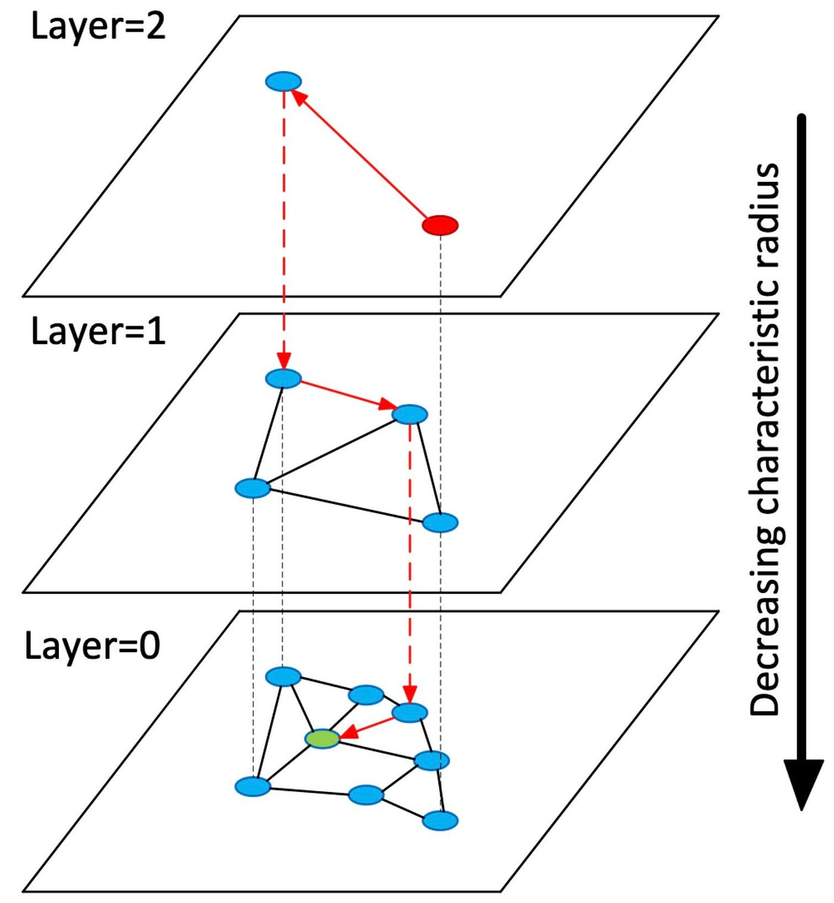

# 相似度搜索的常见算法

  

前面介绍过了衡量两个向量是否“相似”的算法，即语义相似度算法，如余弦相似度、欧式距离等。

  

那么实际在检索的时候，当数据量达到百万、千万甚至亿级别时，逐一计算查询向量与库中所有向量的相似度会变得极其缓慢。如KNN算法。

  

### ** KNN （K-Nearest Neighbors，K近邻算法）**

- 最精确的搜索方式。KNN 使用的是**暴力搜索，**它会扫描所有数据，计算目标向量与数据库中每一个向量的距离，然后返回最近的K个。
- **缺点**：但不适合针对大量的高维向量数据的检索（尤其是数百万级别），因为计算时间随数据量线性增长。

  

KNN主要适合的场景是：

- 数据规模小（如几千条以内）
- 对精度要求极高（不能容忍近似误差）
- 实验或原型阶段快速验证

  

因为KNN在大数据上面比较慢，我们需要更高效的索引算法来加速检索，这类算法通常被称为**近似最近邻搜索算法**。

  

**近似最近邻搜索 (ANN - Approximate Nearest Neighbor)**为了速度牺牲极少量的精度，是目前工业界的主流方案。常见的 ANN 算法包括：

  

### **IVF (Inverted File Index，倒排索引)**

  

IVF 是为了解决 KNN 太慢而诞生的第一种主流加速方案，它的灵感来源于搜索引擎的倒排索引。

  

- **实现原理**：
- **训练（聚类）**：使用 K-Means 算法将所有向量聚类成 N 个簇，每个簇有一个中心点（质心）。这就像把图书馆分成了 N 个书架。
- **建索引（分配）**：将每个向量分配到距离它最近的那个质心所属的列表中（倒排列表）。
- **搜索（探路）**：
- 当查询向量进来时，先计算它与这 N 个质心的距离。
- 选出距离最近的 k个质心（参数 `nprobe`，例如只查最近的 5 个书架）。
- 只在这 k 个质心包含的向量列表中进行暴力搜索。

  

  

**进阶版——IVF\_PQ**：为了进一步省内存，IVF 常结合 **PQ (Product Quantization)**。它把长向量切分成小段，分别压缩编码。这样虽然损失了一点点精度，但能让内存占用降低几十倍，速度更快。

  

这个方案的**优点是，**大大减少了计算量，内存占用可控（尤其是配合 PQ 时）。缺点就是如果目标向量恰好不在选中的那几个簇里，就会漏掉（召回率受 `nprobe` 参数影响大）。

  

### **HNSW (Hierarchical Navigable Small World)**：

  

HNSW 是目前综合性能（速度与精度）最好的算法之一，被广泛应用于 Milvus、Qdrant 等主流向量数据库。利用“小世界网络”现象（六度分隔理论），构建多层级的“高速公路”系统来导航。

  

（整体实现有点像跳表）

  

  

- **实现原理**：
- **图结构**：数据点不再是孤立的，而是通过边连接成一张图。每个点连接几个“邻居”。
- **分层（关键创新）**：
- **底层 (Layer 0)**：包含所有数据点，连接距离很近的邻居（像城市里的街道，用于精确定位）。
- **高层 (Layer 1, 2...)**：节点越来越少，连接距离较远的节点（像高速公路或飞机航线，用于快速跨越空间）。
- **搜索（跳跃导航）**：
- 从顶层开始搜索，快速定位到大致区域。
- 找到入口后，“下楼梯”进入下一层。
- 在下一层继续通过贪婪算法（Greedy Search）找更近的点，直到最底层。

  

HNSW的优点是，搜索速度极快（接近 O(log⁡N) ），召回率极高，支持动态插入数据。缺点则是索引构建比较耗时，且因为要存大量的边（连接关系），内存占用较高。

  

### **LSH (Locality Sensitive Hashing，局部敏感哈希)**

  

LSH 的思路与 IVF 类似，但它不依赖聚类中心，而是依赖数学上的概率哈希。

  

- **实现原理**：
- **哈希函数设计**：传统的哈希函数（如 MD5）是为了让输入哪怕差一点，输出也完全不同。LSH 反其道而行，设计特殊的哈希函数，使得**距离近**的向量碰撞（Hash Collision）概率高。
- **映射**：将高维向量通过随机超平面投影等方法，映射成短的二进制码或整数（哈希值）。
- **建表**：准备多张哈希表。
- **搜索**：
- 计算查询向量的哈希值。
- 直接去对应的“桶”里把数据捞出来。
- 因为可能漏掉，通常会查多张表，或者查相邻的桶。

  

**优点**：理论速度最快（接近 O(1)），非常适合海量数据的粗筛。

**缺点**：召回率不稳定，容易漏掉真正的近邻（假阴性），且对参数调优比较敏感。

  

### 如何选择

  

|  |  |  |  |  |  |  |
| --- | --- | --- | --- | --- | --- | --- |
| 算法 | 核心原理 | 形象类比 | 速度 | 精度 (召回率) | 内存占用 | 适用场景 |
| **KNN ** | 暴力计算所有距离 | 挨家挨户敲门找人 | 慢 | **100%** | 高 (存原始数据) | 小数据量，或对精度要求极高的校验场景 |
| **IVF** | 聚类分桶，只查局部 | 先去对应小区，再挨家找 | 快 | 中/高 (可调) | 中 (可压缩) | 数据量极大，内存有限，追求性价比 |
| **HNSW** | 多层图导航 | **坐飞机(高层) -\> 打车(底层)** | **极快** | **极高** | 高 (存图结构) | **目前最主流**，对延迟和精度都有高要求 |
| **LSH** | 概率哈希分桶 | 把人按姓氏首字母分组，只查同组 | 最快 | 较低 | 低 | 极大规模数据的快速粗筛，或对精度要求不高 |

  

- 如果你需要**综合性能最好**，首选 **HNSW**。
- 如果你**内存非常吃紧**（例如要在手机端或内存小的服务器上跑亿级数据），首选 **IVF\_PQ**。
- 如果你只是做简单的去重或极快速过滤，可以考虑 **LSH**。

