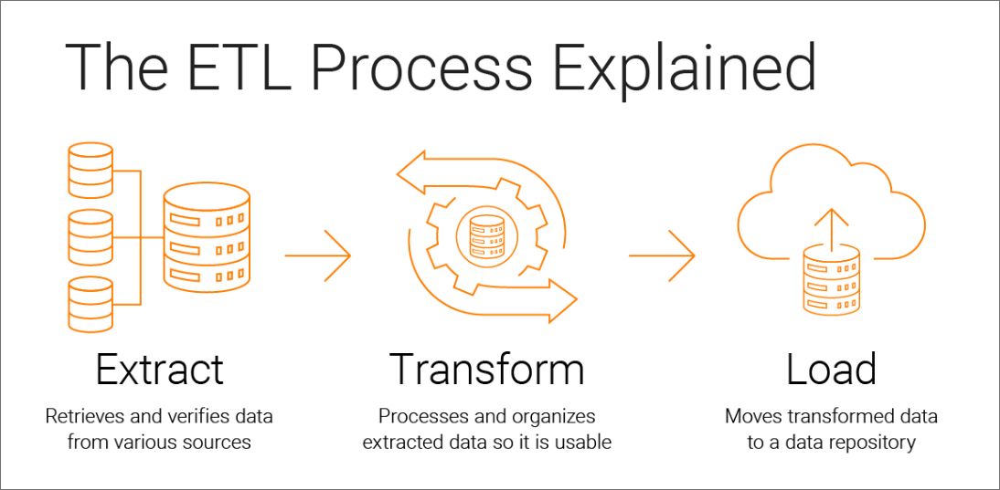
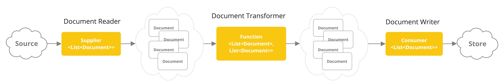
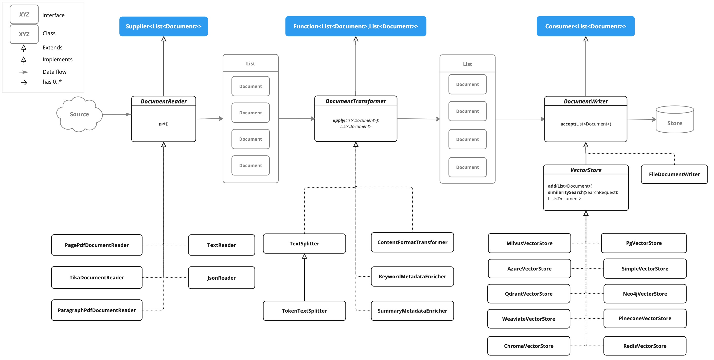

# ✅索引构建流程（ETL）总结与查缺补漏

前面我们用了很多个章节，介绍了如何把一个在磁盘上文档，经过我们的一番处理之后保存在向量数据库中。

  

这里面涉及到了文档读取、文档清洗、文档切分、向量化、以及向量结果保存。

  

如果我们把这些步骤提炼一下，其实就是关键的三个步骤：提取、转换、存储。

  

这不就是典型的ETL（Extract、Transform、Load）么，Spring AI 把这个东西定义为ETL Pipeline，所以，我们在那前面讲过的东西串起来，从ETL的视角总结一下。

  



  

DocumentReader负责把文档从磁盘上读取到内存中，DocumentTransfer负责做文档的切分及转换处理、DocumentWriter负责做文档的存储与查询。



  

下面是一个ETL pipeline的核心类图，这里面很多东西我们都熟悉，比如各种DocumentReader，比如TextSplitter、TokenTextSplitter等Splitter，他们也都是DocumentTransformer的具体实现，还有我们介绍过的PgVectorStore，他则是DocumentWriter的具体实现。

  



  

所以，我们前面已经把整个ETL的过程都讲过了，那我们再查缺补漏一下，在DocumentTransfer中，除了Splitter以外，还有一些实现，我们之前没怎么提，他们是干嘛的呢？

  

### ContentFormatTransformer

  

将文档中的**元数据内容转换为统一的键值对字符串格式**，确保所有文档的内容格式保持一致，便于后续的数据处理和检索操作。

  

假设你有以下三种来源的文档：

```
├── PDF合同 → 提取后元数据：{ "author": "张三", "date": "2025-01-01" }├── Word报告 → 提取后元数据：{ "Author": "李四", "Created": "2025-01-02" }  └── Markdown → 提取后元数据：{ "creator": "王五", "timestamp": "2025-01-03" }
```

  

因为他们的元数据键名不统一，检索时无法统一过滤！所以ContentFormatTransformer就派上用场了。

  

### KeywordMetadataEnricher

  

使用**大语言模型（LLM）自动提取文档的关键词**，并将提取的关键词添加到文档的元数据中（`keywords` 字段）。

  

### SummaryMetadataEnricher

  

使用**大语言模型对文档内容进行摘要总结**，并将生成的摘要添加到文档的元数据中（`summary` 字段）。

  

