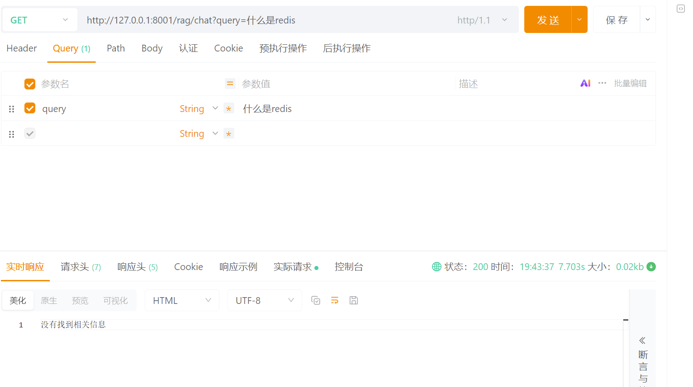
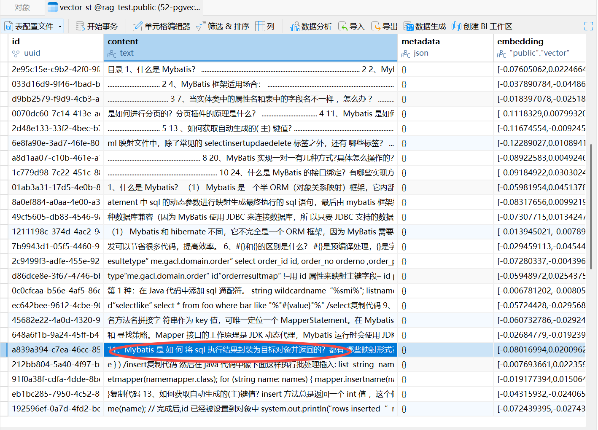
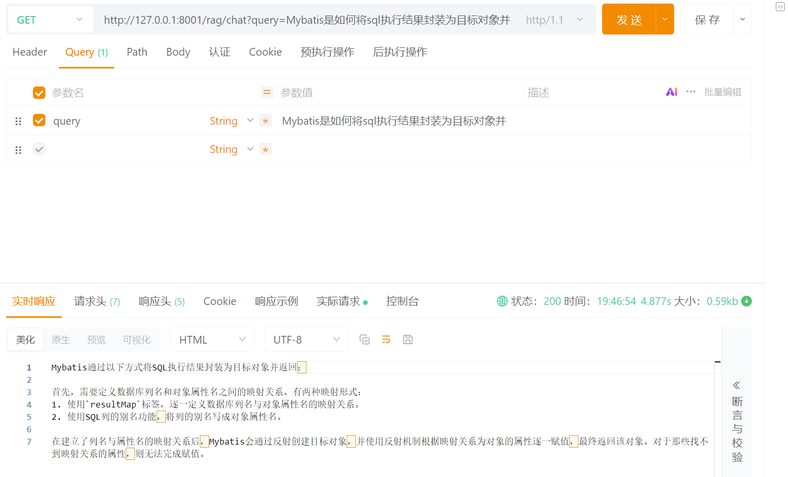
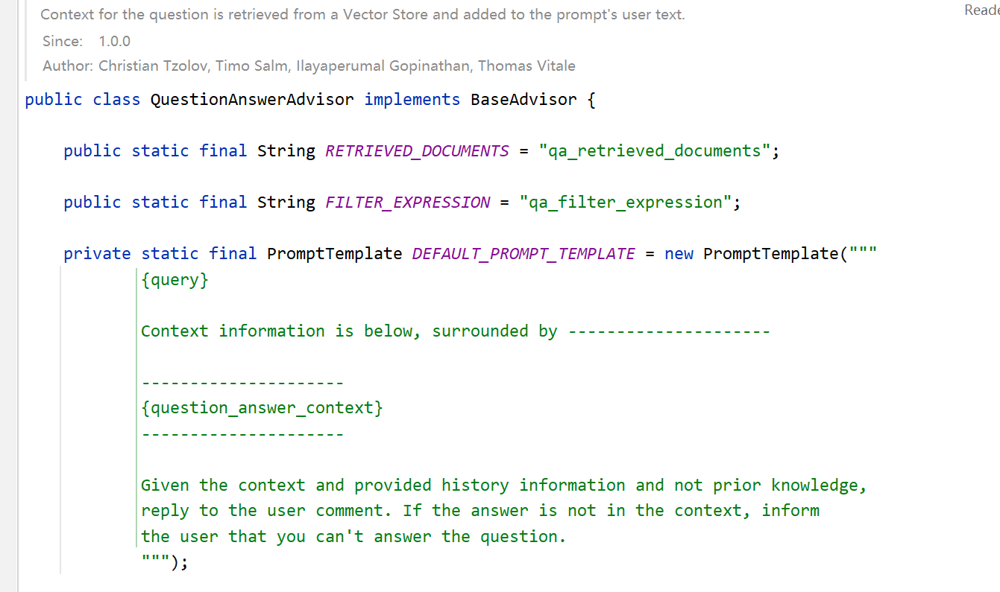
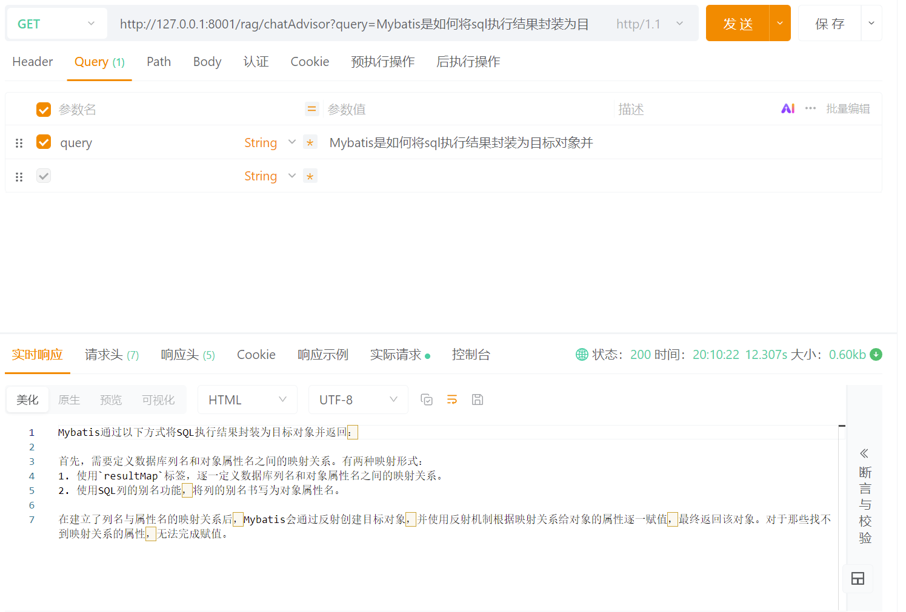
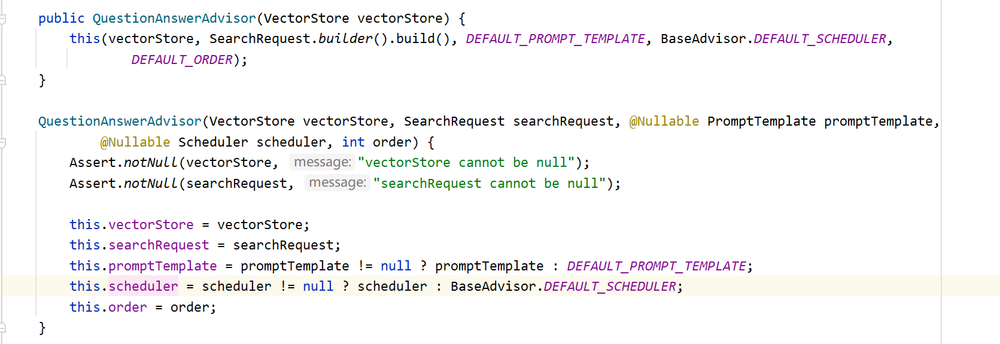
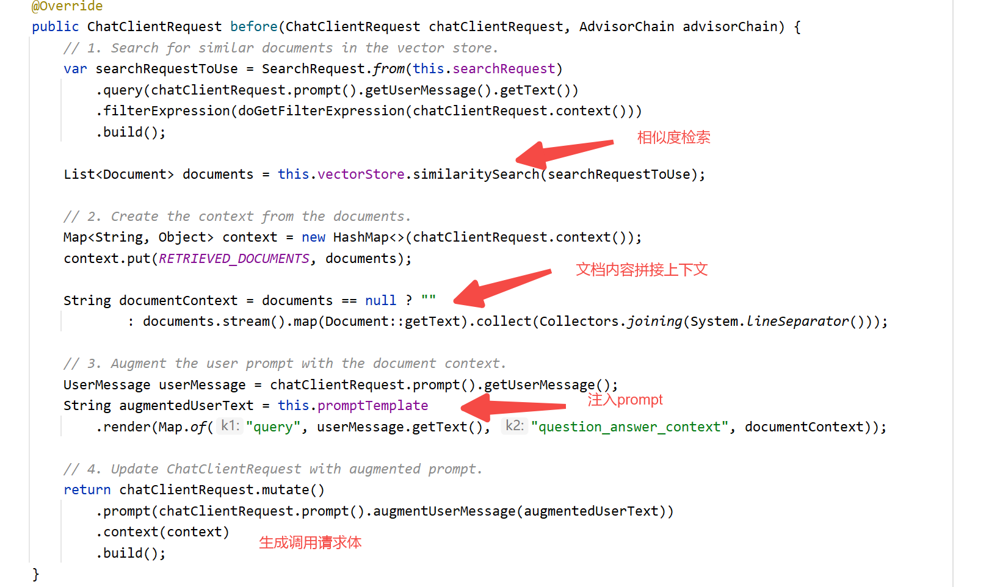
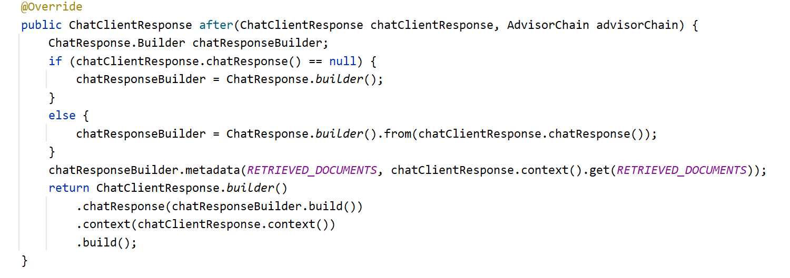

# ✅检索增强生成

在完成了前面的知识库构建工作后，我们已经实现了对原始文档的各种处理，最终成功将向量及文本数据写入向量数据库。

  

接下来，将进入 **RAG** 的核心环节——**检索增强生成**。首先通过向量**相似度检索**，我们能够从知识库中筛选出与用户问题最相关的内容，并将这些检索结果注入到大模型上下文之中，实现**增强生成**的效果。

# 相似度检索

```
/** * 相似度查询 * @param query 用户的原始问题 * @return 文档块 */public List<Document> similarSearch(String query) {    return vectorStore.similaritySearch(SearchRequest                                    .builder()                                    .query(query)                                    .topK(5)                                    .similarityThreshold(0.7f)                                    .build());}
```

|  |  |  |  |
| --- | --- | --- | --- |
| 参数 | 含义 | 示例值 | 说明 |
| query | 用于检索的查询语句 | "什么是Mybatis？" | 该 query 会被自动向量化并与向量库相似度对比 |
| topK(int) | 返回结果条数（Top-K） | 5 | 数值越大，返回匹配内容越多；一般 3\~10 较合理 |
| similarityThreshold(float) | 相似度阈值（0～1） | 0.7f | 过滤不相关内容，越接近 1 越严格（常用范围 0.6\~0.8）需要反复调测 |

该方法是 RAG 检索增强流程中非常关键的一步，它决定了大模型最终生成答案时所能获取的上下文质量。合理设置 topK 和 similarityThreshold 能有效提升检索精准度，减少模型“幻觉”。

# 增强生成

```
   @Autowired    private ChatModel chatModel;    @GetMapping("/retrieve")    public String retrieve(String query, double threshold) {        List<Document> documents = embeddingService.similaritySearch(SearchRequest                .builder()                .query(query).similarityThreshold(threshold).build());        String documentContent = documents.stream()                .map(Document::getText)                .collect(Collectors.joining("\n\n=========文档分隔线===========\n\n"));        // 2. 构建提示词模板        String promptTemplate = """                请基于以下提供的参考文档内容，回答用户的问题。                如果参考文档中没有相关信息，请直接说明"没有找到相关信息"，不要编造内容。                                参考文档:                {documents}                                用户问题: {question}                """;        PromptTemplate prompt = new PromptTemplate(promptTemplate);        Prompt realPrompt = prompt.create(Map.of("documents", documentContent, "question", query));        return chatModel.call(realPrompt).getResult().getOutput().getText();    }
```

该示例代码首先会先根据用户问题，在向量知识库中进行相似度检索，获取最相关的文档片段；随后将这些内容与用户提问一起构造成提示词，交给大模型进行回答。并且为了区分效果，prompt中让大模型当检索无命中时，会明确提示未找到相关信息，从而确保输出内容是来自文档，而不是模型本身的知识。

我们接下来看下调用的效果。

  

# 调用示例

首先我们先提问一个**与文档无关**的问题，这个应当会触发prompt的要求，返回**“没有找到相关信息”**。

**提问“什么是Redis”**，



接下来我们继续改问**与文档相关**的问题，**我们先看下PGvector数据库**，随便找到一个文本块。

**提问：“Mybatis是如何将sql执行结果封装为目标对象并返回的？”**





我们可以看到已经成功检索生成出了结果，这就是大模型根据文本块内容综合分析得到的结果。

  

# QuestionAnswerAdvisor

Spring AI 除了上面介绍的这种自己手动拼接Prompt的方式，还提供了 **Advisor **来自动化 RAG 流程。Advisor可以在模型调用前自动插入检索、重写Prompt以及后处理回答，从而**无需手写检索和提示词拼接逻辑**。

```
<dependency>  <groupId>org.springframework.ai</groupId>  <artifactId>spring-ai-advisors-vector-store</artifactId>  <version>1.1.0</version></dependency>
```

## 创建配置类

与我们之前手动拼接的流程类似，只是这种方式可以固化逻辑，后续可以拿来即用。

```
package cn.hollis.llm.mentor.rag.controller;import cn.hollis.llm.mentor.rag.embedding.EmbeddingService;import com.alibaba.cloud.ai.dashscope.chat.DashScopeChatOptions;import org.springframework.ai.chat.client.ChatClient;import org.springframework.ai.chat.client.advisor.vectorstore.QuestionAnswerAdvisor;import org.springframework.ai.chat.model.ChatModel;import org.springframework.ai.chat.prompt.Prompt;import org.springframework.ai.chat.prompt.PromptTemplate;import org.springframework.ai.document.Document;import org.springframework.ai.vectorstore.SearchRequest;import org.springframework.ai.vectorstore.pgvector.PgVectorStore;import org.springframework.beans.factory.InitializingBean;import org.springframework.beans.factory.annotation.Autowired;import org.springframework.web.bind.annotation.GetMapping;import org.springframework.web.bind.annotation.RequestMapping;import org.springframework.web.bind.annotation.RestController;import java.util.List;import java.util.Map;import java.util.stream.Collectors;@RestController@RequestMapping("/rag/retriever")public class RagRetrieverController {    @Autowired    private ChatModel chatModel;    @GetMapping("/retrieve")    public String retrieve(String query, double threshold) {        List<Document> documents = embeddingService.similaritySearch(SearchRequest                .builder()                .query(query).similarityThreshold(threshold).build());        String documentContent = documents.stream()                .map(Document::getText)                .collect(Collectors.joining("\n\n=========文档分隔线===========\n\n"));        // 2. 构建提示词模板        String promptTemplate = """                请基于以下提供的参考文档内容，回答用户的问题。                如果参考文档中没有相关信息，请直接说明"没有找到相关信息"，不要编造内容。                                参考文档:                {documents}                                用户问题: {question}                """;        PromptTemplate prompt = new PromptTemplate(promptTemplate);        Prompt realPrompt = prompt.create(Map.of("documents", documentContent, "question", query));        return chatModel.call(realPrompt).getResult().getOutput().getText();    }}
```

上面的配置方式是基于我们之前做的手动拼接的版本，实际上QuestionAnswerAdvisor本身就具备这样的功能，我们可以查看其源码，发现它的提示词其实跟我们上面提供的是差不多的含义。



所以我们的配置也可以简化成如下默认的方式。

  

## 调用方式

```
package cn.hollis.llm.mentor.rag.controller;import cn.hollis.llm.mentor.rag.embedding.EmbeddingService;import com.alibaba.cloud.ai.dashscope.chat.DashScopeChatOptions;import org.springframework.ai.chat.client.ChatClient;import org.springframework.ai.chat.client.advisor.vectorstore.QuestionAnswerAdvisor;import org.springframework.ai.chat.model.ChatModel;import org.springframework.ai.chat.prompt.Prompt;import org.springframework.ai.chat.prompt.PromptTemplate;import org.springframework.ai.document.Document;import org.springframework.ai.vectorstore.SearchRequest;import org.springframework.ai.vectorstore.pgvector.PgVectorStore;import org.springframework.beans.factory.InitializingBean;import org.springframework.beans.factory.annotation.Autowired;import org.springframework.web.bind.annotation.GetMapping;import org.springframework.web.bind.annotation.RequestMapping;import org.springframework.web.bind.annotation.RestController;import java.util.List;import java.util.Map;import java.util.stream.Collectors;@RestController@RequestMapping("/rag/retriever")public class RagRetrieverController implements InitializingBean {    private ChatClient chatClient;    @GetMapping("/retrieveAdvisor")    public String retrieveAdvisor(String query) {        return chatClient.prompt(query).call().content();    }    @Autowired    private PgVectorStore vectorStore;    @Override    public void afterPropertiesSet() throws Exception {        // 自定义Prompt模板        PromptTemplate promptTemplate = new PromptTemplate("""                请基于以下提供的参考文档内容，回答用户的问题。                如果参考文档中没有相关信息，请直接说明"没有找到相关信息"，不要编造内容。                                参考文档内容:                {question_answer_context}                                用户问题: {query}                """);        QuestionAnswerAdvisor questionAnswerAdvisor = QuestionAnswerAdvisor.builder(vectorStore)                .searchRequest(SearchRequest.builder().similarityThreshold(0.5).topK(5).build())                .promptTemplate(promptTemplate).build();        this.chatClient = ChatClient.builder(chatModel)                // 实现 Logger 的 Advisor                .defaultAdvisors(questionAnswerAdvisor)                // 设置 ChatClient 中 ChatModel 的 Options 参数                .defaultOptions(                        DashScopeChatOptions.builder()                                .withTopP(0.7)                                .build()                ).build();    }}
```



我们可以看到同样也能实现效果，只是说，这种方式更方便，且复用性强，而手动拼接的方式则更加的灵活，可以操作流程中的每一个步骤。

  

## 实现原理

我们下面从源码层面来分析下QuestionAnswerAdvisor的工作原理，看下他是如何实现RAG效果的。

### 初始化

初始化阶段就是把RAG所需的依赖装配好：向量库、检索请求（阈值、topK等）、提示词模板、调度器（是否异步执行）、执行顺序。提供默认值，也允许我们自定义。核心就是生成一个可用的QuestionAnswerAdvisor实例。



### 前置处理

before 方法就是调用大模型前的一些处理操作。其实也就是我们上面做过的：先检索相关文档，再把文档上下文拼到用户问题里，最后生成调用模型的请求体。



  

### 后置处理

after 方法就是在模型回答后执行，只做一些收尾工作，把检索到的文档信息（包括元数据）加到响应元信息里，但是不改模型回答。



我们已经成功实现了RAG的检索增强生成，学习了Advisor和手动拼接两种方式，并对比分析了检索增强生成的流程：核心思路都是**先检索相关文档 → 将文档拼接到提示词 → 调用大模型生成回答。**

基于本章节，再结合我们之前课程中的索引构建，我们已经可以构建出一个简单的 RAG 系统（**Naive RAG**）。当然，实际生产可用的 RAG 系统远不止这么简单。可以说是**入门容易，很快就能实现基础版，但要做高质量、精确度高的知识问答系统，就需要处理很多细节和优化，难度会指数级上升**。这些优化点我们会在后续课程中详细讲解。

[✅检索增强生成](https://thoughts.aliyun.com/workspaces/6963289eb0fc2e001bb052eb/docs/6975eb3ba7c8ff00014610c8#slate-title)

[相似度检索](https://thoughts.aliyun.com/workspaces/6963289eb0fc2e001bb052eb/docs/6975eb3ba7c8ff00014610c8#6975eb5dc4ea4304d138738a)

[增强生成](https://thoughts.aliyun.com/workspaces/6963289eb0fc2e001bb052eb/docs/6975eb3ba7c8ff00014610c8#6975eb5dc4ea436fbd38738e)

[调用示例](https://thoughts.aliyun.com/workspaces/6963289eb0fc2e001bb052eb/docs/6975eb3ba7c8ff00014610c8#6975eb5dc4ea438c6a387392)

[QuestionAnswerAdvisor](https://thoughts.aliyun.com/workspaces/6963289eb0fc2e001bb052eb/docs/6975eb3ba7c8ff00014610c8#6975eb5dc4ea432d6038739b)

[创建配置类](https://thoughts.aliyun.com/workspaces/6963289eb0fc2e001bb052eb/docs/6975eb3ba7c8ff00014610c8#6975eb5dc4ea43c5bf38739e)

[调用方式](https://thoughts.aliyun.com/workspaces/6963289eb0fc2e001bb052eb/docs/6975eb3ba7c8ff00014610c8#6975eb5dc4ea43daae3873a5)

[实现原理](https://thoughts.aliyun.com/workspaces/6963289eb0fc2e001bb052eb/docs/6975eb3ba7c8ff00014610c8#6975eb5dc4ea43cced3873a9)

[初始化](https://thoughts.aliyun.com/workspaces/6963289eb0fc2e001bb052eb/docs/6975eb3ba7c8ff00014610c8#6975eb5dc4ea437d4e3873ab)

[前置处理](https://thoughts.aliyun.com/workspaces/6963289eb0fc2e001bb052eb/docs/6975eb3ba7c8ff00014610c8#6975eb5dc4ea43537a3873ae)

[后置处理](https://thoughts.aliyun.com/workspaces/6963289eb0fc2e001bb052eb/docs/6975eb3ba7c8ff00014610c8#6977243bc4ea43b1f0388c19)


你可以将零散的思绪与文字先整理为草稿

删除等操作
