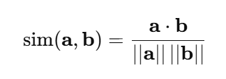
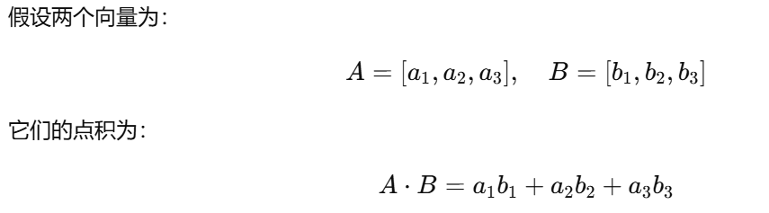
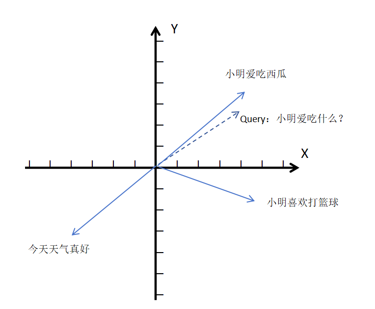
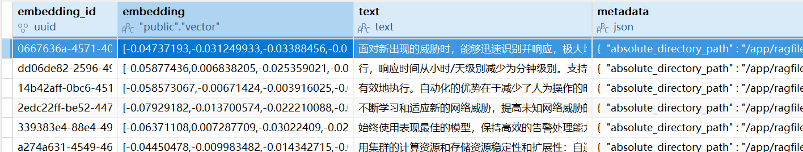

# ✅深入理解RAG技术原理——索引构建

索引构建的开始：文档；索引构建的结束：索引

  

### 文档预处理

文档预处理指的是将原始文档进行加载、解析，并转换为能够统一处理的标准化格式。

  

在这一步中，我们首先要将文档按照不同的类型**加载**，并转换成统一格式**document**，然后还需要去除文档中存在的大量无效内容，比如**多余的空格、换行符、无意义的特殊符号、重复的内容**等；最后还可能需要规范化文本格式，例如统一编码格式、统一大小写等。

  

**文档预处理的目标，是让后续的“分片”和“向量化”能够在干净的数据上进行，从源头上保证知识库索引的质量。**

  

### 文档分片

  

我们都知道，一个文档可能很大，几十上百M都有可能，而LLM是有token限制的， 一个完整的文档都给到LLM去做总结太费token了。而且我们在基于文档回答问题的时候，如果文档太大，就会包含大量无关信息，那么回答可能就不够精准。

  

所以，我们需要给一个大的文档做分片。文档分片，**就是指将文档分为多个片段**。我们的大模型是有上下文大小限制的，不是说直接去处理我们的整篇长文档， 而是将整篇文档按照一定的规则**切分成较小的文本片段（chunk）**。

这样的话，我们在检索的时候，检索出来的也是与用户问题最相关的一些文本块，而不是整篇文档。

  

**有哪些分片方式？**

  

分片的方式有很多种，比如常规的方式有固定大小分片、递归分片（按照特殊符号分段）、文档分片、语义分片、智能分片等。总之，不管什么样的分片方式，最终结果就是将文档切分成多个文本块（chunk）。

  

如果分片之后一个chunk太长，可能会：

- 一个 chunk 包含多个内容，与查询相关的部分被无关内容“淹没”，降低检索相关性得分。
- 生成阶段将整个 chunk 输入 LLM，但其中大部分内容无用，挤占有效上下文空间。

  

如果一个chunk太短，可能会：

- 关键信息被切断（如前半句在 chunk A，后半句在 chunk B），导致单个 chunk 语义不完整。
- LLM 缺乏足够上下文，可能误解片段含义，甚至产生幻觉。

  

### 向量化

数据清洗+分片完成后，每个文本块都需要被转换成一个高维数值的向量，这个过程就叫**向量化**。向量化的目的就是：**让文本的语义可以被“机器理解”和“相似度比较”。**

  

**何为向量？**

我们在大学的高数课程中，应该都学习过向量的相关知识，这边回顾一下。

  

向量在百度百科中的解释：

> 在数学中，向量（也称为欧几里得向量、几何向量），指具有大小（magnitude）和方向的量。它可以形象化地表示为带箭头的线段。箭头所指：代表向量的方向；线段长度：代表向量的大小。

  

总结一下，向量就是一个具有大小和方向的多维数值的数组，而在大模型中，每个维度代表某种“语义特征”。因此，**语义相似的句子，其向量在高维空间中的“距离”更近。**

- **一维向量：**`[3]`**，**可以表示一条数轴上从原点出发到3这个位置的一条带箭头的线段。
- **二维向量：**`[3, 4]`**，**可以表示二维平面上从原点出发到（3,4）这个位置的一条带箭头的线段。
- **三维向量：**`[3, 4, 5]`**，**可以表示三维空间中从原点出发到（3,4,5）这个位置的一条带箭头的线段。

当维度更多，比如384维、768维、1536维，这种我们就称为**高维向量**。这些维度不再代表物理坐标，而是代表文本的某种**“语义特征”**。**维度越高，能够表达的语义特征越多**，文本在高维空间就拥有更高的自由度， 从而能更细致的区分不同语义。

  

**文本块如何变成向量？**

  

这个过程也叫做** Embedding **， 简单来说，就是用一个**向量模型**把文本**“投影”**到高维向量空间里。

每个维度代表了文本在某个**“语义方向”**上的**权重**，比如：

- 第1维：是否包含“人物“
- 第2维：是否涉及“动作”
- 第3维：是否包含“时间”
- ……

最终，每段文字被转成一个 **高维坐标点**，然后就可以进行数学上的比较了。

  

**向量的相似度比较**

三种方法：

- **余弦相似度（Cosine Similarity）**

  

**最常用的语义相似度查询方法，主要就是看两个向量的夹角是否接近。夹角越小，向量越“同方向“，则语义越相似。**

余弦值范围：\[−1，1\]，1 表示两个向量方向完全一致（语义高度相似），0 表示两个向量正交（没有语义相关性），-1 表示方向完全相反（语义相反）。**向量长度不影响结果，只关心方向**，特别适合文本语义匹配。

  

比较两篇文章的相似性。即使一篇文章很短，另一篇很长，但只要它们的关键词比例相似，余弦相似度就会很高。

  

RAG系统中，大多数向量数据库（如 Milvus、Pinecone、FAISS、Pgvector）都支持并默认使用**余弦相似度查询**。

  

- **欧几里得距离（Euclidean Distance）**

就像测量空间中两点之间的直线距离。距离越小，则相似度越高，主要应用于**具有几何意义**的场景，如图像相似度分析。

  

- **点积（Dot Product）**

可以理解成**“两个向量在同一方向上的重叠程度”**。如果两个向量都又长又指向差不多的方向，那么点积就会很大；如果它们方向相反，点积会变成负数；如果它们垂直，则点积为0。

点积是最简单、最高效的一种相似度计算方法，直接计算两个向量的内积。值越大，表示两个向量越相似，**tansformer的注意力机制就是使用的点积来计算权重**。

  

另外还有皮尔逊相关系数、杰卡德相似系数等，不展开说了，**在文本相似度方面用的比较多的就是余弦相似度了**。

  

**举个例子**

  

以下面这个二维坐标系为例**（实际是多维度，为了演示方便）**，有三个已有的向量**（图中的蓝色实线向量）**，**“小明爱吃西瓜”“小明喜欢打篮球”“今天天气真好**”。我们可以从坐标系中看出，**“小明爱吃西瓜”**和**“今天天气真好”**这两个向量是完全不相关的语义，他们的余弦值就接近 -1。**“小明喜欢打篮球”**这个向量和我们的**Query向量（图中的虚线向量）“小明爱吃什么”**的夹角较大，说明它们的余弦相似度较低，语义相关程度就比较低。并且我们可以看到**Query向量“小明爱吃什么”**与**“小明爱吃西瓜”**的**“夹角”非常小**，说明两者的**余弦相似度**接近于 1，更相关。

  

小明爱吃西瓜-\>\[-0.321321321321,0.3213123421321,-0.2321321312,.....\]

  

### 生成索引

当我们完成了 **向量化** 之后，每一个文本块（chunk）都对应一个**高维向量**。但这些向量如果只是存在内存里，并不能快速查询和比较。所以就需要将文本内容和高维语义向量**持久化存储**下来，利用我们的向量数据库**构建索引结构**，并为后续的检索生成提供相似度查询的功能。

  

**向量数据库**

  

向量数据库是一类专门用于存储、管理和检索**高维向量数据**的数据库。与传统数据库（比如Mysql）不同，它并不是基于“精确匹配”进行查询，而是通过计算向量之间的相似度来进行**“语义检索”**。

  

**存储了哪些信息？**

  

我们以Pgvector（PostgreSQL的向量库版本）数据库为例，直观的看一下他存储的内容：

  

主要包含**主键embedding\_id**，**高维向量embedding、原始文本块text、元数据metadata**。

**高维向量embedding**：也就是表达语义信息，用于索引的相似度匹配查询。

**原始文本块text**：我们检索出来，让大模型引用参考的其实就是一些列的原始文本块，高维向量的只是一个用于相似度查询的索引，模型只有基于原始文本块才可以去进行回答效果的增强。

**元数据metadata**：则让我们在检索时能做精确的**过滤、分组或追溯来源。**如**文件名过滤、时间戳过滤**，可以使得在某些场景下，我们的检索更加精准。

[✅深入理解RAG技术原理——索引构建](https://thoughts.aliyun.com/workspaces/6963289eb0fc2e001bb052eb/docs/6971fc93c71a890001b1aa00#slate-title)

[文档预处理](https://thoughts.aliyun.com/workspaces/6963289eb0fc2e001bb052eb/docs/6971fc93c71a890001b1aa00#6971fcb2297ebf78d5b49e68)

[文档分片](https://thoughts.aliyun.com/workspaces/6963289eb0fc2e001bb052eb/docs/6971fc93c71a890001b1aa00#6971fcb2297ebf13e5b49e6f)

[向量化](https://thoughts.aliyun.com/workspaces/6963289eb0fc2e001bb052eb/docs/6971fc93c71a890001b1aa00#6971fcb2297ebf150bb49e78)

[生成索引](https://thoughts.aliyun.com/workspaces/6963289eb0fc2e001bb052eb/docs/6971fc93c71a890001b1aa00#6972128a297ebf43dab4a277)

你可以将零散的思绪与文字先整理为草稿
# ✅深入理解RAG技术原理——索引构建

索引构建的开始：文档；索引构建的结束：索引

  

### 文档预处理

文档预处理指的是将原始文档进行加载、解析，并转换为能够统一处理的标准化格式。

  

在这一步中，我们首先要将文档按照不同的类型**加载**，并转换成统一格式**document**，然后还需要去除文档中存在的大量无效内容，比如**多余的空格、换行符、无意义的特殊符号、重复的内容**等；最后还可能需要规范化文本格式，例如统一编码格式、统一大小写等。

  

**文档预处理的目标，是让后续的“分片”和“向量化”能够在干净的数据上进行，从源头上保证知识库索引的质量。**

  

### 文档分片

  

我们都知道，一个文档可能很大，几十上百M都有可能，而LLM是有token限制的， 一个完整的文档都给到LLM去做总结太费token了。而且我们在基于文档回答问题的时候，如果文档太大，就会包含大量无关信息，那么回答可能就不够精准。

  

所以，我们需要给一个大的文档做分片。文档分片，**就是指将文档分为多个片段**。我们的大模型是有上下文大小限制的，不是说直接去处理我们的整篇长文档， 而是将整篇文档按照一定的规则**切分成较小的文本片段（chunk）**。

这样的话，我们在检索的时候，检索出来的也是与用户问题最相关的一些文本块，而不是整篇文档。

  

**有哪些分片方式？**

  

分片的方式有很多种，比如常规的方式有固定大小分片、递归分片（按照特殊符号分段）、文档分片、语义分片、智能分片等。总之，不管什么样的分片方式，最终结果就是将文档切分成多个文本块（chunk）。

  

如果分片之后一个chunk太长，可能会：

- 一个 chunk 包含多个内容，与查询相关的部分被无关内容“淹没”，降低检索相关性得分。
- 生成阶段将整个 chunk 输入 LLM，但其中大部分内容无用，挤占有效上下文空间。

  

如果一个chunk太短，可能会：

- 关键信息被切断（如前半句在 chunk A，后半句在 chunk B），导致单个 chunk 语义不完整。
- LLM 缺乏足够上下文，可能误解片段含义，甚至产生幻觉。

  

### 向量化

数据清洗+分片完成后，每个文本块都需要被转换成一个高维数值的向量，这个过程就叫**向量化**。向量化的目的就是：**让文本的语义可以被“机器理解”和“相似度比较”。**

  

**何为向量？**

我们在大学的高数课程中，应该都学习过向量的相关知识，这边回顾一下。

  

向量在百度百科中的解释：

> 在数学中，向量（也称为欧几里得向量、几何向量），指具有大小（magnitude）和方向的量。它可以形象化地表示为带箭头的线段。箭头所指：代表向量的方向；线段长度：代表向量的大小。

  

总结一下，向量就是一个具有大小和方向的多维数值的数组，而在大模型中，每个维度代表某种“语义特征”。因此，**语义相似的句子，其向量在高维空间中的“距离”更近。**

- **一维向量：**`[3]`**，**可以表示一条数轴上从原点出发到3这个位置的一条带箭头的线段。
- **二维向量：**`[3, 4]`**，**可以表示二维平面上从原点出发到（3,4）这个位置的一条带箭头的线段。
- **三维向量：**`[3, 4, 5]`**，**可以表示三维空间中从原点出发到（3,4,5）这个位置的一条带箭头的线段。

当维度更多，比如384维、768维、1536维，这种我们就称为**高维向量**。这些维度不再代表物理坐标，而是代表文本的某种**“语义特征”**。**维度越高，能够表达的语义特征越多**，文本在高维空间就拥有更高的自由度， 从而能更细致的区分不同语义。

  

**文本块如何变成向量？**

  

这个过程也叫做** Embedding **， 简单来说，就是用一个**向量模型**把文本**“投影”**到高维向量空间里。

每个维度代表了文本在某个**“语义方向”**上的**权重**，比如：

- 第1维：是否包含“人物“
- 第2维：是否涉及“动作”
- 第3维：是否包含“时间”
- ……

最终，每段文字被转成一个 **高维坐标点**，然后就可以进行数学上的比较了。

  

**向量的相似度比较**

三种方法：

- **余弦相似度（Cosine Similarity）**

  

**最常用的语义相似度查询方法，主要就是看两个向量的夹角是否接近。夹角越小，向量越“同方向“，则语义越相似。**

余弦值范围：\[−1，1\]，1 表示两个向量方向完全一致（语义高度相似），0 表示两个向量正交（没有语义相关性），-1 表示方向完全相反（语义相反）。**向量长度不影响结果，只关心方向**，特别适合文本语义匹配。

  

比较两篇文章的相似性。即使一篇文章很短，另一篇很长，但只要它们的关键词比例相似，余弦相似度就会很高。

  

RAG系统中，大多数向量数据库（如 Milvus、Pinecone、FAISS、Pgvector）都支持并默认使用**余弦相似度查询**。

  

- **欧几里得距离（Euclidean Distance）**

就像测量空间中两点之间的直线距离。距离越小，则相似度越高，主要应用于**具有几何意义**的场景，如图像相似度分析。

  

- **点积（Dot Product）**

可以理解成**“两个向量在同一方向上的重叠程度”**。如果两个向量都又长又指向差不多的方向，那么点积就会很大；如果它们方向相反，点积会变成负数；如果它们垂直，则点积为0。

点积是最简单、最高效的一种相似度计算方法，直接计算两个向量的内积。值越大，表示两个向量越相似，**tansformer的注意力机制就是使用的点积来计算权重**。

  

另外还有皮尔逊相关系数、杰卡德相似系数等，不展开说了，**在文本相似度方面用的比较多的就是余弦相似度了**。

  

**举个例子**

  

以下面这个二维坐标系为例**（实际是多维度，为了演示方便）**，有三个已有的向量**（图中的蓝色实线向量）**，**“小明爱吃西瓜”“小明喜欢打篮球”“今天天气真好**”。我们可以从坐标系中看出，**“小明爱吃西瓜”**和**“今天天气真好”**这两个向量是完全不相关的语义，他们的余弦值就接近 -1。**“小明喜欢打篮球”**这个向量和我们的**Query向量（图中的虚线向量）“小明爱吃什么”**的夹角较大，说明它们的余弦相似度较低，语义相关程度就比较低。并且我们可以看到**Query向量“小明爱吃什么”**与**“小明爱吃西瓜”**的**“夹角”非常小**，说明两者的**余弦相似度**接近于 1，更相关。

  

小明爱吃西瓜-\>\[-0.321321321321,0.3213123421321,-0.2321321312,.....\]

  

### 生成索引

当我们完成了 **向量化** 之后，每一个文本块（chunk）都对应一个**高维向量**。但这些向量如果只是存在内存里，并不能快速查询和比较。所以就需要将文本内容和高维语义向量**持久化存储**下来，利用我们的向量数据库**构建索引结构**，并为后续的检索生成提供相似度查询的功能。

  

**向量数据库**

  

向量数据库是一类专门用于存储、管理和检索**高维向量数据**的数据库。与传统数据库（比如Mysql）不同，它并不是基于“精确匹配”进行查询，而是通过计算向量之间的相似度来进行**“语义检索”**。

  

**存储了哪些信息？**

  

我们以Pgvector（PostgreSQL的向量库版本）数据库为例，直观的看一下他存储的内容：

  

主要包含**主键embedding\_id**，**高维向量embedding、原始文本块text、元数据metadata**。

**高维向量embedding**：也就是表达语义信息，用于索引的相似度匹配查询。

**原始文本块text**：我们检索出来，让大模型引用参考的其实就是一些列的原始文本块，高维向量的只是一个用于相似度查询的索引，模型只有基于原始文本块才可以去进行回答效果的增强。

**元数据metadata**：则让我们在检索时能做精确的**过滤、分组或追溯来源。**如**文件名过滤、时间戳过滤**，可以使得在某些场景下，我们的检索更加精准。

