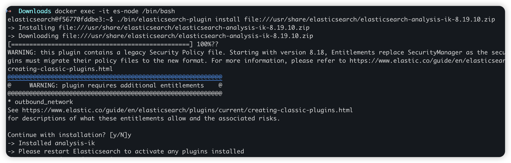
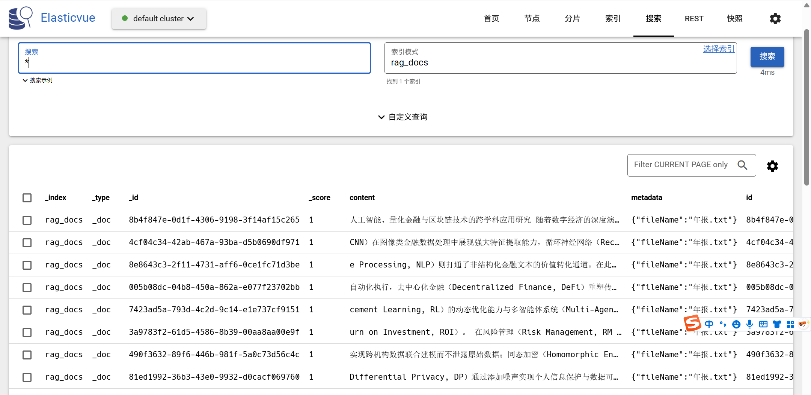
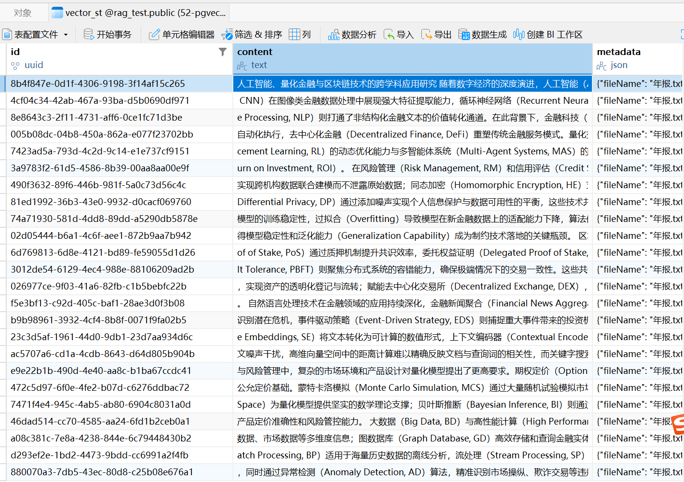

# ✅ 使用 ElasticSearch 做关键词检索

为了做混合检索，我们需要部署 ES，并给 ES 安装上 IK 中文分词器（因为我们主要文档都是中文场景），用于后续我们的关键词检索。

ES docker 启动：**（请使用 8.19.10 版本，以文档为准，最开始用的 7.x 的版本，但是后面有兼容性问题（7.x 不支持向量数据库），这里升级到 8.x）**

```bash
docker run -d --name es-node \
-p 9200:9200 -p 9300:9300 \
-e "discovery.type=single-node" \
-e "xpack.security.enabled=false" \
docker.elastic.co/elasticsearch/elasticsearch:8.19.10
```

下载 IK 分词器 zip 包

elasticsearch-analysis-ik-8.19.10.zip(4.4 MB)

并将其放入到 ES 的目录下

```bash
docker cp elasticsearch-analysis-ik-8.19.10.zip es-node:/usr/share/elasticsearch/
```

进入容器内部

```bash
docker exec -it es-node /bin/bash
```

执行安装命令

```bash
./bin/elasticsearch-plugin install file:///usr/share/elasticsearch/elasticsearch-analysis-ik-8.19.10.zip
```



安装完成后，退出容器，并重启，重启成功后，在宿主机执行下面的命令，查看是否安装 IK 成功：

```bash
curl -X GET "localhost:9200/_cat/plugins?v"
```


到这边，我们就已经完成了关键词存储库的准备工作，接下来我们开始编写代码。

```xml
<dependency>
    <groupId>co.elastic.clients</groupId>
    <artifactId>elasticsearch-java</artifactId>
    <version>8.19.10</version>
</dependency>

<dependency>
    <groupId>org.springframework.boot</groupId>
    <artifactId>spring-boot-starter-data-elasticsearch</artifactId>
</dependency>
```

先引入 ES 的客户端，增加如下配置连接。**（实际环境一般是带认证和 https 的，所以下面的配置兼容了一下，开发环境使用 http 实验即可）** 注意安装的 ES 要与本地的 jar 包版本保持一致，要不会有**兼容问题**。

```java
package cn.hollis.llm.mentor.rag.config;

import co.elastic.clients.elasticsearch.ElasticsearchClient;
import co.elastic.clients.json.jackson.JacksonJsonpMapper;
import co.elastic.clients.transport.ElasticsearchTransport;
import co.elastic.clients.transport.rest_client.RestClientTransport;
import org.apache.http.HttpHost;
import org.apache.http.auth.AuthScope;
import org.apache.http.auth.UsernamePasswordCredentials;
import org.apache.http.client.CredentialsProvider;
import org.apache.http.conn.ssl.NoopHostnameVerifier;
import org.apache.http.impl.client.BasicCredentialsProvider;
import org.apache.http.ssl.SSLContexts;
import org.elasticsearch.client.RestClient;
import org.elasticsearch.client.RestClientBuilder;
import org.slf4j.Logger;
import org.slf4j.LoggerFactory;
import org.springframework.beans.factory.annotation.Value;
import org.springframework.context.annotation.Bean;
import org.springframework.context.annotation.Configuration;
import org.springframework.context.annotation.Lazy;

import javax.net.ssl.SSLContext;

@Configuration
public class EsClientConfiguration {

    private static final Logger logger = LoggerFactory.getLogger(EsClientConfiguration.class);

    @Value("${spring.elasticsearch.uris}")
    private String uris;

    @Value("${spring.elasticsearch.username:}")
    private String username;

    @Value("${spring.elasticsearch.password:}")
    private String password;

    @Value("${spring.elasticsearch.insecure:false}")
    private boolean insecure;

    @Bean
    @Lazy
    public ElasticsearchClient elasticsearchClient() {
        try {
            RestClientBuilder builder = RestClient.builder(HttpHost.create(uris));

            // 如果需要 Basic Auth，配置 CredentialsProvider
            if (username != null && !username.isEmpty()) {
                final CredentialsProvider credentialsProvider = new BasicCredentialsProvider();
                credentialsProvider.setCredentials(AuthScope.ANY,
                        new UsernamePasswordCredentials(username, password));
                builder.setHttpClientConfigCallback(httpClientBuilder -> {
                    httpClientBuilder.setDefaultCredentialsProvider(credentialsProvider);
                    // 如果是 https 且 insecure=true，继续设置 SSLContext 和 HostnameVerifier
                    if (uris.startsWith("https") && insecure) {
                        try {
                            SSLContext sslContext = SSLContexts.custom()
                                    .loadTrustMaterial(null, (chain, authType) -> true) // trust all
                                    .build();
                            httpClientBuilder
                                    .setSSLContext(sslContext)
                                    .setSSLHostnameVerifier(NoopHostnameVerifier.INSTANCE);
                        } catch (Exception e) {
                            throw new RuntimeException("Failed to create SSLContext for ES client", e);
                        }
                    }
                    return httpClientBuilder;
                });
            } else {
                // 没有用户名，仅设置 insecure SSL（如果需要）
                if (uris.startsWith("https") && insecure) {
                    builder.setHttpClientConfigCallback(httpClientBuilder -> {
                        try {
                            SSLContext sslContext = SSLContexts.custom()
                                    .loadTrustMaterial(null, (chain, authType) -> true)
                                    .build();
                            httpClientBuilder
                                    .setSSLContext(sslContext)
                                    .setSSLHostnameVerifier(NoopHostnameVerifier.INSTANCE);
                            return httpClientBuilder;
                        } catch (Exception e) {
                            throw new RuntimeException("Failed to create SSLContext for ES client", e);
                        }
                    });
                }
            }

            RestClient restClient = builder.build();
            ElasticsearchTransport transport = new RestClientTransport(restClient, new JacksonJsonpMapper());
            return new ElasticsearchClient(transport);
        } catch (Exception e) {
            logger.warn("Failed to create Elasticsearch client: {}. ES functionality will be unavailable.", e.getMessage());
            return null;
        }
    }
}
```

修改配置文件的相关配置：

```yaml
spring:
  elasticsearch:
    uris: http://localhost:9200
```

这样我们就完成了 ES 的初始化工作。下面我们应该开始开发相应的 service。

```java
package cn.hollis.llm.mentor.rag.es;

import co.elastic.clients.elasticsearch.ElasticsearchClient;
import co.elastic.clients.elasticsearch._types.Refresh;
import co.elastic.clients.elasticsearch.core.*;
import co.elastic.clients.elasticsearch.indices.CreateIndexRequest;
import co.elastic.clients.elasticsearch.indices.ExistsRequest;
import com.fasterxml.jackson.databind.ObjectMapper;
import jakarta.annotation.PostConstruct;
import lombok.extern.slf4j.Slf4j;
import org.springframework.beans.factory.annotation.Autowired;
import org.springframework.stereotype.Service;

import java.io.IOException;
import java.io.StringReader;
import java.util.ArrayList;
import java.util.List;

@Service
@Slf4j
public class ElasticSearchService {

    @Autowired
    private ElasticsearchClient client;

    private final ObjectMapper mapper = new ObjectMapper();

    private static final String INDEX_NAME = "rag_docs";
    private static final String FIELD_CONTENT = "content";

    @PostConstruct
    public void init() {
        try {
            if (!indexExists(INDEX_NAME)) {
                createIndex();
                log.info("ES index [{}] created with IK analyzer!", INDEX_NAME);
            } else {
                log.info("ES index [{}] already exists, skip creation.", INDEX_NAME);
            }
        } catch (Exception e) {
            log.error("Failed to create ES index: {}", e.getMessage(), e);
        }
    }

    /**
     * 创建索引（IK 分词 + 停用词 + lowercase）
     */
    public void createIndex() throws Exception {
        // 1. 设置索引配置（settings）和 mapping
        String settingsAndMappingJson = """
                {
                  "settings": {
                    "number_of_shards": 1,
                    "number_of_replicas": 0,
                    "analysis": {
                      "filter": {
                        "my_stop_filter": {
                          "type": "stop",
                          "stopwords": "_chinese_"
                        }
                      },
                      "analyzer": {
                        "ik_max": {
                          "type": "custom",
                          "tokenizer": "ik_max_word",
                          "filter": ["lowercase", "my_stop_filter"]
                        },
                        "ik_smart": {
                          "type": "custom",
                          "tokenizer": "ik_smart",
                          "filter": ["lowercase", "my_stop_filter"]
                        }
                      }
                    }
                  },
                  "mappings": {
                    "properties": {
                      "id": { "type": "keyword" },
                      "content": {
                        "type": "text",
                        "analyzer": "ik_max",
                        "search_analyzer": "ik_smart",
                        "fields": {
                          "smart": {
                            "type": "text",
                            "analyzer": "ik_smart",
                            "search_analyzer": "ik_smart"
                          }
                        }
                      },
                      "metadata": {
                        "type": "object",
                        "properties": {
                          "source": { "type": "keyword" },
                          "category": { "type": "keyword" },
                          "orderId": { "type": "keyword" }
                        }
                      }
                    }
                  }
                }
                """;

        CreateIndexRequest request = CreateIndexRequest.of(b -> b
                .index(INDEX_NAME)
                .withJson(new StringReader(settingsAndMappingJson))
        );

        // 3. 创建索引
        client.indices().create(request);
    }

    /**
     * 单条存储
     */
    public void indexSingle(EsDocumentChunk doc) throws Exception {
        if (doc == null || doc.getId() == null) {
            throw new IllegalArgumentException("Document or ID cannot be null");
        }

        String docJson = mapper.writeValueAsString(doc);

        IndexRequest<EsDocumentChunk> request = IndexRequest.of(b -> b
                .index(INDEX_NAME)
                .id(doc.getId())
                .withJson(new StringReader(docJson))
                .refresh(Refresh.True)
        );

        client.index(request);
        log.debug("Indexed doc id={}", doc.getId());
    }

    /**
     * 批量存储
     */
    public void bulkIndex(List<EsDocumentChunk> docs) throws Exception {
        if (docs == null || docs.isEmpty()) return;

        BulkRequest.Builder bulkBuilder = new BulkRequest.Builder();

        for (EsDocumentChunk doc : docs) {
            bulkBuilder.operations(op -> op
                    .index(idx -> idx
                            .index(INDEX_NAME)
                            .id(doc.getId())
                            .document(doc)
                    )
            );
        }

        bulkBuilder.refresh(Refresh.True);

        BulkResponse response = client.bulk(bulkBuilder.build());
        if (response.errors()) {
            log.error("Bulk indexing completed with failures");
            response.items().forEach(item -> {
                if (item.error() != null) {
                    log.error("Failed to index doc {}: {}", item.id(), item.error().reason());
                }
            });
        } else {
            log.info("Successfully indexed {} documents", docs.size());
        }
    }

    public boolean indexExists(String indexName) throws IOException {
        ExistsRequest request = ExistsRequest.of(b -> b.index(indexName));
        return client.indices().exists(request).value();
    }

    /**
     * 中文检索 - ik_max_word 建库 + ik_smart 检索
     */
    public List<EsDocumentChunk> searchByKeyword(String keyword) throws Exception {
        return searchByKeyword(keyword, 5, false);
    }

    /**
     * 中文检索：ik_max_word / ik_smart 切换
     */
    public List<EsDocumentChunk> searchByKeyword(String keyword, int size, boolean useSmartAnalyzer) throws Exception {
        String field = useSmartAnalyzer ? FIELD_CONTENT + ".smart" : FIELD_CONTENT;

        SearchRequest request = SearchRequest.of(b -> b
                .index(INDEX_NAME)
                .query(q -> q
                        .match(m -> m
                                .field(field)
                                .query(keyword)
                        )
                )
                .size(size)
        );

        SearchResponse<EsDocumentChunk> response = client.search(request, EsDocumentChunk.class);

        List<EsDocumentChunk> result = new ArrayList<>();
        response.hits().hits().forEach(hit -> {
            if (hit.source() != null) {
                result.add(hit.source());
            }
        });

        return result;
    }
}
```

```java
@Data
public class EsDocumentChunk {

    private String id;
    private String content;
    private Map<String, Object> metadata;
}
```

主要就是通过 client 在 ES 中创建 EsDocumentChunk 这个实体，提供了入库和查询的方法，EsDocumentChunk 这个实体的 id 与我们之前在 PGvector 中的保持一致，方便后续进行去重，content 就是文本块的内容，还有 metadata 也保持一致即可。

接下来我们修改一下 controller 的代码，实现 ES 的入库。

```java
package cn.hollis.llm.mentor.rag.controller;

import cn.hollis.llm.mentor.rag.cleaner.DocumentCleaner;
import cn.hollis.llm.mentor.rag.es.ElasticSearchService;
import cn.hollis.llm.mentor.rag.es.EsDocumentChunk;
import cn.hollis.llm.mentor.rag.reader.DocumentReaderFactory;
import cn.hollis.llm.mentor.rag.splitter.OverlapParagraphTextSplitter;
import org.springframework.ai.document.Document;
import org.springframework.beans.factory.annotation.Autowired;
import org.springframework.web.bind.annotation.RequestMapping;
import org.springframework.web.bind.annotation.RestController;

import java.io.File;
import java.util.List;

@RestController
@RequestMapping("/rag/es")
public class RagEsController {

    @Autowired
    private DocumentReaderFactory selector;

    @Autowired
    private ElasticSearchService elasticSearchService;

    @RequestMapping("write")
    public String write(String filePath) throws Exception {
        // 1. 加载文档
        List<Document> documents = selector.read(new File(filePath));

        // 2. 文本清洗
        documents = DocumentCleaner.cleanDocuments(documents);

        // 3. 文档分片
        OverlapParagraphTextSplitter splitter = new OverlapParagraphTextSplitter(
                // 每块最大字符数
                200,
                // 块之间重叠 100 字符
                50
        );
        List<Document> apply = splitter.apply(documents);

        // 4. 存储到ES
        List<EsDocumentChunk> esDocs = apply.stream().map(doc -> {
            EsDocumentChunk es = new EsDocumentChunk();
            es.setId(doc.getId());
            es.setContent(doc.getText());
            es.setMetadata(doc.getMetadata());
            return es;
        }).toList();

        elasticSearchService.bulkIndex(esDocs);
        return "success";
    }

    @RequestMapping("search")
    public List<EsDocumentChunk> search(String keyword) throws Exception {
        return elasticSearchService.searchByKeyword(keyword);
    }
}
```

我们可以看到我们的 ES 库中多了一些文本块的数据。这个地方的 id 与我们在向量库中的是一致的，这也是后续我们做文本块去重的匹配条件。





接着，可以使用 ES 做关键词检索：

```java
    // 2. ES 关键词检索
    List<EsDocumentChunk> keywordDocs = esRagService.searchByKeyword(query, 5, true);
    log.info("ES 关键词查询检索到 {} 个相关文档，chunkId列表：{}",
            keywordDocs.size(),
            keywordDocs.stream()
                    .map(doc -> doc.getMetadata().getOrDefault("chunkId", "unknown").toString())
                    .collect(Collectors.joining(", ")));
```