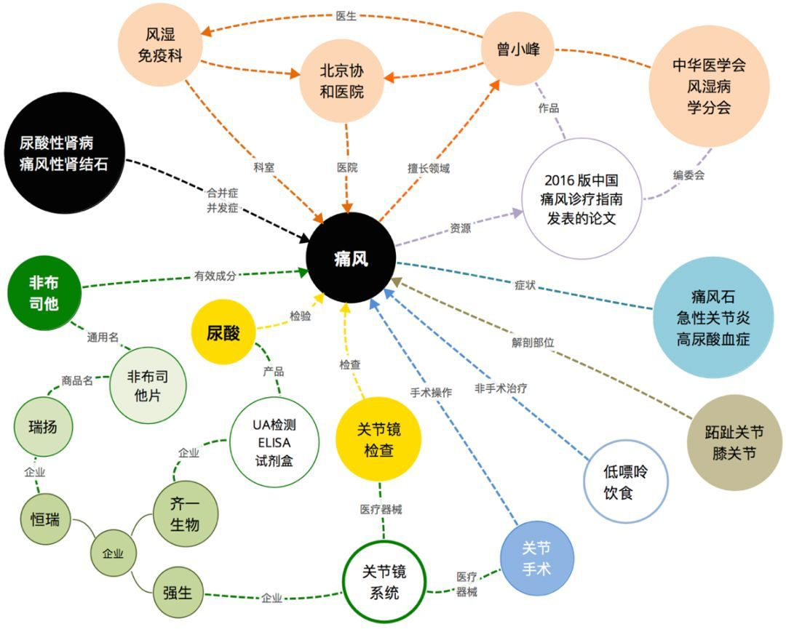

# RAG优化技术：Graph RAG


前面我们在介绍查询路由的时候，提到过可以用图数据库来增强RAG的效果，同时在提示词改写的时候也提到过，通过问题拆解，可以解决多跳问题回答效果不好的问题。

  

这些都和我们这一期要讲的Graph RAG有关系。

  

**Graph RAG** 是一种结合了**图结构（Graph）**与**RAG,**技术的新型人工智能架构。它在传统 RAG 的基础上引入了知识图谱或由文本构建的图结构，以更有效地组织、检索和利用信息，从而提升大语言模型（LLM）在复杂问答、推理和知识密集型任务中的表现。

  

传统的 RAG 方法通常包括两个步骤：

1. **检索（Retrieval）**：从大规模文档库中用向量相似度（如 embedding）检索出与用户查询最相关的若干段落。
2. **生成（Generation）**：将检索到的内容与原始问题一起输入 LLM，生成答案。

但这种方法存在一些问题：

- **上下文碎片化**：检索到的段落彼此孤立，缺乏语义关联。
- **难以处理多跳推理**：例如“爱因斯坦在哪所大学工作过？该校位于哪个国家？”需要两步推理，传统 RAG 难以有效支持。（虽然问题改写可以解决一部分，但是跳数过多，或者逻辑过于复杂的未必能解决）
- **重复/冗余信息**：不同文档可能包含相同事实，导致信息冗余或冲突。
- **缺乏全局知识结构**：无法利用实体之间的关系进行推理。

  

Graph RAG 的核心思想是：**将非结构化文本转化为结构化的图，并在图上进行智能检索与推理**。

  



  

GraphRAG和传统RAG的主要区别就是会借助图数据库和知识图谱技术，抽取文档中的实体之间的关系，构建一个图结构，不再依赖相似度检索，而是改用图的拓扑结构来定位相关信息。

  

## 知识图谱

  

知识图谱是一种**以图结构表示实体及其之间关系的知识库**。它将现实世界中的事物（如人、地点、事件、概念等）建模为**节点（实体）**，将它们之间的语义关系建模为**边（关系）**。

  

典型三元组形式：**(实体, 关系, 实体)**

  

例如：`(吴京, 参演过, 战狼)`

  

## 图数据库

  

图数据库是一种专门用于存储、查询和管理图结构数据的 NoSQL 数据库。它以节点（Node）、边（Edge/Relationship） 和 属性（Property） 为核心模型，天然适合表达和处理高度互联的数据。

  

- **节点（Node）**：表示实体，如“用户”、“商品”、“城市”。
- **边（Edge / Relationship）**：表示节点之间的关系，如“购买”、“关注”、“位于”。边是有方向的（可选），并可携带属性。
- **属性（Property）**：键值对，用于描述节点或边的特征，如 `{name: "张三", age: 30}`。

  

图数据库如果只能推荐一个的话，那一定是Neo4j

  

接下来，我们就以Neo4J为例，介绍一个通过图数据库+知识图谱做检索的例子，使我们的RAG系统能够回答这样的多跳问题：**电影****《十面埋伏》的导演，还导演过什么电影？**

  

这是一个经典的**多跳图查询**，我们需要在 Neo4j 中执行以下逻辑：

1. 找到电影《十面埋伏》
2. 找到导演了这部电影的导演。
3. 找出该导演还导演了哪些其他电影。

  

### Neo4J 部署

  

```
docker run \  --name neo4j \  -p 7474:7474 -p 7687:7687 \  -v $HOME/neo4j/data:/data \  -v $HOME/neo4j/logs:/logs \  -v $HOME/neo4j/conf:/conf \  -e NEO4J_AUTH=neo4j/neo4j666 \  -e NEO4JLABS_PLUGINS='["apoc"]' \  -d neo4j:5.22-community
```

  

部署成功后，使用http://localhost:7474 访问

  

### Neo4J接入

  

添加依赖

```
<dependency>    <groupId>org.springframework.boot</groupId>    <artifactId>spring-boot-starter-data-neo4j</artifactId></dependency>
```

  

增加配置：

  

```
spring:  neo4j:    uri: bolt://localhost:7687    authentication:      username: neo4j      password: your_password
```

  

定义实体类

```
@Node("Movie")public class Movie {    @Id    private String title;    private int year;    public Movie() {    }    public Movie(String title, int year) {        this.title = title;        this.year = year;    }    // Getters    public String getTitle() {        return title;    }    public int getYear() {        return year;    }}
```

  

```
@Node("Director")public class Director {    //导演    private String director;    @Id    private String name;    public Director() {    }    public Director(String name) {        this.name = name;    }    public String getName() {        return name;    }}
```

  

创建 Repository

  

```
@Repositorypublic interface MovieGraphRepository extends Neo4jRepository<Movie, String> {    @Query("""            MATCH (m:Movie {title: $title}) <-[:DIRECTED]- (d:Director) -[:DIRECTED]-> (other:Movie)            WHERE other.title <> $title            RETURN d.name AS director, collect(other.title + ' (' + other.year + ')') AS otherMovies            """)    List<DirectorMoviesDto> findOtherMoviesBySameDirector(String title);}
```

  

这里面返回值我们封装成DirectorMoviesDto：

  

```
public class DirectorMoviesDto {    private String director;    private List<String> otherMovies;    public DirectorMoviesDto() {    }    public DirectorMoviesDto(String director, List<String> otherMovies) {        this.director = director;        this.otherMovies = otherMovies;    }    public String getDirector() {        return director;    }    public void setDirector(String director) {        this.director = director;    }    public List<String> getOtherMovies() {        return otherMovies;    }    public void setOtherMovies(List<String> otherMovies) {        this.otherMovies = otherMovies;    }}
```

  

接着，定义Service

  

```
@Servicepublic class GraphService {    @Autowired    private MovieGraphRepository repository;    public String retrieveContext(String movieName) {        List<Map<String, Object>> results = repository.findOtherMoviesBySameDirector(movieName);        if (results.isEmpty()) {            return "未找到导演过《" + movieName + "》的导演的其他作品。";        }        StringBuilder sb = new StringBuilder();        for (Map<String, Object> row : results) {            String director = (String) row.get("director");            @SuppressWarnings("unchecked")            List<String> movies = (List<String>) row.get("otherMovies");            sb.append(String.format("- 导演 %s 还执导了：%s\n", director, String.join("、", movies)));        }        return sb.toString().trim();    }}
```

  

定义Controller，先做数据初始化：

  

```
@RequestMapping("/rag/graph")@RestControllerpublic class GraphRagController {    @Autowired    private Neo4jTemplate neo4jTemplate;    @Autowired    private Neo4jClient neo4jClient;        @GetMapping("/init")    public String initData() {        // 保存节点        neo4jTemplate.save(new Director("张艺谋"));        neo4jTemplate.save(new Director("陈思诚"));        neo4jTemplate.save(new Movie("十面埋伏", 2004));        neo4jTemplate.save(new Movie("影", 2016));        neo4jTemplate.save(new Movie("英雄", 2002));        neo4jTemplate.save(new Movie("误杀", 2019));        neo4jClient.query("""                        MATCH (p:Director {name: $name}), (m:Movie {title: $title})                        MERGE (p)-[:DIRECTED]->(m)                        """)                .bind("张艺谋").to("name")                .bind("十面埋伏").to("title")                .run();        neo4jClient.query("""                        MATCH (p:Director {name: $name}), (m:Movie {title: $title})                        MERGE (p)-[:DIRECTED]->(m)                        """)                .bind("张艺谋").to("name")                .bind("影").to("title")                .run();        neo4jClient.query("""                        MATCH (p:Director {name: $name}), (m:Movie {title: $title})                        MERGE (p)-[:DIRECTED]->(m)                        """)                .bind("张艺谋").to("name")                .bind("英雄").to("title")                .run();        neo4jClient.query("""                        MATCH (p:Director {name: $name}), (m:Movie {title: $title})                        MERGE (p)-[:DIRECTED]->(m)                        """)                .bind("陈思诚").to("name")                .bind("误杀").to("title")                .run();        return "Data initialized successfully";    }}
```

  

neo4jTemplate.save可以直接来保存节点，但是关系需要使用neo4jClient.query("...").bind(...).to(...).run(); ，他是使用Neo4J的Cypher语言进行数据库操作的，实现数据的初始化。

  

做图数据库检索及回答：

```
@RequestMapping("/rag/graph")@RestControllerpublic class GraphRagController {    @Autowired    private GraphService graphService;    @Autowired    private ChatModel chatModel;    @GetMapping("/ask")    public String ask(@RequestBody String movieName) {        String context = graphService.retrieveContext(movieName);        String prompt = """                你是一个电影知识助手，请根据以下上下文回答问题。                如果上下文没有足够信息，请回答“我不知道”。                                上下文：                %s                                问题：%s                回答：                """.formatted(context, movieName + "的导演还执导过哪些电影？");        return chatModel.call(prompt);    }}
```

  


