# Spring AI中的Modular RAG支持

前面我们介绍 RAG 的范式的时候，提到过 Advanced RAG 和 Modular RAG，前面我们已经介绍了很多 Advanced RAG 的相关技术，但是我们使用这些技术的时候还都是自己拼接的流程代码。

而 Spring AI 其实也提供了 Modular RAG 的支持（虽然比较弱，聊胜于无吧），他的核心组件就是 **RetrievalAugmentationAdvisor。**

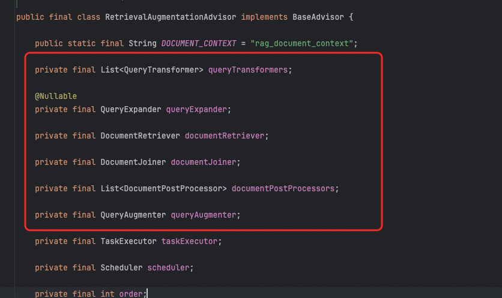

**RetrievalAugmentationAdvisor** 封装了完整的 RAG 流程，包括：

- 查询预处理（查询重写、查询扩展等）
- 文档检索（从向量数据库做检索）
- 上下文后处理（如文档合并等）
- 提示增强（将检索结果与用户问题合并）

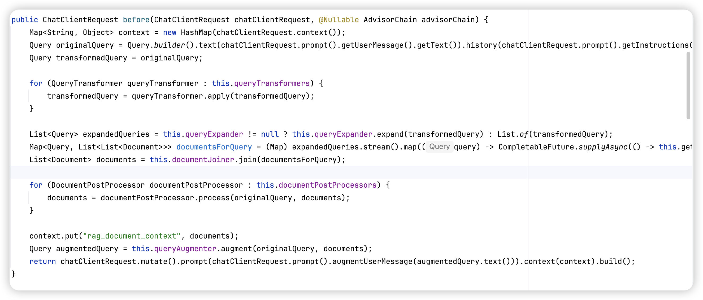

它基于 **模块化 RAG 架构**，允许开发者灵活组合不同阶段的组件。所以对于**复杂业务、或者定制要求更高**的场景，**RetrievalAugmentationAdvisor** 更推荐使用。

## 基本用法

RetrievalAugmentationAdvisor 也是一个 Advisor，他的用法和其他 Advisor 一样。

创建方式的话可以用 builder 来创建：

```java
Advisor retrievalAugmentationAdvisor = RetrievalAugmentationAdvisor.builder()
        // 查询预处理：转换查询（可选）
        .queryTransformers(queryTransformer)
        // 查询预处理：扩展查询（可选）
        .queryExpander(queryExpander)
        // 检索阶段：从向量库检索文档（必需）
        .documentRetriever(documentRetriever)
        // 后处理阶段：合并文档（当使用查询扩展时推荐）
        .documentJoiner(documentJoiner)
        // 生成阶段：构建增强提示词（可选，有默认实现）
        .queryAugmenter(queryAugmenter)
        .build();
```

使用的时候需要把他注册到 ChatClient 中：

```java
String answer = chatClient.prompt()
        .advisors(retrievalAugmentationAdvisor)
        .user("用户的问题")
        .call()
        .content();
```

接着我们分别介绍下各个组件。

## DocumentRetriever

在整个 RetrievalAugmentationAdvisor 中，有一个必不可少的组件——DocumentRetriever。因为他是要做文档检索的，没有他，也就一切都没必要了。

DocumentRetriever 作用是从外部知识源（如向量数据库、全文搜索引擎等）中根据用户查询语义**检索出最相关的文档片段（chunks）**，为大语言模型（LLM）提供上下文支持，从而提升回答的准确性与事实性。

**他的主要实现是 VectorStoreDocumentRetriever，基于向量相似度从 `VectorStore` 中检索文档。**

```java
DocumentRetriever retriever = VectorStoreDocumentRetriever.builder()
    .vectorStore(myVectorStore)          // 必需：绑定向量存储
    .topK(5)                             // 返回最相似的 5 个文档
    .similarityThreshold(0.6)            // 相似度低于 0.6 的过滤掉
    .filterExpression("source == 'docs.spring.io'") // 元数据过滤表达式
    .build();
```

比如，我们简单的使用 VectorStoreDocumentRetriever 结合 RetrievalAugmentationAdvisor 实现一个 RAG 检索，我们使用 ✅RAG优化技术：元数据过滤中的例子来说明，比如我需要检索带上元数据过滤的功能，通过以下代码即可实现效果。

```java
@GetMapping("/chatWithAdvistor")
public String chatWithAdvistor(@RequestParam("query") String query,
                               @RequestParam("fileName") String fileName) {
    Advisor retrievalAugmentationAdvisor = RetrievalAugmentationAdvisor.builder()
            .documentRetriever(VectorStoreDocumentRetriever.builder()
                    .similarityThreshold(0.50)
                    .vectorStore(vectorStore)
                    .build())
            .build();

    String answer = chatClient.prompt()
            .advisors(retrievalAugmentationAdvisor)
            .advisors(a -> a.param(VectorStoreDocumentRetriever.FILTER_EXPRESSION, "fileName == '" + fileName + "'"))
            .user(query)
            .call()
            .content();
    return answer;
}
```

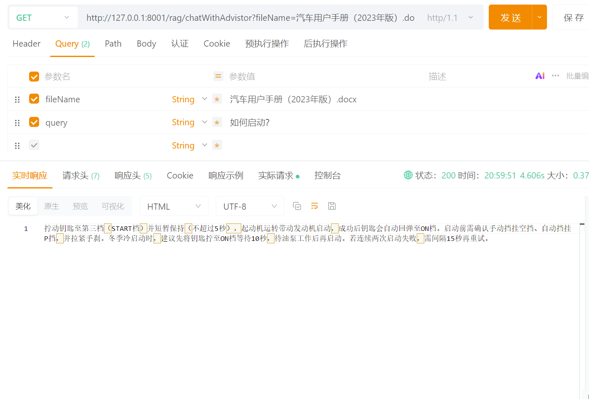

## QueryTransformer

在 ✅RAG优化技术：问题改写这个章节中，我们介绍了几种问题重写的方法，归根结底，都是增加一次或多次大模型调用，来生成多个重写后的问题。而在 Spring AI 中就给我们提供了这么一种东西，可以拿来即用，实现一些简单的问题重写功能。

这就是 QueryTransformer 接口，在 Spring AI 中这个接口提供 3 个实现类。分别是 CompressionQueryTransformer，RewriteQueryTransformer，TranslationQueryTransformer。

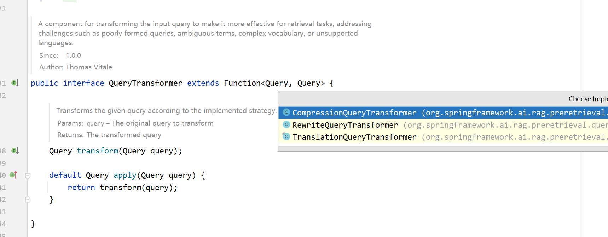

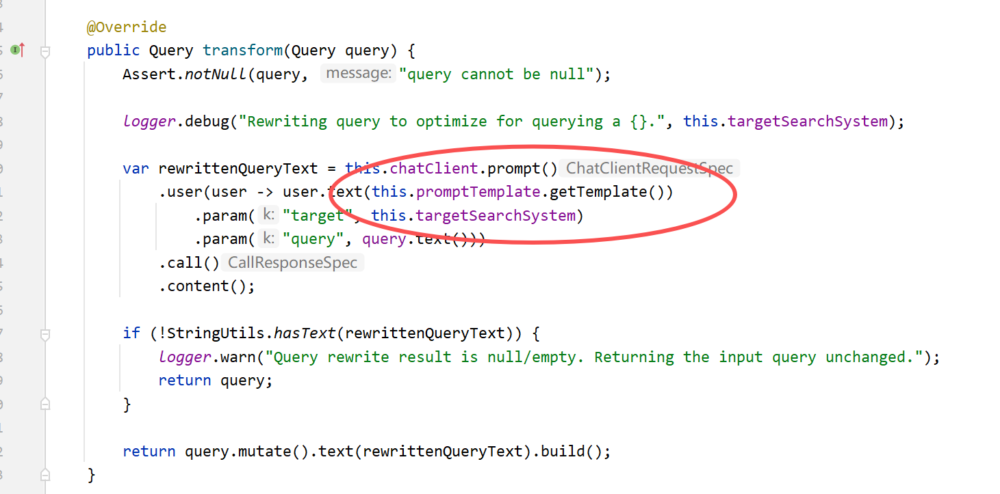

我们可以从源码看到，不论是哪种 QueryTransformer 实现，本质上其实都是发起一次大模型 api 的调用。

### CompressionQueryTransformer

当用户有多轮对话时，把当前问题"压缩成一个完整且独立的查询"，避免丢失上下文。类比的话，其实这就是我们前面**问题重写**章节介绍的**富化**功能，也就是说将历史对话，以及用户当前问题，进行总结输出一个丰富完整的、补充好代词主语的新 Query。

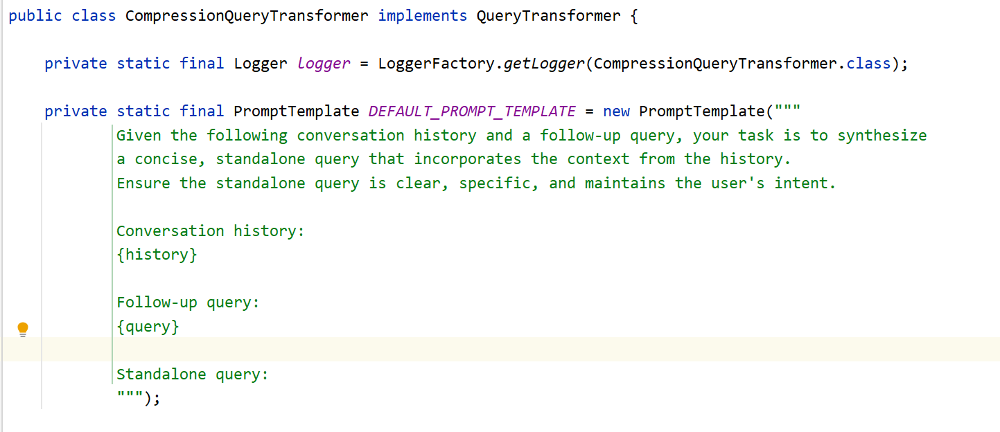

```java
Advisor retrievalAugmentationAdvisor = RetrievalAugmentationAdvisor.builder()
        .queryTransformers(CompressionQueryTransformer.builder()
                .chatClientBuilder(ChatClient.builder(chatModel).build().mutate())
                .build())
        .documentRetriever(VectorStoreDocumentRetriever.builder()
                .topK(5)
                .vectorStore(vectorStore)
                .build())
        .build();

String answer = chatClient.prompt()
        .advisors(retrievalAugmentationAdvisor)
        .advisors(a -> a.param(VectorStoreDocumentRetriever.FILTER_EXPRESSION, "fileName == '" + fileName + "'"))
        .user(query)
        .call()
        .content();
```

### RewriteQueryTransformer

这个其实就是把用户原始问题"改写成更利于检索的关键词问法"。可能会去除掉一些冗余的表达、口语化的连接词、介词等等，使得问题更加具体。但是他是没有上下文关联的，也就是说对于多轮会话，他无法替换一些代词。

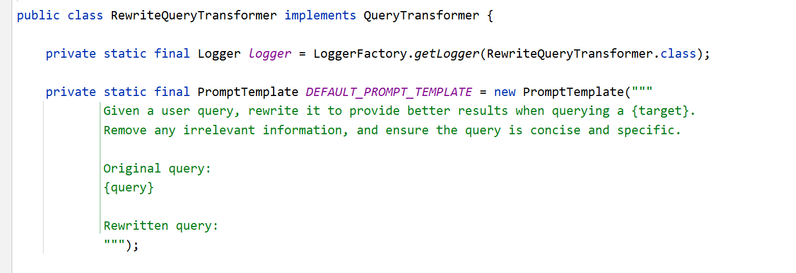

```java
Advisor retrievalAugmentationAdvisor = RetrievalAugmentationAdvisor.builder()
        .queryTransformers(RewriteQueryTransformer.builder()
                .chatClientBuilder(ChatClient.builder(chatModel).build().mutate())
                .build())
        .documentRetriever(VectorStoreDocumentRetriever.builder()
                .vectorStore(vectorStore)
                .build())
        .build();

String answer = chatClient.prompt()
        .advisors(retrievalAugmentationAdvisor)
        .user(query)
        .call()
        .content();
return answer;
```

### TranslationQueryTransformer

将用户问题翻译成文档库使用的语言（默认英文），如果文档库是英文，而用户的问题是中文，就很有可能导致检索不到相关内容。

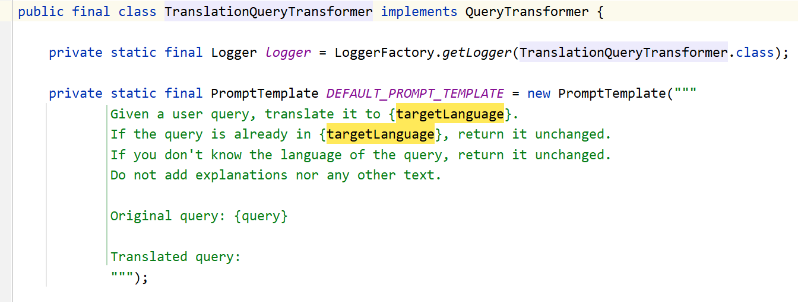

```java
Advisor retrievalAugmentationAdvisor = RetrievalAugmentationAdvisor.builder()
        .queryTransformers(TranslationQueryTransformer.builder()
                .chatClientBuilder(ChatClient.builder(chatModel).build().mutate())
                .targetLanguage("zh")
                .build();)
        .documentRetriever(VectorStoreDocumentRetriever.builder()
                .vectorStore(vectorStore)
                .build())
        .build();

String answer = chatClient.prompt()
        .advisors(retrievalAugmentationAdvisor)
        .user(query)
        .call()
        .content();
return answer;
```

### 实战演示

为了演示效果，选用《三国演义》的第三章节来构建知识库，基于它来实验我们的 QueryTransformer。

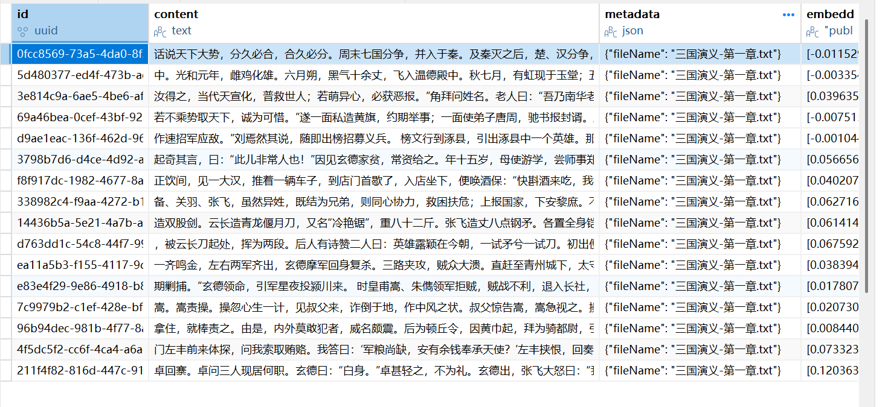

我们构造一个会话历史，看 CompressionQueryTransformer 能跟给我们生成什么样的新 Query

```java
Query query = Query.builder()
        .text("他的字是什么？")
        .history(new UserMessage("刘备是谁的后人？"),
                new AssistantMessage("中山靖王刘胜之后，汉景帝阁下玄孙。"))
        .build();
log.info("压缩重写前的Query is {}", query.text());

CompressionQueryTransformer queryTransformer = CompressionQueryTransformer.builder()
        .chatClientBuilder(ChatClient.builder(chatModel).build().mutate())
        .build();
Query transform = queryTransformer.transform(query);
log.info("压缩重写后的Query is {}", transform.text());
Advisor retrievalAugmentationAdvisor = RetrievalAugmentationAdvisor.builder()
        .queryTransformers(queryTransformer)
        .documentRetriever(VectorStoreDocumentRetriever.builder()
                .topK(5)
                .vectorStore(vectorStore)
                .build())
        .build();

String answer = chatClient.prompt()
        .advisors(retrievalAugmentationAdvisor)
        .user(query.text())
        .call()
        .content();
return answer;
```

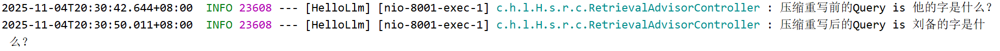

这边可以通过日志看到，已经将我们的代词换成了明确的主语，这个效果跟我们在问题重写章节中描述的是一致的。

下面我们改造一下代码，用 RewriteQueryTransformer 来改写一下：

```java
@GetMapping("/chatWithRewrite")
public String chatWithRewrite() {
    Query query = Query.builder()
            .text("我正在看三国演义，我很喜欢他，你告诉我他的字到底是什么？")
            .history(new UserMessage("刘备是谁的后人？"),
                    new AssistantMessage("中山靖王刘胜之后，汉景帝阁下玄孙。"))
            .build();
    log.info("重写前的Query is {}", query.text());

    RewriteQueryTransformer queryTransformer = RewriteQueryTransformer.builder()
            .chatClientBuilder(ChatClient.builder(chatModel).build().mutate())
            .build();
    Query transform = queryTransformer.transform(query);
    log.info("重写后的Query is {}", transform.text());
    Advisor retrievalAugmentationAdvisor = RetrievalAugmentationAdvisor.builder()
            .queryTransformers(queryTransformer)
            .documentRetriever(VectorStoreDocumentRetriever.builder()
                    .topK(5)
                    .vectorStore(vectorStore)
                    .build())
            .build();

    String answer = chatClient.prompt()
            .advisors(retrievalAugmentationAdvisor)
            .user(query.text())
            .call()
            .content();
    return answer;
}
```

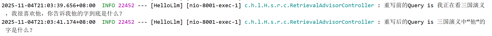

我们可以看到重写后的问题，确实去除了一些冗余信息，但是由于没有上下文历史，他无法替换问题中的代词。

接下来我们继续使用一下 TranslationQueryTransformer，来看下它是什么效果。

由于我们的向量库存储的是中文，那么我们就使用英文的 Query 来演示，目标语言设置成 zh 表示中文。

```java
Query query = Query.builder().text("What is Liu Bei's courtesy name?").build();
log.info("重写前的Query is {}", query.text());

TranslationQueryTransformer queryTransformer = TranslationQueryTransformer.builder()
        .chatClientBuilder(ChatClient.builder(chatModel).build().mutate())
        .targetLanguage("zh")
        .build();
Query transform = queryTransformer.transform(query);
log.info("重写后的Query is {}", transform.text());
Advisor retrievalAugmentationAdvisor = RetrievalAugmentationAdvisor.builder()
        .queryTransformers(queryTransformer)
        .documentRetriever(VectorStoreDocumentRetriever.builder()
                .topK(5)
                .vectorStore(vectorStore)
                .build())
        .build();

String answer = chatClient.prompt()
        .advisors(retrievalAugmentationAdvisor)
        .user(query.text())
        .call()
        .content();
return answer;
```

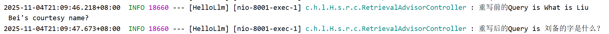

其实就是利用大模型翻译了一下原始 Query。

## QueryExpander

**MultiQueryExpander** 是 Spring AI 默认提供的 **QueryExpander** 的实现类。它用于 **把一个用户查询扩展成多个语义不同但相关的查询**，从而提升向量检索命中率。这个就类似于我们在问题重写章节中介绍的**多样化。**

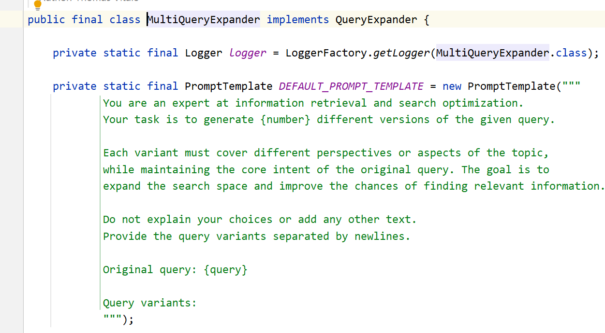

```java
Query query = Query.builder().text("刘备和张飞什么关系").build();
QueryExpander expander = MultiQueryExpander.builder()
        .chatClientBuilder(ChatClient.builder(chatModel).build().mutate())
        // 扩展的条数
        .numberOfQueries(3)
        // 是否包含原始问题
        .includeOriginal(true)
        .build();
List<Query> queries = expander.expand(query);

log.info("扩展后的Query is {}", queries);

Advisor retrievalAugmentationAdvisor = RetrievalAugmentationAdvisor.builder()
        .queryExpander(expander)
        .documentRetriever(VectorStoreDocumentRetriever.builder()
                .topK(5)
                .vectorStore(vectorStore)
                .build())
        .build();

String answer = chatClient.prompt()
        .advisors(retrievalAugmentationAdvisor)
        .user(query.text())
        .call()
        .content();
return answer;
```

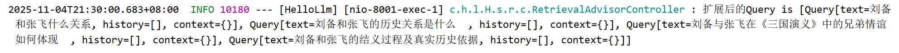

可以看到扩展的结果为 4 条，3 条扩展的 + 1 条原始的问题，**这样就可以一定程度上增加命中文本块的概率。**

## DocumentJoiner

DocumentJoiner 是 RAG 流程中的"文档合并器"。当检索到多个文本块的时候，它负责将这些检索返回的文本块简单拼接成一个统一的文档列表，并做基本的去重与按相似度分数排序，最终输出供大模型生成回答的上下文内容。其实就是跟我们在**检索增强生成**这个文章中讲解的，对文档进行拼接是一个原理。

ConcatenationDocumentJoiner 是 DocumentJoiner 默认的实现类。其功能就是按照文档 ID 去重，再根据 score 进行降序排序。

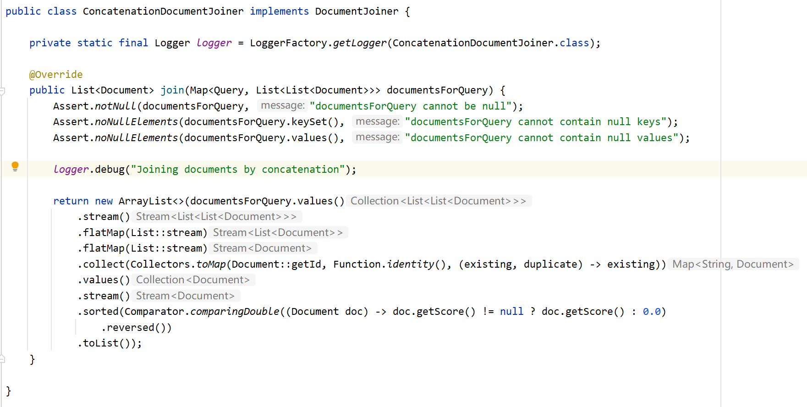

```java
Query query = Query.builder().text("刘备和张飞什么关系").build();
QueryExpander expander = MultiQueryExpander.builder()
        .chatClientBuilder(ChatClient.builder(chatModel).build().mutate())
        .numberOfQueries(3)
        .includeOriginal(true)
        .build();
List<Query> queries = expander.expand(query);

log.info("扩展后的Query is {}", queries);

Advisor retrievalAugmentationAdvisor = RetrievalAugmentationAdvisor.builder()
        .queryExpander(expander)
        .documentRetriever(VectorStoreDocumentRetriever.builder()
                .topK(5)
                .vectorStore(vectorStore)
                .build())
        .documentJoiner(new ConcatenationDocumentJoiner())
        .build();

String answer = chatClient.prompt()
        .advisors(retrievalAugmentationAdvisor)
        .user(query.text())
        .call()
        .content();
return answer;
```

## QueryAugmenter

QueryAugmenter 的作用是在检索完成后、模型生成回答之前，对原始查询进行"上下文增强"。它会根据当前对话内容、历史记录，为查询构建新的提示词，使模型在生成最终回答时理解更充分。

**与上面介绍的 QueryTransformer 不同，QueryTransformer 是作用于检索前，QueryAugmenter 更专注于在生成前增强上下文，确保回答更加准确。**

ContextualQueryAugmenter 是其默认实现类，最终目的就是按照 Prompt 模板生成一个新的 Query。这个 Query 的提示词中包含了检索出的文档内容，还有用户的原始提问

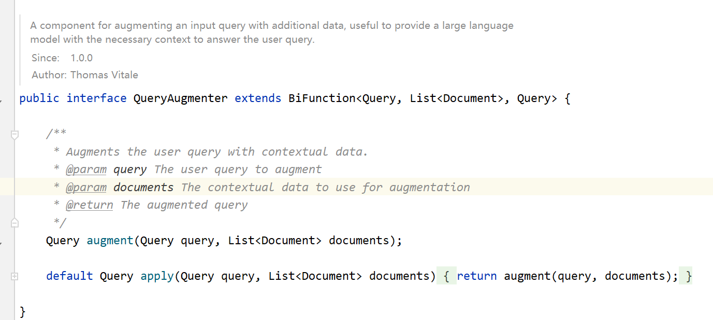

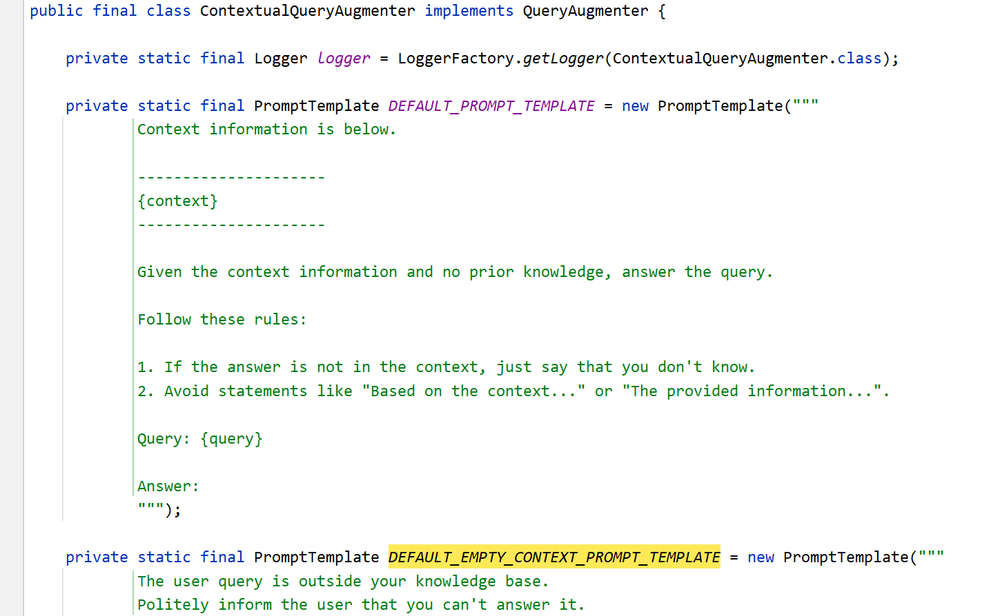

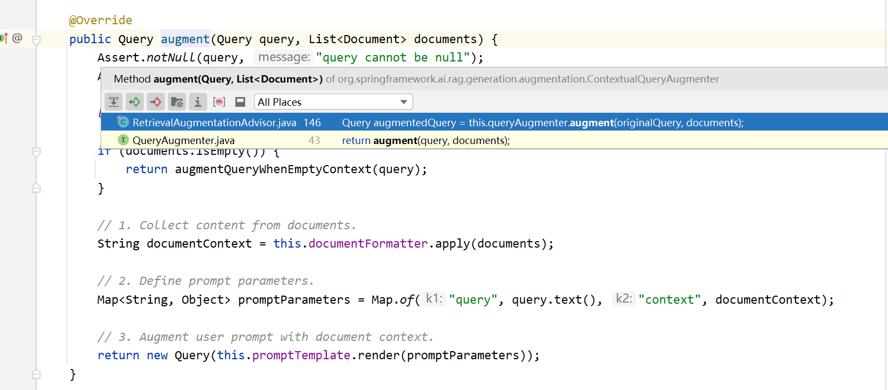

```java
@GetMapping("/chatWithAll")
public String chatWithAll() {
    Query query = Query.builder().text("刘备和张飞什么关系").build();
    QueryExpander expander = MultiQueryExpander.builder()
            .chatClientBuilder(ChatClient.builder(chatModel).build().mutate())
            .numberOfQueries(3)
            .includeOriginal(true)
            .build();
    List<Query> queries = expander.expand(query);

    log.info("扩展后的Query is {}", queries);

    QueryAugmenter queryAugmenter = ContextualQueryAugmenter.builder()
            .allowEmptyContext(true)
            .build();

    Advisor retrievalAugmentationAdvisor = RetrievalAugmentationAdvisor.builder()
            .queryExpander(expander)
            .documentRetriever(VectorStoreDocumentRetriever.builder()
                    .topK(5)
                    .vectorStore(vectorStore)
                    .build())
            .documentJoiner(new ConcatenationDocumentJoiner())
            .queryAugmenter(queryAugmenter)
            .build();

    String answer = chatClient.prompt()
            .advisors(retrievalAugmentationAdvisor)
            .user(query.text())
            .call()
            .content();
    return answer;
}
```

通过 debug，我们可以看下最终生成的新 Query 是长什么样子：

```
Context information is below.

---------------------
备、关羽、张飞，虽然异姓，既结为兄弟，则同心协力，救困扶危；上报国家，下安黎庶。不求同年同月同日生，只愿同年同月同日死。皇天后土，实鉴此心，背义忘恩，天人共戮！”誓毕，拜玄德为兄，关羽次之，张飞为弟。祭罢天地，复宰牛设酒，聚乡中勇士，得三百余人，就桃园中痛饮一醉。来日收拾军器，但恨无马匹可乘。正思虑间，人报有两个客人，引一伙伴当，赶一群马，投庄上来。玄德曰：“此天佑我也！”三人出庄迎接。原来二客乃中山大商：一名张世平，一名苏双，每年往北贩马，近因寇发而回。玄德请二人到庄，置酒管待，诉说欲讨贼安民之意。二客大喜，愿将良马五十匹相送；又赠金银五百两，镔铁一千斤，以资器用。 玄德谢别二客，便命良匠打造双股剑。云长造青龙偃月刀，又名“冷艳锯”，重八十二斤。张飞造丈八点钢矛。各置全身铠甲。共聚乡勇五百余人，来见邹靖。邹靖引见太守刘焉。三人参见毕，各通姓名。玄德说起宗派，刘焉大喜，遂认玄德为侄。不数日正饮间，见一大汉，推着一辆车子，到店门首歇了，入店坐下，便唤酒保：“快斟酒来吃，我待赶入城去投军。”玄德看其人：身长九尺，髯长二尺；面如重枣，唇若涂脂；丹凤眼，卧蚕眉，相貌堂堂，威风凛凛。玄德就邀他同坐，叩其姓名。其人曰：“吾姓关名羽，字长生，后改云长，河东解良人也。因本处势豪倚势凌人，被吾杀了，逃难江湖，五六年矣。今闻此处招军破贼，特来应募。”玄德遂以己志告之，云长大喜。同到张飞庄上，共议大事。飞曰：“吾庄后有一桃园，花开正盛；明日当于园中祭告天地，我三人结为兄弟，协力同心，然后可图大事。”玄德、云长齐声应曰：“如此甚好。” 次日，于桃园中，备下乌牛白马祭礼等项，三人焚香再拜而说誓曰：“念刘备、关羽、张飞，虽然异姓，既结为兄弟，则同心协力，救困扶危；上报国家，下安黎庶。不求同年同月同日生，只愿同年同月同日死。皇天后土，实鉴此心，背义忘恩，天人共戮！”誓毕，拜玄德为兄，关羽次之，张飞为弟。起奇其言，曰：“此儿非常人也！”因见玄德家贫，常资给之。年十五岁，母使游学，尝师事郑玄、卢植，与公孙瓒等为友。 及刘焉发榜招军时，玄德年已二十八岁矣。当日见了榜文，慨然长叹。随后一人厉声言曰：“大丈夫不与国家出力，何故长叹？”玄德回视其人，身长八尺，豹头环眼，燕颔虎须，声若巨雷，势如奔马。玄德见他形貌异常，问其姓名。其人曰：“某姓张名飞，字翼德。世居涿郡，颇有庄田，卖酒屠猪，专好结交天下豪杰。恰才见公看榜而叹，故此相问。”玄德曰：“我本汉室宗亲，姓刘，名备。今闻黄巾倡乱，有志欲破贼安民，恨力不能，故长叹耳。”飞曰：“吾颇有资财，当招募乡勇，与公同举大事，如何。”玄德甚喜，遂与同入村店中饮酒。 正饮间，见一大汉，推着一辆车子，到店门首歇了，入店坐下，便唤酒保：“快斟酒来吃，我待赶入城去投军。”玄德看其人：身长九尺，髯长二尺；面如重枣，唇若涂脂；丹凤眼，卧蚕眉，相貌堂堂，威风凛凛。玄德就邀他同造双股剑。云长造青龙偃月刀，又名“冷艳锯”，重八十二斤。张飞造丈八点钢矛。各置全身铠甲。共聚乡勇五百余人，来见邹靖。邹靖引见太守刘焉。三人参见毕，各通姓名。玄德说起宗派，刘焉大喜，遂认玄德为侄。不数日，人报黄巾贼将程远志统兵五万来犯涿郡。刘焉令邹靖引玄德等三人，统兵五百，前去破敌。玄德等欣然领军前进，直至大兴山下，与贼相见。贼众皆披发，以黄巾抹额。当下两军相对，玄德出马，左有云长，右有翼德，扬鞭大骂：“反国逆贼，何不早降！”程远志大怒，遣副将邓茂出战。张飞挺丈八蛇矛直出，手起处，刺中邓茂心窝，翻身落马。程远志见折了邓茂，拍马舞刀，直取张飞。云长舞动大刀，纵马飞迎。程远志见了，早吃一惊，措手不及，被云长刀起处，挥为两段。后人有诗赞二人曰：英雄露颖在今朝，一试矛兮一试刀。初出便将威力展，三分好把姓名标。 众贼见程远志被斩，皆倒戈而走。玄德挥军追赶，投降者不计其数，大胜而回。刘焉亲自迎接，赏劳军门左丰前来体探，问我索取贿赂。我答曰：‘军粮尚缺，安有余钱奉承天使？’左丰挟恨，回奏朝廷，说我高垒不战，惰慢军心；因此朝廷震怒，遣中郎将董卓来代将我兵，取我回京问罪。”张飞听罢，大怒，要斩护送军人，以救卢植。玄德急止之曰：“朝廷自有公论，汝岂可造次？”军士簇拥卢植去了。关公曰：“卢中郎已被逮，别人领兵，我等去无所依，不如且回涿郡。”玄德从其言，遂引军北行。行无二日，忽闻山后喊声大震。玄德引关、张纵马上高冈望之，见汉军大败，后面漫山塞野，黄巾盖地而来，旗上大书“天公将军”。玄德曰：“此张角也！可速战！”三人飞马引军而出。张角正杀败董卓，乘势赴来，忽遇三人冲杀，角军大乱，败走五十余里。 三人救了董卓回寨。卓问三人现居何职。玄德曰：“白身。”卓甚轻之，不为礼。玄德出，张飞大怒曰：“我等亲赴血战，救了这厮，他却如此无礼。若不杀之，难消我气！”便要提刀入帐来杀董卓。正是：人情势利古犹今，谁识英雄是白
---------------------

Given the context information and no prior knowledge, answer the query.

Follow these rules:

1. If the answer is not in the context, just say that you don't know.
2. Avoid statements like "Based on the context..." or "The provided information...".

Query: 刘备和张飞什么关系
Answer:
```

## 总结一下

RetrievalAugmentationAdvisor 就是将 RAG 的流程拆分为多个可插拔步骤，并按一定的顺序串联起来：首先是 QueryTransformer，它在检索前对用户问题进行改写、压缩或翻译，使查询更适合检索；然后是 QueryExpander，将一个查询扩展成多个语义不同的查询以提升召回率；接着由 DocumentRetriever 执行相似度检索获取文本块；接着这些文本块会由 DocumentJoiner 进行文档合并、去重与排序；最后由 QueryAugmenter 在生成前将检索结果与用户问题融合，形成更完善的上下文提示词交给模型回答。整体构成了一条从"提问 → 问题重写 → 文档整合 → 提示增强 → 生成回答"的标准流程。

当然在实际开发中，这些步骤并非必须全部启用，我们应当根据实际的需求、性能和成本灵活选择与组合。