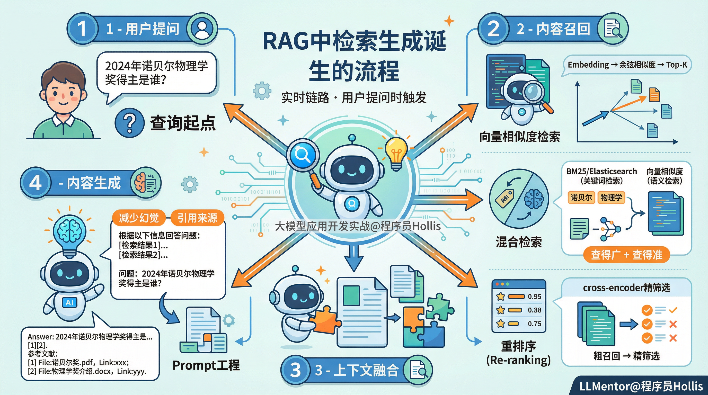

# ✅深入理解RAG技术原理——检索生成



  

我们这篇文章介绍下RAG中的检索生成的主要步骤。一般来说，检索生成是发生在实时链路上的，也就是用户提问的过程我们就去做检索生成。主要包含以下几个步骤：

  

### **用户提问**

这个很好理解，用户提出一个问题或请求（例如：“2024年诺贝尔物理学奖得主是谁？”）。该查询将作为后续检索和生成的起点。

  

### 内容召回

内容召回指的是如何**从知识库中找到与用户问题最相关的文本块（chunk）**。这是检索生成的第一步，也是整个RAG系统回答准确性的**直接因素**。

  

检索有很多种方式，如：

  

**向量相似度检索**

首先会将用户问题进行**向量化（Embedding）**，得到用户问题的向量语义表示。然后在向量数据库中，通过**余弦相似度**或**点积相似度**等算法，进行相似度查询，找到一系列最相似的文本块。检索结果通常是**Top-K**个（例如最相似的3\~5个chunk）。

  

**混合检索**

**（这个知识点会在后面的章节中进行详细的实战讲解，这边只做简单的介绍）**

单纯的相似度检索有时会“检索太多，但不够精准”，尤其是一些领域的专业名词或缩写。相似度查询会表现出明显的瓶颈。语义相似度往往难以准确捕捉这些关键字的精确含义。正因如此，混合检索应运而生。

混合检索是将**关键词检索与相似度检索进行整合**，：

- **BM25 / Elasticsearch**（关键词检索，保证精确匹配，获取核心关键内容）；
- **向量相似度检索**（语义检索，保证相似度，捕捉语义相似的内容）。

通过混合策略，可以让系统在**“查得广”与“查得准”**之间取得平衡，让系统既能理解语义，又能保证检索的准确性与可靠性 。

  

**重排序（Re-ranking）**

  

**（这个知识点会在后面的章节中进行详细的实战讲解，这边只做简单的介绍）**

不管是“向量相似度检索”，还是“混合检索”，都是对用户问题相关内容的初步筛选，可以理解为**“粗召回”** ，这时候还可以再用一个轻量模型（如cross-encoder）对这些粗召回的文本块重新打分排序，可以理解为**“精筛选”**。将最相关的文本块挑选出来，去除掉排名靠后的文本块，这样的操作，可以让最终进入提示词的文档更加精准。

  

  

### **上下文融合**

  

内容召回是找到与用户问题最相关的一些资料，而真正让大模型生成答案的关键在于，如何**让模型正确使用这些资料生成答案**。这一过程通常通过 **Prompt（提示词）工程** 实现。

而我们之前课程中提到的**提示词（Prompt）工程**就是决定回答质量的关键步骤。这一步是将检索到的相关文档与原始查询拼接成一个增强的提示（prompt），例如：

```
根据以下信息回答问题：[检索结果1] …  [检索结果2] …问题：2024年诺贝尔物理学奖得主是谁？
```

这个增强后的提示将作为生成模型的输入。

  

### 内容**生成**

  

在拿到上下文融合后的提示词之后，就可以让大模型回答问题了。因为大模型能借助这个**“知识外挂”**去回答问题，就会有效减少大模型的输出幻觉。

  

除此之外，RAG中的**元数据**也可以在这边体现作用，比如我在元数据中设置了文件名，参考链接等，那么这边大模型在生成答案的时候，在回答中就可以附带**引用****来源和参考链接，提升回答的可信度。**

