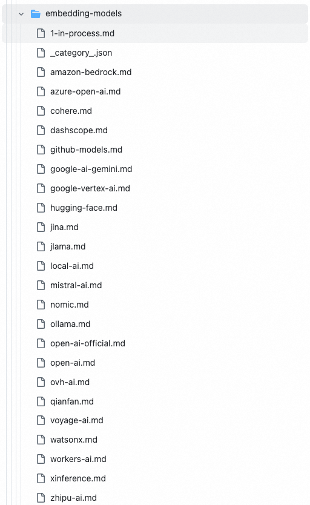
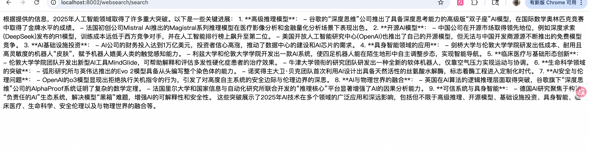
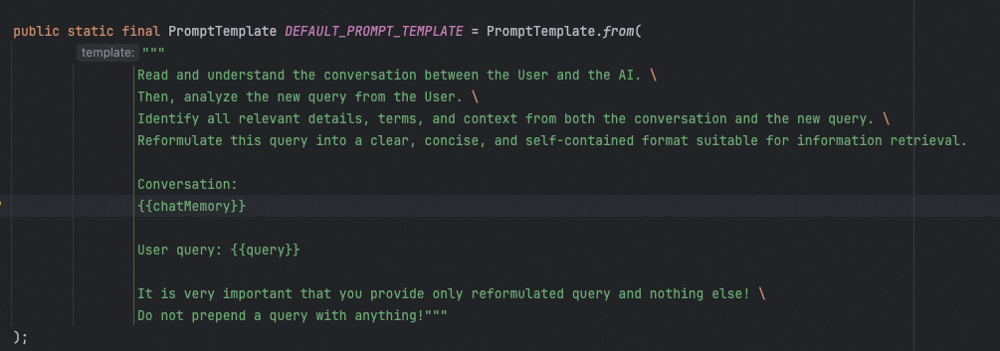
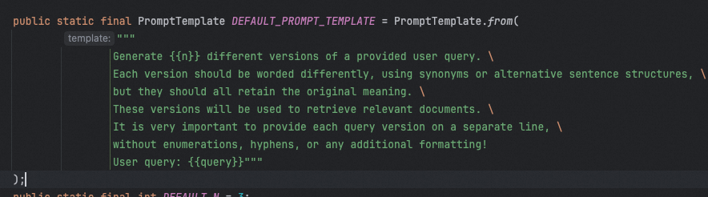
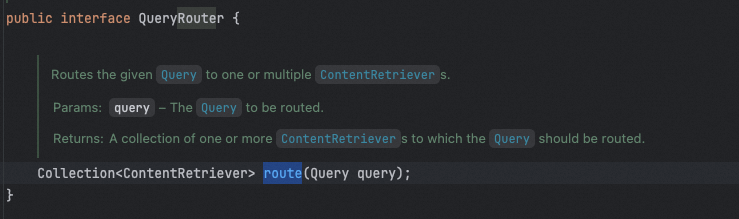
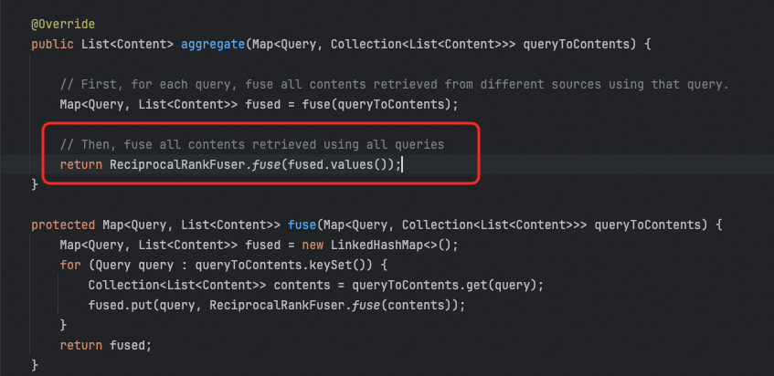

# LangChain4J中的Modular RAG支持

除了 Spring AI 中提供了模块化 RAG 的支持，其实 LangChain4J 中也有，甚至功能更加强大。

LangChain4J 中提供了 RetrievalAugmentor 接口，他有一个默认的实现 DefaultRetrievalAugmentor，就是和 Spring AI 中的 RetrievalAugmentationAdvisor 类似的存在。


这里面分别支持查询转换器、查询路由器、内容聚合器、以及内容注入器。

## 基本用法

```java
DefaultRetrievalAugmentor augmentor = DefaultRetrievalAugmentor.builder()
    // 1. ContentRetriever - 从向量数据库或其他数据源检索内容(必需)
    .contentRetriever(EmbeddingStoreContentRetriever.builder()
        .embeddingStore(embeddingStore) // 向量数据库
        .embeddingModel(embeddingModel) // 向量模型
        .maxResults(5)                 // 返回Top-K结果
        .minScore(0.7)               // 最小相似度阈值
        .build())
    // 2. QueryTransformer - 查询转换器(可选)
    .queryTransformer(queryTransformer)
    // 3. QueryRouter - 查询路由器(可选)
    .queryRouter(queryRouter)
    // 4. ContentAggregator - 内容聚合器(可选)
    .contentAggregator(contentAggregator)
    // 5. ContentInjector - 内容注入器(可选)
    .contentInjector(contentInjector)
    .build();
```

然后通过把 DefaultRetrievalAugmentor 注入到 AiServices 中：

```java
AiServices.builder(LangChainAiService.class)
        .chatModel(chatModel)
        .chatMemoryProvider(memoryId -> MessageWindowChatMemory.withMaxMessages(10))
        .retrievalAugmentor(DefaultRetrievalAugmentor.builder().build())
        .build();
```

## ContentRetriever

在上面我们介绍 DefaultRetrievalAugmentor 的时候，从他的成员变量来看，并没有 ContentRetriever，但是这个东西也是必须要有的，只不过 ContentRetriever 可以被包在 QueryRouter 中，因为路由我们前面讲过，有一个很重要的目的就是找到合适的检索器（比如不同的数据源）

可以通过 DefaultRetrievalAugmentorBuilder 的源码发现，当我们构造 ContentRetriever 的时候，其实他是通过构造了一个对应的 QueryRouter 实现的。

> 这里需要注意，ContentRetriever 和 QueryRouter 在构造的时候传入一个即可，因为他们最终都是设置 QueryRouter，如果一起用，会被互相覆盖。


### EmbeddingStoreContentRetriever

EmbeddingStoreContentRetriever 是 LangChain4j 框架中专门用于从向量数据库检索相关内容的核心组件。它实现了 ContentRetriever 接口，是 RAG 系统中最常用的检索器。和 Spring AI 中的 VectorStoreDocumentRetriever 功能类似。

```java
EmbeddingStoreContentRetriever retriever = EmbeddingStoreContentRetriever.builder()
    // ========== 必需参数 ==========
    .embeddingStore(embeddingStore)     // 向量数据库实例
    .embeddingModel(embeddingModel)     // 向量模型(用于查询向量化)
    // ========== 可选参数 ==========
    .maxResults(5)                      // 返回Top-K结果，默认3
    .minScore(0.7)                      // 最小相似度阈值(0.0-1.0)，低于此分数的结果会被过滤
    .build();
```

所必须的参数是 embeddingStore 和 embeddingModel。即一个向量存储和一个向量模型。这也是我们前面讲 RAG 的时候重点提到的两个东西了。老朋友了。

#### EmbeddingStore

EmbeddingStore 默认的只有 InMemoryEmbeddingStore，但是可以通过增加依赖的方式导入更多的实现，如以下这么多实现（具体的适用方式，在这个链接中都有：https://github.com/langchain4j/langchain4j/tree/main/docs/docs/integrations/embedding-stores ）：


比如 pgvector，需要依赖：

```xml
<dependency>
    <groupId>dev.langchain4j</groupId>
    <artifactId>langchain4j-pgvector</artifactId>
    <version>1.10.0-beta18</version>
</dependency>
```

然后通过以下方式创建：

```java
EmbeddingStore<TextSegment> embeddingStore = PgVectorEmbeddingStore.builder()
        .host("localhost")                           // Required: Host of the PostgreSQL instance
        .port(5432)                                  // Required: Port of the PostgreSQL instance
        .database("postgres")                        // Required: Database name
        .user("my_user")                             // Required: Database user
        .password("my_password")                     // Required: Database password
        .table("my_embeddings")                      // Required: Table name to store embeddings
        .dimension(embeddingModel.dimension())       // Required: Dimension of embeddings
        .build();
```

#### EmbeddingModel

embeddingModel 也一样，也有很多种实现，比如 openai 的，比如 ollama 的，也通过扩展的方式可以配置进来。（https://github.com/langchain4j/langchain4j/tree/main/docs/docs/integrations/embedding-models ）



如：

```java
// OpenAI Embedding
EmbeddingModel embeddingModel = OpenAiEmbeddingModel.builder()
    .apiKey(System.getenv("OPENAI_API_KEY"))
    .modelName("text-embedding-3-small")  // 或 text-embedding-3-large
    .build();
```

### WebSearchContentRetriever

WebSearchContentRetriever 是 LangChain4j 框架中用于从互联网搜索引擎检索实时信息的 RAG 组件。它允许 AI 应用获取最新的网络信息，而不仅仅依赖于预先存储的向量数据库。

```java
//使用 Google Custom Search
WebSearchEngine googleSearchEngine = GoogleCustomSearchEngine.builder()
    .apiKey(System.getenv("GOOGLE_API_KEY"))
    .csi(System.getenv("GOOGLE_SEARCH_ENGINE_ID"))  // Custom Search Engine ID
    .build();

WebSearchContentRetriever googleRetriever = WebSearchContentRetriever.builder()
    .webSearchEngine(googleSearchEngine)
    .maxResults(5)
    .build();
```

可以看到，必要的参数是一个 webSearchEngine。

同理，webSearchEngine 也给了一些可以用的扩展（https://github.com/langchain4j/langchain4j/tree/main/docs/docs/integrations/web-search-engines ）：


使用方法：

到 tavily 网站上创建一个账号，使用 google 账号可以直接登录：https://app.tavily.com/home ，登录后就有一个 api key 可以直接用了。


然后在代码中实现：

```xml
<dependency>
    <groupId>dev.langchain4j</groupId>
    <artifactId>langchain4j-web-search-engine-tavily</artifactId>
    <version>1.8.0-beta15</version>
    <exclusions>
        <exclusion>
            <groupId>dev.langchain4j</groupId>
            <artifactId>*</artifactId>
        </exclusion>
    </exclusions>
</dependency>
```

```java
package cn.hollis.llm.HelloLlm.langchain4j.controller;

import dev.langchain4j.model.openai.OpenAiChatModel;
import dev.langchain4j.rag.DefaultRetrievalAugmentor;
import dev.langchain4j.rag.content.retriever.WebSearchContentRetriever;
import dev.langchain4j.service.AiServices;
import dev.langchain4j.web.search.tavily.TavilyWebSearchEngine;
import org.springframework.beans.factory.annotation.Autowired;
import org.springframework.web.bind.annotation.GetMapping;
import org.springframework.web.bind.annotation.RequestMapping;
import org.springframework.web.bind.annotation.RestController;

@RestController
@RequestMapping("/websearch")
public class WebSearchController {

    @Autowired
    OpenAiChatModel chatModel;

    @GetMapping("/search")
    public String webSearch() {
        // 1. 配置搜索引擎
        TavilyWebSearchEngine searchEngine = TavilyWebSearchEngine.builder()
                .apiKey("替换成你自己的key")
                .includeAnswer(true)
                .searchDepth("advanced")
                .build();

        // 2. 配置 Web 搜索检索器
        WebSearchContentRetriever webRetriever = WebSearchContentRetriever.builder()
                .webSearchEngine(searchEngine)
                .maxResults(5)
                .build();

        // 3. 配置 RetrievalAugmentor
        DefaultRetrievalAugmentor augmentor = DefaultRetrievalAugmentor.builder()
                .contentRetriever(webRetriever)
                .build();

        // 5. 创建 AI Service
        interface WebSearchAssistant {
            String chat(String userMessage);
        }

        WebSearchAssistant assistant = AiServices.builder(WebSearchAssistant.class)
                .chatModel(chatModel)
                .retrievalAugmentor(augmentor)
                .build();

        // 6. 使用 - 获取实时信息
        String answer = assistant.chat("2025年人工智能领域有哪些重大突破？");
        return answer;
    }

}
```

即可得到结果：



## QueryTransformer

QueryTransformer 这个在 Spring AI 中也有，这个是他关于功能的介绍，可以看到这里面提到的一些查询改写的方式，我们前面基本都讲过了。


但是并没有全都是现，默认值给了 CompressingQueryTransformer 和 ExpandingQueryTransformer。

### CompressingQueryTransformer

这个和 Spring AI 中的 CompressionQueryTransformer 功能基本类似，通过他的提示词你就能知道了，他就是实现的我们前面见过的所谓"富化"的能力。



### ExpandingQueryTransformer

这个其实就是我们前面见过的提示词的分解，把一个提示词拆分成多个提示词。但是他的目标是将单个用户查询扩展为多个语义相关的查询，从不同角度检索文档，提高召回率。



## QueryRouter

前面介绍 ContentRetriever 的时候提到了 QueryRouter，他的作用就是把不同的用户请求路由给不同的 ContentRetriever。

入参是用户查询，出参是 ContentRetriever 的列表：



langchain4j 中给提供了两个 router 实现，分别是 DefaultQueryRouter 和 LanguageModelQueryRouter。

DefaultQueryRouter 比较简单，就是直接无脑把所有查询都路由给提前配置好的一批 ContentRetriever：


不需要介绍再多了，当我们构造 DefaultRetrievalAugmentor 的时候，如果只通过 contentRetriever 创建而不用 router 的时候，他就会使用默认的 DefaultQueryRouter 把我们传入的 contentRetriever 包一下。

### 混合检索：向量数据库 + Web 搜索

```java
import dev.langchain4j.rag.content.retriever.ContentRetriever;
import dev.langchain4j.rag.content.retriever.EmbeddingStoreContentRetriever;
import dev.langchain4j.rag.query.router.QueryRouter;

// 1. 向量数据库检索器
EmbeddingStoreContentRetriever vectorRetriever = 
    EmbeddingStoreContentRetriever.builder()
        .embeddingStore(embeddingStore)
        .embeddingModel(embeddingModel)
        .maxResults(3)
        .build();

// 2. Web 搜索检索器
WebSearchContentRetriever webRetriever = 
    WebSearchContentRetriever.builder()
        .webSearchEngine(tavilyEngine)
        .maxResults(3)
        .build();

// 3. 配置查询路由器 - 智能选择检索方式
QueryRouter queryRouter = query -> {
    String queryText = query.text().toLowerCase();
    
    // 判断是否需要实时信息
    if (queryText.contains("最新") || 
        queryText.contains("今天") || 
        queryText.contains("现在") ||
        queryText.contains("当前")) {
        return webRetriever;  // 使用Web搜索
    } else {
        return vectorRetriever;  // 使用向量数据库
    }
};

// 4. 使用路由器集成
DefaultRetrievalAugmentor augmentor = DefaultRetrievalAugmentor.builder()
    .queryRouter(queryRouter)
    .build();
```

### LanguageModelQueryRouter

LanguageModelQueryRouter 是 LangChain4j 中基于语言模型的智能查询路由器，根据查询类型、意图或特征，将查询分发到不同的检索器，实现多数据源智能检索。适合以下场景：

- 多种数据库并存（向量库、图数据库、关系型数据库）
- 不同领域的知识库（技术文档、业务规则、实时信息）
- 检索策略差异（语义检索、精确匹配、关系查询）

如：

```java
import dev.langchain4j.data.segment.TextSegment;
import dev.langchain4j.model.openai.OpenAiChatModel;
import dev.langchain4j.rag.DefaultRetrievalAugmentor;
import dev.langchain4j.rag.content.retriever.ContentRetriever;
import dev.langchain4j.rag.content.retriever.EmbeddingStoreContentRetriever;
import dev.langchain4j.service.AiServices;
import dev.langchain4j.store.embedding.EmbeddingStore;

public class QueryRoutingExample {
    
    public static void main(String[] args) {
        // 1. 初始化 ChatModel
        OpenAiChatModel chatModel = OpenAiChatModel.builder()
            .apiKey(System.getenv("OPENAI_API_KEY"))
            .modelName("gpt-4")
            .build();
        
        // 2. 创建不同类型的检索器
        
        // 向量检索器 - 用于语义搜索
        ContentRetriever vectorRetriever = EmbeddingStoreContentRetriever.builder()
            .embeddingStore(vectorEmbeddingStore)
            .embeddingModel(embeddingModel)
            .maxResults(5)
            .build();
        
        // 图数据库检索器 - 用于关系查询
        ContentRetriever graphRetriever = new GraphDatabaseContentRetriever(
            neo4jDriver
        );
        
        // 关系数据库检索器 - 用于结构化查询
        ContentRetriever relationalRetriever = new RelationalDatabaseContentRetriever(
            dataSource
        );
        
        // Web 搜索检索器 - 用于实时信息
        ContentRetriever webRetriever = WebSearchContentRetriever.builder()
            .webSearchEngine(tavilyEngine)
            .maxResults(5)
            .build();
        
        // 3. 配置路由器
        LanguageModelQueryRouter router = LanguageModelQueryRouter.builder()
            .chatModel(chatModel)
            .retriever("VECTOR", vectorRetriever)
            .retriever("GRAPH", graphRetriever)
            .retriever("RELATIONAL", relationalRetriever)
            .retriever("WEB", webRetriever)
            .defaultRetriever(vectorRetriever)
            .build();
        
        // 4. 集成到 RAG
        DefaultRetrievalAugmentor augmentor = DefaultRetrievalAugmentor.builder()
            .queryRouter(router)
            .build();
        
        // 5. 创建 AI Service
        interface Assistant {
            String chat(String message);
        }
        
        Assistant assistant = AiServices.builder(Assistant.class)
            .chatModel(chatModel)
            .retrievalAugmentor(augmentor)
            .build();
        
        // 6. 使用示例
        
        // 路由到向量检索器
        String answer1 = assistant.chat("RAG 技术的优势是什么？");
        
        // 路由到图检索器
        String answer2 = assistant.chat("刘备和张飞是什么关系？");
        
        // 路由到关系数据库检索器
        String answer3 = assistant.chat("2024年第一季度销售额是多少？");
        
        // 路由到 Web 搜索
        String answer4 = assistant.chat("今天北京的天气如何？");
    }
}
```

## ContentAggregator

ContentAggregator 这个功能是 Spring AI 中没有的，就是我们前面讲过的重排序。

通过文档可以看到，他提供了我们前面在重排序章节介绍过的 RRF 和 ReRank 模型两种实现方式。


### DefaultContentAggregator

DefaultContentAggregator 是 ContentAggregator 的默认实现，它用的就是我们介绍过的 RRF 重排序

##### ✅RAG优化技术：重排序

什么是重排序？ 重排序（Reranking）是在通过混合检索（或其他方式）获得初步检索结果（候选文本块）后，再通过更强的模型（通常是 Cross-Encoder 或专用 Reranker 模型）对这些候选文本块进行重新打分和排序，将真正最相

LLMentor



### ReRankingContentAggregator

ReRankingContentAggregator 使用更精细的模型（如 Cross-Encoder）对候选文档与查询的相关性进行重新评分和排序。

可以选择的排序模型有以下这几个（https://github.com/langchain4j/langchain4j/tree/main/docs/docs/integrations/scoring-reranking-models ）：


比如使用 jina:

```xml
<dependency>
    <groupId>dev.langchain4j</groupId>
    <artifactId>langchain4j-jina</artifactId>
    <version>1.10.0-beta18</version>
</dependency>
```

```java
ScoringModel scoringModel = JinaScoringModel.builder()
    .apiKey(System.getenv("JINA_API_KEY"))
    .modelName("jina-reranker-v2-base-multilingual")
    .build();

ContentAggregator contentAggregator = ReRankingContentAggregator.builder()
    .scoringModel(scoringModel)
    ... 
    .build();

RetrievalAugmentor retrievalAugmentor = DefaultRetrievalAugmentor.builder()
    ...
    .contentAggregator(contentAggregator)
    .build();

return AiServices.builder(Assistant.class)
    .chatModel(...)
    .retrievalAugmentor(retrievalAugmentor)
    .build();
```

## ContentInjector

ContentInjector 这个就是 RAG 中的那个上下文融合的过程，即将检索到的文档和用户消息融到一个提示词中。

默认有一个 DefaultContentInjector，代码也很简单，就是把 userMessage 和文档内容拼到一起。

## 总结

以上，就是 langchain4j 给我们提供的一系列 RAG 的各种组件，我们可以任意组装他们，在 langchain 中也提供了一些默认的实现和扩展，当然你可以可以自己重写他们，自定义你自己的比如问题改写器、查询路由器等等。

通过对比 Spring AI 和 langchain4j，你会发现，其实在 rag 这块，**langchain4j 的能力更强一些，实现更加丰富一点。**
