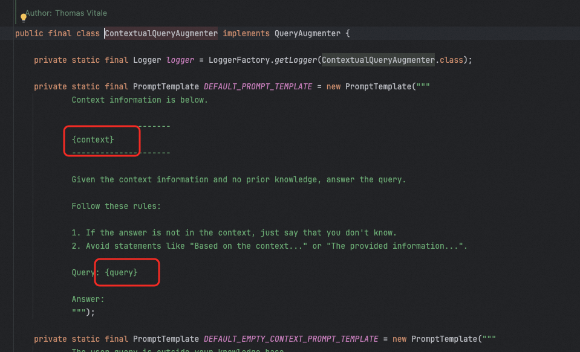

# ✅检索增强生成

我们使用 Spring AI 中的 Modular RAG 的方式，来实现检索增强部分。即使用 RetrievalAugmentationAdvisor 来实现。

因为我们不涉及到更多的优化内容，所以，只需要定制 documentRetriever 和 queryAugmenter 就行了。

VectorStoreDocumentRetriever 定义，使用 vectorStore 构建一个 retriever 即可：

```java
VectorStoreDocumentRetriever retriever = VectorStoreDocumentRetriever.builder()
        .vectorStore(vectorStore)
        .topK(5)
        .similarityThreshold(0.6)
        .build();
```

QueryAugmenter 我们需要重写提示词：

```java
QueryAugmenter queryAugmenter = ContextualQueryAugmenter.builder()
        .allowEmptyContext(true)
        .promptTemplate(new PromptTemplate("""
                ## 角色定位
                你是一位专业的RAG问答助手。请根据提供的上下文信息，详细、准确地回答用户的问题。如果参考文档没有内容，请务必不要胡编乱造，请直接说明"没有找到相关信息"。
                
                ## 任务要求：
                1. 请基于以下提供的参考文档内容，回答用户的问题。
                2. 如果参考文档中没有相关信息，请直接说明"没有找到相关信息"，不要编造内容。
                3. 如果有了参考文档内容，请务必尽量回答问题。有可能用户的输入比较随意，你可以先尝试回答用户的问题，猜测他的实际需求，先给出回复，你需要尽量去贴合用户的问题需求。
                
                ## 格式要求：
                1. 你的所有回答必须使用Markdown格式进行排版。
                2. 上下文信息中包含了图片描述标签，格式为：`<image src="URL" description="多模态描述"></image>`。
                3. 如果图片与用户提问高度相关，请将此标签转换为标准的Markdown图片格式 ``。
                4. 仅在必要时包含图片，请注意千万不要输出重复的内容和图片，图片确保最终生成的URL不要重复。
                
                ## 参考文档:
                {context}
                
                ## 用户问题:
                {query}
                
                注意：如果参考文档下面的内容为空，请直接回答"没有找到相关信息"。
                
                """))
        .build();
```

提示词中主要是针对图片做了些特殊要求，以及要求输出 markdown 格式方便渲染。同时需要注意占位符需要和文档中默认的保持一致：

