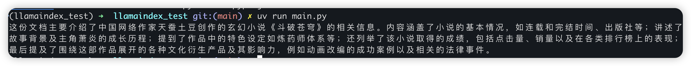

# ✅使用 LlamaIndex 构建一个简单的RAG系统

  

LlamaIndex是一个专为大语言模型设计的数据连接与检索框架，其核心目标是**让 LLM 能够高效、准确地访问和利用私有或结构化/非结构化的外部数据**。它在构建基于私有知识库的问答系统、智能客服、文档摘要、RAG（Retrieval-Augmented Generation）等应用中扮演关键角色。

  

### 主要功能

1. **数据索引构建**支持将各种格式的数据（如 PDF、Word、网页、数据库、API 等）转换为 LLM 可理解的索引结构（如向量索引、树状索引、关键词表等）。
2. **高效检索**提供多种查询引擎（如向量相似性搜索、混合检索、子问题分解等），从索引中快速找出与用户问题最相关的上下文。
3. **与 LLM 无缝集成**自动将检索到的上下文注入提示（prompt），供 LLM 生成准确、基于事实的回答。
4. **支持多种数据源和格式**内置对文件（PDF、TXT、DOCX）、数据库、Notion、Slack、Web 页面等的支持。
5. **模块化与可扩展**允许自定义文档加载器、文本分割器、嵌入模型、LLM 后端等组件。

  

### 主要作用？

- **解决 LLM 的“幻觉”问题**：通过提供真实、相关的上下文，减少模型编造答案。
- **打通私有数据与通用 LLM**：无需微调模型，即可让 LLM 回答企业内部文档中的问题。
- **简化 RAG 架构开发**：封装了从数据加载 → 分块 → 嵌入 → 存储 → 检索 → 生成的完整流程。

  

### 为什么要用？

- **开箱即用**：几行代码即可搭建一个基于私有文档的问答系统。
- **灵活性高**：支持自定义嵌入模型（如 OpenAI、HuggingFace、本地模型）、LLM（如 GPT、Claude、Llama 3）等。
- **社区活跃、文档完善**：由 LlamaIndex Inc. 维护，更新频繁，生态丰富。
- **与 LangChain 互补**：LlamaIndex 更专注于**数据索引与检索**，而 LangChain 更侧重于**Agent 和工作流编排**，两者常结合使用。

  

### LlamaIndex使用

  

前面我们介绍过了LlamaIndex，提到他是一个构建RAG的python框架，前面一个章节我们也介绍过了RAG的基本原理，那么本文，我们就用LlamaIndex来构建一个简单的RAG，然后结合这个简单的RAG再来巩固下RAG的原理及流程。

  

初始化环境：

  

```
uv init llamaindex_testcd llamaindex_testuv venvsource .venv/bin/activate
```

  

编写main.py中的代码：

```
from llama_index.core import VectorStoreIndex, SimpleDirectoryReaderfrom llama_index.embeddings.dashscope import DashScopeEmbeddingfrom llama_index.llms.dashscope import DashScopeimport osDASHSCOPE_API_KEY= "sk-xx" # 这里记得改成你自己的# 1. 加载文档（假设当前目录下有 data/ 文件夹，内含 .txt 或 .pdf 文件）documents = SimpleDirectoryReader("data").load_data()# 2. 设置嵌入模型（用于生成向量）embed_model = DashScopeEmbedding(    model_name="text-embedding-v2",  # 可选: "text-embedding-v1" 或 "text-embedding-v2"    api_key=DASHSCOPE_API_KEY)# 3. 设置 LLM（这里使用本地 Ollama 的 llama3）llm = DashScope(model_name="qwen-max", temperature=0.1,api_key=DASHSCOPE_API_KEY)# 4. 构建索引index = VectorStoreIndex.from_documents(documents, embed_model=embed_model)# 5. 创建查询引擎query_engine = index.as_query_engine(llm=llm)# 6. 提问response = query_engine.query("请总结这份文档的主要内容。")print(response)
```

  

DASHSCOPE\_API\_KEY这个记得改成你自己的。

  

在llamaindex\_test目录中增加一个文件夹和文件

  

```
mkdir datacd dataecho "《斗破苍穹》是中国网络作家天蚕土豆创作的玄幻小说，2009年4月14日起在起点中文网连载，2011年7月20日完结，首版由湖北少年儿童出版社出版。2010年7月，该作品部分章节被编为《废材当自强》由湖北少年儿童出版社出版 [22]。小说以斗气大陆为背景，讲述天才少年萧炎从斗气尽失逐步成长为斗帝的历程，期间通过收集异火、修炼丹药突破困境，最终解开斗帝失踪之谜并前往大千世界 [23]。作品构建了炼药师体系、异火榜及天鼎榜等设定，其中炼药师需具备火木双属性斗气与灵魂感知力，灵魂境界划分为凡境→灵境→天境→帝境 [11]。该小说全网点击量近100亿次，实体书累计销量超300万册，2017年7月荣登“2017猫片胡润原创文学IP价值榜”榜首。伴随作品成功涌现出1000余部同人小说，衍生出游戏、动漫、影视等文化产业 [13-14]。2020年8月被国家图书馆永久典藏并位列中国文化产业IP价值综合榜TOP50前五，改编动画在腾讯视频创下2.6万热度值纪录，并推出必胜客联名等商业合作 [25] [31]。幻维数码制作的动画年番《斗破苍穹》重现佛怒火莲等经典场景，多次入围华语剧集口碑榜前十 [24]。2025年1月入选“2024网络文学神作榜”，同年2月28日荣获2024阅文IP盛典20大荣耀IP [15-16] [30]。2025年11月，上海金山区人民法院宣判国内首例AI著作权侵权案，用户擅自使用《斗破苍穹》角色“美杜莎”形象训练AI模型被判赔偿5万元" > test.txt
```

  

添加依赖：`uv add llama-index llama-index-llms-dashscope llama-index-embeddings-dashscope`

  

运行代码：`uv run main.py`

  



这段代码使用了 **LlamaIndex**，结合阿里云的 **DashScope API** 实现了一个基于向量检索 + 大语言模型（LLM）问答的 RAG（Retrieval-Augmented Generation）系统。下面介绍下用到的 LlamaIndex 特性。

  

SimpleDirectoryReader

- 属于 `llama_index.core` 的数据加载器。
- 自动读取指定目录下的多种格式文件（如 `.txt`, `.pdf`, `.docx` 等），并转换为 `Document` 对象列表。
- 内部会调用 `UnstructuredReader` 或 `PyPDFLoader` 等后端解析器。

  

DashScopeEmbedding（嵌入模型）

- 通过 `llama_index.embeddings.dashscope` 提供的集成，调用阿里云 DashScope 的 embedding API。
- 使用 `text-embedding-v2` 模型生成高质量向量（比 v1 更优）。
- 在构建索引时，LlamaIndex 会自动对每个文档块（chunk）调用此嵌入模型。

  

VectorStoreIndex.from\_documents()

- 核心索引构建方法。
- 默认使用 **内存中的简单向量存储（InMemoryVectorStore）**。
- 自动对文档进行分块（默认 chunk\_size=1024, chunk\_overlap=20），然后嵌入并建立索引。

as\_query\_engine(llm=llm)

- 将索引转换为一个可查询的引擎。
- 默认使用 **Retrieval + Synthesis** 流程：
- 先用嵌入模型对 query 嵌入；
- 在向量库中检索 top-k 最相似的文档块；
- 将这些块作为上下文，拼接到 prompt 中；
- 调用 LLM（这里是 qwen-max）生成最终回答。

DashScope LLM 集成

- 使用 `llama_index.llms.dashscope.DashScope` 类，直接调用阿里云 Qwen 系列模型（如 qwen-max）。
- 支持设置 `temperature`, `max_tokens` 等参数。

  

  

### 优化方向

  

尽管以上代码实现了一个简单的RAG，但是如果想要在生产或高要求场景下使用，还是有很多东西可以优化和增强的，因为如果RAG只是需要这么20-30行代码的话，我们也没必要讲这个课程了。

  

可以优化的方向至少有以下这些，这些内容我们在本章节后续都会讲（所以这里看不懂也没关系，只是想说明，RAG并不是这么简单的。），但是会以Java作为主语言讲解。

  

- 文档分块（Chunking）策略优化
- 使用持久化向量数据库
- 查询优化
- 文档检索优化
- 对话记忆
- 重排序
- 混合检索
- 多模态
- RAG效果测评

  

