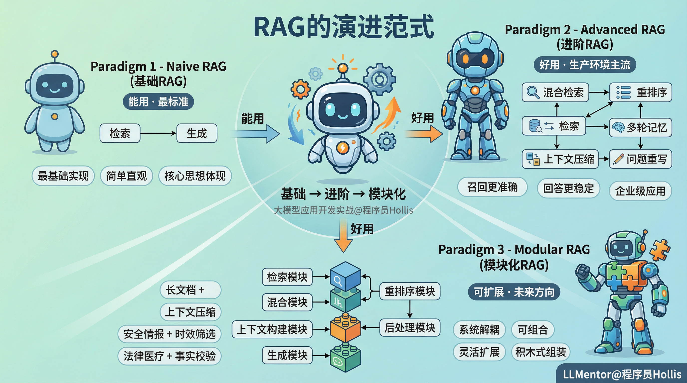

# ✅RAG的范式演进



## Navie RAG

  

Naive RAG，也叫**基础 RAG**，是最基础、最标准的 RAG 实现方式。它完整的体现了“**检索 + 生成**”的核心思想，没有加入复杂的优化策略。整个流程**简单、直观**，是体验 RAG 工作机制的**最佳实践**。

  

## Advanced RAG

Advanced RAG **（进阶型RAG）**是在 Naive RAG** 基础上**发展而来的**增强版本**。它通过引入混合检索与各种优化策略，使RAG的**召回准确率更高、回答更稳定**。它也是目前大部分企业中生产环境用的最多的一种RAG范式。

  

下面列举了一些常见的增强优化手段，包括：

- **混合检索（Hybrid Retrieval）**：结合**关键词检索（BM25/ES）与向量相似度检索**，提升精确度；
- **重排序（Re-ranking）**：对召回结果进行语义相关性评分再重排序，过滤噪声文档，实现**“精筛选”**；
- **上下文压缩（Context Compression）**：对长文本进行**摘要或关键信息提取**，降低模型上下文的压力；
- **多轮记忆（Conversation Memory）**：支持多轮对话，让模型理解上下文语义；
- **问题重写（Query Rewriting）**：用户的问题无法预测，我们需要挖掘用户问题的深层次含义，就需要对用户的原始Query进行重写，将原始问题改写成**语义更完整、信息更丰富**的检索条件进行查询。

总而言之，Advanced RAG是让RAG从**“能用”变为“好用”**的关键阶段。

  

## Modular RAG

Modular RAG**（模块化 RAG）**是目前较新的工程化形态，它强调将 RAG 流程中的各个组件（如查询重写、检索、重排序、上下文融合、生成等）**解耦为可独立配置、替换和组合的****模块**，从而提升系统的**灵活性、可维护性和性能。**

  

它将 RAG 的各个阶段（检索、重排、压缩、生成等）模块化封装，通过配置或编排进行灵活组合，从而实现更高的可维护性与跨任务复用能力。相比于Naive RAG的“单流程”，以及Advanced RAG的“多优化”，Modular RAG更强调系统的**可扩展性、灵活性与可维护性**。

  

在这种架构中，RAG可能会被划分为多个模块，如：

  

- **查询转换模块**（**Query Transformation Module）：**对原始查询进行改写、扩展或分解。
- **检索模块（Retrieval Module）**：负责从知识库或外部源中检索候选内容；支持多种检索策略（向量检索、关键词检索、混合检索等）。
- **重排序模块（Re-ranking Module）**：基于语义相关性或上下文权重对候选结果进行再排序；
- **上下文构建模块（Context Builder）**：负责筛选、拼接、压缩检索结果，为模型提供最优上下文；
- **生成模块（Generation Module）**：由大模型执行答案生成；
- **后处理模块（Post-processing Module）**：对生成结果进行事实校验、格式优化或引用标注；
- **路由模块（****Routing Module）**：根据任务类型动态选择不同模块组合。

  

这种模块化设计让RAG系统具备**“积木式”**的可组合能力。可以针对不同任务自由选择和组装模块。例如：

- 在安全情报场景下，可增加**时效性筛选模块**；
- 在法律或医疗场景中，可接入**事实校验模块**或**引用验证模块**；
- 在长文档处理场景，可加入**上下文压缩模块**。

  

**Modular RAG的优势**在于：

- 每个模块都可以单独优化或升级，而无需重构整个系统，实现持续迭代与灵活扩展。
- 模块间通过标准化接口进行数据交互，职责边界明确，便于多人协作开发与版本管理。
- 支持多源异构数据源（如联网数据、知识图谱、API等等）、动态路由与复杂逻辑组合；
- 强大的灵活性，根据不同的任务目标，自由组合，即可构建定制化的 RAG 流程。

总之，**Modular RAG 让 RAG 从“好用”走向“可扩展”**。它代表了企业级、系统化RAG应用的未来方向。

  

**我们在后续课程中，会对 Advanced RAG和Modular RAG都有重点讲解。**

## 三种之外：业界其他 RAG 范式

以上三种是经典演进线（Naive → Advanced → Modular），除此之外业界还有以下范式，在不同维度上做增强。

### Agentic RAG（智能体 RAG）

让 LLM 作为**自主决策的 Agent**，自己决定"要不要检索、检索什么、检索几次、结果够不够用"。

```
用户提问
    │
    ▼
Agent 思考：这个问题需要检索吗？
    │ 是
    ▼
Agent 自主生成查询 → 检索 → 看结果
    │
    ▼
结果够吗？不够 → 改写查询再检索（可多轮）
    │ 够
    ▼
生成答案
```

| 特点 | 说明 |
| :--- | :--- |
| 自主检索 | Agent 自己判断是否需要检索、检索几次 |
| 多轮迭代 | 第一轮结果不好，自动改写查询再搜 |
| 工具调用 | 检索只是工具之一，还可调 API、查数据库、搜索网页 |
| 典型框架 | LlamaIndex Workflows、LangGraph、CrewAI |

**和 Modular RAG 的区别**：Modular RAG 是预定义的流水线（改写→检索→重排→生成），流程固定；Agentic RAG 没有固定流程，Agent 自己决定下一步做什么。

### Graph RAG（知识图谱 RAG）

微软 2024 年提出，用**知识图谱**替代（或补充）向量检索。

```
文档 → LLM 抽取实体和关系 → 构建知识图谱
                                    │
用户提问 → 社区检测 → 社区摘要 → LLM 生成答案
```

| 特点 | 说明 |
| :--- | :--- |
| 全局视角 | 能回答"整篇文档讲了什么"这类全局性问题（传统 RAG 擅长局部细节，不擅长全局） |
| 关系推理 | 能跨文档推理实体间关系 |
| 构建成本高 | 需要大量 LLM 调用来抽取实体和构建图谱 |
| 适合场景 | 长文档总结、多文档关联分析、法律/医疗知识推理 |

### Self-RAG（自我反思 RAG）

模型在生成过程中**自我评估**：检索结果相不相关？生成的答案有没有幻觉？需不需要重新检索？

```
用户提问
    │
    ▼
模型判断：需要检索吗？ ── 否 ──► 直接生成
    │ 是
    ▼
检索 → 模型判断：结果相关吗？ ── 不相关 ──► 重新检索
    │ 相关
    ▼
生成答案 → 模型判断：答案有依据吗？ ── 没有 ──► 重新生成
    │ 有
    ▼
输出答案
```

| 特点 | 说明 |
| :--- | :--- |
| 反思令牌 | 模型输出特殊标记（如 `[Retrieve]`、`[Relevant]`、`[No Support]`）来控制流程 |
| 自我校验 | 生成后自检答案是否有检索结果支撑 |
| 训练成本 | 需要用反思数据微调模型 |
| 适合场景 | 对幻觉零容忍的场景（医疗、法律） |

### Corrective RAG（CRAG，纠错 RAG）

检索结果的质量不靠谱？加一层**质量评估 + 纠错机制**：

```
检索结果 → 评估器打分
    │
    ├─ 正确（高分）→ 直接用
    ├─ 错误（低分）→ 丢弃，转用网页搜索兜底
    └─ 模糊（中分）→ 对结果做摘要提取后再用
```

| 特点 | 说明 |
| :--- | :--- |
| 三档评估 | 检索结果分"正确/模糊/错误"三档，分别处理 |
| 网页兜底 | 检索质量差时自动转向网页搜索 |
| 轻量 | 不需要微调模型，用提示词即可实现 |

### Adaptive RAG（自适应 RAG）

根据问题**复杂度自动选择策略**：

| 问题类型 | 策略 |
| :--- | :--- |
| 简单事实 | 直接检索，单次 |
| 复杂推理 | 多步检索，Agentic 模式 |
| 闲聊 | 不检索，直接生成 |

先分类问题，再路由到不同 RAG 流程。

### RAG-Fusion（多查询融合 RAG）

用 LLM 把一个问题**改写成多个视角的子问题**，分别检索，再用 RRF 融合：

```
"R7 续航多少" → 改写出：
  - "智界R7 电池容量"
  - "智界R7 CLTC 续航里程"
  - "华为R7 纯电续航"
分别检索 → RRF 融合 → 重排 → 生成
```

### Long-Context RAG（长上下文 RAG）

随着 Gemini 1.5 Pro（2M tokens）、Claude 3.5（200K）等长上下文模型出现，可以直接把全部文档塞进上下文窗口，跳过检索步骤：

| 维度 | 传统 RAG | Long-Context |
| :--- | :--- | :--- |
| 检索 | 需要（向量/BM25） | 不需要 |
| 上下文 | 只给 top-k chunk | 全部文档 |
| 延迟 | 低 | 高（长上下文推理慢） |
| 成本 | 低 | 高（token 多） |
| 适合 | 文档量大（GB 级） | 文档量小（能塞进上下文） |

**不是"取代"关系**：长上下文有大海捞针问题、成本线性增长、不适合大规模知识库。小知识库可跳过检索，大知识库仍需 RAG。

## 范式全景对比

| 范式 | 核心思想 | 检索次数 | 复杂度 | 适合场景 |
| :--- | :--- | :--- | :--- | :--- |
| Naive RAG | 检索+生成 | 1 次 | 低 | 入门、简单 FAQ |
| Advanced RAG | 检索+优化（重排/混合/改写） | 1-2 次 | 中 | 生产环境主流 |
| Modular RAG | 模块化解耦，可组合 | 可配置 | 中高 | 企业级、需扩展 |
| Agentic RAG | Agent 自主决策检索 | 多次（动态） | 高 | 复杂推理、多步任务 |
| Graph RAG | 知识图谱+社区摘要 | 图遍历 | 高 | 全局总结、关系推理 |
| Self-RAG | 自我反思+校验 | 动态 | 高 | 零幻觉场景 |
| CRAG | 检索质量评估+纠错 | 1-2 次 | 中 | 检索质量不稳定 |
| Adaptive RAG | 按问题复杂度路由 | 动态 | 中高 | 混合题型 |
| RAG-Fusion | 多查询+RRF 融合 | N 次 | 中 | 多视角召回 |
| Long-Context | 长窗口跳过检索 | 0 次 | 低 | 小知识库 |

实际生产中往往是组合使用——比如 Modular RAG 的架构里嵌入 CRAG 的纠错逻辑 + RAG-Fusion 的多查询策略。

## LLM Wiki：RAG 的另一种思路

以上范式都是"每次查询时检索"，Karpathy 提出的 **LLM Wiki** 是另一种思路：**知识被"编译一次、持续积累"，而不是每次查询从零推导**。

```
传统 RAG：                          LLM Wiki 方式：
每次提问 → 检索 → 生成 → 丢弃        笔记(raw) → LLM 编译 → wiki 层(结构化)
                                                    │
每次都重新检索，无积累               提问 → 先查 wiki → 有答案直接返回
                                    没有 → LLM 推理后写入 wiki，下次不用重算
```

| 维度 | RAG | LLM Wiki |
| :--- | :--- | :--- |
| **目标** | 给 LLM 补充外部知识 | 给 LLM 提供已编译的结构化知识 |
| **检索方式** | 向量相似度检索 chunk | 双链 + 索引 + 结构化页面 |
| **知识形态** | 切碎的 chunk（碎片化） | 结构化页面（concept/entity/comparison） |
| **知识积累** | 每次检索是独立的 | 编译一次，持续积累，越用越好 |
| **适合** | 海量非结构化文档查询 | 个人知识体系、学习笔记、面试复习 |

简单说：**RAG 是"每次都搜"，LLM Wiki 是"编译一次反复用"**。两者不是替代关系——RAG 适合海量动态知识库，LLM Wiki 适合个人结构化知识体系。

## 一句话总结

经典三种（Naive → Advanced → Modular）是**演进线**，后续范式（Agentic / Graph / Self-RAG / CRAG / Adaptive / RAG-Fusion / Long-Context）是在不同维度上的**增强方向**，而 LLM Wiki 是从**知识编译积累**角度的另一种思路。实际生产中往往是组合使用。
