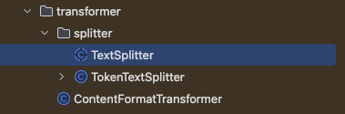
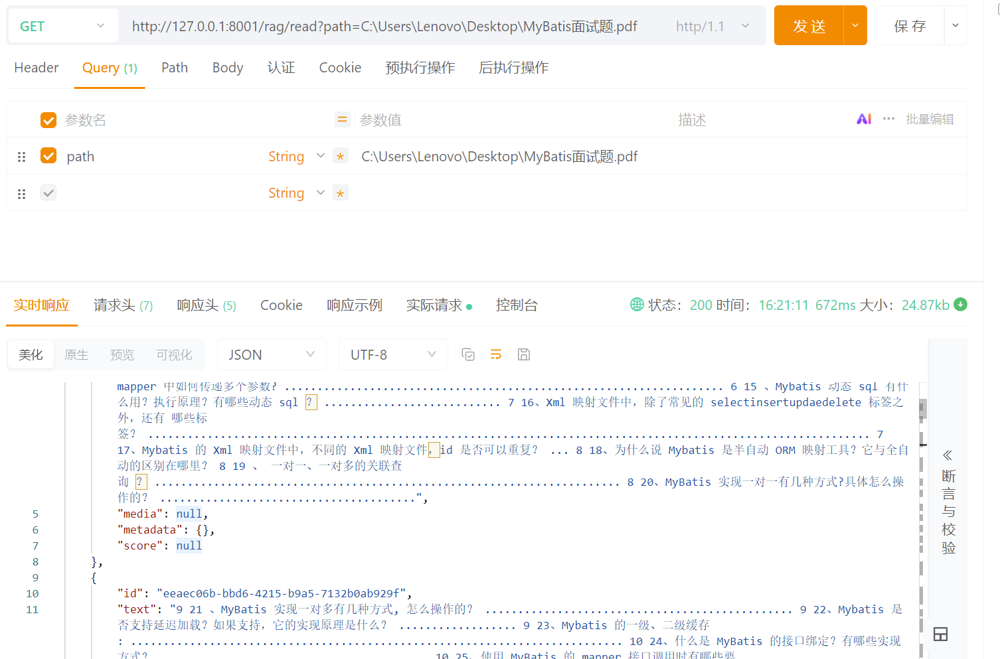
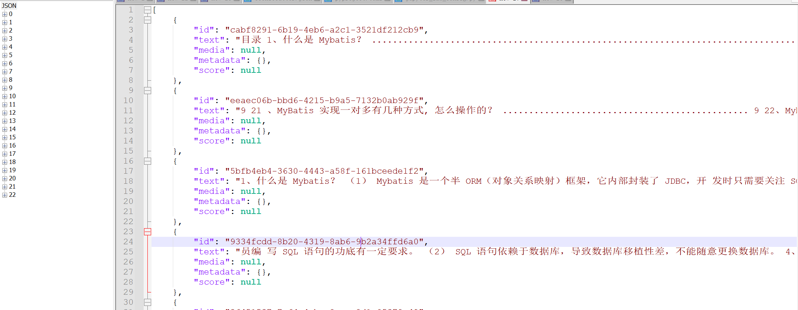
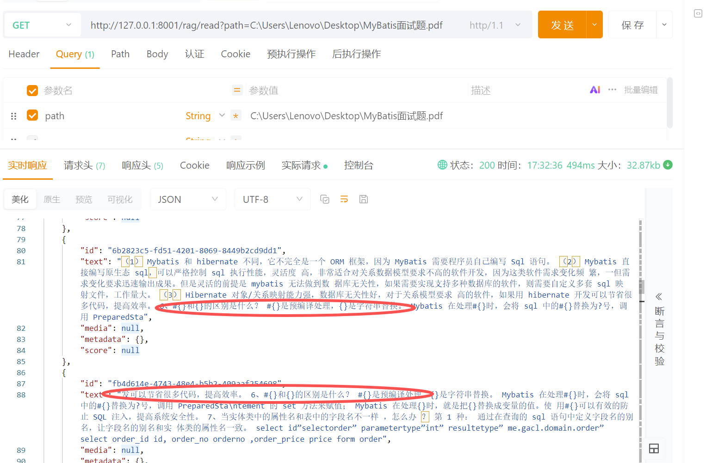
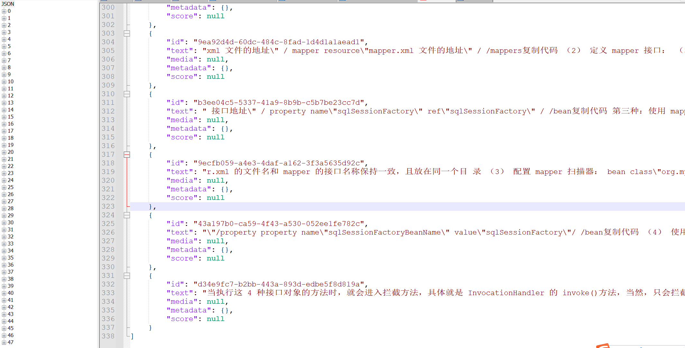
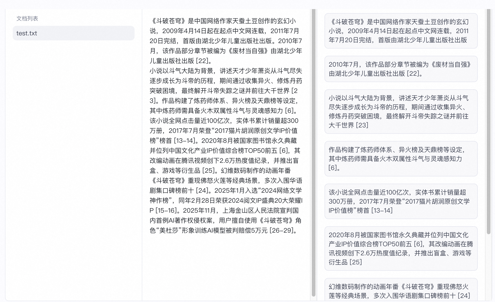
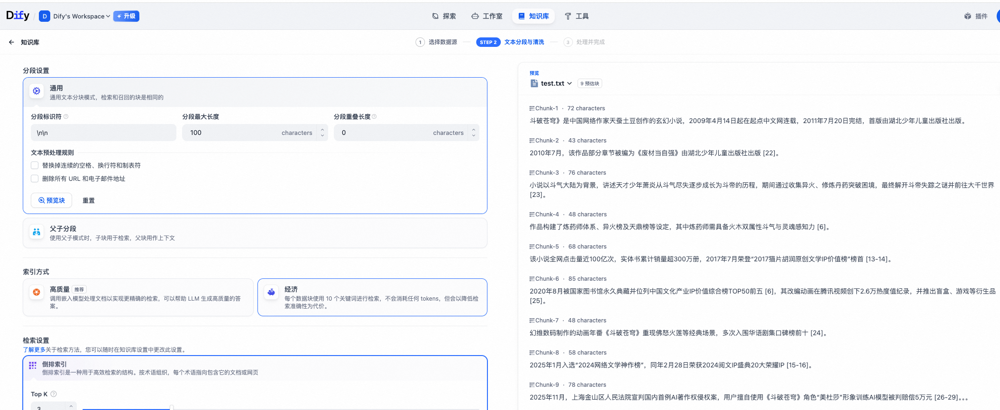
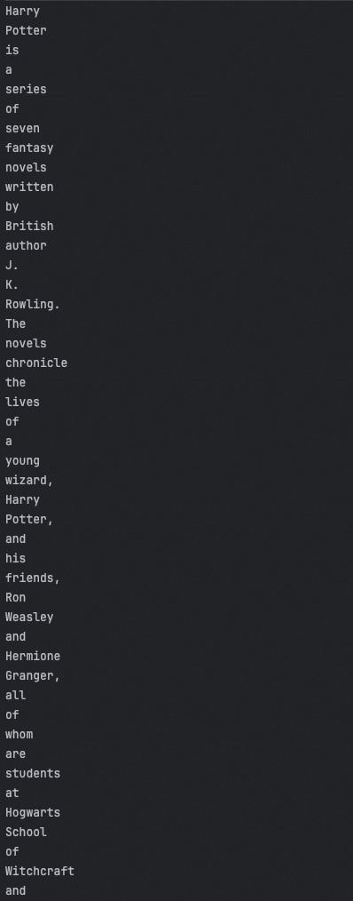

# ✅ 文档分片的代码实现

前面我们介绍了常见的分片方式，那么借助 Spring AI（Alibaba）和 LangChain4j 我们可以实现哪些分片呢？在 Java 中，我们想要做分片，代码该怎么写呢？

本文主要介绍三种：

1. Spring AI 的固定长度分片
2. Spring AI Alibaba 的递归分片
3. LangChain4J 的语义分片

但是不代表这就只有这几种啊，比如固定长度分片，在不同的框架中都有实现，只不过可能具体实现细节不同而已；再比如递归分片和语义分片，在 Spring AI Alibaba 和 LangChain4J 中也都有（顺便吐槽一句，Spring AI 这方面还是比较弱的）。所以，我们演示这几种常见的，让大家知道怎么用，效果怎么样，至于其他的，无非就是换个 API 的事儿。

# Spring AI 的文档分片

在 Spring AI 的 ETL Pipeline 模块中，`TextSplitter` 是所有文本拆分器的抽象基类。它定义了统一的接口，任何拆分策略（按句、按段、按 token）都可以通过继承它实现。

但是目前，Spring AI 官方仅提供了一个具体实现类：**TokenTextSplitter**：按 **token 数量** 拆分文本。**Token 是模型处理文本的最小单位，可能由一个或多个字符组成。**



## TokenTextSplitter

`TokenTextSplitter` 会先将文本编码成模型的 token，然后根据设定的每块 token 数，把文本拆成多个长度适合模型上下文的小文本块。

- **chunkSize**：每个文本块的目标大小**（以 token 为单位）**（默认值：800）。切分后的每个 Document 对象包含的最大 Token 数量。
- **minChunkSizeChars**：每个文本块的最小字符数**（以字符为单位）**（默认值：350）。如果拆分出的最后一块字符数少于这个值，它可能会被丢弃或合并，以防止生成过短、没有语义信息的碎片。
- **minChunkLengthToEmbed**：只有长度超过此值的块才会被发送给向量模型。这可以过滤掉无意义的空行或超短片段。
- **maxNumChunks**：单个文档允许拆分出的最大块数（默认值：10000）。防止因为文档过大导致生成太多分块。
- **keepSeparator**：是否在块中保留分隔符（如换行符）（默认值：true）。

**我们基于上一章《文档预处理》的代码，继续改造，增加文档分片环节。**

```java
/**
 * 读取文件
 */
@GetMapping("/read")
public List<Document> readDocument(@RequestParam("path") String path) {
    File file = new File(path);
    if (!file.exists() || !file.isFile()) {
        throw new IllegalArgumentException("文件不存在或不是有效文件: " + path);
    }
    try {
        // 1. 加载文档
        List<Document> documents = selector.read(file);

        // 2. 文本清洗
        documents = cleanDocuments(documents);

        // 3. 文档分片
        documents = split(documents);

        return documents;

    } catch (IOException e) {
        throw new RuntimeException("读取文件失败: " + e.getMessage(), e);
    }
}

/**
 * 文档分片
 */
public List<Document> split(List<Document> documents) {
    if (CollectionUtils.isEmpty(documents)) {
        return Collections.emptyList();
    }

    TokenTextSplitter splitter = new TokenTextSplitter(
            // 每块最多 600 tokens
            600,
            // 每块至少 400 字符再考虑断点
            300,
            // 太短的不做嵌入
            5,
            // 最多拆分8000块
            8000,
            // 保留句号、换行符
            true
    );

    return splitter.apply(documents);
}
```

### 调用示例



我们在上一章节中，对同一文档的预处理，按文档页码生成了 12 个 document，本章节中经过我们对文档的分片操作，我们可以看到，我们的 document 变成了 23 个，说明按照我们的要求已经分片成功了。



## SpringAI 文档分片的缺陷

虽然我们已经能够在 Spring AI 中实现文档分片，但 Spring AI 提供的 `TokenTextSplitter` 功能过于简单了。一些常用的智能体框架，如 LangChain / LangChain4j，在文档分片方面的能力更强、更灵活。

首先，Spring AI 的切分方式不具备**重叠（overlap）机制**，也就是说相邻文本块之间没有共享内容。相比之下，LangChain / LangChain4j 通常提供 **overlap 参数**，**用于在前一个文本块和下一个文本块之间保留一定数量的字符或 token，这样可以有效避免语义被切断，提高检索和召回的准确性。**

在 Spring AI 的 GitHub 上，也有一些人早就提出了这个 issue 优化，只是官方一直没有相关回应，也许在 Spring AI 未来的某个版本，也会解决这个问题。

https://github.com/spring-projects/spring-ai/issues/2123?utm_source=chatgpt.com

## 自定义重叠段落分片器

```java
/**
 * 自定义分片器：支持 chunkSize、overlap，并按段落拆分
 */
public class OverlapParagraphTextSplitter extends TextSplitter {

    // 每块最大字符数
    private final int chunkSize;

    // 相邻块之间重叠字符数
    private final int overlap;

    public OverlapParagraphTextSplitter(int chunkSize, int overlap) {
        if (chunkSize <= 0) {
            throw new IllegalArgumentException("chunkSize 必须大于 0");
        }
        if (overlap < 0) {
            throw new IllegalArgumentException("overlap 不能为负数");
        }
        if (overlap >= chunkSize) {
            throw new IllegalArgumentException("overlap 不能大于等于 chunkSize");
        }
        this.chunkSize = chunkSize;
        this.overlap = overlap;
    }

    public List<String> splitText(String text) {
        if (StringUtils.isBlank(text)) return Collections.emptyList();

        String[] paragraphs = text.split("\\n+");
        List<String> allChunks = new ArrayList<>();
        StringBuilder currentChunk = new StringBuilder();

        for (String paragraph : paragraphs) {
            if (StringUtils.isBlank(paragraph)) continue;

            int start = 0;
            while (start < paragraph.length()) {
                int remainingSpace = chunkSize - currentChunk.length();
                int end = Math.min(start + remainingSpace, paragraph.length());

                if (currentChunk.length() > 0) currentChunk.append("\n");
                currentChunk.append(paragraph, start, end);

                // 如果当前块已满，保存并生成新块
                if (currentChunk.length() >= chunkSize) {
                    allChunks.add(currentChunk.toString());

                    // 计算重叠
                    String overlapText = "";
                    if (overlap > 0) {
                        int overlapStart = Math.max(0, currentChunk.length() - overlap);
                        overlapText = currentChunk.substring(overlapStart);
                    }

                    currentChunk = new StringBuilder();
                    if (!overlapText.isEmpty())
                        currentChunk.append(overlapText);
                }

                start = end;
            }
        }

        if (currentChunk.length() > 0)
            allChunks.add(currentChunk.toString());

        return allChunks;
    }

    /**
     * 批量拆分
     */
    public List<Document> apply(List<Document> documents) {
        if (CollectionUtils.isEmpty(documents)) {
            return Collections.emptyList();
        }

        List<Document> result = new ArrayList<>();
        for (Document doc : documents) {
            List<String> chunks = splitText(doc.getText());
            for (String chunk : chunks) {
                result.add(new Document(chunk));
            }
        }
        return result;
    }
}
```

```java
@GetMapping("/read")
public List<Document> readDocument(@RequestParam("path") String path) {
    File file = new File(path);
    if (!file.exists() || !file.isFile()) {
        throw new IllegalArgumentException("文件不存在或不是有效文件: " + path);
    }
    try {
        // 1. 加载文档
        List<Document> documents = selector.read(file);

        // 2. 文本清洗
        documents = cleanDocuments(documents);

        // 3. 文档分片
//            documents = split(documents);
        OverlapParagraphTextSplitter splitter = new OverlapParagraphTextSplitter(
                // 每块最大字符数
                400,
                // 块之间重叠 100 字符
                100
        );
        List<Document> apply = splitter.apply(documents);
        return apply;

    } catch (IOException e) {
        throw new RuntimeException("读取文件失败: " + e.getMessage(), e);
    }
}
```

### 调用示例





我们可以看到调用结果相邻文本块之间都有一段 overlap 重叠，这样就可以一定程度上保证了文本块的延续性。最终我们查看接口详细响应结果，发现文本块从原来的 23 个变成了 48 个。

另外，Spring AI 也不支持按照段落或其他自然语言结构直接拆分文本块（Spring AI Alibaba 支持一部分），而 LangChain / Langchain4j 框架可以根据换行符、句号或段落结构进行分割，保证拆分后的文本块在语义上更完整、自然。

因此，如果希望获得更高级的分片效果，可以选择 3 种方式：一是将 LangChain / LangChain4j 与 Spring AI 配合使用**（以 Spring AI 为主体框架，Langchain4j 用于特定功能）**，充分利用它们各自的优势；二是自定义 Spring AI 的 `TextSplitter`，基于这个抽象类实现一些定制化的分片功能（如重叠和按段落拆分），从而满足特定业务需求。还有就是可以看下 Spring AI Alibaba 中是不是有一些可用的分片工具，可以直接用。

# Spring AI Alibaba 的递归分片

```java
RecursiveCharacterTextSplitter splitter = new RecursiveCharacterTextSplitter(100);
List<String> chunks = splitter.splitText("""
        《斗破苍穹》是中国网络作家天蚕土豆创作的玄幻小说，2009年4月14日起在起点中文网连载，2011年7月20日完结，首版由湖北少年儿童出版社出版。2010年7月，该作品部分章节被编为《废材当自强》由湖北少年儿童出版社出版 [22]。
        小说以斗气大陆为背景，讲述天才少年萧炎从斗气尽失逐步成长为斗帝的历程，期间通过收集异火、修炼丹药突破困境，最终解开斗帝失踪之谜并前往大千世界 [23]。作品构建了炼药师体系、异火榜及天鼎榜等设定，其中炼药师需具备火木双属性斗气与灵魂感知力 [6]。
        该小说全网点击量近100亿次，实体书累计销量超300万册，2017年7月荣登“2017猫片胡润原创文学IP价值榜”榜首 [13-14]。2020年8月被国家图书馆永久典藏并位列中国文化产业IP价值综合榜TOP50前五 [6]，其改编动画在腾讯视频创下2.6万热度值纪录，并推出盲盒、游戏等衍生品 [25]。幻维数码制作的动画年番《斗破苍穹》重现佛怒火莲等经典场景，多次入围华语剧集口碑榜前十 [24]。2025年1月入选“2024网络文学神作榜”，同年2月28日荣获2024阅文IP盛典20大荣耀IP [15-16]。2025年11月，上海金山区人民法院宣判国内首例AI著作权侵权案，用户擅自使用《斗破苍穹》角色“美杜莎”形象训练AI模型被判赔偿5万元 [26-29]。
        """);

chunks.forEach(System.out::println);
```

分段结果：

```
《斗破苍穹》是中国网络作家天蚕土豆创作的玄幻小说，2009年4月14日起在起点中文网连载，2011年7月20日完结，首版由湖北少年儿童出版社出版
2010年7月，该作品部分章节被编为《废材当自强》由湖北少年儿童出版社出版 [22]
小说以斗气大陆为背景，讲述天才少年萧炎从斗气尽失逐步成长为斗帝的历程，期间通过收集异火、修炼丹药突破困境，最终解开斗帝失踪之谜并前往大千世界 [23]
作品构建了炼药师体系、异火榜及天鼎榜等设定，其中炼药师需具备火木双属性斗气与灵魂感知力 [6]
该小说全网点击量近100亿次，实体书累计销量超300万册，2017年7月荣登“2017猫片胡润原创文学IP价值榜”榜首 [13-14]
2020年8月被国家图书馆永久典藏并位列中国文化产业IP价值综合榜TOP50前五 [6]，其改编动画在腾讯视频创下2.6万热度值纪录，并推出盲盒、游戏等衍生品 [25]
幻维数码制作的动画年番《斗破苍穹》重现佛怒火莲等经典场景，多次入围华语剧集口碑榜前十 [24]
2025年1月入选“2024网络文学神作榜”，同年2月28日荣获2024阅文IP盛典20大荣耀IP [15-16]
2025年11月，上海金山区人民法院宣判国内首例AI著作权侵权案，用户擅自使用《斗破苍穹》角色“美杜莎”形象训练AI模型被判赔偿5万元 [26-29]
```

这和我们直接在 Coze、Dify 等做分段的效果是一样的。但是，要把 overlap 设置为 0，因为 Spring AI 目前的切分器都不支持这个字段……





**需要特别注意的是，如果你要用这种分段的方式的话，文档是不能先把空格、换行等符号给清洗掉的，否则就会导致意想不到的结果，因为你要基于这些特殊符号分段，但是特殊符号被你清理了，就肯定不行了。**

# LangChain4J 的语义分段

使用 LangChain4J 中的 `DocumentBySentenceSplitter`，调用他的 split 方法，但是需要注意的时候，需要调用 `String[] split(String text)` 方法，而不能是 `List<TextSegment> split(Document document)` 方法，因为后面这个方法是定义在父类里面的，并没有用到语义分段的功能。

```java
DocumentBySentenceSplitter splitter = new DocumentBySentenceSplitter(100, 10);

for (String textSegment : splitter.split("""
        《斗破苍穹》是中国网络作家天蚕土豆创作的玄幻小说，2009年4月14日起在起点中文网连载，2011年7月20日完结，首版由湖北少年儿童出版社出版。2010年7月，该作品部分章节被编为《废材当自强》由湖北少年儿童出版社出版 [22]。小说以斗气大陆为背景，讲述天才少年萧炎从斗气尽失逐步成长为斗帝的历程，期间通过收集异火、修炼丹药突破困境，最终解开斗帝失踪之谜并前往大千世界 [23]。作品构建了炼药师体系、异火榜及天鼎榜等设定，其中炼药师需具备火木双属性斗气与灵魂感知力 [6]。该小说全网点击量近100亿次，实体书累计销量超300万册，2017年7月荣登“2017猫片胡润原创文学IP价值榜”榜首 [13-14]。2020年8月被国家图书馆永久典藏并位列中国文化产业IP价值综合榜TOP50前五 [6]，其改编动画在腾讯视频创下2.6万热度值纪录，并推出盲盒、游戏等衍生品 [25]。幻维数码制作的动画年番《斗破苍穹》重现佛怒火莲等经典场景，多次入围华语剧集口碑榜前十 [24]。2025年1月入选“2024网络文学神作榜”，同年2月28日荣获2024阅文IP盛典20大荣耀IP [15-16]。2025年11月，上海金山区人民法院宣判国内首例AI著作权侵权案，用户擅自使用《斗破苍穹》角色“美杜莎”形象训练AI模型被判赔偿5万元 [26-29]。""")) {
    System.out.println(textSegment);
}
```

以上代码，执行后结果：

```
《斗破苍穹》是中国网络作家天蚕土豆创作的玄幻小说，2009年4月14日起在起点中文网连载，2011年7月20日完结，首版由湖北少年儿童出版社出版。2010年7月，该作品部分章节被编为《废材当自强》由湖北少年儿童出版社出版 [22]。
小说以斗气大陆为背景，讲述天才少年萧炎从斗气尽失逐步成长为斗帝的历程，期间通过收集异火、修炼丹药突破困境，最终解开斗帝失踪之谜并前往大千世界 [23]。作品构建了炼药师体系、异火榜及天鼎榜等设定，其中炼药师需具备火木双属性斗气与灵魂感知力 [6]。
该小说全网点击量近100亿次，实体书累计销量超300万册，2017年7月荣登“2017猫片胡润原创文学IP价值榜”榜首 [13-14]。2020年8月被国家图书馆永久典藏并位列中国文化产业IP价值综合榜TOP50前五 [6]，其改编动画在腾讯视频创下2.6万热度值纪录，并推出盲盒、游戏等衍生品 [25]。幻维数码制作的动画年番《斗破苍穹》重现佛怒火莲等经典场景，多次入围华语剧集口碑榜前十 [24]。2025年1月入选“2024网络文学神作榜”，同年2月28日荣获2024阅文IP盛典20大荣耀IP [15-16]。2025年11月，上海金山区人民法院宣判国内首例AI著作权侵权案，用户擅自使用《斗破苍穹》角色“美杜莎”形象训练AI模型被判赔偿5万元 [26-29]。
```

看上去好像效果还行？但是其实他并没有做分段，是完全按照我给的格式又输出了一遍。

我研究了半天，后来才发现……竟然是……竟然是……不支持中文……

好吧，那就改用英文试一下，找一段哈利波特的维基百科的介绍：

```java
DocumentBySentenceSplitter splitter = new DocumentBySentenceSplitter(100, 10);

for (String textSegment : splitter.split("""
        Harry Potter is a series of seven fantasy novels written by British author J. K. Rowling. The novels chronicle the lives of a young wizard, Harry Potter, and his friends, Ron Weasley and Hermione Granger, all of whom are students at Hogwarts School of Witchcraft and Wizardry. The main story arc concerns Harry's conflict with Lord Voldemort, a dark wizard who intends to become immortal, overthrow the wizard governing body known as the Ministry of Magic, and subjugate all wizards and Muggles (non-magical people).
        The series was originally published in English by Bloomsbury in the United Kingdom and Scholastic Press in the United States. A series of many genres, including fantasy, drama, coming-of-age fiction, and the British school story (which includes elements of mystery, thriller, adventure, horror, and romance), the world of Harry Potter explores numerous themes and includes many cultural meanings and references.[1] Major themes in the series include prejudice, corruption, madness, love, and death.[2]
        """)) {
    System.out.println(textSegment);
}
```

分段结果如下：

```
Harry Potter is a series of seven fantasy novels written by British author J. K.
Rowling.
The novels chronicle the lives of a young wizard, Harry Potter, and his friends, Ron Weasley and Hermione Granger, all of whom are students at Hogwarts School of Witchcraft and Wizardry.
The main story arc concerns Harry's conflict with Lord Voldemort, a dark wizard who intends to become immortal, overthrow the wizard governing body known as the Ministry of Magic, and subjugate all wizards and Muggles (non-magical people).
The series was originally published in English by Bloomsbury in the United Kingdom and Scholastic Press in the United States.
A series of many genres, including fantasy, drama, coming-of-age fiction, and the British school story (which includes elements of mystery, thriller, adventure, horror, and romance), the world of Harry Potter explores numerous themes and includes many cultural meanings and references.[1] Major themes in the series include prejudice, corruption, madness, love, and death.[2]
```

效果怎么说呢，也不好，因为他把 J K Rowling 给拆分开了，但是啊，其实没对比就没有伤害，我们用其他的分段器试试：

```java
public static void main(String[] args) {
    RecursiveCharacterTextSplitter splitter = new RecursiveCharacterTextSplitter(100);
    List<String> chunks = splitter.splitText("""
    Harry Potter is a series of seven fantasy novels written by British author J. K. Rowling. The novels chronicle the lives of a young wizard, Harry Potter, and his friends, Ron Weasley and Hermione Granger, all of whom are students at Hogwarts School of Witchcraft and Wizardry. The main story arc concerns Harry's conflict with Lord Voldemort, a dark wizard who intends to become immortal, overthrow the wizard governing body known as the Ministry of Magic, and subjugate all wizards and Muggles (non-magical people).

    The series was originally published in English by Bloomsbury in the United Kingdom and Scholastic Press in the United States. A series of many genres, including fantasy, drama, coming-of-age fiction, and the British school story (which includes elements of mystery, thriller, adventure, horror, and romance), the world of Harry Potter explores numerous themes and includes many cultural meanings and references.[1] Major themes in the series include prejudice, corruption, madness, love, and death.[2]
    """);

    chunks.forEach(System.out::println);
}
```

效果如下：



这么一对比，确实语义分词器的效果还不错。