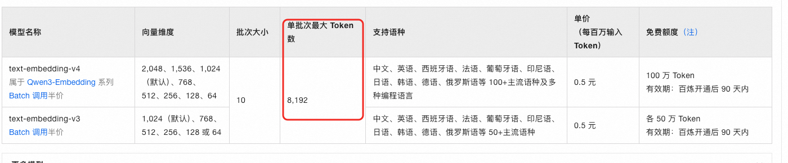

# 什么是父子分片？

除了前面讲的传统的分块以外，还以一种比较常见的分块方式，在dify、coze这种智能体平台上也比较常用的，那就是父子分块。

  

父子分片通过**将大块文本作为父块保留上下文，将其切分为多个子块用于检索**，从而兼顾两者优势。

- **小分片**（如句子或短段落）语义粒度细，便于精确匹配用户查询，但往往缺乏足够的上下文，导致生成时信息不完整。
- **大分片**（如整段或整节）包含丰富上下文，有利于生成高质量回答，但可能因内容冗余而降低检索相关性（“信号稀释”问题）。

  

检索阶段使用**子块**（较小、语义聚焦）进行向量匹配，提高与用户查询的语义对齐度。生成阶段则返回对应的**父块**（较大、上下文完整）作为 LLM 的输入，确保模型拥有足够背景信息生成准确、连贯的回答。从而避免因单纯使用大块导致的“高召回但低精度”，或单纯使用小块导致的“高精度但低召回/低生成质量”。

  

### 父子分片的必要性

  

之所以父子分片很重要，前面我们说过了大分片和小分片的各自优势，那其实，在实操过程中，我任务还是主要是考虑到这两个原因：

  

1、embedding模型是有token数限制的。如text-embdding-v4这个模型，单批次最大的token数是8192，也就意味着，如果你的一个分片的长度超过了这个token数的话，他是没有办法做embedding的，也就没办法存入向量库了。也就没办法做RAG了。

  

  

那也就意味着，我们不管用什么样的分片方式，都至少需要支持一个chunkSize的字段，避免出现这种超过模型本身限制导致无法处理掉问题。

  

2、切分后语义会丢失

  

按照上面的前提，我们必然会存在着部分完整内容被切分到不同的分片中。这样会导致语义不完整了。

  

之前我们讲过一个解决方案 ，那就是用overlap，做点冗余和重叠。

  

但是对于文本是有效的，那如果碰到了表格和图片呢？比如：

  

`` 这段内容，如果刚好要被切分开，就糟糕了。

  

所以，我们需要一种方案，既能满足小文本块的嵌入和检索，又能满足大文本块的完整性召回。那就是父子分块了。

  

### 基本思路和流程

  

**文档分片阶段**

  

比如说我们按照markdown的标题分片，一个标题下的内容都放在一起，但是为了避免embedding模型不支持太长的token数，那么就需要传入一个chunkSize。

  

那么，如果在一个标题下，超过了chunkSize之后，就需要把他拆分成多段，比如1拆2。简单的举个例子比如

  

`我是一个完整的句子` 需要按照chunkSize=5拆分，那就得到`我是一个完` 、`整的句子` 两个的那块。

  

那么，我们其实在这里可以得到三个分片，分别是`我是一个完整的句子` 、`我是一个完` 、`整的句子`

  

那么其实我们的`我是一个完整的句子` 就是一个父分片，而`我是一个完` 、`整的句子` 是两个子分片。

  

接下来，我们把两个子分片使用embedding模型做向量化嵌入，保存到向量数据库中。

  

父分片怎么办？父分片因为太长了，是没办法直接嵌入的，那么其实这里父分片没必要用向量数据库，直接用关系型数据库存储完整内容就行了。因为我们不会用父分片做语义相似度检索。具体怎么检索后面讲。

  

那么就是：

`我是一个完整的句子` ，id =5 ——\> MySQL

`我是一个完` , parentChunkId = 5 ——\> pgvector（代指pg的向量库）

`整的句子` , parentChunkId = 5——\> pgvector

  

同时，我们需要在两个子chunk的metadata中记录一下(parentChunkId = 5)，当前分片是一个子分片，以及它对应的父分片的id。

  

**文档检索阶段**

  

因为只有子分片做了索引构建，保存在向量数据库了，所以在做语义相似度召回的时候，只会通过子分片召回。

  

召回之后，我们判断下这个分片是不是子分片，如果是的话，则取出他的父分片的id，去关系型数据库查询出完整的父分片，替换子分片内容，交给LLM做资料参考。

  

当然，这里还需要考虑父分片的去重、查询的加速、以及如何替换等问题，并且这种分片方案目前不管是在langchian、还是spring ai 、langchain4j中都没有直接实现。

  

那这些问题，我们在后面的RAG的项目中会带着大家把这块手撕出来，并解决这些问题。

## 父子分片的优缺点

### 优点

| 优点 | 说明 |
| :--- | :--- |
| **检索精度高** | 子块小、语义聚焦，和用户查询的向量相似度更准，避免大块"信号稀释" |
| **生成上下文完整** | 命中子块后返回父块，LLM 拿到完整上下文，不会因切分丢语义 |
| **解决表格/图片被切断的问题** | 父块保留完整结构，不会出现图片被切两半的情况 |
| **绕过 embedding token 限制** | 父块太长不嵌入，子块控制在 token 限制内，两者各司其职 |
| **存储灵活** | 子块入向量库（检索用），父块入 MySQL（完整内容，不占向量库空间） |

### 缺点

| 缺点 | 说明 |
| :--- | :--- |
| **存储翻倍** | 同一段内容存两份（父块存 MySQL + 子块存向量库），磁盘和索引体积增长 |
| **检索多一跳** | 向量检索命中子块 → 还要拿 `parentChunkId` 查 MySQL 取父块，多一次 DB 查询 |
| **父块去重复杂** | 多个子块命中同一个父块时，需要去重，否则同一父块被重复送给 LLM，浪费 token |
| **框架不支持** | LangChain / Spring AI / LangChain4j 都没有原生实现，需要手写 |
| **子块粒度难调** | 子块太小 → 命中率高但父块太大浪费 token；子块太大 → 退化为普通分片，失去精度优势 |
| **跨父块语义断裂** | 如果答案需要两个不同父块的信息，子块命中的父块各自只覆盖一部分，仍然可能不完整 |
| **写入链路更长** | 入库时先切父块 → 存 MySQL → 再切子块 → 嵌入 → 存向量库，比单层分片多一倍操作 |

### 和其他分片策略对比

| 策略 | 检索精度 | 上下文完整性 | 存储成本 | 实现复杂度 |
| :--- | :--- | :--- | :--- | :--- |
| 固定长度切分 | 低 | 差 | 1x | 最低 |
| 语义切分（按标题/段落） | 中 | 中 | 1x | 中 |
| overlap 切分 | 中 | 中 | ~1.2x | 低 |
| **父子分片** | **高** | **好** | **~2x** | **高** |

### 一句话总结

父子分片用**存储翻倍 + 多一跳查询**的代价，换来**检索精度和上下文完整性的双赢**。适合对召回质量要求高、能承受额外存储和开发成本的场景，但框架不原生支持，需要手写。

