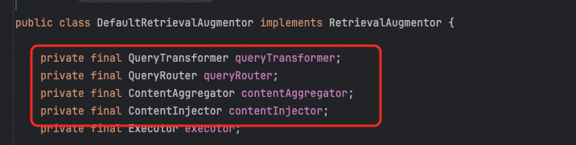
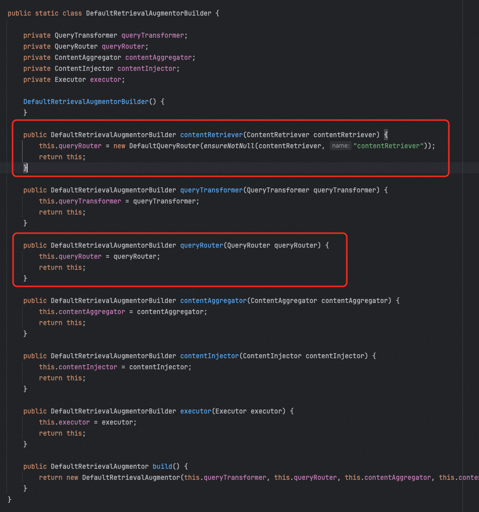
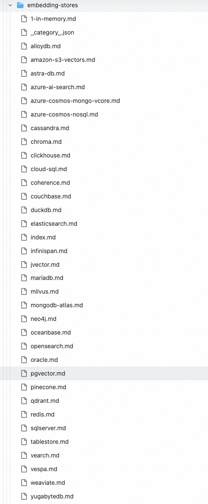
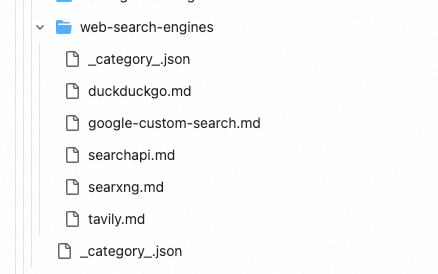
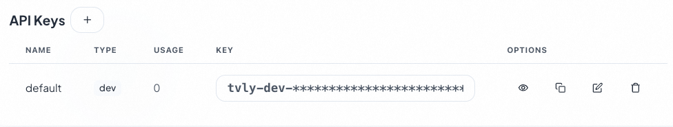
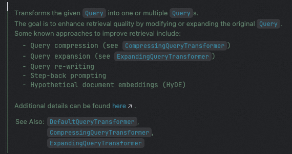
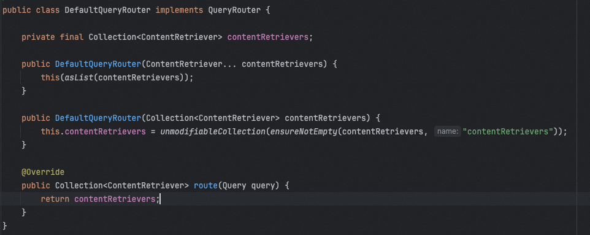
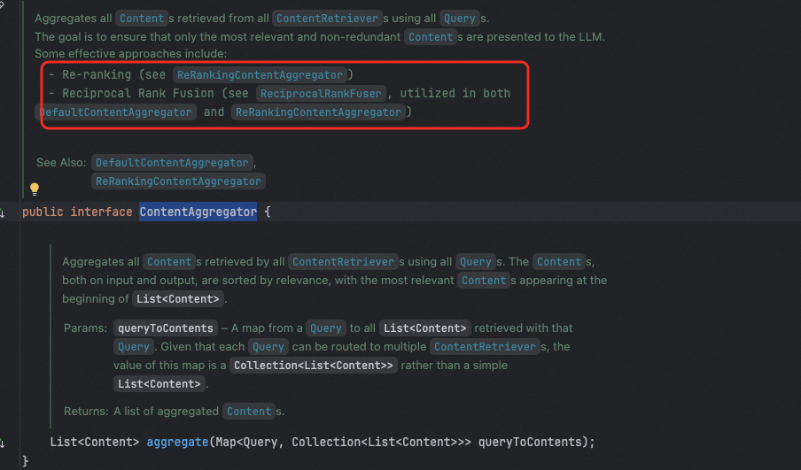
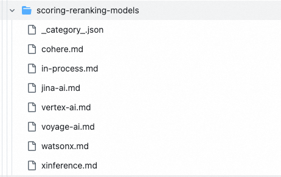

# ✅LangChain4J中的Modular RAG支持

  

除了Spring AI中提供了模块化RAG的支持，其实LangChain4J中也有，甚至功能更加强大。

  

LangChain4J中提供了RetrievalAugmentor接口，他有一个默认的实现DefaultRetrievalAugmentor，就是和Spring AI中的RetrievalAugmentationAdvisor类似的存在。

  



  

这里面分别支持查询转换器、查询路由器、内容聚合器、以及内容注入器。

  

# 基本用法

  

```
DefaultRetrievalAugmentor augmentor = DefaultRetrievalAugmentor.builder()// 1. ContentRetriever - 从向量数据库或其他数据源检索内容(必需).contentRetriever(EmbeddingStoreContentRetriever.builder()        .embeddingStore(embeddingStore) // 向量数据库        .embeddingModel(embeddingModel) // 向量模型        .maxResults(5)                 // 返回Top-K结果        .minScore(0.7)               // 最小相似度阈值        .build())// 2. QueryTransformer - 查询转换器(可选).queryTransformer(queryTransformer)// 3. QueryRouter - 查询路由器(可选).queryRouter(queryRouter)// 4. ContentAggregator - 内容聚合器(可选).contentAggregator((contentAggregator)// 5. ContentInjector - 内容注入器(可选).contentInjector(contentInjector).build();
```

  

然通过把DefaultRetrievalAugmentor注入到AiServices中：

```
AiServices.builder(LangChainAiService.class)        .chatModel(chatModel)        .chatMemoryProvider(memoryId -> MessageWindowChatMemory.withMaxMessages(10))        .retrievalAugmentor(DefaultRetrievalAugmentor.builder().build())        .build();
```

  

# ContentRetriever

在上面我们介绍DefaultRetrievalAugmentor的时候，从他的成员变量来看，并没有ContentRetriever，但是这个东西也是必须要有的，只不过ContentRetriever可以被包在QueryRouter中，因为路由我们前面讲过，有一个很重要的目的就是找到合适的检索器（比如不同的数据源）

  

可以通过DefaultRetrievalAugmentorBuilder的源码发现，当我们构造ContentRetriever的时候，其实他是通过构造了一个对应的QueryRouter实现的。

  

> 这里需要注意，ContentRetriever和QueryRouter在构造的时候传入一个即可，因为他们最终都是设置QueryRouter，如果一起用，会被互相覆盖。



  

## EmbeddingStoreContentRetriever

  

EmbeddingStoreContentRetriever 是 LangChain4j 框架中专门用于从向量数据库检索相关内容的核心组件。它实现了 ContentRetriever 接口，是 RAG 系统中最常用的检索器。和Spring AI中的VectorStoreDocumentRetriever功能类似。

  

```
EmbeddingStoreContentRetriever retriever = EmbeddingStoreContentRetriever.builder()    // ========== 必需参数 ==========    .embeddingStore(embeddingStore)     // 向量数据库实例    .embeddingModel(embeddingModel)     // 向量模型(用于查询向量化)        // ========== 可选参数 ==========    .maxResults(5)                      // 返回Top-K结果，默认3    .minScore(0.7)                      // 最小相似度阈值(0.0-1.0)，低于此分数的结果会被过滤        .build();
```

  

所必须的参数是embeddingStore和embeddingModel。即一个向量存储和一个向量模型。这也是我们前面讲RAG的时候重点提到的两个东西了。老朋友了。

  

### EmbeddingStore

EmbeddingStore默认的只有InMemoryEmbeddingStore，但是可以通过增加依赖的方式导入更多的实现，如以下这么多实现（具体的适用方式，在这个链接中都有：https://github.com/langchain4j/langchain4j/tree/main/docs/docs/integrations/embedding-stores ）：

  



  

比如pgvector，需要依赖：

  

```
<dependency>    <groupId>dev.langchain4j</groupId>    <artifactId>langchain4j-pgvector</artifactId>    <version>1.10.0-beta18</version></dependency>
```

  

然后通过以下方式创建：

  

```
EmbeddingStore<TextSegment> embeddingStore = PgVectorEmbeddingStore.builder()        .host("localhost")                           // Required: Host of the PostgreSQL instance        .port(5432)                                  // Required: Port of the PostgreSQL instance        .database("postgres")                        // Required: Database name        .user("my_user")                             // Required: Database user        .password("my_password")                     // Required: Database password        .table("my_embeddings")                      // Required: Table name to store embeddings        .dimension(embeddingModel.dimension())       // Required: Dimension of embeddings        .build();
```

  

### EmbeddingModel

  

embeddingModel也一样，也有很多种实现，比如openai的，比如ollama的，也通过扩展的方式可以配置进来。（https://github.com/langchain4j/langchain4j/tree/main/docs/docs/integrations/embedding-models ）


  

如：

  

```
// OpenAI EmbeddingEmbeddingModel embeddingModel = OpenAiEmbeddingModel.builder()    .apiKey(System.getenv("OPENAI_API_KEY"))    .modelName("text-embedding-3-small")  // 或 text-embedding-3-large    .build();
```

  

## WebSearchContentRetriever

  

WebSearchContentRetriever 是 LangChain4j 框架中用于从互联网搜索引擎检索实时信息的 RAG 组件。它允许 AI 应用获取最新的网络信息，而不仅仅依赖于预先存储的向量数据库。

  

```
//使用 Google Custom SearchWebSearchEngine googleSearchEngine = GoogleCustomSearchEngine.builder()    .apiKey(System.getenv("GOOGLE_API_KEY"))    .csi(System.getenv("GOOGLE_SEARCH_ENGINE_ID"))  // Custom Search Engine ID    .build();WebSearchContentRetriever googleRetriever = WebSearchContentRetriever.builder()    .webSearchEngine(googleSearchEngine)    .maxResults(5)    .build();
```

  

可以看到，必要的参数是一个webSearchEngine。

  

同理，webSearchEngine也给了一些可以用的扩展（https://github.com/langchain4j/langchain4j/tree/main/docs/docs/integrations/web-search-engines ）：

  



  

使用方法：

  

到tavily网站上创建一个账号，使用google账号可以直接登录：https://app.tavily.com/home ，登录后就有一个api key可以直接用了。

  



  

然后在代码中实现：

  

```
        <dependency>            <groupId>dev.langchain4j</groupId>            <artifactId>langchain4j-web-search-engine-tavily</artifactId>            <version>1.8.0-beta15</version>            <exclusions>                <exclusion>                    <groupId>dev.langchain4j</groupId>                    <artifactId>*</artifactId>                </exclusion>            </exclusions>        </dependency>
```

  

```
package cn.hollis.llm.HelloLlm.langchain4j.controller;import dev.langchain4j.model.openai.OpenAiChatModel;import dev.langchain4j.rag.DefaultRetrievalAugmentor;import dev.langchain4j.rag.content.retriever.WebSearchContentRetriever;import dev.langchain4j.service.AiServices;import dev.langchain4j.web.search.tavily.TavilyWebSearchEngine;import org.springframework.beans.factory.annotation.Autowired;import org.springframework.web.bind.annotation.GetMapping;import org.springframework.web.bind.annotation.RequestMapping;import org.springframework.web.bind.annotation.RestController;@RestController@RequestMapping("/websearch")public class WebSearchController {    @Autowired    OpenAiChatModel chatModel;    @GetMapping("/search")    public String webSearch() {        // 1. 配置搜索引擎        TavilyWebSearchEngine searchEngine = TavilyWebSearchEngine.builder()                .apiKey("替换成你自己的key")                .includeAnswer(true)                .searchDepth("advanced")                .build();        // 2. 配置 Web 搜索检索器        WebSearchContentRetriever webRetriever = WebSearchContentRetriever.builder()                .webSearchEngine(searchEngine)                .maxResults(5)                .build();        // 3. 配置 RetrievalAugmentor        DefaultRetrievalAugmentor augmentor = DefaultRetrievalAugmentor.builder()                .contentRetriever(webRetriever)                .build();        // 5. 创建 AI Service        interface WebSearchAssistant {            String chat(String userMessage);        }        WebSearchAssistant assistant = AiServices.builder(WebSearchAssistant.class)                .chatModel(chatModel)                .retrievalAugmentor(augmentor)                .build();        // 6. 使用 - 获取实时信息        String answer = assistant.chat("2025年人工智能领域有哪些重大突破？");        return answer;    }}
```

  

即可得到结果：

  


  

# QueryTransformer

  

QueryTransformer这个在Spring AI中也有，这个是他关于功能的介绍，可以看到这里面提到的一些查询改写的方式，我们前面基本都讲过了。

  



  

但是并没有全都是现，默认值给了CompressingQueryTransformer和ExpandingQueryTransformer。

  

## CompressingQueryTransformer

  

这个和Spring AI中的CompressionQueryTransformer功能基本类似，通过他的提示词你就能知道了，他就是实现的我们前面见过的所谓"富化"的能力。

  


  

## ExpandingQueryTransformer

  

这个其实就是我们前面见过的提示词的分解，把一个提示词拆分成多个提示词。但是他的目标是将单个用户查询扩展为多个语义相关的查询，从不同角度检索文档，提高召回率。

  


  

# QueryRouter

  

前面介绍ContentRetriever的时候提到了QueryRouter，他的作用就是把不同的用户请求路由给不同的ContentRetriever。

  

入参是用户查询，出参是ContentRetriever的列表：


  

langchain4j中给提供了两个router实现，分别是DefaultQueryRouter和LanguageModelQueryRouter。

  

DefaultQueryRouter比较简单，就是直接无脑把所有查询都路由给提前配置好的一批ContentRetriever：

  



  

不需要介绍再多了，当我们构造DefaultRetrievalAugmentor的时候，如果只通过contentRetriever创建而不用router的时候，他就会使用默认的DefaultQueryRouter把我们传入的contentRetriever包一下。

  

### 混合检索：向量数据库 + Web 搜索

  

```
import dev.langchain4j.rag.content.retriever.ContentRetriever;import dev.langchain4j.rag.content.retriever.EmbeddingStoreContentRetriever;import dev.langchain4j.rag.query.router.QueryRouter;// 1. 向量数据库检索器EmbeddingStoreContentRetriever vectorRetriever =     EmbeddingStoreContentRetriever.builder()        .embeddingStore(embeddingStore)        .embeddingModel(embeddingModel)        .maxResults(3)        .build();// 2. Web 搜索检索器WebSearchContentRetriever webRetriever =     WebSearchContentRetriever.builder()        .webSearchEngine(tavilyEngine)        .maxResults(3)        .build();// 3. 配置查询路由器 - 智能选择检索方式QueryRouter queryRouter = query -> {    String queryText = query.text().toLowerCase();        // 判断是否需要实时信息    if (queryText.contains("最新") ||         queryText.contains("今天") ||         queryText.contains("现在") ||        queryText.contains("当前")) {        return webRetriever;  // 使用Web搜索    } else {        return vectorRetriever;  // 使用向量数据库    }};// 4. 使用路由器集成DefaultRetrievalAugmentor augmentor = DefaultRetrievalAugmentor.builder()    .queryRouter(queryRouter)    .build();
```

  

## LanguageModelQueryRouter

  

LanguageModelQueryRouter 是 LangChain4j 中基于语言模型的智能查询路由器，根据查询类型、意图或特征，将查询分发到不同的检索器，实现多数据源智能检索。适合以下场景：

  

- 多种数据库并存（向量库、图数据库、关系型数据库）
- 不同领域的知识库（技术文档、业务规则、实时信息）
- 检索策略差异（语义检索、精确匹配、关系查询）

  

如：

```
import dev.langchain4j.data.segment.TextSegment;import dev.langchain4j.model.openai.OpenAiChatModel;import dev.langchain4j.rag.DefaultRetrievalAugmentor;import dev.langchain4j.rag.content.retriever.ContentRetriever;import dev.langchain4j.rag.content.retriever.EmbeddingStoreContentRetriever;import dev.langchain4j.service.AiServices;import dev.langchain4j.store.embedding.EmbeddingStore;public class QueryRoutingExample {        public static void main(String[] args) {        // 1. 初始化 ChatModel        OpenAiChatModel chatModel = OpenAiChatModel.builder()            .apiKey(System.getenv("OPENAI_API_KEY"))            .modelName("gpt-4")            .build();                // 2. 创建不同类型的检索器                // 向量检索器 - 用于语义搜索        ContentRetriever vectorRetriever = EmbeddingStoreContentRetriever.builder()            .embeddingStore(vectorEmbeddingStore)            .embeddingModel(embeddingModel)            .maxResults(5)            .build();                // 图数据库检索器 - 用于关系查询        ContentRetriever graphRetriever = new GraphDatabaseContentRetriever(            neo4jDriver        );                // 关系数据库检索器 - 用于结构化查询        ContentRetriever relationalRetriever = new RelationalDatabaseContentRetriever(            dataSource        );                // Web 搜索检索器 - 用于实时信息        ContentRetriever webRetriever = WebSearchContentRetriever.builder()            .webSearchEngine(tavilyEngine)            .maxResults(5)            .build();                // 3. 配置路由器        LanguageModelQueryRouter router = LanguageModelQueryRouter.builder()            .chatModel(chatModel)            .retriever("VECTOR", vectorRetriever)            .retriever("GRAPH", graphRetriever)            .retriever("RELATIONAL", relationalRetriever)            .retriever("WEB", webRetriever)            .defaultRetriever(vectorRetriever)            .build();                // 4. 集成到 RAG        DefaultRetrievalAugmentor augmentor = DefaultRetrievalAugmentor.builder()            .queryRouter(router)            .build();                // 5. 创建 AI Service        interface Assistant {            String chat(String message);        }                Assistant assistant = AiServices.builder(Assistant.class)            .chatModel(chatModel)            .retrievalAugmentor(augmentor)            .build();                // 6. 使用示例                // 路由到向量检索器        String answer1 = assistant.chat("RAG 技术的优势是什么？");                // 路由到图检索器        String answer2 = assistant.chat("刘备和张飞是什么关系？");                // 路由到关系数据库检索器        String answer3 = assistant.chat("2024年第一季度销售额是多少？");                // 路由到 Web 搜索        String answer4 = assistant.chat("今天北京的天气如何？");    }}
```

  

# ContentAggregator

  

ContentAggregator这个功能是spring ai中没有的，就是我们前面讲过的重排序。

  

通过文档可以看到，他提供了我们前面在重排序章节介绍过的RRF和ReRank模型两种实现方式。

  



  

## DefaultContentAggregator

  

DefaultContentAggregator 是 ContentAggregator 的默认实现，它用的就是我们介绍过的RRF重排序

  

##### ✅RAG优化技术：重排序

什么是重排序？ 重排序（Reranking）是在通过混合检索（或其他方式）获得初步检索结果（候选文本块）后，再通过更强的模型（通常是 Cross-Encoder 或专用 Reranker 模型）对这些候选文本块进行重新打分和排序，将真正最相

LLMentor

  


  

## ReRankingContentAggregator

  

ReRankingContentAggregator使用更精细的模型（如 Cross-Encoder）对候选文档与查询的相关性进行重新评分和排序。

  

可以选择的排序模型有以下这几个（https://github.com/langchain4j/langchain4j/tree/main/docs/docs/integrations/scoring-reranking-models ）：

  



  

比如使用jina:

  

```
<dependency>    <groupId>dev.langchain4j</groupId>    <artifactId>langchain4j-jina</artifactId>    <version>1.10.0-beta18</version></dependency>
```

  

```
ScoringModel scoringModel = JinaScoringModel.builder()    .apiKey(System.getenv("JINA_API_KEY"))    .modelName("jina-reranker-v2-base-multilingual")    .build();ContentAggregator contentAggregator = ReRankingContentAggregator.builder()    .scoringModel(scoringModel)    ...     .build();RetrievalAugmentor retrievalAugmentor = DefaultRetrievalAugmentor.builder()    ...    .contentAggregator(contentAggregator)    .build();return AiServices.builder(Assistant.class)    .chatModel(...)    .retrievalAugmentor(retrievalAugmentor)    .build();
```

  

# ContentInjector

  

ContentInjector这个就是RAG中的那个上下文融合的过程，即将检索到的文档和用户消息融到一个提示词中。

  

默认有一个DefaultContentInjector，代码也很简单，就是把userMessage和文档内容拼到一起。

  

# 总结

  

以上，就是langchain4j给我们提供的一系列RAG的各种组件，我们可以任意组装他们，在langchain中也提供了一些默认的实现和扩展，当然你可以可以自己重写他们，自定义你自己的比如问题改写器、查询路由器等等。

  

通过对比spring ai和langchain4j，你会发现，其实在rag这块，**langchain4j的能力更强一些，实现更加丰富一点。**

