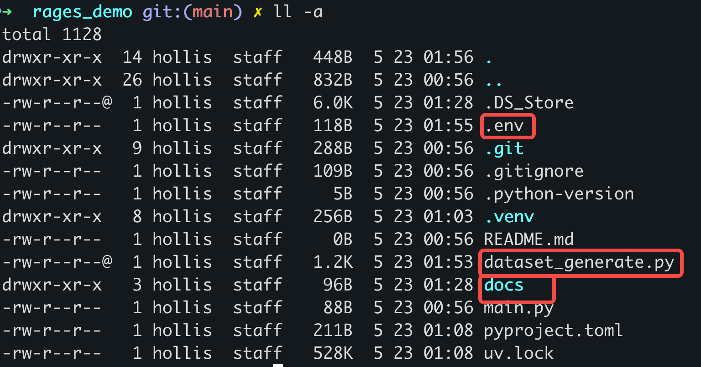
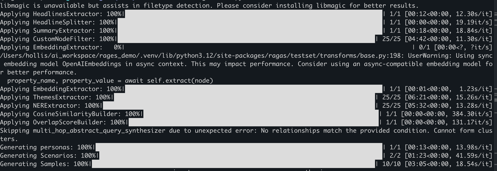
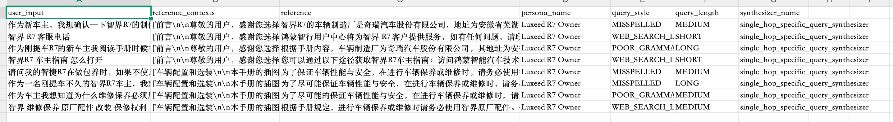

# ✅基于文档生成用于评测的数据集

前面我们介绍过了如何获取测评集，有一种方式是通过文档可以生成一些问题和答案。那么ragas就只次，我们介绍下如何使用。


## 本文脑图

```markmap
- 基于文档生成评测数据集（RAGAS）
  - 配置四步
    - DirectoryLoader 加载 docs/ 下 markdown
    - llm_factory("qwen3.7-max") + OpenAI client
    - embedding_factory("openai", text-embedding-v4)
    - TestsetGenerator.generate_with_langchain_docs(testset_size=10)
  - 生成流水线
    - HeadlinesExtractor + HeadlineSplitter：标题定骨架
    - SummaryExtractor 摘要 → CustomNodeFilter 筛高价值节点
    - EmbeddingExtractor 向量化
    - ThemesExtractor + NERExtractor：主题与命名实体
    - Cosine / Overlap 相似度：铺垫跨段落复杂问题
    - personas 画像 → Scenarios 场景 → Samples 样本
  - 产出
    - 导出 rag_testset.csv，共10条
    - 字段：问题 / 参考内容 / 标准答案
  - 关键局限
    - 不含 RAG 系统回答
    - 参考资料是生成答案所用，不等于RAG实际检索
  - 下一步
    - 先生成RAG真实回答+参考资料，才能评5大指标
    - Context Precision / Recall 需参考材料+标准答案
```

### 基于AI生成数据集


比如我们提前准备一份文档，markdown格式最好，放到docs目录下





运行以下脚本代码：

```python
from langchain_community.document_loaders import DirectoryLoader
from ragas.llms import LangchainLLMWrapper
from ragas.testset import TestsetGenerator
from ragas.embeddings.base import embedding_factory
from openai import OpenAI
from dotenv import load_dotenv
from ragas.llms import llm_factory
import os

# 1. 加载环境变量
load_dotenv()

# 2. 加载文档
path = "docs/"
loader = DirectoryLoader(path, glob="**/*.md")
docs = loader.load()

# 3. 配置 LLM
openai_client = OpenAI(api_key=os.getenv("OPENAI_API_KEY"))
llm = llm_factory("qwen3.7-max", client=openai_client)

# 4. 配置 Embeddings
embeddings = embedding_factory("openai", model="text-embedding-v4", client=openai_client)

# 5. 生成测试集
generator = TestsetGenerator(llm=llm, embedding_model=embeddings)
dataset = generator.generate_with_langchain_docs(docs, testset_size=10)

# 6. 导出结果
df = dataset.to_pandas()
print(df)

df.to_csv("rag_testset.csv", index=False)
print("测试集已成功导出为 rag_testset.csv")
```


运行以上代码。可以看到运行进度：




- `Applying HeadlinesExtractor` (提取标题) & `HeadlineSplitter` (按标题切分)：AI 正在通读你的 Markdown 文件，识别出里面的各级标题，理清文档的整体骨架结构。
- `Applying SummaryExtractor` (提取摘要)：AI 对文档的各个部分进行总结概括，以便后续能基于这些摘要来设计问题。
- `Applying CustomNodeFilter` (节点过滤)： AI 正在从文档中筛选出最有价值、信息密度最高的文本片段（Nodes），剔除掉那些无关紧要的内容。
- `Applying EmbeddingExtractor` (向量化处理)：将筛选出来的文本片段转换成计算机能理解的数学向量，方便后续评估检索的准确度。
- `Applying ThemesExtractor` (提取主题) & `NERExtractor` (提取命名实体)：AI 进一步分析文档中的核心话题以及专有名词（如人名、产品名、地名等）。
- `CosineSimilarityBuilder` & `OverlapScoreBuilder`：计算各个文本片段之间的相似度与重叠度，为后续生成需要跨段落推理的复杂问题建立关联。
- `Generating personas` (生成用户画像)：AI 虚拟出了不同类型的提问者角色（比如“新手小白”、“资深专家”），让生成的问题更贴近真实用户的提问习惯。
- `Generating Scenarios` (生成应用场景)：结合刚才提取的知识点和用户画像，构思出具体的提问背景。
- `Generating Samples` (生成最终样本)：最~~后，综合以上所有信息，生成高质量~~测试数据


这个过程根据你的文档的大小，LLM的情况，可能会比较慢。


最终会得到一份csv文档，里面包含了10条数据，分别包含了用户问题、参考内容以及标准答案：




可以看到，上面的数据集中是不包含我们的RAG系统针对问题的回答的，所以，根据上一期我们介绍的各个指标需要的参数，那么有了这份数据集，就可以针对Context Precision、Context Recall两个指标做评测了么？


其实并不是，因为上面的数据集中的参考资料，其实是生成标准答案的参考资料，而我们要对RAG测评，需要拿到RAG实际检索到的参考资料才行。

|  |  |  |  |  |  |  |
| --- | --- | --- | --- | --- | --- | --- |
| 指标 | 问题 | AI回答 | 参考材料 | 标准答案 | LLM | Embedding |
| Context Precision上下文准确率 | ✅ |  | ✅ | ✅ | ✅ |  |
| Context Recall上下文召回率 | ✅ |  | ✅ | ✅ | ✅ |  |
| Answer Relevancy答案相关性 | ✅ | ✅ |  |  | ✅ | ✅ |
| Faithfulness忠诚度 | ✅ | ✅ | ✅ |  | ✅ |  |
| Answer Correctness答案准确性 | ✅ | ✅ |  | ✅ | ✅ | ✅ |


不管是针对Context Precision、Context Recall两个指标做评测，还是要针对另外几个指标做评测，我们还需要基于这份数据集，生成我们自己的RAG问答系统的答案+参考资料才行。
