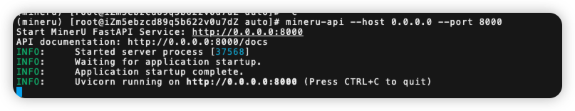
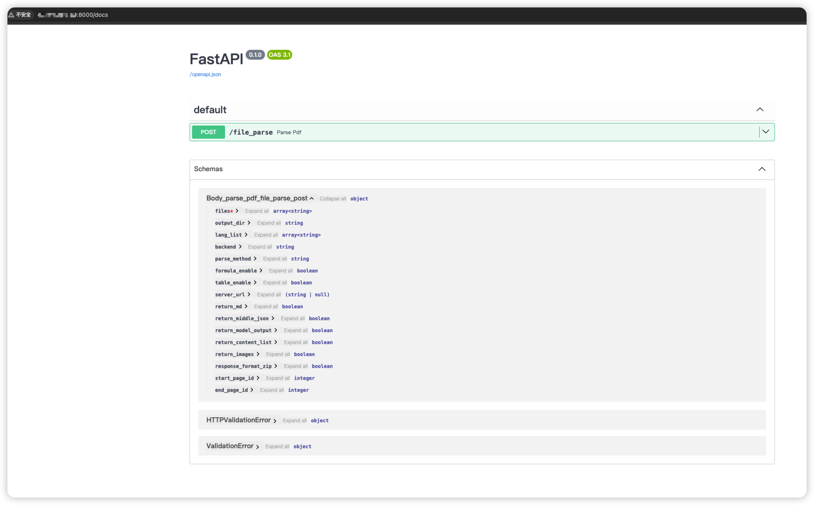
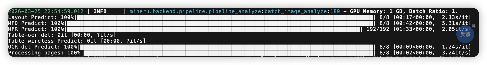

# ✅在Java代码中把MinerU解析文档功能集成进来

(MinerU相关的内容，虽然之前公司也在用，但是部署这块是算法同学搞的，这次从部署开始弄，我花了很多时间，前前后后搞了差不多三四个通宵吧，把一些过程中遇到的问题都整理出来了。网上这块的资料比较少，踩了很多坑，希望能给大家点帮助）

  

我们前面讲过了索引构建的流程了，文档处理的过程要做上传、解析、切分、向量化等流程。

  

但是我们前面的文档解析使用的python的mineru框架，那么怎么在JAVA代码中把这个流程串起来呢？也就是说，如何在Java中调用py的代码呢？

  

第一种办法，就是mineru不是提供了api么，只要申请token，我们就可以在JAVA中调那个API接口了。这个就不展开说了，比较简单。

  

### MinterU提供API接口

  

比较常见的方案是使用fast api，FastAPI 是一个现代、高性能的 Python Web 框架，专门用于构建 API。简单来说，它让你可以用 Python 快速搭建一个 HTTP 服务，让其他程序（比如 Java 应用）通过网络来调用你的 Python 代码。

  

好巧不巧的是，MinerU支持FastAPI，哈哈哈哈。

  

如果需要使用modelscope的模型的话，先执行：

  

```
export MINERU_MODEL_SOURCE=modelscope
```

  

通过以下命令启动：

```
mineru-api --host 0.0.0.0 --port 8000
```

  



  

然后在浏览器中访问 `http://127.0.0.1:8000/docs` 查看API文档。

  



  

- 同步解析接口：`POST /file_parse`

  

这个方法支持的参数列表如下：

|  |  |  |  |
| --- | --- | --- | --- |
| 参数名 | 类型 | 默认值 | 说明 |
| files | List\[UploadFile\] | 必填 | 支持 PDF 和部分图片格式（如 jpg、png），不支持 Office 文件 |
| output\_dir | str | ./output | 输出目录 |
| lang\_list | List\[str\] | \["ch"\] | 语言列表，长度与文件数一致，不一致时用第一个或 "ch" 补齐 |
| backend | str |  | 解析后端，影响输出目录和命名 |
| parse\_method | str | auto | 解析方法 |
| formula\_enable | bool | True | 是否启用公式识别 |
| table\_enable | bool | True | 是否启用表格识别 |
| server\_url | Optional\[str\] | None | 可选，远程服务地址 |
| return\_md | bool | True | 是否返回 Markdown 内容 |
| return\_middle\_json | bool | False | 是否返回中间 JSON |
| return\_model\_output | bool | False | 是否返回模型输出 |
| return\_content\_list | bool | False | 是否返回内容列表 |
| return\_images | bool | False | 是否返回图片 |
| response\_format\_zip | bool | False | 是否以 zip 文件打包返回 |
| start\_page\_id | int | 0 | 起始页码 |
| end\_page\_id | int | 99999 | 结束页码 |

  

通过curl可请求：

  

```
 curl -X POST http://xxx.xx.xx.xx:8000/file_parse \  -H "Accept: application/json" \  -F "files=@/Users/hollis/Downloads/Java八股文介绍.pdf" \  -F "backend=pipeline"  -F "response_format_zip=true" \  -F "return_images=true" \  -o result.zip
```

  

发起请求后，在mineru-api的控制台可以看到：

  



  

这段可能包含以下内容：

```
Layout Predict: 100%|█████████████████| 13/13 [00:27<00:00,  2.15s/it]MFD Predict: 100%|████████████████████| 13/13 [01:10<00:00,  5.46s/it]MFR Predict: 100%|██████████████████| 126/126 [01:13<00:00,  1.72it/s]Table-ocr det: 100%|████████████████████| 5/5 [00:00<00:00,  5.90it/s]Table-ocr rec ch: 100%|█████████████| 559/559 [00:35<00:00, 15.54it/s]Table-wireless Predict: 100%|███████████| 5/5 [00:01<00:00,  3.02it/s]Table-wired Predict: 100%|██████████████| 5/5 [00:01<00:00,  3.49it/s]OCR-det Predict: 100%|████████████████| 13/13 [00:14<00:00,  1.11s/it]Processing pages: 100%|███████████████| 13/13 [00:06<00:00,  2.09it/s]OCR-rec Predict: 100%|██████████████████| 7/7 [00:00<00:00, 11.73it/s]
```

  

- `Layout Predict`: **版面布局预测**。
- 系统正在分析每一页文档的结构，识别哪里是标题、段落、图片、表格还是公式。这是为了理解文档的整体逻辑结构。
- `MFD Predict`: **多公式检测 (Multi-Formula Detection)**。
- 专门用于定位文档中的数学公式区域。将公式与普通文本区分开，以便后续用专门的模型进行识别。
- `MFR Predict`: **多公式识别 (Multi-Formula Recognition)**。
- 对上一步检测到的公式区域进行具体的字符和符号识别（通常是将图片公式转换为 LaTeX 或 MathML 格式）。这里的数量（126个）比页面数（13页）多，说明每页可能有多个公式。
- `Table-ocr det`: **表格检测**。
- 在页面中框选出所有表格的位置。
- `Table-ocr rec ch`: **表格内容识别 (Chinese/Character)**。
- 对表格内的单元格文字进行识别。`ch` 可能代表支持中文或字符级识别。
- `Table-wireless Predict`: **无线表（无边框表格）预测**。
- 专门处理没有明显边框线的表格，通过语义和对齐方式推断行列结构。
- `Table-wired Predict`: **有线表（有边框表格）预测**。
- 专门处理有清晰边框线的表格，利用线条信息重建表格结构。
- *注：将表格分为“有线”和“无线”分别处理是高级OCR引擎（如PaddleOCR PP-Structure）的典型特征，旨在提高不同风格表格的结构化还原率。*
- `OCR-det Predict`: **通用文本检测**。
- 检测除公式和表格外，普通段落文本的位置。
- `Processing pages`: **页面处理进度**。
- 表示整个文档共有13页，已全部处理完毕。
- `OCR-rec Predict`: **通用文本识别**。
- 将检测到的普通文本区域转换为可编辑的文本字符串。

  

等处理完之后，会打印：

  

```
2026-03-25 22:57:45.853 | INFO     | mineru.cli.common:_process_output:168 - local output dir is ./output/13bae51b-78e2-4c96-bc2c-cf3e847d3aa6/Java八股文介绍/autoINFO:     115.xx.xx.189:52174 - "POST /file_parse HTTP/1.1" 200 OK
```

  

表示成功了，这里会提示一个本地目录，但是这个目录你去找可能找不到，因为mineru会有一个后台线程自动删除本地的文件。

  

在调用方，可以看到的结果：

  


  

  

### Java中通过HTTP调用接口

  

最开始，这块我是通过RestTemplate发起http请求的，但是发现一个问题，那就是MinerU那端已经正常返回了，但是我的JAVA中还是拿不到结果，后来经过排查，发现是在把返回的内容转成字符串的过程很慢很慢。后来经过debug发现是在用`ResponseEntity<String> response = restTemplate.getForEntity(url, String.class);` 接收原始数据。如果 String 接收很快但转对象慢，那么问题在于反序列化了。

  

于是我换了个框架，改用apache httpclient改造后快了很多：

  

```
private String parsePdfToMarkdown(String fileName, InputStream fileStream) {        String url = fileParseApiUrl + "/file_parse";        // 配置请求超时        RequestConfig requestConfig = RequestConfig.custom()                .setConnectionRequestTimeout(Timeout.ofMilliseconds(connectTimeout))                .setResponseTimeout(Timeout.ofMilliseconds(responseTimeout))                .build();        try (CloseableHttpClient httpClient = HttpClients.custom()                .setDefaultRequestConfig(requestConfig)                .build()) {            HttpPost httpPost = new HttpPost(url);            httpPost.setHeader("Accept", "application/json");            // 构建 multipart 请求体            HttpEntity multipartEntity = MultipartEntityBuilder.create()                    .addBinaryBody("files", fileStream, ContentType.APPLICATION_OCTET_STREAM, fileName)                    .addTextBody("backend", "pipeline")                    .addTextBody("response_format_zip", "false")                    .addTextBody("return_images", "false")                    .addTextBody("return_model_output", "false")                    .addTextBody("return_middle_json", "false")                    .build();            httpPost.setEntity(multipartEntity);            log.info("开始调用文件解析接口: {}", url);            try (CloseableHttpResponse response = httpClient.execute(httpPost)) {                int statusCode = response.getCode();                log.info("文件解析接口响应状态码: {}", statusCode);                HttpEntity responseEntity = response.getEntity();                String responseBody = responseEntity != null ? EntityUtils.toString(responseEntity, "UTF-8") : "";                if (statusCode == 200) {                    log.info("文件解析接口调用成功，响应体长度: {}", responseBody.length());                    return responseBody;                } else {                    log.error("文件解析接口调用失败，状态码: {}, 响应: {}", statusCode, responseBody);                    throw new RuntimeException("文件解析接口调用失败: HTTP " + statusCode + ", " + responseBody);                }            }        } catch (Exception e) {            log.error("调用文件解析接口异常", e);            throw new RuntimeException("调用文件解析接口失败: " + e.getMessage(), e);        } finally {            // 确保文件流被关闭            try {                if (fileStream != null) {                    fileStream.close();                }            } catch (Exception ignored) {            }        }    }
```

  

通过下面这个方法调用parsePdfToMarkdown：

  

```
/**     * 处理文档转换为 Markdown 格式     *     * @param document 文档对象     */    public void processDocumentToMarkdown(KnowledgeDocument document, InputStream inputStream) {        log.info("开始处理文档转换为 Markdown，documentId: {}", document.getDocTitle());        // 更新状态为转换中        document.setStatus(DocumentStatus.CONVERTING);        boolean result = knowledgeDocumentService.updateById(document);        Assert.isTrue(result, "文件CONVERTING状态更新失败");        try {            // 生成一串数字，避免文件名的中文乱码            String docTitle = document.getDocTitle() + document.getDocTitle().hashCode();            // 调用文档解析获取 Markdown            String parseResult = parsePdfToMarkdown(docTitle, inputStream);            String markdownContent = JSON.parseObject(parseResult).getJSONObject("results").getJSONObject(docTitle).getString("md_content");            // 保存转换后的内容到 MinIO            String convertedObjectName = CONVERTED_FILE_DIR + document.getDocTitle().substring(0, document.getDocTitle().lastIndexOf(".")) + ".md";            String convertedUrl = fileStorageService.uploadFile(convertedObjectName, markdownContent.getBytes(), ContentType.TEXT_MARKDOWN);            // 更新文档状态为已转换            document.setStatus(DocumentStatus.CONVERTED);            document.setConvertedDocUrl(convertedUrl);            result = knowledgeDocumentService.updateById(document);            Assert.isTrue(result, "文件CONVERTED状态更新失败");            log.info("文档 Markdown 转换完成，documentId: {}", document.getDocTitle());        } catch (Exception e) {            log.error("文档 Markdown 转换失败，documentId: {}", document.getDocTitle(), e);            // 转换失败，状态回滚为 UPLOADED            document.setStatus(DocumentStatus.UPLOADED);            result = knowledgeDocumentService.updateById(document);            Assert.isTrue(result, "文件UPLOADED状态更新失败");            throw new RuntimeException("文档 Markdown 转换失败: " + e.getMessage(), e);        } finally {            closeQuietly(inputStream);        }    }
```

  

但是这个版本还存在一个问题，那就是图片我们是没有获取到的。只实现了把pdf转成markdown，再保存在minio，那么图片的处理我们后面讲.

  

### 常见问题


`Could get FontBBox from font descriptor because None cannot be parsed as 4 floats` 这个信息，这只是一个警告，表示PDF中某些字体信息不完整或格式特殊，不会影响MinerU的正常运行。

  

我在测试一个Notion导出的PDF文件时遇到了同样的警告（连续触发了一百多次，可能是Notion生成PDF时遗漏了FontBBox？），但即使有FontBBox警告，MinerU仍然成功解析了这个PDF的内容。 （https://github.com/opendatalab/MinerU/issues/3313 ）

  