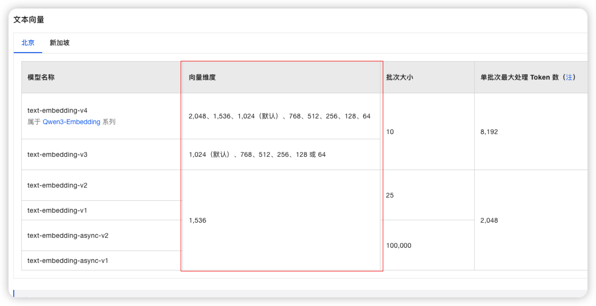

# ✅向量维度如何设置？

  

在构建 RAG系统的索引时，向量维度的设置是一个非常关键的环节。**简单来说，维度的选择并非一个可以随意调整的参数，而是由你所选用的 Embedding模型直接决定的。**

  

在我们的项目中，我们的配置如下：

  

```
elasticsearch:  
    host: http://127.0.0.1:9200  
    base-url: https://dashscope.aliyuncs.com/compatible-mode/v1  
    model-name: text-embedding-v4  
    api-key: @dashscope.api.key@  
    dimensions: 1536
```

  

即1536。


### text-embedding-v4 是什么模型？

配置里的 `text-embedding-v4` 是**向量化模型（Embedding Model）**，不是对话生成模型。它由阿里云 DashScope 提供，专门负责把一段文本转换成固定维度的浮点向量（embedding）。

| 属性 | 说明 |
| :--- | :--- |
| 提供方 | 阿里云 DashScope（通义千问系列） |
| 类型 | 文本向量化模型（Text Embedding） |
| 用途 | 文本 → `float[]` 向量，用于语义检索、聚类、相似度计算 |
| 调用方式 | OpenAI 兼容 API（`/embeddings` 接口） |
| 支持维度 | 1024 / 1536 / 2048 等多种可选 |

在项目里，调用 `openAiEmbeddingModel.embed(textSegment)` 时，本质上是向 DashScope 发请求：

```
POST https://dashscope.aliyuncs.com/compatible-mode/v1/embeddings
{
  "model": "text-embedding-v4",
  "input": "要向量化的文本",
  "dimensions": 1536
}
→ 返回 1536 维 float 向量
```

拿到向量后写入 ES 的 `dense_vector` 字段。检索时，用户问题也用同一个模型向量化，再用余弦相似度找最接近的 chunk。所以 `text-embedding-v4` 只负责"文本 → 向量"这一步，不负责生成回答。


**维度的设置，有一个****核心原则：****向量维度必须与你选择的 Embedding 模型的输出维度完全一致。**

  

每个 Embedding 模型在将文本转换为向量时，都会生成一个固定长度的浮点数数组，这个数组的长度就是向量的维度。例如：

- 如果你使用 `OpenAI` 的 `text-embedding-ada-002` 模型，它的输出向量是 **1536** 维。
- 如果你使用 `BAAI/bge-small-zh-v1.5` 模型，它的输出向量是 **384** 维。

在创建向量数据库索引时，你必须将这个固定的维度值作为参数传入。如果设置的维度与模型实际输出的维度不匹配，会导致向量无法正确存储和检索，整个系统将无法工作。

  

但是，很多模型是支持多种维度的，比如`text-embedding-v4`，他就支持很多个维度。

  



  

**更高的维度能保留更丰富的语义信息，但也会相应增加存储和计算成本。比如**`text-embedding-v4` 这个模型：

  

- 通用场景（推荐）：1024 维度是性能与成本的最佳平衡点，适用于绝大多数语义检索任务。
- 追求精度：对于高精度要求领域，可选择 1536 或 2048 维度。这会带来一定的精度提升，但存储和计算开销会显著增加。
- 资源受限：在对成本极其敏感的场景下，可选择 768 及以下维度。这能显著降低资源消耗，但会损失部分语义信息。

  

|  |  |  |
| --- | --- | --- |
| **维度选项** | **适用场景** | **特点** |
| **1536 / 2048** | 追求极致精度 | 保留最丰富的语义信息，但存储和计算成本最高。 |
| **1024 (默认)** | 通用场景 | 性能与成本的最佳平衡点，适合绝大多数语义检索任务。 |
| **768 及以下** | 资源受限场景 | 显著降低存储和计算开销，但会损失部分语义信息。 |

  

前面，我们设置的是1536维，这个后面我们还会做评测，然后根据实际的检索效果（精度）与系统成本（性能）之间找到一个相对的平衡点。

  

如果召回效果比较好，但是性能比较差，则可以考虑降低维度。

如果性能比较好，但是召回效果很差，则可以考虑提升维度。


## 向量化检索的适用场景与优缺点

向量检索（语义检索）适合处理"意思相近但用词不同"的检索问题，是 RAG 知识库召回的核心手段。

### 适用场景

1. **语义模糊 / 同义词多**：用户提问和文档用词不一致但意思相同
   - 问"怎么导出行车记录仪视频"，文档写"行车记录仪影像如何拷贝" → 关键词检索匹配不上，向量检索能召回
   - 问"R7 的屏幕多大"，文档写"智界R7 中控屏尺寸" → 向量检索能理解
2. **自然语言提问**：用户用完整句子提问，不是堆关键词
3. **跨语言检索**：多语言 embedding 模型（如 bge-m3）支持中文问、英文文档召回
4. **非结构化长文本**：PDF / Word 切分后的 chunk，无结构化字段可用 SQL 过滤
5. **相似度推荐**：给定一段文本，返回语义最接近的 N 篇
6. **去重 / 聚类**：语义重复文档聚类、重复问题检测

### 优点

| 优点 | 说明 |
| :--- | :--- |
| 语义理解 | 能匹配同义词、近义词、改写句，不依赖字面重合 |
| 容错性强 | 用户打错字、口语化、不规范，仍能召回 |
| 支持自然语言 | 不用教用户怎么组织关键词 |
| 跨语言 | 多语言模型能跨语种检索 |
| 无 schema 依赖 | 不需要预定义字段、分词词典，扔进文本就能搜 |
| 相似度连续 | 返回 0~1 相似度分数，可做阈值过滤、排序 |

### 缺点

| 缺点 | 说明 |
| :--- | :--- |
| 精确匹配差 | 对专有名词、ID、编号、代码等精确内容召回率低 |
| 可解释性差 | 只能看到相似度分数，看不到命中的关键词 |
| 存储成本高 | 每条文本存一个 float[]（1536 维 × 4 字节 ≈ 6KB），百万级 chunk 就是 GB 级 |
| 计算成本高 | 入库调 embedding API 按 token 计费，查询也要向量化 + 近似最近邻搜索 |
| 维度灾难 | 维度越高精度越好，但存储和计算上升明显，需权衡 |
| 模型依赖 | 换 embedding 模型 = 全库重新向量化，索引要重建 |
| 冷启动 | 新领域术语、新词，embedding 模型没见过，向量质量差 |
| 召回不稳定 | 同一问题改个说法，召回结果可能差很多，需评测调参 |

### 向量检索 vs 关键词检索（BM25）

| 维度 | 向量检索 | 关键词检索（BM25） |
| :--- | :--- | :--- |
| 匹配方式 | 语义相似度 | 词面重合 |
| 同义词 | ✅ 能处理 | ❌ 需同义词词典 |
| 精确词 | ❌ 容易漏 | ✅ 精确命中 |
| 可解释性 | ❌ 只有分数 | ✅ 能看到命中词 |
| 存储 | 高（向量） | 低（倒排索引） |
| 查询速度 | 近似搜索 O(log n) | 倒排，很快 |
| 上手成本 | 需 embedding 模型 | 开箱即用 |

### 工程实践：混合检索（Hybrid Search）

向量检索不是万能的，生产环境通常是**向量 + 关键词混合检索**：

```
用户问题
    │
    ├─► 向量检索（语义召回）─────┐
    │                            ├─► 融合（RRF / 加权）──► 重排 ──► 结果
    └─► BM25 检索（关键词召回）──┘
```

- 向量检索负责"语义相近但用词不同"
- BM25 负责"精确词、编号、代码"
- 两者结果用 RRF（Reciprocal Rank Fusion）或加权分数融合
- 再用 reranker 模型重排

ES 8.x 原生支持 `knn` + `match` 的 hybrid query，LangChain4j 也可以组合两个检索器实现。

一句话总结：向量检索强项是"理解意思"，弱项是"精确匹配"。生产环境不要单打独斗，和 BM25 混合用、再叠加 rerank，才能兼顾召回率和精度。
