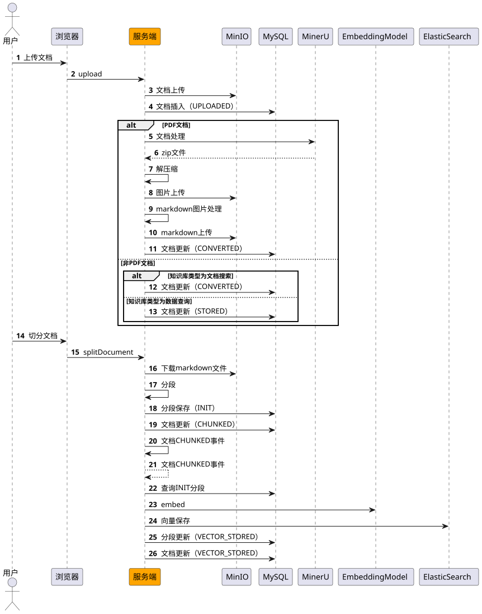
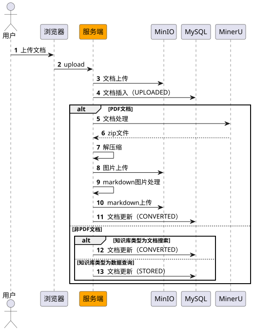
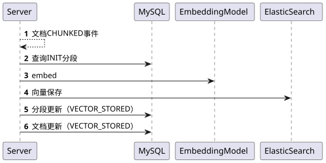

# ✅文档预处理阶段全流程讲解（事件驱动）

  

### 完整流程



  

  

1、多个流程之间，基于事件驱动。这样可以更好的解耦。

2、事件驱动如果处理失败了， 引入任务定时任务兜底。

  

### 文档上传



  

  

### 文档分段

  


  

  

### 文档向量保存

  

1、事件驱动



  

  

在DocumentEventListener中，接收DocumentChunkedEvent，做向量化和保存处理：

  

```
    /**     
    * 监听文档CHUNKED事件     
    * 触发向量嵌入流程     
    *     
    * @param event 文档已分段事件     
    */    
    
    @Async("eventListenerExecutor")    
    @EventListener    
    public void onDocumentChunked(DocumentChunkedEvent event) {        
        Long documentId = event.getDocumentId();        
        log.info("收到文档CHUNKED事件，开始执行向量嵌入，documentId: {}, segmentCount: {}",                documentId, event.getSegmentCount());        
        try {            
            boolean success = documentProcessService.embeddingAndStore(documentId);            
            log.info("向量嵌入完成，documentId: {}, success: {}", documentId, success);        
            } catch (Exception e) {            
                log.error("向量嵌入失败，documentId: {}", documentId, e);        
            }    
    }
```