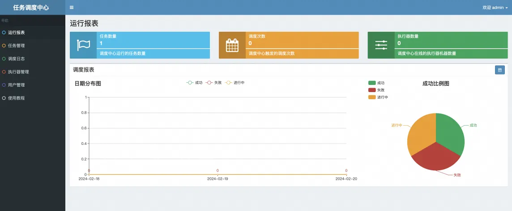
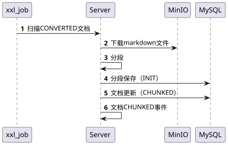
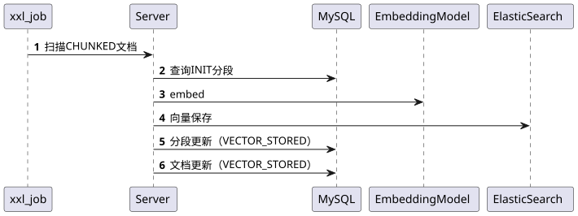

# ✅XXL-JOB部署及用任务驱动文档处理流程

  

## XXL-JOB部署

  

### 配置要求

CPU：1核

内存：2G

  

### 代码下载

  

https://github.com/xuxueli/xxl-job

  

### 初始化数据库

  

找到文件`/xxl-job/doc/db/tables_xxl_job.sql` ，然后执行，把库表建好。

  

### 修改配置

找到文件 `/xxl-job/xxl-job-admin/src/main/resources/application.properties`

  

重点修改数据库部分信息

  

```
### 调度中心JDBC链接spring.datasource.url=jdbc:mysql://127.0.0.1:3306/xxl_job?useUnicode=true&characterEncoding=UTF-8&autoReconnect=true&serverTimezone=Asia/Shanghai
spring.datasource.username=root
spring.datasource.password=root_pwd
spring.datasource.driver-class-name=com.mysql.jdbc.Driver
### 报警邮箱
spring.mail.host=smtp.qq.com
spring.mail.port=25
spring.mail.username=xxx@qq.com
spring.mail.password=xxx
spring.mail.properties.mail.smtp.auth=true
spring.mail.properties.mail.smtp.starttls.enable=true
spring.mail.properties.mail.smtp.starttls.required=true
spring.mail.properties.mail.smtp.socketFactory.class=javax.net.ssl.SSLSocketFactory
### 调度中心通讯TOKEN [选填]：非空时启用；
xxl.job.accessToken=
### 调度中心国际化配置 [必填]： 默认为 "zh_CN"/中文简体, 可选范围为 "zh_CN"/中文简体, "zh_TC"/中文繁体 and "en"/英文；
xxl.job.i18n=zh_CN
## 调度线程池最大线程配置【必填】
xxl.job.triggerpool.fast.max=200
xxl.job.triggerpool.slow.max=100
### 调度中心日志表数据保存天数 [必填]：过期日志自动清理；限制大于等于7时生效，否则, 如-1，关闭自动清理功能；
xxl.job.logretentiondays=30
```

  

然后就可以通过XxlJobAdminApplication启动了（在服务器上，可以先maven打个包，然后通过nohup java -jar xxl-job.jar & 启动），启动后访问：http://localhost:8080/xxl-job-admin

  

账号密码登录：admin/123456

  



  

  

## 任务开发

  

xxl-job 部署之后，我们需要在代码中开发对应的配置任务。

  

### ~~文档分段补偿任务~~

本任务已移除，不再使用，因为分段操作靠用户在页面上发起。

- ~~查询 CONVERTED 状态的文档~~
- ~~执行文档分段~~

  



  

```
/** * 文档分段补偿任务 * 扫描 CONVERTED 状态超过阈值的文档，重新触发分段 */@XxlJob("documentSplitCompensation")
public void documentSplitCompensation() {    
    log.info("========== 开始执行文档分段补偿任务 ==========");   
     int successCount = 0;    
     int failCount = 0;    
     try {        
        // 查询 CONVERTED 状态的文档        
        // todo 注：实际项目中应该在实体和数据库中添加 updateTime 和 retryCount 字段        
        // 这里简化处理，查询所有 CONVERTED 状态的文档        LambdaQueryWrapper<KnowledgeDocument> queryWrapper = new LambdaQueryWrapper<>();        
        queryWrapper.eq(KnowledgeDocument::getStatus, DocumentStatus.CONVERTED);       
        queryWrapper.isNotNull(KnowledgeDocument::getConvertedDocUrl);        
        List<KnowledgeDocument> documents = knowledgeDocumentService.list(queryWrapper);        
        log.info("发现 {} 个待补偿的 CONVERTED 状态文档", documents.size());for (KnowledgeDocument document : documents) {            
            try {                
                // 检查重试次数（从 extension 字段解析，或使用默认值）                
                int retryCount = getRetryCount(document);                if (retryCount >= MAX_RETRY_COUNT) {                           
                    log.warn("文档 {} 已达最大重试次数 {}，跳过补偿", document.getDocId(), retryCount);                   
                    continue;               
                }                
                log.info("补偿处理文档分段，documentId: {}, retryCount: {}", document.getDocId(), retryCount);
                // 执行分段                
                //todo 多余查询?               
                int segmentCount = documentProcessService.splitDocument(document.getDocId());                
                // 更新重试次数                
                updateRetryCount(document.getDocId(), retryCount + 1);                
                log.info("文档分段补偿成功，documentId: {}, segmentCount: {}", document.getDocId(), segmentCount);                successCount++;            
                } catch (Exception e) {                
                    log.error("文档分段补偿失败，documentId: {}", document.getDocId(), e);                
                    failCount++;            
                }        
            }    
    } catch (Exception e) {        
            log.error("文档分段补偿任务执行异常", e);    
    }    
    log.info("========== 文档分段补偿任务完成，成功: {}，失败: {} ==========", successCount, failCount);}
```

  

  

### 向量化补偿任务

- 扫描 CHUNKED 状态但存在未向量化的 segment，
- 触发向量化和存储

  



  

```java
/**
 * 向量化补偿任务
 * 扫描 CHUNKED 状态但存在未向量化的 segment，重新触发向量化
 */
@XxlJob("documentEmbeddingCompensation")
public void documentEmbeddingCompensation() {
    log.info("========== 开始执行向量化补偿任务 ==========");
    int successCount = 0;
    int failCount = 0;
    try {
        // 查询 CHUNKED 状态的文档
        //todo 扫表注意索引问题
        LambdaQueryWrapper<KnowledgeDocument> docQueryWrapper = new LambdaQueryWrapper<>();
        docQueryWrapper.eq(KnowledgeDocument::getStatus, DocumentStatus.CHUNKED);
        // ⚠️ 当前代码未加时间条件，会扫到正在被正常流程处理的文档，存在并发冲突风险
        // 建议改为：只捞 10 分钟前更新的文档，排除正常流程正在处理的
        // docQueryWrapper.le(KnowledgeDocument::getUpdateTime,
        //     LocalDateTime.now().minusMinutes(10));
        List<KnowledgeDocument> documents = knowledgeDocumentService.list(docQueryWrapper);
        log.info("发现 {} 个 CHUNKED 状态的文档", documents.size());
        for (KnowledgeDocument document : documents) {
            try {
                // 检查是否存在未向量化的片段
                LambdaQueryWrapper<KnowledgeSegment> segmentQueryWrapper = new LambdaQueryWrapper<>();
                segmentQueryWrapper.eq(KnowledgeSegment::getDocumentId, document.getDocId());
                segmentQueryWrapper.eq(KnowledgeSegment::getStatus, SegmentStatus.INIT);
                segmentQueryWrapper.eq(KnowledgeSegment::getSkipEmbedding, 0);
                segmentQueryWrapper.isNull(KnowledgeSegment::getEmbeddingId);
                //todo 这段逻辑可以内置到embeddingAndStore
                long unembeddedCount = knowledgeSegmentService.count(segmentQueryWrapper);
                if (unembeddedCount == 0) {
                    // 没有未向量化的片段，检查是否所有片段都已处理
                    // 如果所有片段都已向量化，更新文档状态
                    checkAndUpdateDocumentStatus(document.getDocId());
                    continue;
                }
                // 检查重试次数
                int retryCount = getRetryCount(document);
                if (retryCount >= MAX_RETRY_COUNT) {
                    log.warn("文档 {} 已达最大重试次数 {}，跳过补偿", document.getDocId(), retryCount);
                    continue;
                }
                log.info("补偿处理向量化，documentId: {}, unembeddedCount: {}, retryCount: {}",
                        document.getDocId(), unembeddedCount, retryCount);
                // 执行向量化
                boolean success = documentProcessService.embeddingAndStore(document.getDocId());
                if (success) {
                    // 更新重试次数
                    updateRetryCount(document.getDocId(), retryCount + 1);
                    log.info("向量化补偿成功，documentId: {}", document.getDocId());
                    successCount++;
                } else {
                    log.warn("向量化补偿失败，documentId: {}", document.getDocId());
                    failCount++;
                }
            } catch (Exception e) {
                log.error("向量化补偿失败，documentId: {}", document.getDocId(), e);
                failCount++;
            }
        }
    } catch (Exception e) {
        log.error("向量化补偿任务执行异常", e);
    }
    log.info("========== 向量化补偿任务完成，成功: {}，失败: {} ==========", successCount, failCount);
}
```


### 当前代码的改进点：缺少时间过滤条件

当前代码只按 `status = CHUNKED` 查询文档，**没有加时间条件**，存在以下问题：

| 问题 | 说明 |
| :--- | :--- |
| 并发冲突 | 正常流程正在向量化的文档也会被捞走，和正常流程重复执行 |
| 重复空跑 | 每次定时触发都全量扫描同一批文档，即使上次刚补偿成功 |
| 资源浪费 | 正常流程没出问题的文档也被扫描、判断，白白消耗数据库查询和 API 调用 |

**建议改动**：加入 `updateTime` 时间过滤，只捞"卡了超过一定时间"的文档。补偿任务的核心定位是**兜底**，不是抢正常流程的活：

```java
// 建议改为：只捞 10 分钟前更新的 CHUNKED 文档
LambdaQueryWrapper<KnowledgeDocument> docQueryWrapper = new LambdaQueryWrapper<>();
docQueryWrapper.eq(KnowledgeDocument::getStatus, DocumentStatus.CHUNKED);
docQueryWrapper.le(KnowledgeDocument::getUpdateTime,
    LocalDateTime.now().minusMinutes(10));
```

| 条件 | 作用 |
| :--- | :--- |
| `status = CHUNKED` | 只看切分完但还没向量化的 |
| `updateTime <= now - 10min` | 排除"刚切分完正在被正常流程处理"的文档 |
| `retryCount < MAX_RETRY_COUNT` | 已有，防止无限重试 |

> ⚠️ **注意**：上述时间过滤条件在当前项目代码中**尚未实现**，代码里只有 `status = CHUNKED` 的单条件查询。上面的 `docQueryWrapper.le(...)` 是建议补丁，需要手动加到项目中。阈值 10 分钟应根据正常向量化流程的平均耗时调整——大文档向量化要 5 分钟就设 10 分钟，小文档 1 分钟搞定就设 5 分钟。

  

## 常见问题

  

### Suppressed: java.io.FileNotFoundException: /data/applogs/xxl-job/xxl-job-admin.log (No such file or directory)

  

缺少日志文件，创建一个就行了,

  

路径是在xxl-job-master/xxl-job-admin/src/main/resources/logback.xml这里配置的，也可以改成你自己的。