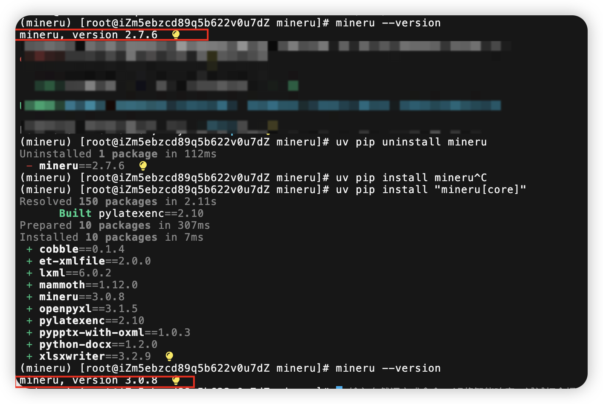

# 项目中多种格式的文档处理？

## PDF

PDF 文档的解析与处理，详见以下两篇：

- [8.MinerU文档处理功能实现](./8.MinerU文档处理功能实现.md)
- [10.在Java代码中把MinerU解析文档功能集成进来](./10.在Java代码中把MinerU解析文档功能集成进来.md)

## WORD

因为我们使用 MinerU 做了 PDF 的处理，那 MinerU 是否支持 doc 和 docx 的 Word 文档呢？尝试着调用 fast api，发现报错如下：

```
HTTP 400, {"error":"Unsupported file type: docx"}
```

于是我去 GitHub 上查了一下，官方说不支持……

https://github.com/opendatalab/MinerU/discussions/3746

但是，不要慌，他只是旧版本（我之前用的 2.7.6）不支持，把你的 MinerU 升级到 3.0 以后的版本就支持了。升级方式如下：

卸载后重新安装最新的 3.0.x 版本：



然后就和 PDF 一模一样的用法了。也是转成 zip，然后解压上传处理。

## EXCEL

### ✅ Excel 文件如何处理？

一个优秀的 RAG 系统，肯定要支持很多种类型的文件处理。那么有一种常见的格式，即 Excel，我们要如何处理它呢？

我们前面介绍过 PDF 的处理，使用了 MinerU 这个工具，然后市面上也有一些处理 Excel 的方案，是这样的：会先通过 LibreOffice 将文件转成 PDF 的形式，再使用 MinerU 进行表格区域识别。

> LLMentor

## CSV

同 Excel。

## Markdown

~~Markdown 没啥要讲的，因为 PDF、Word 都是转成 Markdown 再处理的，所以 Markdown 的处理就是直接读取内容然后分段就好了。~~

Markdown 的格式，分段上不需要做特别处理，但是图片是需要处理的，即把文档中的图片描述通过 LLM 转换出来，并且替换文档中的原来的描述。

代码实现如下：

```java
package cn.hollis.llm.mentor.know.engine.document.service.impl;

import cn.hollis.llm.mentor.know.engine.document.constant.ContentType;
import cn.hollis.llm.mentor.know.engine.document.constant.DocumentStatus;
import cn.hollis.llm.mentor.know.engine.document.constant.FileType;
import cn.hollis.llm.mentor.know.engine.document.constant.KnowledgeBaseType;
import cn.hollis.llm.mentor.know.engine.document.entity.KnowledgeDocument;
import cn.hollis.llm.mentor.know.engine.document.service.FileStorageService;
import cn.hollis.llm.mentor.know.engine.document.service.KnowledgeDocumentService;
import lombok.extern.slf4j.Slf4j;
import org.springframework.beans.factory.annotation.Autowired;
import org.springframework.stereotype.Service;
import org.springframework.util.Assert;

import java.io.ByteArrayOutputStream;
import java.io.InputStream;
import java.nio.charset.StandardCharsets;
import java.util.regex.Matcher;
import java.util.regex.Pattern;

/**
 * Markdown 文档处理服务实现类
 * <p>
 * 与 MinerU 流程不同，此处的输入流本身就是一个 Markdown 文件，
 * 文件中的图片地址通常已经是公网可访问的 URL（如 MinerU 输出的 cdn 地址）。
 * 该类的职责：
 * 1. 直接读取 Markdown 内容
 * 2. 解析其中的图片标签 
 * 3. 调用视觉大模型为每张图片生成描述，替换 alt 文本
 * 4. 将处理后的 Markdown 上传到 MinIO，并更新文档状态为 CONVERTED
 */
@Slf4j
@Service
public class MarkdownProcessServiceImpl extends MinerUProcessBaseServiceImpl {

    private static final String CONVERTED_FILE_DIR = "converted/";

    /**
     * 匹配 Markdown 图片标签：
     */
    private static final Pattern IMAGE_PATTERN = Pattern.compile("!\\[(.*?)\\]\\(([^)]+)\\)");

    @Autowired
    private FileStorageService fileStorageService;

    @Autowired
    private KnowledgeDocumentService knowledgeDocumentService;

    @Override
    public void processDocument(KnowledgeDocument document, InputStream inputStream) {
        log.info("开始处理 Markdown 文档图片描述生成，documentId: {}", document.getDocTitle());

        // 更新状态为转换中
        document.setStatus(DocumentStatus.CONVERTING);
        boolean result = knowledgeDocumentService.updateById(document);
        Assert.isTrue(result, "文件CONVERTING状态更新失败");

        try {
            // 1. 读取 Markdown 文件内容
            String mdContent = readInputStreamAsString(inputStream);

            // 2. 为图片生成描述并替换 alt 文本
            String processedMdContent = enrichImageDescriptions(mdContent);

            // 3. 上传处理后的 Markdown 到 MinIO
            String docTitle = document.getDocTitle();
            String baseName = docTitle.contains(".") ? docTitle.substring(0, docTitle.lastIndexOf(".")) : docTitle;
            String convertedObjectName = CONVERTED_FILE_DIR + baseName + ".md";
            String convertedUrl = fileStorageService.uploadFile(
                    convertedObjectName,
                    processedMdContent.getBytes(StandardCharsets.UTF_8),
                    ContentType.TEXT_MARKDOWN);

            // 4. 更新文档状态为已转换
            document.setStatus(DocumentStatus.CONVERTED);
            document.setConvertedDocUrl(convertedUrl);
            result = knowledgeDocumentService.updateById(document);
            Assert.isTrue(result, "文件CONVERTED状态更新失败");

            log.info("Markdown 文档处理完成，documentId: {}, convertedUrl: {}", document.getDocTitle(), convertedUrl);
        } catch (Exception e) {
            log.error("Markdown 文档处理失败，documentId: {}", document.getDocTitle(), e);
            // 处理失败，状态回滚为 UPLOADED
            document.setStatus(DocumentStatus.UPLOADED);
            result = knowledgeDocumentService.updateById(document);
            Assert.isTrue(result, "文件UPLOADED状态更新失败");
            throw new RuntimeException("Markdown 文档处理失败: " + e.getMessage(), e);
        } finally {
            closeQuietly(inputStream);
        }
    }

    /**
     * 遍历 Markdown 中的图片标签，为每张图片调用视觉模型生成描述并替换 alt 文本
     * 例如： -> 
     */
    private String enrichImageDescriptions(String mdContent) {
        Matcher matcher = IMAGE_PATTERN.matcher(mdContent);
        StringBuffer result = new StringBuffer();

        while (matcher.find()) {
            String originAlt = matcher.group(1);
            String imageUrl = matcher.group(2);

            String description;
            try {
                // 调用基类提供的视觉模型生成描述
                description = generateImageDescription(imageUrl);
                if (description == null || description.isBlank()) {
                    log.warn("图片描述为空，保留原 alt 文本，url: {}", imageUrl);
                    description = originAlt;
                } else {
                    // 去除可能存在的换行，保证 Markdown 标签单行
                    description = description.replaceAll("[\\r\\n]+", " ").trim();
                }
                log.info("图片描述已生成: {} -> {}", imageUrl, description);
            } catch (Exception e) {
                log.warn("生成图片描述失败，保留原 alt 文本，url: {}", imageUrl, e);
                description = originAlt;
            }

            String newImageTag = "";
            matcher.appendReplacement(result, Matcher.quoteReplacement(newImageTag));
        }
        matcher.appendTail(result);

        return result.toString();
    }

    /**
     * 将 InputStream 全量读取为字符串
     */
    private String readInputStreamAsString(InputStream inputStream) throws Exception {
        try (ByteArrayOutputStream baos = new ByteArrayOutputStream()) {
            byte[] buffer = new byte[8192];
            int n;
            while ((n = inputStream.read(buffer)) != -1) {
                baos.write(buffer, 0, n);
            }
            return baos.toString(StandardCharsets.UTF_8);
        }
    }

    /**
     * 安静关闭输入流，忽略异常
     */
    private void closeQuietly(InputStream inputStream) {
        if (inputStream != null) {
            try {
                inputStream.close();
            } catch (Exception ignored) {
                // 忽略关闭异常
            }
        }
    }

    @Override
    public boolean supports(FileType fileType, KnowledgeBaseType knowledgeBaseType) {
        return fileType == FileType.MARKDOWN;
    }
}
```

## TXT

其实 Markdown 本质上也是 txt 的纯文本文件，只不过是有一些 Markdown 语法的内容而已，所以 txt 的处理方式和 Markdown 一样。只不过不太适合做标题分段。