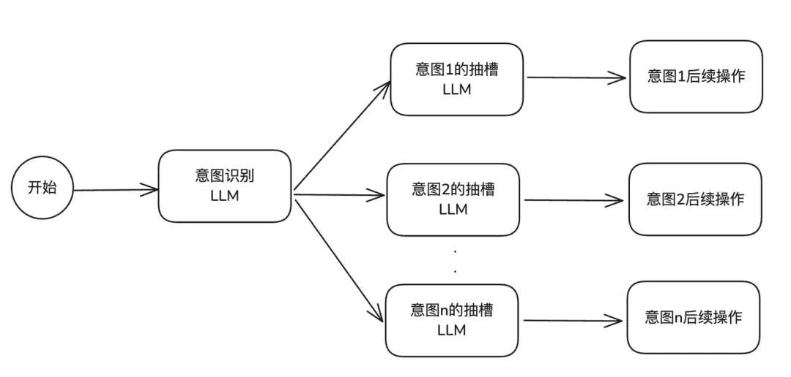

# 意图识别如何实现？如何优化？

意图识别是很多 Agent 中的核心任务，主要目的是从用户输入中准确判断其背后的语义目标（如"查询订单"、"订机票"、"退货申请"等）。

往往很多智能体中，在意图识别之后，会把用户请求路由给不同的子 Agent 来处理，所以意图识别至关重要，一旦意图识别错了，那么最终的执行结果往往也会错。

我们介绍下通常的意图识别方案。（项目中不一定都会用，但是还是给大家讲下。）

意图识别最简单也是最常用的方案，就是提示词工程。

## 提示词工程

在意图识别的提示词工程中，主要会用到角色定义、few-shot 以及结构化输出。如：

```
# 角色定义
你是一个专业的客服意图识别专家。请分析用户的输入，判断是否与汽车相关，并识别其意图和关键信息。为了确保高准确率，请在输出最终结果前，先进行逻辑推理和分析。

# 相关性判断
首先判断用户输入是否与"汽车"相关（如买车、用车、修车、投诉等）。
如果不相关，直接输出：{"related": false}
如果相关，继续执行以下步骤。

# 意图分类体系
1. **售前咨询与购买**
   - 涵盖：车型配置询问、价格/优惠/购车政策、试驾预约、经销商/门店查询、库存查询。
   - 特征：用户处于"看车/买车"阶段。
2. **售后维修与保养**
   - 涵盖：进店维修预约、故障报修（明确要求去店里）、保养服务、维修进度查询、配件价格询问。
   - 特征：用户处于"修车/养车"阶段，有明确的进店或人工服务需求。
3. **车辆使用与技术指导**
   - 涵盖：车辆功能操作（如"怎么开天窗"）、仪表盘/故障灯解读、用车技巧、零部件更换教程（DIY）、技术原理咨询。
   - 特征：用户处于"用车"阶段，需求是"学习如何操作"或"了解原理"，而非直接要求进店维修。
   - *辨析：* "雨刮器怎么换"属于此类（教程）；"雨刮器坏了去换一下"属于售后维修。
4. **投诉与维权**
   - 涵盖：产品质量投诉（异响、死机等）、服务态度投诉、维修争议、法律/安全诉求。
   - 特征：用户带有负面情绪，表达不满或追责意愿。
5. **客户关怀与运营**
   - 涵盖：会员权益、活动邀约、满意度回访、积分兑换。
6. **闲聊与通用问答**
   - 涵盖：打招呼、无意义字符、与汽车无关的闲聊（如天气、育儿）。
   - 注意：此类 `related` 字段应为 `false`。
7. **其他**
   - 涵盖：无法归类到以上任何一项的汽车相关模糊意图。

# 输出格式示例
{
  "related": true,
  "intent": "技术支持与使用"
}
```

这种方案的优点在于简单高效。通过提示词设计，无需添加复杂的额外算法或模型架构，就可使 AI 智能体快速具备意图识别。比较适合意图数量较少的情况（如 10 个以内）。

但是缺点也比较明显，就是当意图数量增多的时候，需要给每一个意图都编写对应的 few-shot、CoT 等内容，不仅提示词会迅速膨胀，而且也会导致模型很难精准地捕捉到准确的意图而导致识别失败。

而且，对于方言、口语化等特异表达的识别效果不稳定，出现 Bad Case 后，只能通过修改提示词来修复，过程繁琐且效果难以保证。

## 提示词工程 + 槽位

在提示词工程的方案的基础上，引入槽位抽取的手段。槽位抽取就是让 LLM 从用户的问题中抽取的特定信息（即"槽位"），例如"订机票"意图需要抽取"出发地"、"目的地"、"时间"等。

比如，上面的提示词可以优化如下：

```
# 角色定义
你是一个专业的客服意图识别专家。请分析用户的输入，判断是否与汽车相关，并识别其意图和关键信息。为了确保高准确率，请在输出最终结果前，先进行逻辑推理和分析。

# 相关性判断
首先判断用户输入是否与"汽车"相关（如买车、用车、修车、投诉等）。
如果不相关，直接输出：{"related": false}
如果相关，继续执行以下步骤。

# 意图分类体系
1. **售前咨询与购买**
   - 涵盖：车型配置询问、价格/优惠/购车政策、试驾预约、经销商/门店查询、库存查询。
   - 特征：用户处于"看车/买车"阶段。
2. **售后维修与保养**
   - 涵盖：进店维修预约、故障报修（明确要求去店里）、保养服务、维修进度查询、配件价格询问。
   - 特征：用户处于"修车/养车"阶段，有明确的进店或人工服务需求。
3. **车辆使用与技术指导**
   - 涵盖：车辆功能操作（如"怎么开天窗"）、仪表盘/故障灯解读、用车技巧、零部件更换教程（DIY）、技术原理咨询。
   - 特征：用户处于"用车"阶段，需求是"学习如何操作"或"了解原理"，而非直接要求进店维修。
   - *辨析：* "雨刮器怎么换"属于此类（教程）；"雨刮器坏了去换一下"属于售后维修。
4. **投诉与维权**
   - 涵盖：产品质量投诉（异响、死机等）、服务态度投诉、维修争议、法律/安全诉求。
   - 特征：用户带有负面情绪，表达不满或追责意愿。
5. **客户关怀与运营**
   - 涵盖：会员权益、活动邀约、满意度回访、积分兑换。
6. **闲聊与通用问答**
   - 涵盖：打招呼、无意义字符、与汽车无关的闲聊（如天气、育儿）。
   - 注意：此类 `related` 字段应为 `false`。
7. **其他**
   - 涵盖：无法归类到以上任何一项的汽车相关模糊意图。

# 关键信息提取
提取以下信息，如果没有提到则填 null：
car_model：车型（如 "A6L"）
order_id：订单号/合同号
dealer：经销商/门店名称
fault_description：故障现象描述
appointment_time：预约时间
part_name：配件名称（如 "轮胎"）
function_name：功能名称（如 "自动泊车"）
warning_light：故障灯名称（如 "发动机灯"）

# 输出格式示例
{
  "related": true,
  "intent": "用户意图",
  "entities": {
    "car_model": "...",
    "order_id": "...",
    "dealer": "...",
    "fault_description": "...",
    "appointment_time": "...",
    "part_name": "...",
    "function_name": "...",
    "warning_light": "..."
  }
}
```

这个方案会让后置的处理更加方便，因为在意图分析节点中可以直接做关键信息提取了，但是有个缺点，那就是如果意图太多，或者槽位太多的话，需要不断地调整提示词，并且也会影响输出效果。

那么，可以的优化手段是，把意图分析提示词，和槽位提取提示词做分离。

## 提示词、槽位分离

即整个意图识别分为两个节点：意图识别、槽位抽取。



1. **意图识别节点**：提示词只包含所有意图的简要描述，负责快速判断用户输入的意图类别。
2. **槽位抽取节点**：一旦意图被识别，系统会路由到该意图专属的槽位抽取节点。这个节点的提示词只关注当前意图需要抽取的特定信息（即"槽位"），例如"订机票"意图需要抽取"出发地"、"目的地"、"时间"等。

这个方案的优点是，架构清晰，易于维护，新增或修改某个意图时，只需调整对应的槽位抽取节点，不影响其他部分。而且每个抽槽节点的职责单一且明确，仅专注于对应意图所关联信息的抽取任务，避免了多意图抽槽任务交叉可能带来的干扰与冲突。

同时，这种设计使得槽位提取的 LLM 节点不会受到其他无关意图信息的干扰，能够更加专注于对复杂文本语境中的关键要素进行捕捉与解读。

这个方案最大的缺点就是，由于需要串联调用两次或多次 LLM，总的响应时间会变长，可能不适合对实时性要求极高的场景。

此方案适合意图分支较多（如 10-20 个）、业务逻辑复杂，但对响应延迟有一定容忍度的场景，例如企业内部的业务咨询系统。

## 前置 RAG 召回

前面的方案如果你用了，还是发现有不准确、效果不好等问题的话，那么说明你的业务场景比较复杂了，因为如果用户的提问涉及到大量方言、口语化或非常规表达时，前两种依赖模型实时泛化的方案可能力不从心。

有一种解决办法，那就是引入参数量更大、更强大的模型，因为它们的泛化能力会更强，往往可以提升召回效果。但是成本和响应时长也扛不住。所以并不是长久之计。

于是，有了一种引入 RAG 技术来增强系统的泛化能力的方案，那就是靠 RAG 做前置召回。


1. **构建意图语料库**：为每个意图预先收集和生成大量的用户问法（Query），包括标准问法、同义句、口语化表达、方言等，形成一个"意图泛化知识库"。
2. **检索辅助识别**：当用户提问时，系统首先将用户输入与"意图泛化知识库"进行语义相似度检索，找出最相似的几条问法及其对应的意图。
3. **LLM 辅助决策**：将检索到的相似问法作为示例（Few-shot），连同用户的原始问题一起提交给 LLM，让模型基于这些参考示例来做出更准确的意图判断。

这个方案的优点是，泛化能力可控，对于无法识别的特异表达，只需将其添加到知识库中即可，无需反复调试提示词，修复 Bad Case 速度快。而且成本与准确率更优，由于有知识库的辅助，可以选用性价比更高的小模型，同时意图识别的准确率也能得到显著提升。

缺点首先是研发成本高，需要单独搞一套 RAG；其次的话就是不擅处理多轮对话，此方案主要基于单轮用户输入进行检索，难以结合历史对话上下文来综合判断意图。

所以一般适用于以单轮对话为主，但存在大量特异表达的垂直领域场景，如地铁公交查询、地域化客服系统等。

## 多轮对话上下文关联

现实中的用户需求往往是多轮的。例如，用户先说"我要打车"，接着补充"去公司"。此时，必须结合历史对话才能准确识别出完整的意图是"打车去公司"。

一个常见的优化手段是，在意图识别时，将用户的历史对话、近期操作的文档或数据作为辅助信息输入给模型，帮助模型理解当前请求的完整上下文。高阶方案会将意图识别与槽位抽取合并，并升级为多轮 RAG 召回，以同时兼顾多轮理解和效率。

## 问题澄清

前面我们也讲过问题澄清，其实当用户的需求非常模糊或关键信息缺失时，与其猜测，不如主动询问。

设计一个澄清机制。当模型判断意图置信度不高或关键槽位缺失时，不是直接执行或报错，而是通过引导式提问让用户补充信息。例如，用户说"安排下周的会议"，系统可以反问"请问会议的主题和预计时长是？"。