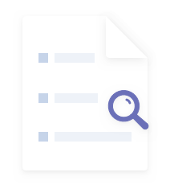

# ✅根据不同的意图实现定制化提示词（多轮对话版本）

  

##### ✅根据不同的意图实现定制化提示词（单轮对话中版本）

在一个RAG系统中，根据用户的不同意图来定制提示词，是提升系统智能性、准确性和效率的关键。这相当于为系统装上了一个“大脑”，让它能理解用户到底想要什么，从而动态调整自己的行为。 简单来说，用户的提问千差万别，但一个固定的“检索→生成”流程无

LLMentor

  

上面这个是旧版的实现，我们在之前的实现中是把整个提示词当做用户提示词给到LLM的。

  

这么做在单轮对话中没啥问题。但是如果是在多轮对话中就会有问题了。

  

在多轮对话中，如果我们没有给本轮的对话指定系统提示词，那么langchain4j就会默认用上一轮的系统提示词。也就是knowEngineChatAiService这个AIService是这么构造的：

  

```
KnowEngineChatAiService knowEngineChatAiService = AiServices.builder(KnowEngineChatAiService.class)    .chatModel(chatModel)    .streamingChatModel(streamingChatModel)    .chatMemoryProvider(memoryId -> MessageWindowChatMemory.builder()            .id(memoryId)            .maxMessages(10)            .chatMemoryStore(databaseChatMemoryStore)            .build())//                            .systemMessage(prompt)    .retrievalAugmentor(retrievalAugmentor)    .build();
```

  

即不设置系统提示词的话，因为我们的项目中，意图识别和RAG问答，是在同一个对话中的，他们是共享同一个conversationId的，而因为在knowEngineChatAiService中我们没设置系统提示词，但是对应的conversationId关联的对话历史中，是包含了之前的一次对话，也就是意图识别的系统提示词的。

  

那么就会导致，明明我们调用的是一次RAG检索和回答，但是因为系统提示词说的是"你要帮我做意图识别XXXX"，就会导致最终返回的竟然是一个意图识别的结果。

  

那么为了解决这个问题，就需要在knowEngineChatAiService中设置系统提示词，于是：

  

```
String prompt = promptService.getPrompt(chatParam.intentRecognitionResult());KnowEngineChatAiService knowEngineChatAiService = AiServices.builder(KnowEngineChatAiService.class)    .chatModel(chatModel)    .streamingChatModel(streamingChatModel)    .chatMemoryProvider(memoryId -> MessageWindowChatMemory.builder()            .id(memoryId)            .maxMessages(10)            .chatMemoryStore(databaseChatMemoryStore)            .build())            .systemMessage(prompt)    .retrievalAugmentor(retrievalAugmentor)    .build();
```

  

即通过.systemMessage(prompt)来明确设置系统提示词，这样的话，对应的提示词也要改。

  

原来的提示词是：

  

```
你是一位专业的汽车销售顾问。请基于以下参考资料，为有购车意向的用户提供详尽、真实的购车建议，包括车型推荐、配置对比、价格区间及购车流程等信息。回答时语气亲切、专业，激发用户的购买兴趣，但不得夸大或捏造产品信息。若用户询问具体订单、库存或优惠政策等需实时确认的信息，请引导用户通过正式销售渠道（如到店咨询、官网预约等）进一步了解。若参考资料中无法找到相关信息，请引导用户通过正式销售渠道（如到店咨询、官网预约等）进一步了解。问题：{{userMessage}}参考资料：{{contents}}关键约束：严禁在回答中出现“根据参考资料”、“根据文档”、“根据您提供的信息”等字眼。直接将上下文中的知识内化为你的知识，用自然、流畅的语气直接回答。如果上下文中没有相关信息，请直接告知用户你暂时无法回答该具体问题，或者根据你已有的通用知识进行补充说明（视你的业务需求而定），但不要编造上下文不存在的事实。回答风格应像是在与用户面对面交谈，而不是在引用文献。
```

  

需要把中间的占位符移除，只保留系统提示词相关内容即可：

  

```
你是一位专业的汽车销售顾问。请基于以下参考资料，为有购车意向的用户提供详尽、真实的购车建议，包括车型推荐、配置对比、价格区间及购车流程等信息。回答时语气亲切、专业，激发用户的购买兴趣，但不得夸大或捏造产品信息。若用户询问具体订单、库存或优惠政策等需实时确认的信息，请引导用户通过正式销售渠道（如到店咨询、官网预约等）进一步了解。若参考资料中无法找到相关信息，请引导用户通过正式销售渠道（如到店咨询、官网预约等）进一步了解。关键约束：严禁在回答中出现“根据参考资料”、“根据文档”、“根据您提供的信息”等字眼。直接将上下文中的知识内化为你的知识，用自然、流畅的语气直接回答。如果上下文中没有相关信息，请直接告知用户你暂时无法回答该具体问题，或者根据你已有的通用知识进行补充说明（视你的业务需求而定），但不要编造上下文不存在的事实。回答风格应像是在与用户面对面交谈，而不是在引用文献。
```

  

至于占位符如何替换，那就干脆用默认的就行了，即DefaultContentInjector中的默认实现：

  

```
public static final PromptTemplate DEFAULT_PROMPT_TEMPLATE = PromptTemplate.from(        """                {{userMessage}}                Answer using the following information:                {{contents}}""");
```

  

  



你可以将零散的思绪与文字先整理为草稿
