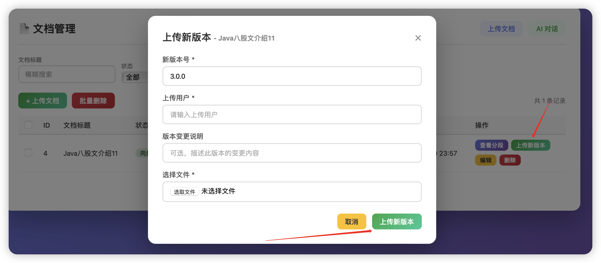
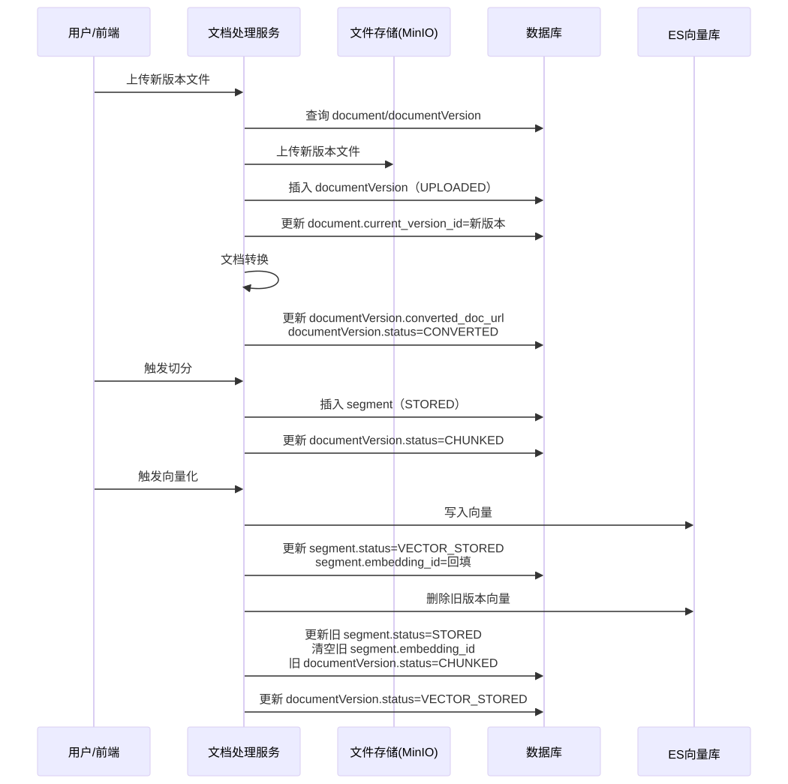
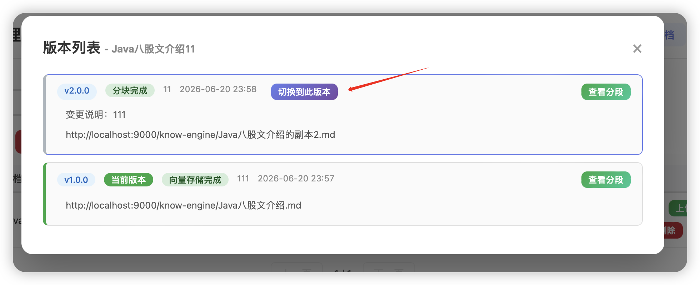
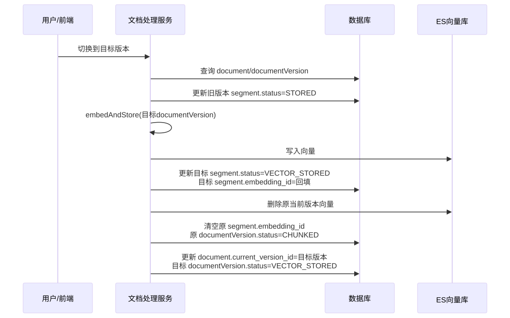

# ✅文档如何做多版本管理？

  

know-engine 的文档管理系统实现了一套完整的多版本管理方案，核心目标是：**在不停机的前提下，支持知识文档的版本迭代、历史追溯与任意版本切换**，同时保证 RAG 检索的向量数据与文档内容始终保持版本一致性。

  

PS：本章功能演示用到的测试数据：

  

https://nfturbo-file.oss-cn-hangzhou.aliyuncs.com/llm/%E6%B5%8B%E8%AF%95%E7%94%A8%E6%95%B0%E6%8D%AE.zip

  

## 多版本支持的数据模型设计

  

### 设计思路：逻辑文档与物理版本分离

  

之前我们设计的只有knowledge\_document的单表方案在面对版本管理时会遇到诸多问题：每次更新都会覆盖原始数据，无法回溯；切换版本需要删除再重建，存在服务中断窗口。

于是我们改成采用 **「逻辑文档 + 物理版本快照」** 分离模型，将文档的"身份信息"与"内容版本"拆分存储：

```
knowledge_document（逻辑文档）    │  doc_id         文档唯一身份    │  doc_title      标题（跨版本不变）    │  knowledge_base_type  知识库类型（跨版本不变）    │  accessible_by  权限（跨版本不变）    └─ current_version_id ──────────────────────┐                                                ▼knowledge_document_version（版本快照）          当前激活版本    │  version_id     版本唯一ID    │  doc_id         关联逻辑文档    │  version        语义化版本号（1.0.0）    │  doc_url        MinIO 原始文件地址    │  converted_doc_url  转换后文件地址    │  content_hash   SHA-256 内容哈希    └─ status         版本处理状态knowledge_segment（知识分段）    │  document_id    关联逻辑文档 ID    └─ document_version  关联版本 ID（version_id）
```

  

### 核心表结构

`knowledge_document`（逻辑文档表）该表只存储文档的不变属性，新增 `current_version_id` 作为指向当前激活版本的"激活指针"。通过更换这个指针即可完成版本切换，代价极低且原子。

```
create TABLE `knowledge_document` (    `doc_id`        BIGINT        NOT NULL AUTO_INCREMENT comment '文档ID',    `doc_title`     VARCHAR(1024) NOT NULL comment '文档标题',    `expire_date`   DATE          NULL     comment '文档失效日期',    `status`        VARCHAR(32)   NOT NULL comment '状态：INIT, UPLOADED, CONVERTING, CONVERTED, CHUNKED, VECTOR_STORED',    `accessible_by` VARCHAR(1024) NULL     comment '可见范围',    `description`   VARCHAR(512)  NULL     comment '文档描述',    `knowledge_base_type` VARCHAR(32) NULL comment '知识库类型：DOCUMENT_SEARCH, DATA_QUERY',    `extension`     TEXT          NULL     comment '扩展字段，保存JSON字符串',    `current_version_id` BIGINT  NULL     comment '当前激活版本ID，指向 knowledge_document_version.version_id',    `created_at`    DATETIME      NOT NULL DEFAULT CURRENT_TIMESTAMP comment '创建时间',    `updated_at`    DATETIME      NOT NULL DEFAULT CURRENT_TIMESTAMP ON update CURRENT_TIMESTAMP comment '修改时间',    `lock_version` INT           NOT NULL DEFAULT 0 comment '乐观锁版本号',    `deleted`       TINYINT      NOT NULL DEFAULT 0 comment '是否删除：0-未删除，1-已删除',    PRIMARY KEY (`doc_id`),    -- 为状态字段添加索引，优化定时任务扫表性能    INDEX `idx_status` (`status`),    -- 复合索引：状态+文档ID，优化分页查询性能    INDEX `idx_status_doc_id` (`status`, `doc_id`),    -- 创建时间索引，优化按时间排序查询    INDEX `idx_created_at` (`created_at`)) ENGINE=InnoDB DEFAULT CHARSET=utf8mb4 COLLATE=utf8mb4_unicode_ci comment = '知识文档表';
```

`knowledge_document_version`（版本快照表）每行存储一个版本的完整快照，通过 `UNIQUE KEY uk_doc_version(doc_id, version)` 约束保证同一文档的版本号不重复。

```
create TABLE `knowledge_document_version` (    `version_id`      BIGINT       NOT NULL AUTO_INCREMENT comment '版本ID',    `doc_id`          BIGINT       NOT NULL comment '关联文档ID（knowledge_document.doc_id）',    `version`         VARCHAR(32)  NOT NULL DEFAULT '1.0.0' comment '版本号（语义化版本，如 1.0.0）',    `doc_url`         VARCHAR(2048) NULL    comment '该版本文档URL（MinIO原始文件）',    `converted_doc_url` VARCHAR(2048) NULL  comment '该版本转换后的文档URL',    `content_hash`    VARCHAR(64)  NULL    comment '该版本文档内容哈希值（SHA-256）',    `status`          VARCHAR(32)  NOT NULL comment '版本状态：UPLOADED, CONVERTING, CONVERTED, CHUNKED, VECTOR_STORED, STORED',    `upload_user`     VARCHAR(255) NULL    comment '该版本上传用户',    `changelog`       VARCHAR(1024) NULL   comment '版本变更说明',    `created_at`      DATETIME     NOT NULL DEFAULT CURRENT_TIMESTAMP comment '创建时间',    `updated_at`     DATETIME     NOT NULL DEFAULT CURRENT_TIMESTAMP ON update CURRENT_TIMESTAMP comment '修改时间',    `lock_version`   INT          NOT NULL DEFAULT 0 comment '乐观锁版本号',    `deleted`        TINYINT      NOT NULL DEFAULT 0 comment '是否删除：0-未删除，1-已删除',    PRIMARY KEY (`version_id`),    -- 同一文档版本号唯一    UNIQUE KEY `uk_doc_version` (`doc_id`, `version`),    -- 文档ID索引，用于查询文档所有版本    INDEX `idx_doc_id` (`doc_id`),    -- 内容哈希索引，用于跨版本去重    INDEX `idx_content_hash` (`content_hash`)) ENGINE=InnoDB DEFAULT CHARSET=utf8mb4 COLLATE=utf8mb4_unicode_ci comment = '文档版本表';
```

`knowledge_segment`（知识分段表）分段通过 `document_version` 字段绑定到具体版本 ID，使得不同版本的分段数据可以并存于同一张表中，互不干扰。

```
CREATE TABLE `knowledge_segment` (    `id`               BIGINT NOT NULL AUTO_INCREMENT,    `document_id`      BIGINT NOT NULL COMMENT '逻辑文档 ID',    `document_version` BIGINT COMMENT '版本 ID（精确绑定到某个版本）',    `text`             LONGTEXT,    `embedding_id`     VARCHAR(255) COMMENT 'ES 向量 ID',    `status`           VARCHAR(255) COMMENT 'STORED / VECTOR_STORED',    INDEX `idx_document_version` (`document_version`));
```

  

## 上传新版本

  



  

同一份文档，如果有新的版本，可以通过上传新版本的方式更新文档内容。流程如下：

  



  

上传后数据变化如下：1.0.0 -\> 2.0.0

|  |  |
| --- | --- |
| 数据表 | 数据变化 |
| knowledge\_documen | current\_version\_id 更新为新版本的 version\_id(2.0.0)； |
| knowledge\_document\_version | 新增 1 条新版本记录(2.0.0)；status 从 UPLOADED 演进至 VECTOR\_STORED；旧版本记录保留(1.0.0)，但是状态会变为CHUNKED |
| knowledge\_segment | 新增新版本(2.0.0)对应的 N 条片段；新版本片段 status 从 STORED → VECTOR\_STORED 并回填 embedding\_id；旧版本片(1.0.0)段保留，但在 embedAndStore 的双检阶段被降级为 STORED 并清空 embedding\_id |
| Elasticsearch 向量库 | 写入新版本向量；(2.0.0)旧版本(1.0.0)向量在 embedAndStore 中通过 deactivateVersion 按 docId + versionId 删除 |

  

上传后重新选择新的分段方式后，就可以把新文档的内容存储到向量数据库中。这个过程为了不影响用户体验，实现了一个不停机更新：

  

##### ✅文档如何实现不停机更新

RAG系统中，文档的更新也是个比较常见的操作。我们也支持文档的更新，支持以下这三种操作： 1、文档的基本信息更新，如名称、描述等。 2、指定分段的内容更新。 3、整个文档的更新 文档基本信息更新 更新范围限制 文档基本信息更新（PUT /a

LLMentor

  

## 版本切换

版本切换（`switchVersion`）的语义是：**将指定的历史版本重新激活为当前版本，使其分段重新进入向量库，接管 RAG 检索流量**。

  



主要流程如下：



  

版本切换后数据状态如下：2.0.0 -\> 1.0.0

|  |  |
| --- | --- |
| 数据表 | 数据变化 |
| knowledge\_documen | current\_version\_id 更新为目标版本的 version\_id(1.0.0)； |
| knowledge\_document\_version | 目标版本(1.0.0) status 由 CHUNKED 升为 VECTOR\_STORED；原版本(2.0.0) status 由 VECTOR\_STORED 降为 CHUNKED |
| knowledge\_segment | 目标版本(1.0.0)片段 status 从 STORED → VECTOR\_STORED 并回填 embedding\_id；原版本(2.0.0)片段 status 从 VECTOR\_STORED 降为 STORED 并清空 embedding\_id |
| Elasticsearch 向量库 | 写入目标版本(1.0.0)向量；删除原当前版本(2.0.0)的向量 |

  

### 版本启停能力（deactivate / activate）

  

版本切换的底层由两个对称操作支撑：

**版本失效（deactivateVersion）**

将一个 `VECTOR_STORED` 版本下线：

```
① 校验版本状态为 VECTOR_STORED② 调用 cleanupOldVersionData：按 docId + versionId 清理旧版本的 ES 向量③ 将该版本所有分段状态 VECTOR_STORED → STORED，清空 embeddingId④ 版本状态 VECTOR_STORED → CHUNKED
```

关键代码（`KnowledgeDocumentServiceImpl.deactivateVersion`）：

```
// 清理 ES 向量documentCleanupService.cleanupOldVersionData(docId, versionId);// 分段状态降级，清空 embeddingIdLambdaUpdateWrapper<KnowledgeSegment> segUpdate = Wrappers.<KnowledgeSegment>lambdaUpdate()        .set(KnowledgeSegment::getStatus, SegmentStatus.STORED)        .set(KnowledgeSegment::getEmbeddingId, null)        .eq(KnowledgeSegment::getDocumentId, docId)        .eq(KnowledgeSegment::getDocumentVersion, versionId)        .eq(KnowledgeSegment::getStatus, SegmentStatus.VECTOR_STORED);knowledgeSegmentMapper.update(null, segUpdate);// 版本状态降级version.setStatus(DocumentStatus.CHUNKED);knowledgeDocumentVersionService.updateById(version);
```

**版本生效（activateVersion）**

将一个已切片但未向量化的版本（`CHUNKED`）重新向量化上线：

```
① 校验版本状态为 CHUNKED② 分页扫描该版本下所有 status=STORED 且 skip_embedding=0 的分段③ 批量 embed 写入 ES → 记录 embeddingId④ 分段状态 STORED → VECTOR_STORED⑤ 版本状态 CHUNKED → VECTOR_STORED
```

关键代码（`KnowledgeDocumentServiceImpl.activateVersion`）：

```
// 分页向量化，避免单批数据量过大Page<KnowledgeSegment> page = knowledgeSegmentService.page(new Page<>(1, 100), queryWrapper);while (!page.getRecords().isEmpty()) {    List<KnowledgeSegment> batch = page.getRecords();    List<String> embeddingIds = vectorStoreService.embedAndStore(batch);    for (int i = 0; i < batch.size(); i++) {        KnowledgeSegment seg = batch.get(i);        seg.setEmbeddingId(embeddingIds.get(i));        seg.setStatus(SegmentStatus.VECTOR_STORED);        knowledgeSegmentService.updateById(seg);    }    page = knowledgeSegmentService.page(new Page<>(page.getCurrent(), 100), queryWrapper);}version.setStatus(DocumentStatus.VECTOR_STORED);knowledgeDocumentVersionService.updateById(version);
```

### switchVersion 完整流程

`switchVersion` 将上述两个操作串联，实现版本的原子切换：

```
// DocumentProcessServiceImpl.switchVersion// ① 旧版本所有分段状态降为 STORED（退出向量检索）LambdaUpdateWrapper<KnowledgeSegment> updateWrapper = Wrappers.<KnowledgeSegment>lambdaUpdate()        .set(KnowledgeSegment::getStatus, SegmentStatus.STORED)        .eq(KnowledgeSegment::getDocumentId, document.getDocId())        .eq(KnowledgeSegment::getDocumentVersion, document.getCurrentVersionId());knowledgeSegmentMapper.update(null, updateWrapper);// ② 目标版本重新向量化（activateVersion 内部已处理完整激活流程）boolean embedResult = embedAndStore(versionRecord);// ③ 更新激活指针document.setCurrentVersionId(versionId);knowledgeDocumentService.updateById(document);
```

  

整个切换的过程中，向量数据的处理我们是通过embedAndStore方法实现的，这里面其实

[✅文档如何做多版本管理？](https://thoughts.aliyun.com/workspaces/6963289eb0fc2e001bb052eb/docs/6a36c28cd31fed0001a4cdf0#slate-title)

[多版本支持的数据模型设计](https://thoughts.aliyun.com/workspaces/6963289eb0fc2e001bb052eb/docs/6a36c28cd31fed0001a4cdf0#6a36c438e6d1fe6ee430b9b5)

[设计思路：逻辑文档与物理版本分离](https://thoughts.aliyun.com/workspaces/6963289eb0fc2e001bb052eb/docs/6a36c28cd31fed0001a4cdf0#6a36c438e6d1fe05ae30b9b7)

[核心表结构](https://thoughts.aliyun.com/workspaces/6963289eb0fc2e001bb052eb/docs/6a36c28cd31fed0001a4cdf0#6a36c45be6d1fedeed30ba01)

[上传新版本](https://thoughts.aliyun.com/workspaces/6963289eb0fc2e001bb052eb/docs/6a36c28cd31fed0001a4cdf0#6a377b0ee6d1fe976630ba61)

[版本切换](https://thoughts.aliyun.com/workspaces/6963289eb0fc2e001bb052eb/docs/6a36c28cd31fed0001a4cdf0#6a377b6de6d1fe59ac30ba6a)

[版本启停能力（deactivate / activate）](https://thoughts.aliyun.com/workspaces/6963289eb0fc2e001bb052eb/docs/6a36c28cd31fed0001a4cdf0#6a36c438e6d1fe968d30b9e4)

[switchVersion 完整流程](https://thoughts.aliyun.com/workspaces/6963289eb0fc2e001bb052eb/docs/6a36c28cd31fed0001a4cdf0#6a36c438e6d1fe3a8d30b9f0)


你可以将零散的思绪与文字先整理为草稿
