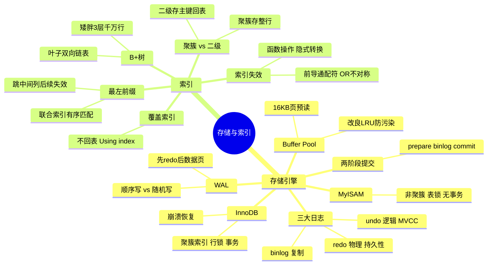
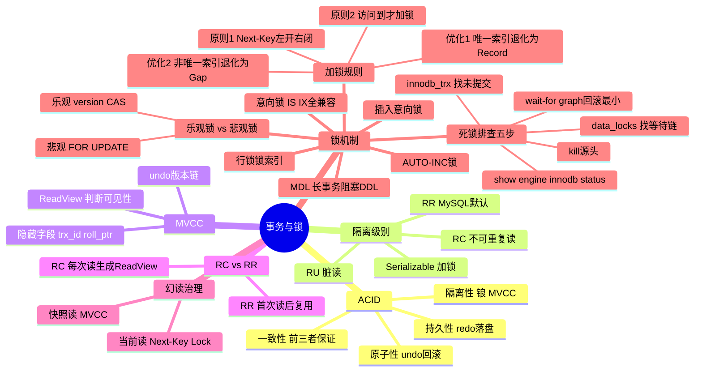
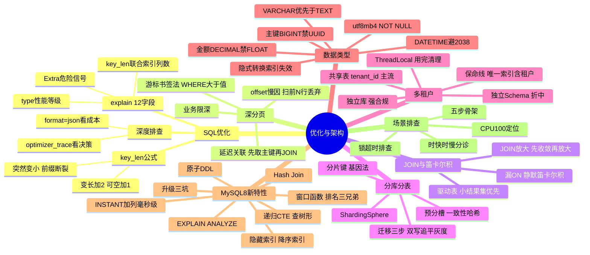

# MySQL 知识脑图

> 全栈 MySQL 面试知识树，覆盖 13 大板块。用 **Mermaid mindmap** 渲染为可交互脑图（支持暗色模式自动切换）。拆成 3 棵子树避免单图过大，下方保留 markmap 文本树作为备选格式。

## 一、存储与索引线

## 二、事务与锁线

## 三、优化与架构线

## 四、markmap 文本树（备选格式）

> 以下嵌套列表可粘贴到 [markmap.js.org/repl](https://markmap.js.org/repl) 渲染为可交互脑图，也可直接当文本树阅读。

### 存储引擎与架构

- 存储引擎与架构
  - InnoDB vs MyISAM
    - InnoDB：聚簇索引、行锁、支持事务、崩溃恢复
    - MyISAM：非聚簇、表锁、无事务、全文索引快
  - Buffer Pool
    - 预读：页为单位（16KB）批量加载
    - 改良 LRU：young 区 + old 区防全表扫描污染
  - WAL（Write-Ahead Logging）
    - 先写 redo log 再写磁盘数据页
    - 顺序写日志 vs 随机写数据 → 崩溃恢复快
  - 三大日志
    - redo log（物理日志 / 持久性 / InnoDB 独有）
      - crash-safe，循环写，checkpoint 推进
    - undo log（逻辑日志 / 原子性 + MVCC）
      - 回滚 + 多版本并发控制
    - binlog（逻辑日志 / Server 层 / 复制）
      - 追加写，Statement/Row/Mixed 三格式
  - 两阶段提交
    - redo log prepare → 写 binlog → redo log commit
    - 保证 redo 与 binlog 一致，主从复制不丢事务

### 索引

- 索引
  - B+ 树（InnoDB 索引底座）
    - 矮胖：3~4 层即可存千万级行数
    - 叶子有序双向链表 → 范围查询 O(叶子数)
    - 三层推导：1170 扇出 × 16 行 ≈ 2190 万行
  - 聚簇索引 vs 二级索引
    - 聚簇：叶子存整行（按主键组织）
    - 二级：叶子存主键值 → 查非索引列要回表
  - 覆盖索引
    - 查询列全在索引中 → 不回表 → `Using index`
  - 最左前缀原则
    - 联合索引 (a,b,c) → 可用 a / a,b / a,b,c
    - 跳过中间列 → 后续列失效
  - 回表
    - 二级索引查到主键 → 回聚簇索引取整行
  - 索引失效场景
    - 函数操作列、隐式类型转换、前导通配符 `%xx`
    - OR 前后非全索引、不满足最左前缀
    - 优化器认为全表扫更快 → 放弃索引

### 事务与隔离

- 事务与隔离
  - ACID
    - 原子性（undo log 回滚）
    - 持久性（redo log 落盘）
    - 隔离性（锁 + MVCC）
    - 一致性（前三者保证）
  - 隔离级别
    - 读未提交（RU）→ 脏读
    - 读已提交（RC）→ 不可重复读
    - 可重复读（RR）← MySQL 默认
    - 串行化（Serializable）→ 加锁
  - MVCC（多版本并发控制）
    - 隐藏字段：trx_id / roll_ptr
    - undo 版本链：roll_ptr 串联历史版本
    - ReadView：活跃事务列表，判断版本可见性
  - RC vs RR
    - RC：每次 SELECT 生成新 ReadView
    - RR：首次 SELECT 生成 ReadView，后续复用
  - 幻读治理
    - RR 下 MVCC 解决快照读幻读
    - Next-Key Lock 解决当前读幻读

### 锁机制

- 锁机制
  - 行锁锁的是索引
    - 无索引 → 退化为表锁
  - 意向锁（IS/IX）
    - 表级标记，IS/IX 之间全兼容
    - 快速判断表级锁冲突
  - MDL（元数据锁）
    - DDL 加排他 MDL → 长事务阻塞 DDL → 雪崩
  - AUTO-INC 锁
    - 自增主键分配，三种模式
  - 插入意向锁
    - 同一 Gap 内不同位置插入不互斥
  - 加锁规则「两原则两优化」
    - 原则 1：基本单位 Next-Key Lock（左开右闭）
    - 原则 2：访问到的对象才加锁
    - 优化 1：唯一索引等值命中 → 退化为 Record Lock
    - 优化 2：非唯一索引向右遍历最后不满足 → 退化为 Gap Lock
  - RC vs RR 加锁差异
    - RC 不加 Gap（除唯一约束/外键）
    - RR 默认加 Next-Key Lock
  - 死锁排查五步
    - show engine innodb status → LATEST DETECTED DEADLOCK
    - innodb_trx 找未提交事务
    - data_locks/waits 找锁等待链
    - kill 源头事务
    - wait-for graph 回滚 undo 量最小的事务
  - 乐观锁 vs 悲观锁
    - 悲观：SELECT ... FOR UPDATE
    - 乐观：version 字段 + CAS
    - 秒杀扣库存用悲观，订单更新用乐观

### SQL 优化与 explain

- SQL 优化与 explain
  - explain 12 字段
    - id：执行顺序（同号上→下、不同号大值先）
    - select_type：查询类型
    - type：性能等级 const > eq_ref > ref > range > index > ALL
    - key / possible_keys：实际用 / 可选索引
    - key_len：联合索引用了几列
    - ref：比较对象
    - rows：估算扫描行数
    - filtered：过滤比例
    - Extra：危险信号
  - key_len 计算公式
    - 单列类型字节数 + 可空 +1 + 变长 +2
    - 突然变小 = 最左前缀断裂
  - Extra 速查
    - Using index（覆盖索引，好事）
    - Using filesort（额外排序，危险）
    - Using temporary（临时表，危险）
    - Using join buffer（被驱动表无索引）
  - 深度排查
    - explain format=json 看成本估算
    - optimizer_trace 看索引选择决策

### 深分页优化

- 深分页
  - offset 慢因
    - 需扫描前 offset 行再丢弃
  - 游标/书签法
    - 记录上一页最后一条排序值，WHERE > 值 LIMIT
    - 多列排序变体
  - 延迟关联
    - 先子查询取主键再 JOIN 取数据
  - 业务限深
    - 只允许翻前 N 页，深层引导改条件
  - ES/分库分表场景
    - 超深分页用 search_after 替代

### JOIN 与笛卡尔积

- JOIN 与笛卡尔积
  - 意外笛卡尔积
    - 漏写 ON 条件 → 静默笛卡尔积 → 行数爆炸
  - CROSS JOIN 正经用途
    - 生成序列表、行列转换
  - JOIN 语义 vs 物理执行
    - 逻辑：笛卡尔积 + 过滤
    - 物理：嵌套循环 / Hash Join
  - JOIN 放大陷阱
    - 分页/COUNT 在一对多 JOIN 之后做 → 被撑爆
    - 解法：先收敛（主表先分页/明细先聚合）再放大
  - 驱动表选择
    - 小结果集表做驱动表
    - 被驱动表 JOIN 列必须有索引

### 分库分表

- 分库分表
  - 拆分时机
    - 单表数据量 > 1000 万 / 单库容量瓶颈
  - 分片键选型
    - 选高频查询字段
    - 基因法：分片因子嵌入其他 ID
  - 预分槽扩容
    - 一致性哈希预留 slot → 扩容只迁移部分
  - 跨片查询/分页
    - 广播表 / 冗余表 / ES 辅助检索
  - 平滑迁移三步
    - 双写 → 全量 + binlog 追平 → 校验灰度切流
  - ShardingSphere
    - JDBC 层代理，透明分库分表

### 多租户设计

- 多租户
  - 三种隔离方案
    - 独立库（强合规 / 成本高）
    - 独立 Schema（折中）
    - 共享表 + tenant_id（主流 / 成本低）
  - ThreadLocal 上下文
    - 请求入口绑定租户 ID
    - 用完必须清理（线程复用串库）
  - MyBatis 拦截器改写
    - 自动注入 tenant_id 条件
  - 保命线
    - 唯一索引含 tenant_id
    - 缓存 key 带租户前缀
    - ThreadLocal 用完清理

### 数据类型选型

- 数据类型
  - 主键：BIGINT 留余量（禁 UUID → 页分裂）
  - 金额：DECIMAL 或 BIGINT 存分（禁 FLOAT 二进制误差）
  - 字符串：能用 VARCHAR 不用 TEXT
  - 时间：DATETIME 默认（TIMESTAMP 2038 溢出）
  - 字符集：统一 utf8mb4（支持 emoji）
  - 约束：所有字段 NOT NULL DEFAULT
  - UUID 代价
    - 36 字节随机值 → B+ 树频繁页分裂
    - 二级索引撑大 4 倍 → 分布式优先雪花 ID
  - 隐式类型转换
    - 字段 varchar + 查询传 int → 索引失效
    - 规则：字符串优先转数字

### MySQL 8.0 新特性

- MySQL 8.0 新特性
  - 窗口函数
    - row_number / rank / dense_rank（排名三兄弟）
    - lag / lead（前后行引用）
    - 不折叠行 → 适合趋势分析
  - 递归 CTE
    - WITH recursive 查树形/层级结构
  - INSTANT ADD COLUMN（8.0.12）
    - 毫秒级加列，不动数据行
  - 原子 DDL
    - DDL 事务化，要么全成功要么全回滚
  - 索引增强
    - 隐藏索引（invisible → drop → 秒级恢复）
    - 降序索引
    - 函数索引
  - Hash Join（8.0.18）
    - 无索引等值 join 的优化
  - EXPLAIN ANALYZE
    - 真实执行统计（实际行数/耗时）
  - 查询缓存移除
    - 8.0 彻底删除（5.7 已标记废弃）
  - 升级三大坑
    - caching_sha2_password 老驱动连不上
    - rank/row/groups 成保留字
    - GROUP BY 不再隐式排序

### 场景排查实战

- 场景排查
  - 排查五步骨架
    - 现象定性 → show processlist → explain → 分诊解决 → 复盘防再犯
  - 索引失效场景
    - 函数操作、隐式转换、前导通配符、OR 不对称
  - 时快时慢分诊
    - 缓存冷热、数据量增长、统计信息过期
  - 批量导入优化
    - 临时关索引/批量插入/LOAD DATA INFILE
  - CPU 100% 定位
    - 慢查询 / 临时表排序 / 全表扫描
  - 锁超时排查
    - innodb_trx + data_locks 看等待链
  - 动态筛选索引设计
    - 多条件组合查询的索引策略
