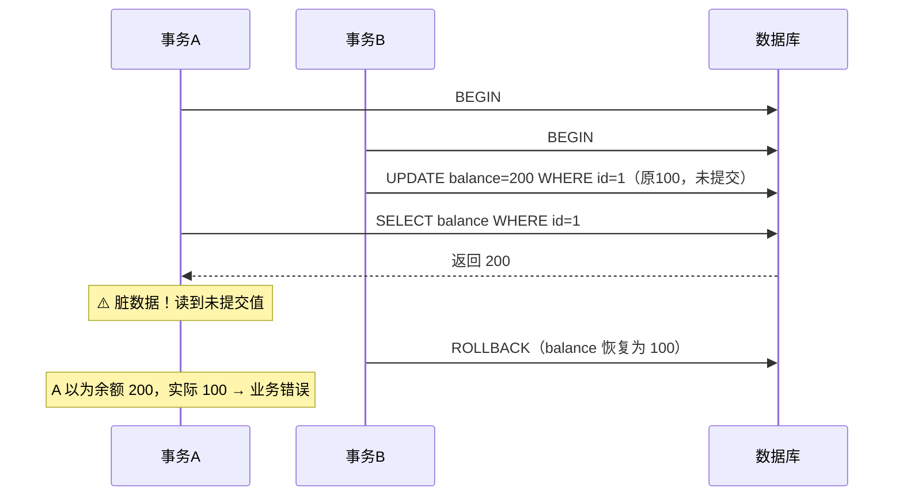
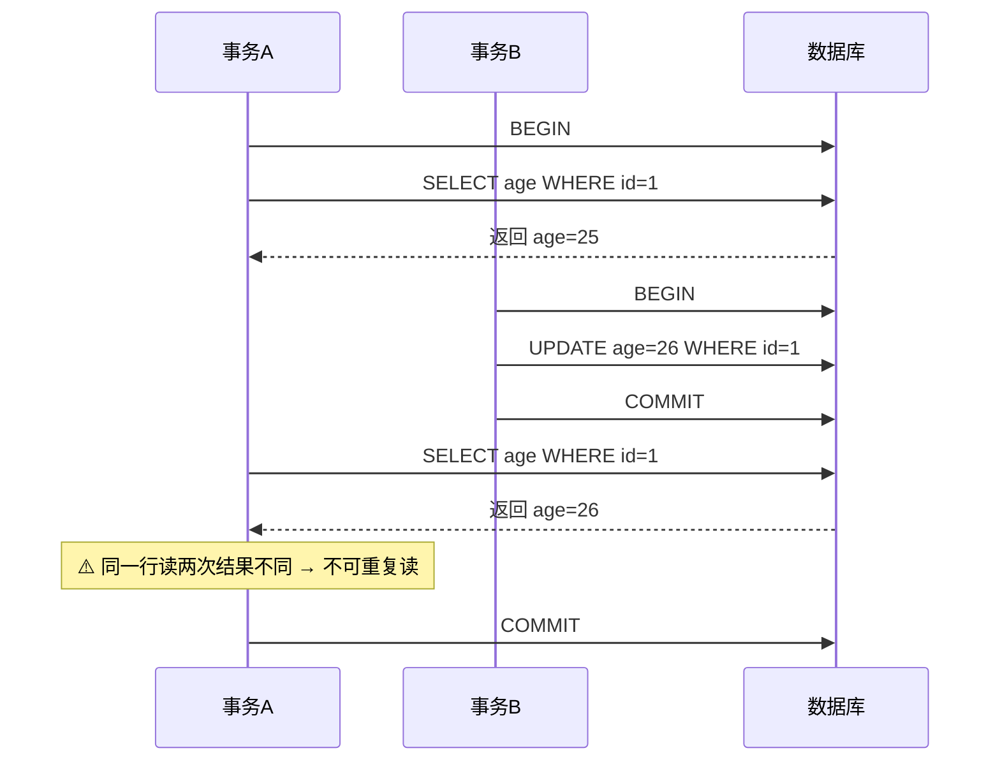
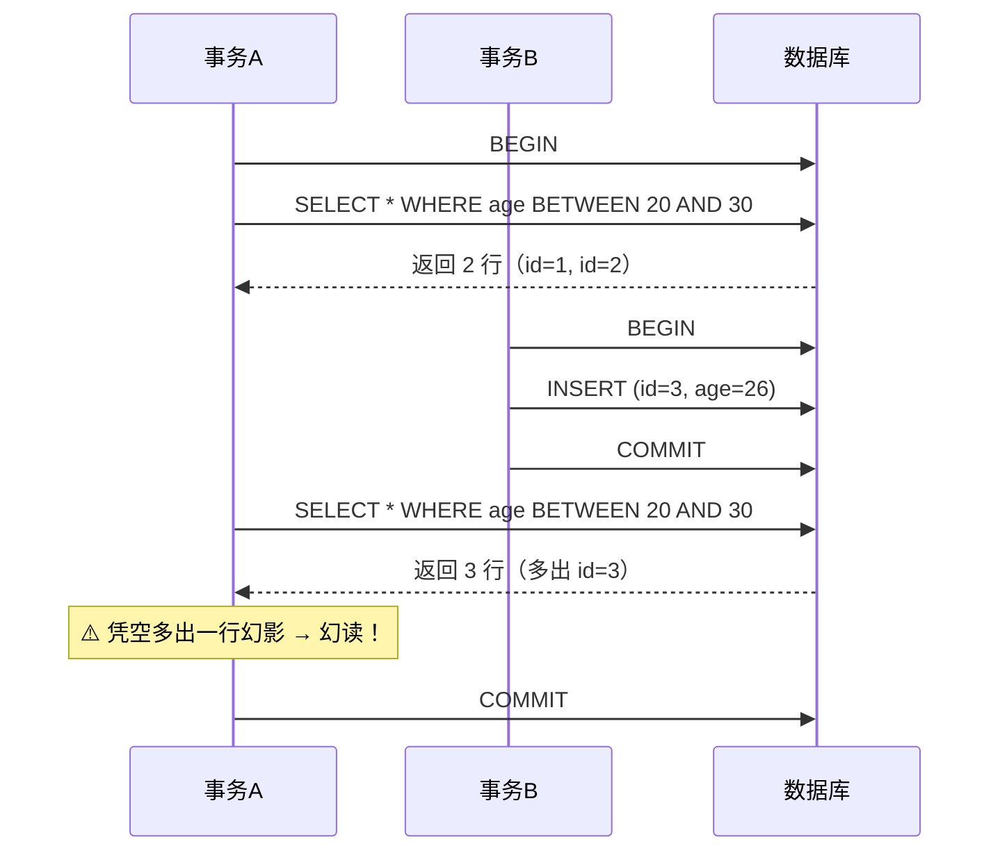

# MySQL 事务与锁面试题

事务是一组要么全做、要么全不做的数据库操作单元。锁是保证并发正确性的手段。这两块是 MySQL 面试最深、最高频的部分。

---

## 一、事务的四大特性 ACID

| 特性 | 含义 | InnoDB 靠什么保证 |
|:---|:---|:---|
| **原子性**（Atomicity） | 事务要么全成功，要么全回滚 | **undo log**（回滚日志） |
| **一致性**（Consistency） | 事务前后数据完整性约束不被破坏 | 由其他三个特性 + 业务共同保证（最终目的） |
| **隔离性**（Isolation） | 并发事务互不干扰 | **锁 + MVCC** |
| **持久性**（Durability） | 提交后数据永久保存，宕机不丢 | **redo log**（重做日志） |

> 记忆：一致性是**目的**，原子性、隔离性、持久性是**手段**。

---

## 二、并发事务带来的三个问题

| 问题 | 含义 | 举例 |
|:---|:---|:---|
| **脏读** | 读到别的事务**未提交**的数据 | A 改了值没提交，B 读到了，随后 A 回滚 |
| **不可重复读** | 同一事务内两次读**同一行**结果不同（因别人 **update**） | A 两次读 age，中间 B 改了并提交 |
| **幻读** | 同一事务内两次**范围查询**行数不同（因别人 **insert/delete**） | A 两次 `count(*)`，中间 B 插了新行 |

> 不可重复读针对**单行的修改**，幻读针对**多行的增删**。

---

## 三、四种隔离级别

| 隔离级别 | 脏读 | 不可重复读 | 幻读 | 说明 |
|:---|:---:|:---:|:---:|:---|
| 读未提交（Read Uncommitted） | ❌ | ❌ | ❌ | 几乎不用 |
| 读已提交（Read Committed, RC） | ✅ | ❌ | ❌ | Oracle 默认 |
| **可重复读（Repeatable Read, RR）** | ✅ | ✅ | ⚠️ | **MySQL 默认**，靠 MVCC+间隙锁基本解决幻读 |
| 串行化（Serializable） | ✅ | ✅ | ✅ | 全加锁，性能最差 |

> ✅ = 解决该问题，❌ = 不解决。

### 三种读问题详解（定义 + 成因 + 举例）

#### 1. 脏读（Dirty Read）

**定义**：一个事务读到了另一个事务**尚未提交**的数据。如果对方随后回滚，你读到的就是从未真实存在过的数据。

**形成原因**：并发事务下读操作没有对未提交的数据做可见性隔离，允许读到对方事务修改后的最新值（不管有没有提交）。

**举例**（隔离级别：RU）：



#### 2. 不可重复读（Non-Repeatable Read）

**定义**：同一事务内，两次读取**同一行**数据，结果不同——因为中间有别的事务对该行做了 **UPDATE/DELETE 并提交**。

**形成原因**：读操作没有锁住读过的行（读锁未保持到事务结束），或每次读都能看到别人已提交的最新版本，导致同一行在事务内被「改写」。

**举例**（隔离级别：RC）：



> **脏读 vs 不可重复读**：脏读读的是**未提交**数据（对方可能回滚）；不可重复读读的是**已提交**数据（对方已确认修改）。前者更严重。

#### 3. 幻读（Phantom Read）

**定义**：同一事务内，两次执行**相同条件的范围查询**，返回的行数不同——因为中间有别的事务 **INSERT/DELETE 并提交**，导致「凭空多出/少了几行幻影」。

**形成原因**：幻读的成因分两种场景，不能一概而论——

| 读类型 | 幻读成因 | 出现级别 |
|:---|:---|:---|
| **快照读**（普通 SELECT） | ReadView 重新生成，能看到别人新提交的行 | RC（每次 SELECT 都生成新快照） |
| **当前读**（SELECT FOR UPDATE / UPDATE / DELETE） | 只加记录锁不加间隙锁，别人能往范围里插入新行 | RC（无间隙锁） |
| **RR 快照读 + 当前读混用** | 快照读读旧快照（看不到新行），当前读读最新版本（能看到新行）→ 两次结果不一致 | RR（唯一可能出现幻读的场景） |

> ⚠️ **RR 级别纯快照读不会幻读**：整个事务复用同一个 ReadView，永远看不到别人新插入的行。RR 的幻读只在「快照读 + 当前读混用」时才可能出现。

**举例**（隔离级别：RC，快照读场景——每次 SELECT 都生成新 ReadView）：



> **不可重复读 vs 幻读**：不可重复读针对**同一行的修改**（行数不变，内容变）；幻读针对**范围内行数的增减**（行内容可能没变，但多了/少了几行）。两者都是「同一查询两次结果不同」，但成因和锁的粒度不同。

### 四种隔离级别的实现方式

隔离级别的实现本质是**控制「快照读」与「当前读」的可见性与加锁策略**：MVCC（多版本并发控制）服务快照读，行锁/间隙锁服务当前读，不同级别组合不同。

| 隔离级别 | 快照读（普通 select） | 当前读（select for update/update/delete） | 核心机制 |
|:---|:---|:---|:---|
| **读未提交 RU** | 直接读最新版本，**不生成 ReadView**，能看见未提交数据 | 加行级 X 锁 | 无可见性判断，靠 X 锁互斥防写冲突 |
| **读已提交 RC** | MVCC + **每次 SELECT 生成新 ReadView**，只看已提交版本 | 加行级记录锁（无间隙锁） | ReadView 过滤未提交事务，每次读都拍新快照 |
| **可重复读 RR** | MVCC + **事务首次 SELECT 生成 ReadView 并复用到底** | Next-Key Lock（记录锁 + 间隙锁） | 快照稳定 + 间隙锁防幻读，MySQL 默认 |
| **串行化 Serializable** | 读隐式加共享锁（读升级为当前读） | Next-Key Lock | 所有读加锁，事务完全串行 |

**各级别关键说明**：

- **RU**：只读最新版本（`DB_TRX_ID` 最新的记录），不做 ReadView 可见性判断，所以能读到别人未提交的脏数据；写仍加 X 锁保证不丢更新。
- **RC**：每次普通 SELECT 都生成新 ReadView，过滤掉 `m_ids` 里未提交的事务，所以只能看到已提交数据；但每次读都拍新快照 → 别人提交后下次读就变 → 不可重复读。Oracle 默认。
- **RR**：ReadView 只在事务**第一次**快照读时生成，之后整个事务复用，所以能重复读；当前读用 Next-Key Lock 锁住记录 + 间隙，防止别人 insert 造成幻读。这是 MySQL 区别于标准 SQL 的地方（标准 RR 不解决幻读）。
- **Serializable**：普通 SELECT 自动升级为 `LOCK IN SHARE MODE`（加共享锁），读和读兼容、读和写互斥，所有事务串行执行，完全避免并发问题但性能最差。

> ReadView 的可见性判断（`min_trx_id`/`max_trx_id`/`m_ids` 规则）和版本链细节见下方第四章 MVCC 章节。

> **重点**：MySQL 默认 RR 级别，通过 **MVCC（快照读）+ Next-Key Lock（当前读）** 在很大程度上解决了幻读，这是它和标准 SQL 定义不同的地方。

```sql
select @@transaction_isolation;         -- 查看当前隔离级别
set session transaction isolation level read committed;  -- 设置
```

---

## 四、MVCC（多版本并发控制）—— 核心考点

MVCC 让**读不加锁、读写不阻塞**，通过为数据保存多个版本来实现快照读。它依赖三样东西：

### 1. 三个隐藏字段

| 字段 | 作用 |
|:---|:---|
| `DB_TRX_ID` | 最近一次修改该行的事务 ID |
| `DB_ROLL_PTR` | 回滚指针，指向 undo log 里的旧版本，串成**版本链** |
| `DB_ROW_ID` | 无主键时的隐藏行 ID |

### 2. undo log 版本链

每次修改都把旧值存进 undo log，用 `DB_ROLL_PTR` 串成一条链，从新到旧。

### 3. ReadView（读视图）

快照读时生成，决定版本链上哪个版本对当前事务可见。关键字段：

- `m_ids`：生成 ReadView 时**活跃（未提交）**的事务 ID 列表
- `min_trx_id` / `max_trx_id`：活跃事务的最小 ID / 下一个将分配的 ID
- `creator_trx_id`：当前事务 ID

**可见性判断**（对版本链上某行的 `trx_id`）：
- `trx_id < min_trx_id` → 已提交，**可见**
- `trx_id >= max_trx_id` → 之后才开启的事务，**不可见**
- 在 `[min, max)` 之间：若在 `m_ids` 里 → 未提交，不可见；否则已提交，可见

### RC 和 RR 的关键区别就在生成 ReadView 的时机

| 隔离级别 | ReadView 生成时机 | 结果 |
|:---|:---|:---|
| **RC** | **每次 select** 都生成新的 | 能读到别人已提交的最新数据 → 不可重复读 |
| **RR** | **第一次 select** 时生成，之后复用 | 整个事务看到的是同一快照 → 可重复读 |

> 一句话：**RC 每次读都拍新照片，RR 只在第一次读时拍一张照片用到底。**

---

## 五、快照读 vs 当前读

| 类型 | 含义 | 语句 |
|:---|:---|:---|
| **快照读** | 读历史版本，不加锁，走 MVCC | 普通 `select` |
| **当前读** | 读最新版本，加锁 | `select ... for update` / `lock in share mode`、`update`、`delete`、`insert` |

> 幻读在 RR 下的兜底：**快照读**靠 MVCC 避免幻读，**当前读**靠 **Next-Key Lock**（间隙锁）避免幻读。

---

## 六、锁的分类

### 1. 按粒度

| 锁 | 粒度 | 特点 | 引擎 |
|:---|:---|:---|:---|
| 表锁 | 整张表 | 开销小、并发低 | MyISAM、InnoDB 都有 |
| 行锁 | 单行 | 开销大、并发高 | **仅 InnoDB** |
| 页锁 | 一页 | 折中 | BDB |

> InnoDB 行锁是**加在索引上**的，如果查询没走索引，会退化成**表锁**（锁全部行）。

### 2. 按兼容性（共享 / 排他）

| 锁 | 别名 | 兼容 |
|:---|:---|:---|
| 共享锁 S | 读锁 | S 与 S 兼容，S 与 X 互斥 |
| 排他锁 X | 写锁 | X 与任何锁都互斥 |

### 3. InnoDB 行锁的三种形态（RR 级别）

| 锁 | 锁住的范围 | 作用 |
|:---|:---|:---|
| **记录锁**（Record Lock） | 单条索引记录 | 锁住命中的行 |
| **间隙锁**（Gap Lock） | 索引记录之间的**间隙**（开区间） | 防止别人往间隙里 insert → 防幻读 |
| **临键锁**（Next-Key Lock） | 记录锁 + 间隙锁 = **左开右闭区间** | RR 默认加锁方式，防幻读的核心 |

```sql
-- 假设 id 有索引，表中有 id=5,10,15
select * from t where id > 8 and id < 12 for update;
-- RR 下会加 next-key lock，锁住 (5,10]、(10,15) 等间隙
-- 别人无法 insert id=9,11 → 避免幻读
```

---

## 七、死锁

**死锁**：两个及以上事务互相持有对方需要的锁，形成循环等待。

```
事务A: 锁住行1，等待行2
事务B: 锁住行2，等待行1   → 互相等待，死锁
```

**InnoDB 的处理**：自动检测死锁，回滚**代价较小**（持有锁少）的那个事务，另一个继续执行。

**如何避免死锁**：

| 方法 | 说明 |
|:---|:---|
| 固定加锁顺序 | 所有事务按相同顺序访问资源（如都按 id 升序） |
| 减小事务粒度 | 事务尽量短小，及早释放锁 |
| 一次锁定所需资源 | 避免持有锁再去申请新锁 |
| 降低隔离级别 | RR → RC 可减少间隙锁 |
| 加合适索引 | 避免行锁升级为表锁 |

```sql
show engine innodb status;   -- 查看最近一次死锁详情
select * from information_schema.innodb_trx;  -- 查看当前运行的事务
```

---

## 八、易错点

| 易错点 | 说明 |
|:---|:---|
| **认为 RR 完全解决幻读** | 快照读 + 当前读混用仍可能出现幻读，严格解决要 Serializable |
| **以为行锁锁的是数据行** | InnoDB 行锁锁的是**索引**，无索引会退化为表锁 |
| **MVCC 对当前读也生效** | MVCC 只服务快照读；当前读靠加锁 |
| **一致性是靠某一个日志保证的** | 一致性是最终目的，由 AID 三者共同达成 |
| **redo / undo 记反** | undo 保原子性（回滚）、redo 保持久性（重做） |

---

## 九、一句话总结

事务用 **ACID** 保证正确性：undo log 保原子、redo log 保持久、锁 + MVCC 保隔离。MySQL 默认 **RR** 级别，用 **MVCC（快照读）+ Next-Key Lock（当前读）** 基本解决幻读。理解 **ReadView 生成时机**（RC 每次读 / RR 首次读）和 **间隙锁**，是这块面试的分水岭。

---

## 十、相关笔记

| 主题 | 笔记 |
|:---|:---|
| 索引（行锁基于索引） | [索引.md](4.%20索引.md) |
| redo/undo/binlog 日志 | [存储引擎与架构.md](3.%20存储引擎与架构.md) |
| 锁对 SQL 性能的影响 | [SQL优化与调优.md](8.%20SQL优化与调优.md) |
| SQL 执行底层全链路（事务/锁在全链路位置） | [15. SQL执行底层全链路.md](15.%20SQL执行底层全链路.md) |
