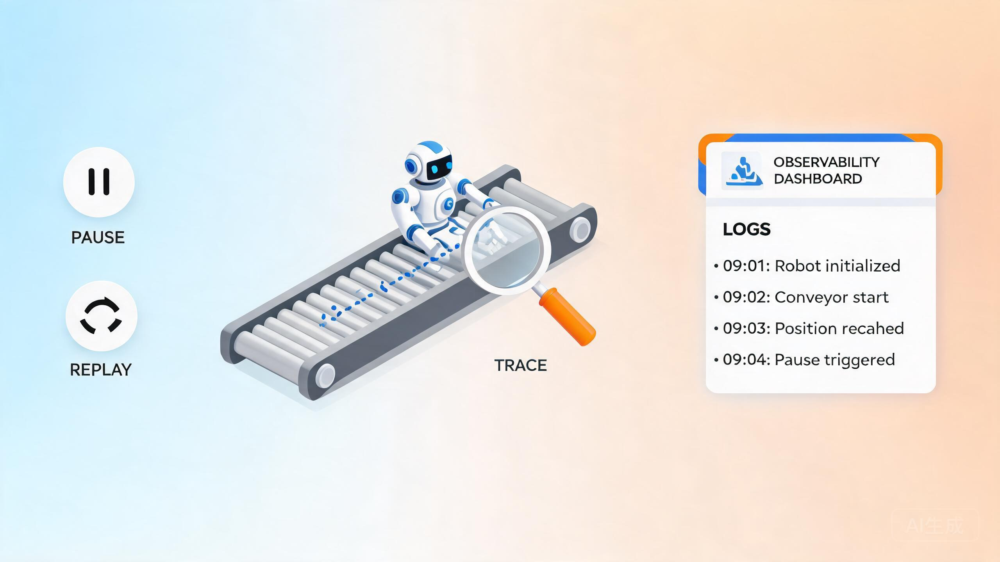

# AI Agent 设计哲学:可中断、可观测、可回放——生产级 Agent 的另一半工程

> 探小虎 · 技术分享

这是 Agent 设计里最容易被新手忽略、却最能区分「玩具」和「产品」的一条原则。

前面聊的都是怎么让 Agent 变强——记忆、工具、分解。但 Agent 是一个**长时间自主运行的循环**,一旦跑起来,立刻面临三个现实问题:它跑偏了我想喊停、它到底在干嘛为什么这么决策、它崩了能不能从断点续跑。这三个问题不解决,Agent 就只是个 Demo,上不了生产。



---

## 一、为什么这是「最被忽略却最关键」的原则

新手做 Agent,热情全花在「让循环跑起来」——记忆挂上、工具接上,能跑通就欣喜若狂。等到上生产,才会撞上这三堵墙:

| 问题 | 现实场景 |
|:---|:---|
| 跑偏了想喊停 | Agent 删错了文件还在继续删,你只能干瞪眼等它跑完 |
| 不知道它在干嘛 | 排障时只能翻海量原始日志,反推它在哪步「想歪了」 |
| 崩了能不能续 | 一次跑了 20 分钟崩在 18 分钟,从头再来一遍 |

**这三个能力不增加 Agent 的「聪明」,但决定了它能不能真正上生产。** 业界有个说法:生产级 Agent 的一半工程量,都花在「让这个黑盒变得透明、可控、可救」上。

---

## 二、可中断(interruption):跑偏了能喊停

Agent 一旦进入自主循环,你不能假设它「一定会跑对」。它可能死循环、可能调错工具、可能在错的路径上越走越远。**等它跑完再处理,代价可能是不可逆的。**

可中断要解决两件事:

**1)能随时安全打断。** 不能靠 `kill -9` 强杀——强杀可能留下半截文件、未提交的事务、不一致的状态。好的中断是**在安全点暂停**:当前这一步工具执行完,下一步还没开始,把状态存下来。

**2)打断后状态不丢。** 中断不是终止,是为了调整后继续。状态必须落盘,下次能从断点接着跑,而不是从头再来。

```
Agent 循环: 思考→调工具→观察→思考→调工具→观察...
                       ↑
              [用户/超时触发中断]
                       ↓
              等当前工具执行完(安全点)
                       ↓
              保存 state → 暂停
                       ↓
              用户调整后:从断点续跑 / 丢弃重来
```

> 设计哲学:**中断不是「杀死进程」,是「在安全点冻结状态」。能停得下来,才敢让它跑起来。**

---

## 三、可观测(tracing / hook):知道它在干嘛

一个黑盒 Agent 最可怕——它出问题时,你连「它在哪一步出的问题」都不知道,只能像考古一样翻原始日志。

可观测靠两件事:

**1)全链路埋点(tracing)。** 每一步决策都记下来:思考了什么、调了什么工具、传了什么参数、拿到什么结果。把它当成 Agent 的「行车记录仪」。

**2)hook 机制。** 在关键节点埋钩子(工具调用前、调用后、循环结束),既能记录,也能介入——比如工具调用前 hook 拦截危险操作。

```
[think] 用户要删 /data,我调用 rm 工具
[pre-hook] 工具:rm,参数:/data → 判定高危 → 弹确认
[hook-return] 用户拒绝 → 喂回「用户拒绝」
[think] 用户拒绝了,我换方案:列文件让用户选
[tool-call] ls /data → 结果:[a, b, c]
...
```

排障时,顺着这条链一路看下去,**哪一步「想歪了」一目了然**。没有这套,Agent 出问题就只能「重启大法」。

> 设计哲学:**透明胜过聪明。一个可观察、能回放的 Agent,远比一个更聪明但完全黑盒的 Agent 有价值。**

---

## 四、可回放(state):崩了能续

Agent 跑久了,崩是常态——网络抖了、工具超时、模型限流、机器重启。**崩了能续,才是生产级的基本要求。**

可回放要靠**状态持久化**:

- **每一步状态落盘。** 当前在第几轮、上一步的观察是什么、已调了哪些工具、任务进展到哪。崩了之后能从最后的安全点恢复。
- **状态可回放。** 不只是「续跑」,还能「重放」——把某次出问题的运行按原状态重新跑一遍,用来复现 bug。这对调试无价。

```
运行中每一步:
  state_v1 → state_v2 → state_v3 → 崩在这
                                       ↓
                            从 state_v3 续跑
                            或:用 state_v1~v3 重放复现 bug
```

很多人做 Agent 不存 state,崩了就从头跑,结果一个本该 5 分钟的任务,每次崩都要重来 5 分钟。**state 持久化的成本,换来的是「不返工」的收益。**

---

## 五、三者怎么串起来:一次真实运行

把三个能力串起来,一次生产级 Agent 运行大概长这样:

```
用户启动任务
    ↓
[循环] 思考 → 调工具(经 hook 校验) → 观察 → 落 state
   ↑      ↓全程 tracing 记录
   │   [超时/用户中断触发] → 安全点暂停 → state 落盘
   │      ↓
   │   [崩溃] → 从最近 state 恢复续跑
   │      ↓
   └── 续跑(状态不丢,tracing 不断)
    ↓
  目标达成 → 输出;全程 tracing 可回放排障
```

你会发现,**tracing 贯穿始终,interruption 和 state 都建立在「能安全暂停且不丢状态」之上**。三者不是三个独立功能,而是一套「可控性」工程的不同侧面。

---

## 六、常见踩坑

| 坑 | 后果 | 解法 |
|:---|:---|:---|
| **只存最终结果** | 崩了不知道崩在哪,无法续跑 | 每一步 state 落盘 |
| **tracing 太碎** | 日志爆炸,排障时找不到关键 | 关键节点埋点,工具调用前后必记 |
| **强杀循环** | 留下不一致状态(半删的文件) | 在安全点暂停,等当前步执行完 |
| **没有 hook 介入点** | 危险操作拦不住,只能事后追责 | 工具调用前 hook 校验权限 |
| **state 不版本化** | 多次崩溃后不知道哪个是干净的 | state 带版本号,支持回滚 |

---

## 七、写在最后:三条底层信念

1. **能停得下来,才敢跑起来。** 可中断不是可选项,是 Agent 上生产的及格线。
2. **透明胜过聪明。** 全链路 tracing + hook,让黑盒变透明,出问题能定位。
3. **崩了能续,才是生产级。** state 持久化 + 可回放,把「重来成本」从分钟级降到秒级。

Agent 的强大来自自主循环,但**自主循环的代价是失控风险**。可中断、可观测、可回放,就是用来对冲这个风险的工程纪律。没有它,Agent 越强,你越不敢用。

---

> 如果这篇文章对你有启发,欢迎关注公众号「**探小虎**」,我会持续分享 AI Agent、后端架构与算法方面的技术思考。
>
> 相关阅读:《AI Agent 设计哲学:从「会聊天的模型」到「会做事的系统」》《AI Agent 设计哲学:工具调用与 MCP》。
