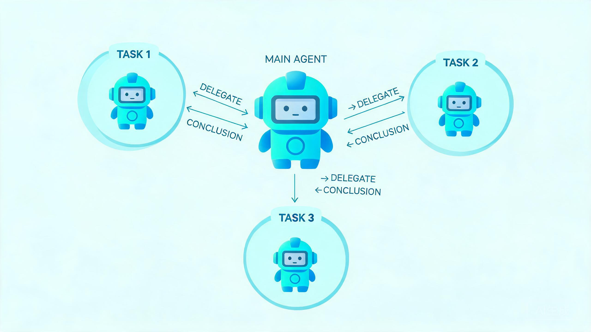

# AI Agent 设计哲学:多 Agent 协作——主 Agent、子 Agent 与技能的分工

> 探小虎 · 技术分享

任务简单时,一个 Agent 从头干到尾就行。但任务一旦复杂——要搜十个文件、要分析又要测试、要跨多个领域——单个 Agent 就扛不住了。不是它不够聪明,而是**它的上下文和注意力都是有限的资源**。

这时哲学不是「造一个更大的 prompt 让它全能」,而是**分解**:派子 Agent 分担,把标准打法沉淀成技能复用。本文聊两种典型分解方式,以及「什么时候该拆、什么时候该合」。



---

## 一、为什么单个 Agent 扛不住复杂任务

把所有事都交给一个 Agent,看着省事,实际上有三个隐性代价:

| 问题 | 表现 |
|:---|:---|
| **上下文爆炸** | 子任务的中间垃圾全堆在主上下文,真正该聚焦的被淹没 |
| **注意力稀释** | 模型在「搜文件」和「写代码」之间来回切换,每件都做不精 |
| **不可复用** | 同一类子任务每次都让模型从零现想,重复烧 token |

> 一句话概括:**单个 Agent 的上下文是稀缺资源。与其造一个无所不能的巨型 Agent,不如让它学会「委派」和「复用套路」——这和人类团队协作、沉淀方法论,是同一个智慧。**

---

## 二、分解方式一:子代理(Subagent)

主 Agent 把一个**独立子任务**派给一个专门的子 Agent,子 Agent 在**自己的独立上下文**里干完,**只回报结论**,不把一路的中间垃圾塞回主上下文。

```
              主 Agent(规划全局)
             /        |         \
      子Agent:搜索   子Agent:分析   子Agent:测试
         (各自独立上下文,只回报结论)
```

两个收益:

1. **省主上下文。** 子任务可能调了 10 次工具、产生了 50 条中间结果,这些都不进主 Agent 的窗口,主 Agent 只拿到「结论」一句。
2. **主注意力聚焦。** 主 Agent 不被低层细节打断,只管「派给谁、用谁的结论干什么」。

**关键约束:子任务的边界要清晰。** 如果子 Agent 干着干着发现「这事做不了,得让主 Agent 补信息」,频繁回流,子代理就退化成了多个互相打断的 Agent,反而更乱。

> 设计哲学:**子代理的价值在「上下文隔离 + 结论汇报」。子任务必须能独立闭环,否则不配当子代理。**

---

## 三、分解方式二:技能(Skill)

子代理解决「同时干多件事」,技能解决「同一类事反复干」。

把**某类任务的标准打法**——步骤、工具组合、检查清单、输出格式——封装成一个可复用的指令包,遇到匹配的任务直接加载这套打法,而不是每次让模型从零现想。

| 维度 | 子代理 | 技能 |
|:---|:---|:---|
| 解决问题 | 并行多任务 | 复用同类打法 |
| 形态 | 独立运行的 Agent | 可加载的指令包 |
| 类比 | 团队里不同角色的人 | 团队沉淀的 SOP/方法论 |
| 适用 | 子任务能独立闭环 | 某类任务有标准套路 |

技能的本质是**把人类团队的「方法论沉淀」搬进 Agent**——遇到「写周报」就加载周报技能(查数据→统计→套模板→推送),不用每次重新教模型。

> 设计哲学:**技能让 Agent 不必每次从零思考。好的技能集合,本身就是一份「这个团队怎么干活」的说明书。**

---

## 四、什么时候该拆、什么时候该合

分解不是越多越好。**拆是有代价的**:子代理之间有通信成本,协调有开销,拆错了反而让简单任务变复杂。

| 场景 | 该拆还是该合 | 理由 |
|:---|:---|:---|
| 子任务能独立闭环,且产出大量中间垃圾 | **拆**(子代理) | 隔离上下文,省主窗口 |
| 同一类任务反复出现,有标准打法 | **合**(技能) | 沉淀复用,别每次现想 |
| 子任务强依赖主任务的实时信息 | **合**(留主 Agent) | 频繁回流,拆了更乱 |
| 任务只有 2~3 步 | **合**(单 Agent) | 拆的协调开销大于收益 |

**判断标准只有一句话:拆的收益(上下文隔离/复用)是否大于拆的代价(通信/协调)。** 收益大于代价才拆,否则合。

---

## 五、常见踩坑

| 坑 | 后果 | 解法 |
|:---|:---|:---|
| **子代理边界模糊** | 干着干着回流,退化成互相打断 | 子任务必须能独立闭环 |
| **子代理回报太啰嗦** | 把中间过程也塞回主上下文 | 强制只回报结论 |
| **技能写太死** | 一点变化就用不了 | 技能给框架不给死步骤,留灵活度 |
| **过度拆分** | 10 个子 Agent 互相协调,比单 Agent 还乱 | 控制拆分层数,一般不超过 2 层 |
| **技能不复用** | 写一次就丢,下次又从零想 | 把高频任务都沉淀成技能,持续维护 |

---

## 六、写在最后:三条底层信念

1. **上下文和注意力是稀缺资源。** 与其造巨型 Agent,不如让它学会委派和复用。
2. **子代理解决并行,技能解决复用。** 前者是「不同人干不同事」,后者是「同类事有标准打法」。
3. **拆的收益必须大于代价。** 收益(隔离/复用)大于代价(通信/协调)才拆,否则合。

人类团队高效,靠的不是每个人无所不能,而是分工和沉淀方法论。Agent 也一样——**让每个 Agent 在自己擅长的隔间里做事,让套路能被反复使用**。

---

> 如果这篇文章对你有启发,欢迎关注公众号「**探小虎**」,我会持续分享 AI Agent、后端架构与算法方面的技术思考。
>
> 相关阅读:《AI Agent 设计哲学:从「会聊天的模型」到「会做事的系统」》《AI Agent 设计哲学:可中断、可观测、可回放》。
