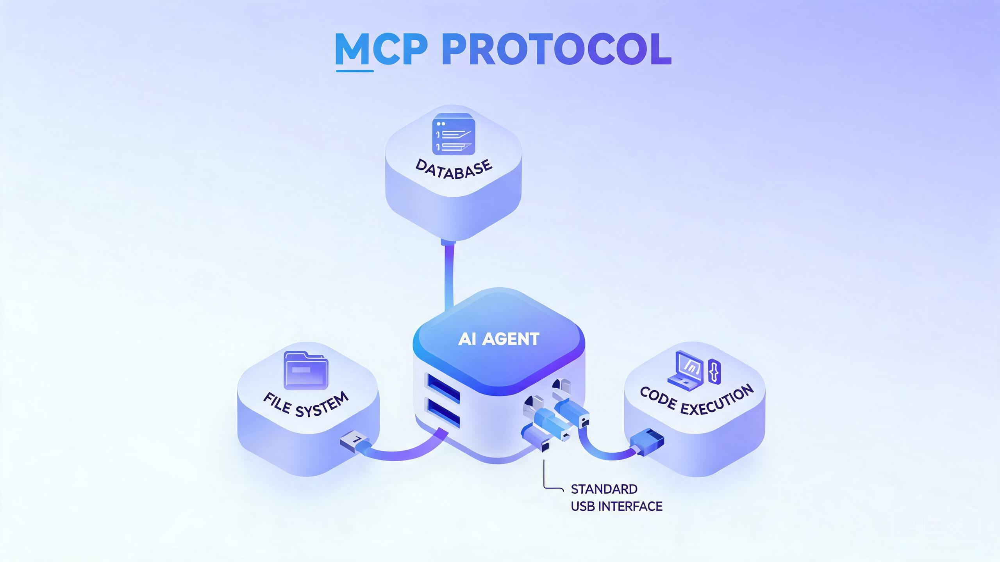

# AI Agent 设计哲学:工具调用与 MCP,让模型长出手脚的同时给它分寸

> 探小虎 · 技术分享

模型只会输出文本,碰不到真实世界。一个只会说话的模型,再聪明也只能是「嘴强王者」。让 Agent 从「能聊」变成「能干」的,是工具调用——模型说一句「我要调用 `search(query)`」,框架真的去执行,把结果喂回去。

但工具一旦能碰真实世界(删文件、发消息、花钱调 API),**风险也随之而来**。本文聊工具调用的机制、MCP 协议、以及「能力与授权必须分离」的分寸哲学。



---

## 一、为什么模型必须长出「手脚」

模型天生有三个「碰不到」:

| 短板 | 表现 | 工具补法 |
|:---|:---|:---|
| **碰不到实时** | 训练数据有截止日期,不知道「现在」 | 搜索/查询工具 |
| **碰不到外部系统** | 不会真的查数据库、发邮件 | API 调用工具 |
| **算不准精确数** | 心算容易 off-by-one、跨月错误 | 计算器/代码执行工具 |

没有工具,模型只能凭训练时的记忆「猜答案」,幻觉就这么来的。**工具的本质不是「让模型更聪明」,而是「让模型不用猜」——把它不确定的事,变成一次确定的外部调用。**

---

## 二、工具调用的基本机制

工具调用的循环很简单,但有一个关键点容易被忽略:**执行的不是模型,是框架**。

```
用户:「今天北京天气怎么样?」
        ↓
   模型思考:需要实时数据 → 输出结构化调用
        ↓
   模型输出: { "tool": "get_weather", "args": {"city": "北京"} }
        ↓
   框架(非模型)执行 get_weather("北京")   ← 这一步是确定性代码
        ↓
   结果喂回模型:「北京 28℃ 晴」
        ↓
   模型基于结果生成自然语言回复
```

这里有个**职责分工**的原则:模型只决定「调什么、传什么参数」,框架负责「怎么调、能不能调、调完怎么处理」。模型不接触真实世界,框架是唯一的执行者。这个分工是后面所有权限设计的基础。

> 一句话概括:**模型是「决策者」,框架是「执行者」。决策可以模糊,执行必须确定。**

---

## 三、MCP:工具的「USB 协议」

工具一多,问题就来了:每个工具都写一套胶水代码(参数校验、错误处理、结果格式化),N 个工具 N 套写法,接入成本爆炸。

**MCP(Model Context Protocol)** 解决的就是这件事——它把「工具」抽象成一个标准接口,Agent 可以像插 U 盘一样接入任意工具:

```
        ┌──────────────┐
        │   Agent      │
        │  (任意模型)   │
        └──────┬───────┘
               │  统一协议(MCP)
   ┌───────────┼───────────┐
   ▼           ▼           ▼
 文件系统    数据库      代码执行
 (MCP服务)  (MCP服务)   (MCP服务)
```

**function calling vs MCP,别搞混:**

| 维度 | function calling | MCP |
|:---|:---|:---|
| 是什么 | 模型的能力(输出结构化调用) | 工具的接入协议(标准化接口) |
| 谁定义 | 模型厂商 | Anthropic 主导的开放协议 |
| 解决问题 | 模型怎么「说」要调工具 | 工具怎么「被」接入 Agent |
| 关系 | MCP 工具最终也通过 function calling 被模型调用 | |

打个比方:function calling 是「嘴会说我要喝水」,MCP 是「所有水杯都用统一口径的接口,任何饮水机都能接」。**两者互补,不互斥。**

---

## 四、工具是手脚,边界是分寸

工具让 Agent 能碰真实世界,这是它强大的来源,也是它危险的来源。一个能 `rm -rf` 的 Agent,如果没有边界,就是一颗定时炸弹。

所以工具设计有两条**并行**的哲学:

**1)标准化接入 —— 让工具可插拔。** 用 MCP 之类的统一协议,工具像 U 盘即插即用。

**2)权限与确认 —— 让工具有边界。** 危险操作必须有闸门,模型说「调」不代表框架「就调」。

```
模型想执行: rm -rf /data
        ↓
   权限系统拦截 → 判定:高危
        ↓
   要么弹人工确认,要么直接拒绝
        ↓
   拒绝时把「为什么拒绝」喂回模型,让它换方案
```

> 设计哲学:**给 Agent 手脚的同时,必须给它分寸。能力(工具)和授权(权限)必须分开设计——工具提供「能做什么」,权限系统决定「此刻能不能做」。**

---

## 五、权限模型的三道闸门

一个好的权限系统,至少分三层:

| 层 | 内容 | 例子 |
|:---|:---|:---|
| **分级** | 工具按危险程度分级 | 读(低) / 写(中) / 不可逆(高) |
| **确认** | 危险操作需人工放行 | 删库、花钱、发外部消息 → 弹确认 |
| **沙箱** | 即便放行也限范围 | 限额、限目录、限网络,炸了也不波及真实环境 |

很多人只做第一层(分级),不做确认和沙箱,结果高危操作一旦模型「想错了」,直接酿成事故。**三道闸门层层兜底,才敢让 Agent 上生产。**

---

## 六、工具设计的常见踩坑

| 坑 | 后果 | 解法 |
|:---|:---|:---|
| **工具描述写太糊** | 模型不知道何时该用、怎么传参 | 工具描述当 API 文档写,给参数示例和边界 |
| **工具粒度太粗** | 一个工具干太多事,模型用不准 | 拆成单一职责的小工具,组合优于万能 |
| **结果塞太多** | 工具返回 10K 行,又回到上下文爆炸 | 工具内做摘要/分页,只返回相关片段 |
| **没有失败反馈** | 工具报错模型不知道,继续瞎调 | 错误信息结构化喂回,让模型能换方案 |
| **权限一刀切** | 全放开(危险)或全禁止(没法用) | 按工具分级 + 动态确认 |

---

## 七、写在最后:三条底层信念

1. **工具是补模型短板的脚手架。** 不是让模型变聪明,而是让它不用猜——把不确定的事变成确定的外部调用。
2. **能力越大,边界越重要。** 给手脚的同时给分寸,工具提供能力,权限决定能不能用,两者必须分离。
3. **工具设计是接口设计。** 描述清晰、粒度单一、结果克制、失败可回——好的工具集合,本身就是一份给模型看的 API 文档。

一个能删库的 Agent 不可怕,可怕的是它删库时没有任何闸门拦着。

---

> 如果这篇文章对你有启发,欢迎关注公众号「**探小虎**」,我会持续分享 AI Agent、后端架构与算法方面的技术思考。
>
> 相关阅读:《AI Agent 设计哲学:从「会聊天的模型」到「会做事的系统」》《AI Agent 设计哲学:记忆的三层架构》。
