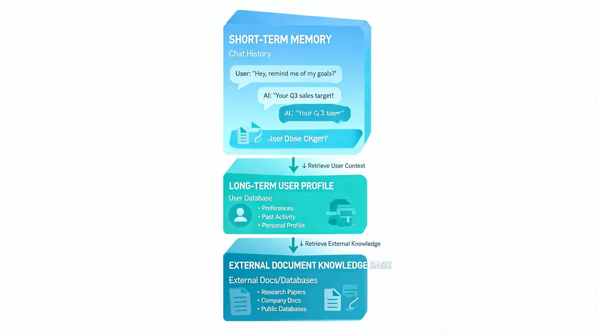

# AI Agent 设计哲学:记忆的三层架构,以及「什么时候记、什么时候忘」

> 探小虎 · 技术分享

几乎所有 Agent 新手都会踩同一个坑——把「记忆」理解成「把历史对话一股脑塞进上下文,塞到模型报错为止」。上下文满了就截断最前面几条,再不行就清空重来。

这套做法在 Demo 阶段看着没问题,一上生产立刻翻车:模型该记的没记住,不该记的塞了一堆,token 烧了几十倍,效果还不如不记。本文想聊一个被严重低估的话题:**Agent 的记忆不是「记住一切」,而是分层的、有策略的、有时机的。**



---

## 一、先破除一个误解:记忆 ≠ 把历史塞进上下文

新手对「记忆」的默认想象,就是把聊天记录原样拼进下一次 prompt。这背后其实藏着一个错误的等式:

```
记忆 = 上下文里的历史对话
```

这个等式会逼着你做出三种必然翻车的动作:

| 错误做法 | 直观后果 |
|:---|:---|
| **全量塞入** | 窗口很快爆满,新输入被挤掉,模型反而「最近失忆」 |
| **粗暴截断** | 砍掉最早 N 轮,关键约定被砍掉,模型开始重复犯老错 |
| **无差别保留** | 噪声和信号混在一起,模型注意力被稀释,该用的事实找不到 |

> 一句话概括:**上下文是模型的「工作记忆」,不是「仓库」。把仓库的东西全堆在工作台上,工作台就废了。**

---

## 二、为什么上下文是稀缺资源

很多人觉得「现在窗口都 200K 了,塞不下不是问题」。这是对上下文最大的误读。窗口大 ≠ 可以随便塞,原因有四:

1. **窗口再大也会满。** 一次代码任务灌进一个仓库的几个文件,加上工具返回结果,几十 K 就没了。200K 不是「无限」,只是「晚一点爆」。
2. **注意力会衰减。** 业界有个经典现象叫 *lost in the middle*——模型对上下文头部和尾部记得清楚,中间段经常被忽略。塞越多,被忽略的中间段越多。
3. **成本按 token 计。** 每一轮推理都把整个上下文重新算一遍,塞 10 倍的内容,就付 10 倍的钱,延迟也涨 10 倍。
4. **召回噪声。** 塞进来的东西越杂,模型越容易抓错重点,幻觉反而加重。

所以上下文不是「能塞就塞」的资源,而是**必须精打细算的稀缺资源**。记忆设计的全部工程量,都在回答一个问题:**怎么用最小的上下文,在正确的时刻,把正确的一小段信息放进去。**

---

## 三、记忆的三层模型

真正可用的 Agent 记忆,是分层的。来源不同、时间尺度不同、是否进 prompt 也不同:

```
┌─────────────────────────────────────────────────────┐
│  短期记忆 (Short-term)    ← 当前任务的对话上下文      │
│                            直接进 prompt              │
├─────────────────────────────────────────────────────┤
│  长期记忆 (Long-term)     ← 跨会话的用户偏好/历史决策 │
│                            存外部存储,用到才检索       │
├─────────────────────────────────────────────────────┤
│  外部知识 (External)      ← 海量文档/数据库           │
│                            靠 RAG 按相关度召回片段     │
└─────────────────────────────────────────────────────┘
        ↑ 时间尺度从短到长,容量从小到大,精度从高到低
```

| 层 | 来源 | 时间尺度 | 是否进 prompt | 容量 | 淘汰策略 |
|:---|:---|:---|:---|:---|:---|
| **短期** | 当前对话 | 秒~分钟 | 是(直接拼) | 小 | 滑动窗口 + 摘要压缩 |
| **长期** | 跨会话沉淀 | 天~永久 | 否(按需捞) | 中 | 过期/冲突更新 |
| **外部** | 文档库/DB | 静态~长期 | 否(按需捞) | 海量 | 重建索引 |

成熟框架把 `memory` 和 `rag` 拆成两个独立模块,正是这个原因——它们解决的是**不同时间尺度、不同来源**的「记住」。

---

## 四、短期记忆:进 prompt,但要会淘汰和摘要

短期记忆是本轮任务的上下文,直接进 prompt,但**不能只进不出**。两个必备策略:

**1) 滑动窗口 + 摘要压缩。** 保留最近 N 轮原话,更老的对话滚动成摘要塞回去:

```
[原话] 第1轮 ... 第5轮        [原话] 第6轮 ... 第10轮        [原话] 第11轮(当前)
   ↓ 摘要压缩                    ↓ 摘要压缩                       ↓
[摘要:之前讨论了需求X,已敲定方案Y]   [原话最近 N 轮]                  新输入
```

这样既不爆窗口,又不会因为截断丢掉早期关键决策。

**2) 区分「事实」和「过程」。** 对话里大部分是过程噪声(「我再想想」「那不行」),真正需要留的是事实(用户姓名、已确认的方案、关键约束)。摘要时只留事实,过程可以丢。

> 设计哲学:**短期记忆的核心不是「保留」,而是「压缩」。把 10 轮对话压成 1 句事实,才是真本事。**

---

## 五、长期记忆:存在外部,用到才捞

长期记忆是跨会话沉淀下来的东西——用户是谁、之前做过什么决定、有什么偏好。它**不进 prompt,只在用到的时候才检索一小段进去**。

三个关键设计点:

- **存什么?** 用户画像、历史决策、已完成的任务结果、明确表达的偏好。**不要存过程闲聊**,那是噪声。
- **怎么存?** 简单的用 KV(用户 ID → 偏好 JSON),复杂的用向量库(语义检索)或图(关系网络)。**存什么决定了检索效率。**
- **什么时候写?** 这是新手最忽略的。长期记忆不是「每轮都写」,而是在**关键节点**写:用户明确表态时、任务完成时、决策敲定时。

```
用户表态「我偏好用 Java」
        ↓
   写入长期记忆: {user: xxx, lang: java}
        ↓
   下一轮自动检索「用户偏好」→ 注入 prompt
```

> 设计哲学:**长期记忆的价值不在「存」,在「下次能精准捞出来用」。存而不捞,等于没存。**

---

## 六、外部知识:RAG 按相关度召回

当知识库大到不可能全进上下文(公司文档、产品手册、代码仓库),就只能靠 **RAG(检索增强)** 按相关度召回一小段:

```
用户问题:「我们的退款流程是怎样的?」
        ↓
   chunking: 文档切块
        ↓
   embedding: 向量化
        ↓
   向量检索: top-k 最相关片段
        ↓
   重排(rerank): 精排,过滤噪声
        ↓
   只把 top-3~5 片段塞进 prompt
```

四个最容易踩的坑:

| 坑 | 表现 | 解法 |
|:---|:---|:---|
| **切块太碎** | 召回的片段上下文断裂,模型看不懂 | 按 token 数 + 重叠窗口切块,保留上下文 |
| **召回太多** | top-20 全塞,又回到「全量塞入」的老坑 | top-k 控制在 3~5,加相关度阈值 |
| **不重排** | 向量相似≠语义相关,噪声多 | 加一层 rerank 精排 |
| **只检索不更新** | 文档变了索引没变,捞到的是老知识 | 增量索引,文档变更触发重建 |

> RAG 的本质不是「检索」,而是「**精准地只召回此刻需要的那一小段**」。多塞一点都是浪费。

---

## 七、记忆的时机艺术:什么时候记、什么时候捞、什么时候忘

把三层串起来,真正难的不是「怎么存」,而是**时机**:

| 动作 | 时机 | 例子 |
|:---|:---|:---|
| **记(写入)** | 关键节点:用户表态、决策敲定、任务完成 | 用户说「我用 Java」→ 写入长期记忆 |
| **捞(召回)** | 用到才捞:当前任务需要某信息时 | 涉及「用户偏好」时,检索长期记忆 |
| **忘(淘汰)** | 过期、低价值、冲突更新 | 旧偏好被新表态覆盖;临时上下文任务结束即弃 |

很多人把记忆做成「只进不出」的黑洞,什么都存、什么都不删,最后长期记忆塞满噪声,检索精度崩盘。**会忘,才会记。**

---

## 八、写在最后:三条底层信念

把记忆的三层架构再往下压,只剩三条:

1. **上下文是稀缺资源。** 记忆的艺术不是「记住一切」,而是「在合适的时机,只召回此刻需要的那部分」。
2. **分层而非堆砌。** 短期负责此刻,长期负责跨会话,外部负责海量——各管一时间尺度,各用一检索策略。
3. **记的价值在捞。** 存而不捞等于没存;捞而不准等于噪声。记忆系统的终极衡量标准是「下次能用上」。

大模型给了我们一个能「记住」很多事的窗口,但决定 Agent 是不是真好用的,从来不是窗口多大,而是**我们怎么克制地、有策略地用它**。

---

> 如果这篇文章对你有启发,欢迎关注公众号「**探小虎**」,我会持续分享 AI Agent、后端架构与算法方面的技术思考。
>
> 相关阅读:《AI Agent 设计哲学:从「会聊天的模型」到「会做事的系统」》《AI Agent 设计哲学:确定性归代码,不确定性归模型》。
