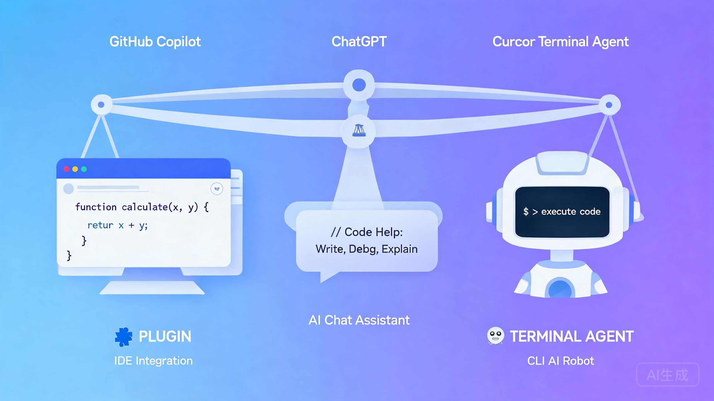

# Cursor vs Copilot vs Claude Code:AI 编码助手横评与选型

> 探小虎 · 技术分享

用过 AI 编码助手的人,多半在这三者之间反复横跳:Cursor、GitHub Copilot、Claude Code。到底该选哪个?网上对比文一堆,但大多是功能罗列——「Cursor 有 Composer,Copilot 有 Workspace,Claude Code 能跑命令」。

功能迭代极快,今天列的功能下个月可能改名。本文不做功能清单,**而是从几个相对稳定的维度横向对比,最后给一棵选型决策树**。功能以官方最新文档为准,但维度的判断框架,几年内都管用。



---

## 一、先厘清:这三者其实不在一个维度

最大的误解是把它仨当同类对比。其实它们**形态不同**:

| 工具 | 形态 | 定位 |
|:---|:---|:---|
| **Cursor** | 独立 IDE(VS Code fork) | IDE-first,把 AI 深度嵌进编辑器 |
| **GitHub Copilot** | IDE 插件(支持 VS Code/JetBrains 等) | 插件-first,跨 IDE 的 AI 副驾 |
| **Claude Code** | CLI / Agent(终端里跑) | Agent-first,直接在终端操作文件系统和命令 |

这个形态差异决定了它们**适合的工作方式完全不同**:

- Cursor 适合**在编辑器里反复打磨**代码的人(交互式、所见即所得);
- Copilot 适合**不想换 IDE、要跨编辑器**的人(低侵入、轻量);
- Claude Code 适合**让 AI 自己跑命令、改多文件、做长任务**的人(Agent 化、终端原生)。

> 一句话概括:**别问「哪个最好」,先问「我想要哪种工作方式」。**

---

## 二、横评的五个关键维度

抛开易变的功能点,看这五个稳定维度:

| 维度 | Cursor | GitHub Copilot | Claude Code |
|:---|:---|:---|:---|
| **交互范式** | 编辑器内对话 + Composer 多文件改 | 行内补全 + Chat + Workspace | 终端对话 + 自主执行命令 |
| **上下文能力** | 强(项目索引、@引用文件) | 中(Workspace 索引整个仓库) | 强(直接读文件系统、跑命令探查) |
| **Agent 能力** | 中(Composer 可多步改) | 中(Agent 模式可调工具) | 强(原生 Agent,跑命令、改文件、提交) |
| **工具集成** | 内置 + MCP 支持 | GitHub 生态深度集成 | MCP 原生 + 终端工具全打通 |
| **侵入性** | 高(要换 IDE) | 低(插件,装哪都行) | 中(终端原生,不进 IDE) |

> 三个工具的强弱会随版本迭代变化,**这里只标相对位置,不标绝对分**。重要的是理解每个维度的「适配场景」,而非记分。

---

## 三、什么时候选 Cursor

**适合:重度依赖编辑器交互、喜欢「所见即所得」打磨代码的人。**

Cursor 把 AI 嵌进编辑器本体,体验最连贯——Composer 多文件改、Tab 预测下一处编辑、@引用精确喂上下文。如果你**整天泡在编辑器里、希望 AI 改完立刻能看 diff 能调试**,Cursor 的体感最好。

代价是**要换 IDE**。从 VS Code 迁过来几乎无痛(fork,快捷键兼容),但如果你深度依赖 JetBrains 或别的 IDE 生态,Cursor 不是你的菜。

---

## 四、什么时候选 GitHub Copilot

**适合:不想换 IDE、要跨编辑器、团队已在 GitHub 生态的人。**

Copilot 是插件形态,装在哪个 IDE 都行,团队统一用 GitHub 的话,和 PR、Issue、Actions 的联动最深。如果你**已经习惯 JetBrains、不想为了 AI 改工作流**,Copilot 是最低成本的选择。

代价是**深度不及原生 IDE**。作为插件,它的多文件改、长任务编排能力,通常弱于把 AI 做进本体的 Cursor,也弱于在终端自由跑命令的 Claude Code。**轻量补全它最强,重度 Agent 任务它偏弱。**

---

## 五、什么时候选 Claude Code

**适合:要让 AI 自主跑长任务、操作文件系统、改多文件并提交的人。**

Claude Code 是终端原生的 Agent——它不进 IDE,直接在终端里读文件、跑命令、改代码、提交分支。如果你想要的是**「给个需求,AI 自己把活干完」的 Agent 化体验**,它最对路。

代价是**不给你编辑器内的精细交互**。它更适合「交代完让它跑,跑完看结果」,而不是「边聊边改边看 diff」。如果你习惯在编辑器里实时打磨,Claude Code 会觉得隔了一层。

---

## 六、选型决策树

把上面的判断收成一棵树:

```
                  你要 AI 干嘛?
                       │
        ┌──────────────┼──────────────┐
        ▼              ▼              ▼
    边聊边改        要 Agent 自己     不想换 IDE
    看实时 diff     跑长任务          轻量补全即可
        │              │              │
        ▼              ▼              ▼
     Cursor       Claude Code     GitHub Copilot
   (换 IDE 可接受)(终端原生 Agent)  (插件跨 IDE)
```

三个都不强的话,也可以**组合用**:编辑器里挂 Copilot 做行内补全,重任务切到 Claude Code 让它自主跑——这是很多人实测后稳定下来的配置。

---

## 七、写在最后:别被「哪个最好」绑架

1. **三者形态不同,不在一个维度。** IDE-first / 插件-first / Agent-first,先选工作方式,再选工具。
2. **看维度而非看功能。** 功能点迭代极快,交互范式、上下文能力、Agent 能力、侵入性这些维度更经得起时间考验。
3. **可以组合用。** 没人规定只能选一个,补全 + Agent 的组合配置往往最实用。

AI 编码助手这个领域,半年一轮大变化。今天选的「最佳」明天可能被超越,但**「按工作方式选工具」这个判断框架不会过时**。

---

> 如果这篇文章对你有启发,欢迎关注公众号「**探小虎**」,我会持续分享 AI Agent、后端架构与算法方面的技术思考。
>
> 相关阅读:《OpenSpec:让 AI 写代码之前,先和你「对齐要做什么」》《AI Agent 设计哲学:工具调用与 MCP》。
