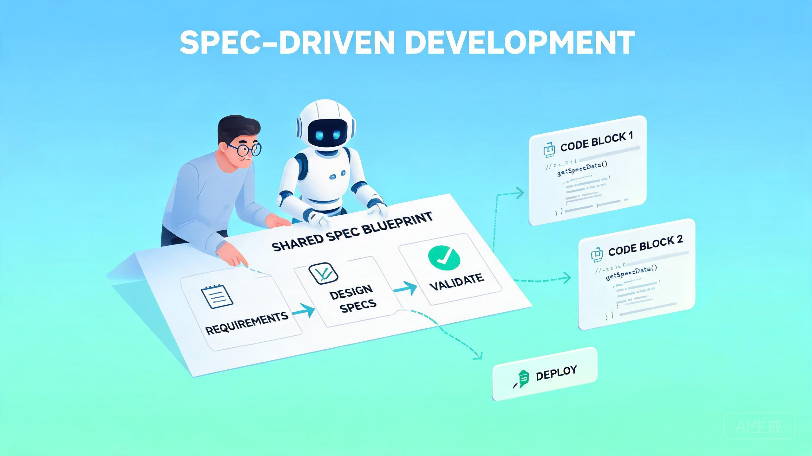
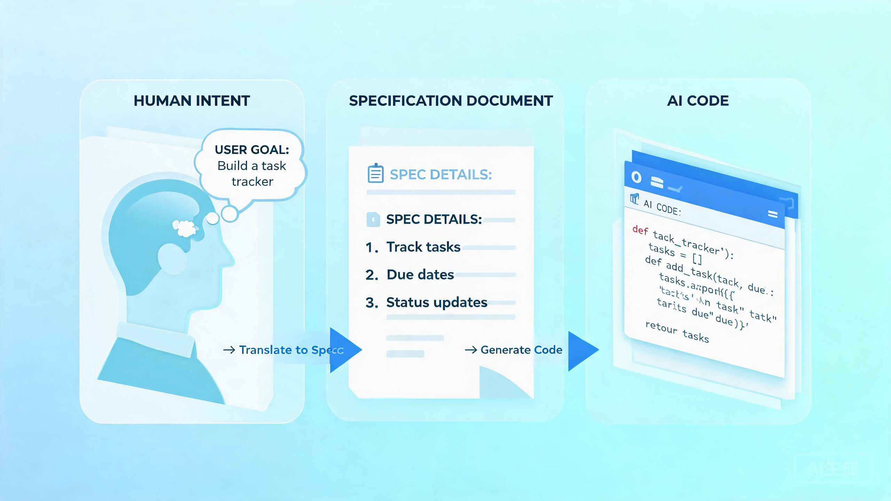
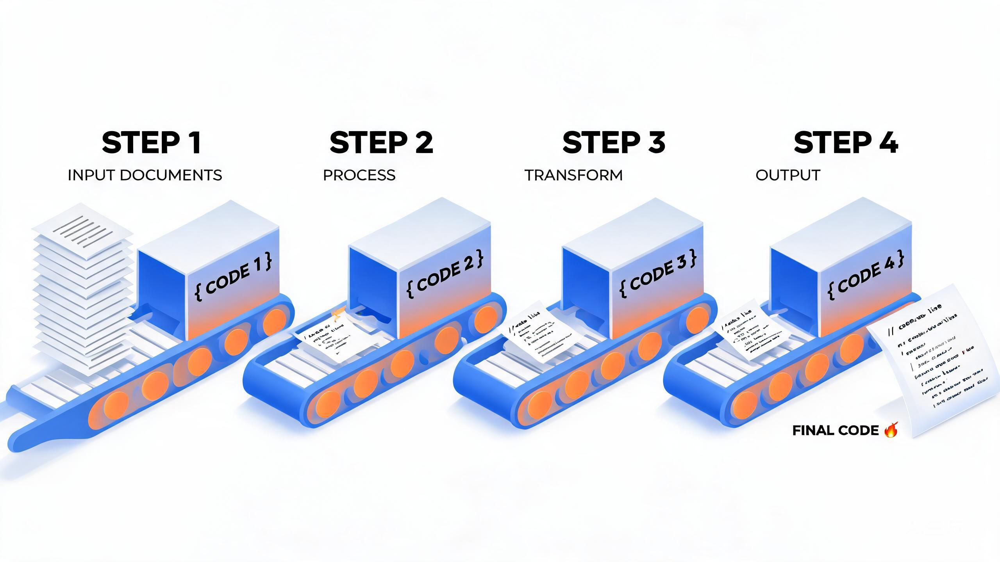

# OpenSpec:让 AI 写代码之前,先和你「对齐要做什么」

> 探小虎 · 技术分享

用过 Cursor、Copilot、Claude Code 的人都有同一种体验:一开始惊为天人,用久了却越来越累——它总是「猜」你要什么,猜偏了就得反复返工,换个会话之前的约定又全忘了。

本文想聊一个叫 [OpenSpec](https://github.com/Fission-AI/OpenSpec) 的开源工具。它想解决的不是「让 AI 写得更快」,而是一个更根本的问题:**在动手写代码之前,怎么先让人和 AI 就「要做什么」达成白纸黑字的共识。**



---

## 一、先说痛点:为什么「AI 写得快」反而让人更累

AI 编码工具的能力毋庸置疑,但它有一个结构性缺陷:**你的需求只活在聊天记录里。**

这会带来三个几乎必然的问题:

| 问题 | 具体表现 |
|:---|:---|
| **猜错意图** | 你说「加个深色模式」,它自作主张改了一堆配色和布局,跟你想的完全两码事 |
| **失忆** | 换个会话、清一次上下文,之前定好的约定它全忘了,又从头猜一遍 |
| **结果漂移** | 同一个需求让它做两次,实现思路南辕北辙,团队里更是各写各的 |


根子上是同一件事:**需求没有一个持久的、可版本管理的载体**。聊天记录会滚走、会清空、会因人而异。于是每一次交互,AI 都在「重新理解你」,而你在「反复纠正它」。

> 一句话概括:**问题不在于 AI 不够聪明,而在于人和 AI 之间缺一份「都认账」的规格说明。**

---

## 二、OpenSpec 的核心思想:在「人的意图」和「AI 的代码」之间,加一层规格

OpenSpec 干的事情很纯粹——它在中间插入一个 **规格层(spec layer)**:

```
   人的意图                          AI 的代码
      │                                ↑
      │                                │
      ▼                                │
┌─────────────────────────────────────────────┐
│            规格层 (OpenSpec)                │
│  先把「要做什么」写成人和 AI 都能读的        │
│  Markdown,人审核通过,再动手写代码           │
└─────────────────────────────────────────────┘
```



关键顺序只有一句话:**先对齐计划,后写代码(align before you build)。**

AI 不再是拿到一句模糊指令就闷头开干,而是先产出一份计划(为什么做、改什么、怎么改、分几步),**由你这个人类审核批准之后,才进入实现阶段**。这一步把「猜错方向」的风险,前置到了「还没写一行代码」的时候。

OpenSpec 自己给这套理念定了五条设计原则,很能说明它的取向:

| 原则 | 含义 |
|:---|:---|
| **fluid not rigid**(流动而非僵化) | 不是重流程,能跟着你的思路走 |
| **iterative not waterfall**(迭代而非瀑布) | 小步快跑,而不是一次性冻结所有需求 |
| **easy not complex**(简单而非复杂) | 全是纯 Markdown,没有任何黑话语法 |
| **built for brownfield**(为存量项目而生) | 不只服务于从零起步的新项目,老项目也能接 |
| **scalable**(可扩展) | 一个人用得了,一个团队也用得了 |

---

## 三、两个核心概念:Specs(规格)与 Changes(变更)

理解 OpenSpec,只要抓住这两个词,以及它们的**时间尺度差异**:

| 概念 | 中文 | 生命周期 | 角色 |
|:---|:---|:---|:---|
| **Specs** | 规格 | **长期存活** | 项目「应该是什么样」的唯一事实来源 |
| **Changes** | 变更 | **短期临时** | 一次「要改成什么样」的原子提案,做完就归档 |


打个比方:**Specs 是宪法,Changes 是一次次修正案。** 你不会直接去改宪法,而是提一份修正案,大家评审通过、落地执行,最后再把它并入宪法正文。

这么分层的好处是:

- 永久的规格始终保持干净、权威;
- 所有「进行中的活儿」都被隔离在变更里,可以并行推进、互不污染;
- 每一次改动都留下了「为什么这么改」的痕迹,而不是只剩一堆 commit。

> 设计哲学:**永久归永久,临时归临时。事实来源(source of truth)和进行中的提案(proposal)物理隔离,各管一摊。**

---

## 四、完整工作流:从一个想法到归档,走一遍

OpenSpec 的日常使用,是一条清晰的流水线。默认的 `core` profile 包含四步主干(在支持的 AI 工具里通过 `/opsx:` 斜杠命令触发):

```
1. 探索 Explore ──► 2. 提案 Propose ──► 3. 实现 Apply ──► 4. 归档 Archive
   /opsx:explore     /opsx:propose       /opsx:apply       /opsx:archive
        │                  │                   │                 │
   零风险地聊清        生成变更文件夹       逐条完成任务       变更并入正式规格
   思路,权衡方案     (计划,人来审核)    (真正写代码)        文件夹移入 archive
```



**第一步:探索(Explore)** —— `/opsx:explore`

和 AI 做一次「零风险」的对话——它会读你的代码、权衡几种方案,帮你把想法捋清楚。这一步不产出任何文件,纯粹是想明白「到底该往哪个方向走」。

> 官方原话:这是和 AI 协作时**最值得养成的一个习惯**,否则 AI 会「自信地建错东西」。

**第二步:提案(Propose)** —— `/opsx:propose <变更名>`

方向定了,AI 会在 `openspec/changes/<变更名>/` 下生成一整套计划文件:

| 文件 | 作用 |
|:---|:---|
| `proposal.md` | 为什么做这件事、改动的整体范围(why & what) |
| `specs/` | 具体需求,配上可验证的场景(Scenario),用 ADDED/MODIFIED/REMOVED 标记增量 |
| `design.md` | 技术方案、实现思路(how) |
| `tasks.md` | 拆好的实现任务清单(带 checkbox) |

**这一步是整个流程的灵魂**:AI 写计划,**你来审核**。你读 `proposal.md` 和 `specs/`,确认方向没跑偏,才放行。

**第三步:实现(Apply)** —— `/opsx:apply`

审核通过后,AI 才按 `tasks.md` 里的清单**逐条落地写代码**。因为计划已经白纸黑字定好,它不会再中途「发挥」。实现过程中如果发现计划要改,可以回头更新计划文件,而不是偷偷改代码。

**第四步:归档(Archive)** —— `/opsx:archive`

变更完成,这个文件夹被移入 `openspec/changes/archive/YYYY-MM-DD-<变更名>/`,同时把改动**并入正式的 `specs/`**。一次迭代闭环,规格随之进化。

> 归档前如果想先把 delta specs 合并进主 specs,可以跑一步可选的 `/opsx:sync`;`/opsx:archive` 默认也会处理这件事。

> 除了四步主干,`core` profile 里还有 `/opsx:update`(刷新计划)。开启 expanded profile(`openspec config profile`)后,还能用 `/opsx:new`、`/opsx:continue`、`/opsx:ff`、`/opsx:verify`、`/opsx:bulk-archive`、`/opsx:onboard` 等命令服务更复杂的场景。

---

## 五、目录结构:所有东西都是纯 Markdown

`openspec init` 会在项目根目录生成一个 `openspec/` 文件夹,结构如下(摘自官方 Getting Started):

```
openspec/
├── specs/                     # 永久的、活的需求(事实来源 / source of truth)
│   └── <domain>/              # 按业务领域分组,如 auth/、payments/
│       └── spec.md
├── changes/                   # 进行中的变更(一个变更一个文件夹)
│   └── <change-name>/
│       ├── proposal.md        # 为什么做、改什么
│       ├── design.md          # 技术方案
│       ├── tasks.md           # 任务清单(带 checkbox)
│       └── specs/             # Delta specs:本次要新增/修改/删除的需求
│           └── <domain>/
│               └── spec.md
└── config.yaml                # 项目配置(可选)
```

注意两个要点:

1. **specs 按 domain 分组**,不是堆在一个 `requirements.md` 里。`auth`、`payments`、`billing` 各管一摊,改动定位更准。
2. **changes 里的 specs 是「增量(delta)」**,用 `ADDED / MODIFIED / REMOVED` 标记本次要做什么动作,而不是把整个系统的需求重抄一遍。

规格长这样(直接摘自官方示例):

```markdown
## ADDED Requirements
### Requirement: Theme selection
The app SHALL let users switch between light and dark themes,
defaulting to the system preference.

#### Scenario: User toggles dark mode
- **WHEN** the user clicks the theme toggle
- **THEN** the app switches to dark mode and persists the choice
```

用的是接近自然语言的 `SHALL / WHEN / THEN` 句式——**人一眼看得懂,AI 也解析得了**。全部走 Git 版本管理,谁改了什么、为什么改,历史里一清二楚。

> 设计哲学:**规格必须同时对人和机器友好。纯 Markdown 是最大公约数——不引入学习成本,不锁死工具,还天然能被 Git 追踪。**

---

## 六、上手:三条命令就能跑起来

OpenSpec 是一个 npm 全局命令行工具。**前置要求:Node.js 20.19.0 或更高。**

```bash
# 1. 全局安装
npm install -g @fission-ai/openspec@latest

# 2. 进入你的项目,初始化
cd your-project
openspec init          # 生成 openspec/ 目录 + 对应 AI 工具的指令文件

# 3. 升级后刷新指令(可选)
openspec update        # 更新写给 AI 的说明文件
```

初始化时它会问你用的是哪个 AI 工具——OpenSpec 目前适配了 **30 多种主流助手**(Cursor、GitHub Copilot、Claude Code、Codex、Amazon Q、Cline、Continue、Augment、CoStrict 等),会自动为对应工具写好 `/opsx:` 斜杠命令的接入文件。

之后你在 AI 工具里直接 `/opsx:propose "加个深色模式"`,流水线就转起来了。

> **小坑提示:** `/opsx:propose` 是规范名,不同工具下写法略有差异——Cursor 和 GitHub Copilot 是 `/opsx-propose`,Amazon Q 是 `@opsx-propose`,Codex 是 `$openspec-propose`。`openspec init` 会打印你选的工具对应的正确写法。

一些常用的辅助命令:

| 命令 | 作用 |
|:---|:---|
| `openspec list` | 列出进行中的变更(加 `--specs` 列出规格) |
| `openspec view` | 交互式仪表盘,查看规格与变更全貌 |
| `openspec archive` | 归档已完成的变更并更新主规格 |
| `openspec config` | 查看/修改配置(如关闭匿名遥测) |

> 官方提醒:OpenSpec 在**干净上下文 + 高推理模型**下表现最好。开始一个变更前清一下上下文窗口,效果会好很多。

---

## 七、它到底适合谁

OpenSpec 不是银弹,值不值得引入,取决于你的场景:

**适合的情况**

- 用 AI 写**有一定复杂度**的功能,而不是一次性小脚本;
- 多人协作,需要一份**大家都认账**的需求文档;
- 老项目(brownfield)迭代,改动需要留痕、可回溯;
- 反复被「AI 猜错方向、来回返工」折磨过。

**没那么必要的情况**

- 只是让 AI 帮你写个几十行的一次性小工具;
- 需求你自己都还没想清楚、纯探索性质的玩耍。

> 设计哲学:**规格的成本,是为了换取「不返工」的收益。任务越复杂、协作越多、生命周期越长,这笔账就越划算;反之则可能是过度工程。**

> **延伸:** 如果你的需求横跨多个仓库(API 服务 + Web 前端 + 共享库),OpenSpec 还有一个 beta 功能叫 **Stores**——把规划放在一个独立的「规划仓库」里,通过 `git push` 让整个团队和所有编码 agent 共享同一份事实来源,跨仓库的变更只写一份计划。

---

## 八、写在最后:规格驱动,是给 AI 时代补上的「工程纪律」

回头看,OpenSpec 想做的事情,其实和几十年来软件工程一直在强调的东西一脉相承——**先想清楚要做什么,再动手做**。

只不过在 AI 编码的语境下,这件事有了新的紧迫性:当代码可以被「一句话生成」,**「想清楚」这一步反而成了最容易被跳过、也最致命的一环**。OpenSpec 的价值,就是用一层轻量的规格,把这一步重新钉回流程里——

1. **先对齐,后写码。** 让人在「零成本」的计划阶段就把方向定死,而不是在代码里返工。
2. **规格是资产,聊天是过程。** 需求应该沉淀成可版本管理的事实来源,而不是随会话飘散。
3. **对人和机器都友好。** 纯 Markdown、自然语言句式,不给协作双方任何一方增加负担。

AI 让「写代码」变得空前廉价,但也让「写对代码」变得空前重要。OpenSpec 提醒我们的,或许正是这样一件朴素的事:**工具越强,越需要在动手之前,先达成共识。**

---

> 如果这篇文章对你有启发,欢迎关注公众号「**探小虎**」,我会持续分享 AI Agent、后端架构与算法方面的技术思考。
>
> 相关阅读:《AI Agent 设计哲学:从「会聊天的模型」到「会做事的系统」》。
