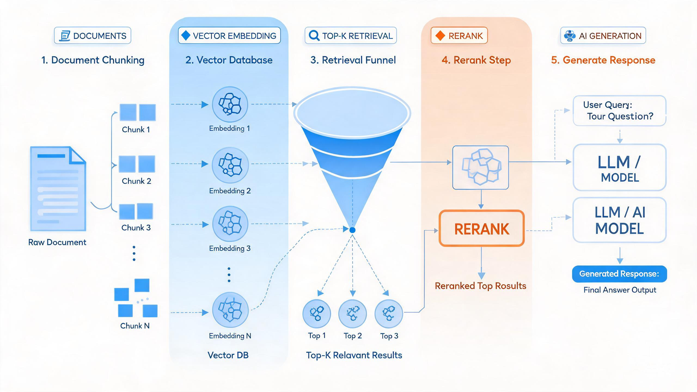

# RAG 实战:从朴素拼接到工程化检索增强

> 探小虎 · 技术分享

RAG(检索增强生成)看起来简单得像四步:切块 → 向量化 → 检索 → 塞进上下文。教程跑通半天,上线后却各种翻车——召回不准、答非所问、漏关键知识、幻觉照旧。

问题不在 RAG 这条路,而在**朴素 RAG 把每个环节都当成了「能跑就行」**。工程化的 RAG,每个环节都有讲究。本文按流程拆开聊,每个环节给判断标准。



---

## 一、RAG 的本质不是「检索」,是「精准召回此刻需要的」

先把 RAG 想清楚:它不是「去知识库搜点东西塞给模型」,而是**用最小的上下文成本,把此刻这一问真正需要的一小段知识精准捞出来**。

```
朴素理解:RAG = 检索 + 拼接
工程理解:RAG = 精准召回此刻需要的最小片段
```

这个本质决定了后面所有环节的设计目标——**不是「搜得多」,而是「搜得准、塞得少」**。

> 一句话概括:**RAG 的终极衡量标准,是「模型拿到这小段,就能答对」;多塞一段都是浪费,少塞一段就是漏。**

---

## 二、朴素 RAG 为什么不够用

朴素 RAG 的典型问题:

| 问题 | 根因 |
|:---|:---|
| **召回不准** | embedding 不贴领域 / 检索没重排 |
| **片段断裂** | chunking 切碎了上下文 |
| **塞太多** | top-k 设太大,又回到上下文爆炸 |
| **答非所问** | 检索靠字面相似,语义没对齐 |
| **知识过期** | 文档变了索引没重建 |

每个问题都对应一个工程化环节,下面逐个拆。

---

## 三、chunking:切块的艺术

切块是 RAG 最被低估的环节。切错,后面全白干。

| 切法 | 问题 |
|:---|:---|
| **太碎**(按句切) | 片段没上下文,模型看不懂 |
| **太大**(整篇切) | 召回时混入无关内容,塞进去浪费窗口 |
| **无重叠** | 关键信息被切在边界,两边都捞不全 |

**工程做法:按 token 数切块 + 重叠窗口。** 每块 200~500 token,块之间重叠 10~20%,保证边界信息不被切丢。代码、表格这种结构化内容,**按语义边界切**(按函数、按行),不要硬按字数。

> 设计哲学:**chunking 的目标是「每块都能独立被理解」。切完自己读一遍,读得懂才算合格。**

---

## 四、embedding:选型与误区

embedding 模型决定了「相似」的质量,是 RAG 准确率的地基。

选型看三点:

1. **贴领域。** 通用 embedding 在法律、医疗、代码等领域常不够准,优先选领域微调的。
2. **维度与成本。** 高维度更准但检索更慢、存储更贵;别一味求高,够用就行。
3. **中英文支持。** 中文场景务必选中文友好的 embedding,别拿纯英文模型硬上。

常见误区:**换 embedding 比调 prompt 有用十倍**。召回不准,先看 embedding 选对没,别先去改 prompt。

---

## 五、向量检索 + 重排

检索环节两层,新手常只做第一层:

**1)召回(recall)—— 向量检索。** 从海量里粗筛出 top-N(比如 top-20)候选。这层追求「别漏」,宁可多捞。

**2)重排(rerank)—— 精排。** 用更强的模型对 top-N 精排,只留 top-3~5。这层追求「别错」,去掉噪声。

```
知识库(百万级)
    ↓ 向量检索(粗筛)
top-20 候选(宁多勿漏)
    ↓ rerank 精排
top-3~5(只留精的)
    ↓
塞进 prompt
```

**为什么必须重排?** 向量相似 ≠ 语义相关——「苹果」(水果)和「苹果」(公司)向量很近,但答错。rerank 模型能结合上下文判断真正相关性。

> top-k 别贪大。塞 20 段远不如精准塞 3 段——又回到「最小够用」。

---

## 六、评测:RAG 不是「感觉不错」就行的

RAG 上线前必须有评测,不然你根本不知道改了某环节是变好还是变差。

至少两个指标:

| 指标 | 测什么 |
|:---|:---|
| **召回率** | 真正该被捞出来的片段,捞出来没 |
| **答案准确率** | 最终答案对不对(可用 LLM-as-judge) |

建一个 golden set(几十~几百个标注好的问答对),每次改动都跑一遍回归。**没评测的 RAG 调参,等于蒙眼开车。**

---

## 七、常见踩坑速查

| 坑 | 后果 | 解法 |
|:---|:---|:---|
| **chunking 按字数硬切** | 片段断裂 | 按 token + 重叠,结构化按语义边界 |
| **embedding 不贴领域** | 召回不准 | 换领域 embedding,别先改 prompt |
| **只检索不重排** | 噪声多 | 加 rerank 精排 |
| **top-k 贪大** | 上下文爆炸 | 控 3~5,加相关度阈值 |
| **索引不更新** | 知识过期 | 文档变更触发增量索引 |
| **没评测** | 调参靠感觉 | 建 golden set 做回归 |

---

## 八、写在最后

1. **RAG 的本质是精准召回,不是拼接。** 目标是「模型拿到这小段就能答对」。
2. **每个环节都有讲究。** chunking / embedding / 检索 / 重排 / 评测,任一环节偷懒,全链路崩。
3. **没评测别调参。** golden set 回归是 RAG 工程化的底线。

朴素 RAG 是「能跑」,工程化 RAG 是「能用」。两者之间差的就是每个环节的克制和精准。

---

> 如果这篇文章对你有启发,欢迎关注公众号「**探小虎**」,我会持续分享 AI Agent、后端架构与算法方面的技术思考。
>
> 相关阅读:《AI Agent 设计哲学:记忆的三层架构》《AI 应用评测怎么做:别只靠「感觉不错」》。
