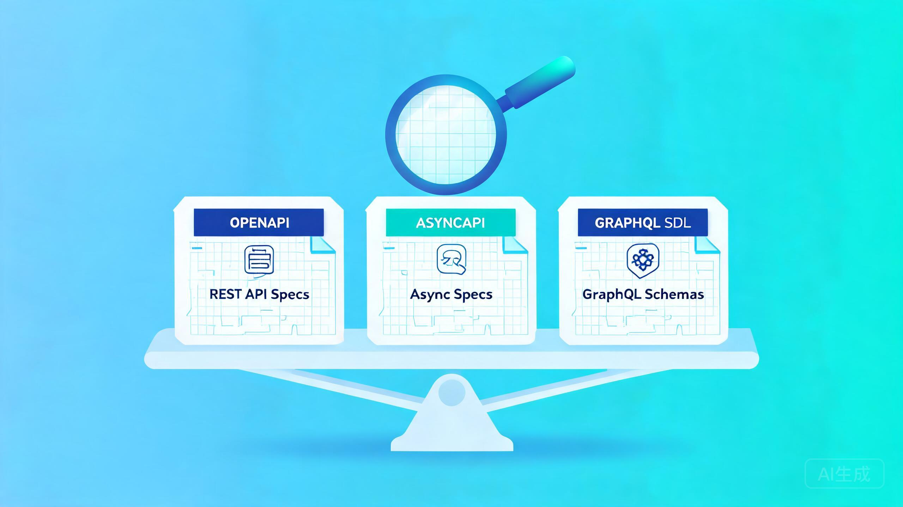

# Spec-Driven 工具横评:OpenSpec / spec-kit / Kiro 怎么选

> 探小虎 · 技术分享

AI 编码时代,「想清楚要做什么」成了最容易被跳过、也最致命的一环。于是「规格驱动开发(spec-driven)」重新回到聚光灯下——在写代码之前,先把规格(spec)写下来,人和 AI 都认账,再动手。

这个赛道目前有三个代表工具:**OpenSpec**(Fission-AI)、**spec-kit**(GitHub)、**Kiro**(AWS)。功能迭代极快,本文不做功能清单,而是从几个稳定维度横评,**给一套选型判断框架**。具体功能以官方文档为准。



---

## 一、为什么 spec-driven 突然重要

传统软件工程几十年一直在喊「先想清楚再动手」,但在 AI 编码语境下,这件事有了新紧迫性:

```
传统开发:  想 → 写(成本高,「想」自然被重视)
AI 编码:   想 → 一句话生成(「写」变廉价,「想」反被跳过)
```

当代码可以被一句话生成,**「想清楚」反而成了最容易被跳过、也最致命的一环**。spec-driven 的价值,就是用一层轻量规格,把这一步重新钉回流程。三大工具都在干这件事,但路线很不一样。

---

## 二、三大工具速览

| 工具 | 出身 | 形态 | 定位 |
|:---|:---|:---|:---|
| **OpenSpec** | Fission-AI 开源 | CLI + 跨 AI 工具斜杠命令 | 轻量、跨工具、brownfield 友好 |
| **spec-kit** | GitHub 开源 | Python 工具链 + 模板 | 重量、流程严格、模板丰富 |
| **Kiro** | AWS | 独立 IDE(服务化) | 一站式 IDE,规格内建 |

三者的差异不在「能不能写规格」,而在**流程多僵、绑多死、从零还是接存量**。

---

## 三、横评的关键维度

| 维度 | OpenSpec | spec-kit | Kiro |
|:---|:---|:---|:---|
| **流程僵化度** | 流动,可随时改计划 | 较僵,有阶段门 | 内建流程,IDE 引导 |
| **greenfield / brownfield** | 双修,brownfield 强 | 偏 greenfield(新项目) | 双修,IDE 内建 |
| **工具锁定** | 无,纯 Markdown + 30+ AI 工具 | 较松,Markdown 为主 | 强,绑 Kiro IDE |
| **格式开放性** | 纯 Markdown,无私有格式 | Markdown 为主 |  IDE 内规格,迁移有成本 |
| **上手成本** | 低(npm 一装即用) | 中(Python 环境配置) | 中(要装 IDE) |
| **AI 工具兼容** | 30+ 主流助手(Cursor/Copilot/Claude…) | 主要配 GitHub 生态 | 绑 Kiro 自家 |

> 这里的判断基于各工具公开的设计取向,具体能力以官方最新文档为准。

---

## 四、什么时候选 OpenSpec

**适合:存量项目(brownfield)迭代、跨 AI 工具、不想被绑死的人。**

OpenSpec 是纯 Markdown + CLI,不绑任何 IDE,初始化时让你选 AI 工具,自动生成对应的 `/opsx:` 斜杠命令。最大特点是 **specs(长期规格)和 changes(短期变更)物理隔离**——这让它特别适合「老项目持续迭代、改动要留痕」的场景。

代价是**流程较松**,需要团队自觉遵守。如果你要的是「强制走完每一步」的重流程,OpenSpec 偏轻。

---

## 五、什么时候选 spec-kit

**适合:从零起步的新项目、流程要严格、团队已经在 GitHub 生态。**

spec-kit 走的是「重流程」路线:阶段门清晰、模板丰富、文档详尽。新项目从规格起步,把它当工程脚手架,能少走很多弯路。

代价是**重量级**。要装 Python 环境、要按它的模板走,对存量项目改造、对轻量需求,都是过度工程。它更适合 greenfield。

---

## 六、什么时候选 Kiro

**适合:想要一站式 IDE 体验、不在意工具锁定、想要规格内建的人。**

Kiro 把规格流程做进了 IDE 本体——不用装 CLI、不用配斜杠命令,开箱即用,IDE 全程引导。如果你**想要的是「最少配置、开箱就跑」**,Kiro 最省心。

代价是**绑定 Kiro IDE**,规格存在它的体系里,迁移到别的工具有成本。对「不想被绑」的人,这是硬伤。

---

## 七、选型建议

把判断收成一句话:

- **存量项目 + 不绑工具** → OpenSpec
- **新项目 + 重流程 + GitHub 生态** → spec-kit
- **要开箱即用 + 不怕绑定** → Kiro

一棵决策树:

```
                  你的场景?
                      │
       ┌──────────────┼──────────────┐
       ▼              ▼              ▼
   存量项目        新项目           要开箱即用
   不绑工具        要重流程         不怕绑 IDE
       │              │              │
       ▼              ▼              ▼
    OpenSpec       spec-kit         Kiro
```

> 三个工具都在快速迭代,选型前务必去各自官方仓库/官网核一遍最新能力。但「按场景选工具」的框架,不会过时。

---

## 八、写在最后

1. **spec-driven 是给 AI 时代补的工程纪律。** 工具越强,越需要在动手前对齐。
2. **三者路线不同,不在一个维度。** OpenSpec(轻量跨工具)/ spec-kit(重流程新项目)/ Kiro(IDE 一站式)。
3. **按场景选,不按「谁最好」选。** 存量项目、新项目、开箱即用,各有最配的工具。

规格驱动不是回到瀑布流,而是**在 AI 让「写代码」变廉价的时代,把「想清楚」重新钉回流程**——选哪个工具是次要的,把这一步钉回去才是主要的。

---

> 如果这篇文章对你有启发,欢迎关注公众号「**探小虎**」,我会持续分享 AI Agent、后端架构与算法方面的技术思考。
>
> 相关阅读:《OpenSpec:让 AI 写代码之前,先和你「对齐要做什么」》《AI 编码助手横评:Cursor vs Copilot vs Claude Code》。
