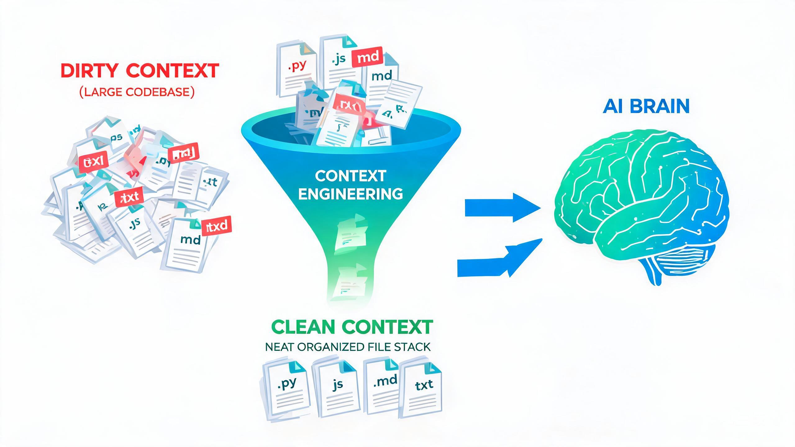

# 万物皆可 Markdown

先说一个我最近才认真意识到的事实：过去一周，我和 AI 打交道的所有「文件」，几乎全是 Markdown。

- 给 Claude Code 立规矩，写的是 AGENTS.md；
- Agent 的长期记忆，存的是 memory 目录下的一堆 .md；
- AI 编码工具的规格文档（OpenSpec / spec-kit），产出是 Markdown；
- 模型回答我的每一句话，渲染出来还是 Markdown；
- 连我自己仓库里两百多篇面试笔记、刷题记录、知识库 wiki，底座也是 Markdown。

Markdown 诞生于 2004 年，初衷是「让不懂 HTML 的人也能写出结构化的文章」——那时候它的读者是人。二十年后，它最大的读者群变成了模型。



这篇文章想聊清楚一件事：**Markdown 已经不只是「写文档的语法」，而是人与 AI 之间的通用协议。** 想明白这一点，你在做提示词、上下文工程、Agent 记忆设计时的很多选型，会突然变得有依据。

## 一、Markdown 在 AI 里的五重身份

### 1.1 模型的母语

一个模型对「结构化文本」的理解习惯，是由训练语料的分布决定的。

大模型训练语料里，技术文本的三巨头是：GitHub（README、issue、discussion）、Stack Overflow、各类技术文档与 Jupyter Notebook。这些内容的最大公约数是什么？Markdown。

所以对模型来说，Markdown 不是「一门需要现学的外语」，而是它组织结构化知识的母语。这解释了一个所有人都见过、但很少有人深想的现象：**所有主流对话产品的默认输出都是 Markdown。** 不是产品经理拍脑袋，是模型用母语作答最省力、质量最稳。

由此有个直接推论：同样一份内容，用 Markdown 喂给模型，理解损耗通常最低。喂 JSON 也能读懂，但模型要先「翻译」一遍；喂 Markdown，直接就懂。

### 1.2 模型的输出层：一份输出，两个读者

对话产品把模型的 Markdown 回答渲染成排版：人看到标题、列表、表格、代码高亮；下游程序拿到的又是纯文本结构，可以抽代码块、按标题切分、转 HTML 发邮件。

这其实是个非常难得的工程性质：

> Markdown 是少数在「人读的体验」和「机器解析的效率」上同时及格的格式。HTML 排版好但太重，纯文本轻但没结构，JSON 结构好但人没法直接读。

一鱼两吃，是它成为默认输出层的根本原因。

### 1.3 上下文工程的标配载体

打开任何一个 AI 编码工具的项目规则文件——CLAUDE.md、AGENTS.md、.cursorrules——清一色 Markdown。System prompt 也基本是 Markdown 写的：标题分节、列表列规则、代码块放示例。

为什么规则文件都用 Markdown？因为一份规则文件有三个读者：

- 写它的人：要能维护、能改；
- 读它的模型：要能稳定理解；
- review 它的同事：要能看 diff、能提意见。

同时讨好三个读者的格式，只有 Markdown。我们在《Context Engineering》里说过「CLAUDE.md 是给 AI 看的项目宪法」——宪法的书写格式本身，就是一次选型。

### 1.4 Agent 的记忆与知识库格式

再往深一层，Agent 的「脑子」也是用 Markdown 存的：

- **记忆文件**：Agent 的长期记忆，通常落成 memory 目录下的一堆 .md；
- **知识库**：我们在《LLM Wiki 技术调研》里讨论过的 wiki 层，载体就是 .md，`[[双链]]` 同时供 Agent 和编辑器使用；
- **技能文件**：SKILL.md = frontmatter 元数据 + Markdown 正文，一个文件同时给「程序」和「模型」读。

我自己就是个极端案例：仓库里两百多篇 Markdown——算法笔记、八股文、系统设计、wiki 层——既是「我」的复习入口，也是 Agent 的消化原料。人和模型共用一套知识底座，「万物皆可 Markdown」在这里不是修辞，是物理现实。

### 1.5 结构化输出的轻量替代

让模型返回数据，不一定非要上 JSON。标题 + 列表 + 表格，很多时候就够了：

- Markdown 表格是「模型最容易正确生成、人最容易肉眼核对」的表格；
- 报告类输出（周报、总结、调研文档）天然适合 Markdown，而不是一坨 JSON 再由前端二次渲染。

当然，边界也很清楚，见第四节。

## 二、一张表看懂：谁该用什么格式

把 Markdown、JSON、XML、YAML 放在「人机接口」这个维度下对比：

| 维度 | Markdown | JSON | XML | YAML |
| --- | --- | --- | --- | --- |
| token 开销 | 极低（符号即语义，1~2 字符） | 中（引号、逗号、括号密集） | 高（闭合标签全部重复） | 低（但依赖缩进） |
| 人可读 | 极高 | 差，嵌套一深就崩 | 中 | 高 |
| 人可维护 | 极高，改一行是一行 | 差，改字段容易碰坏结构 | 差 | 中，缩进是隐形坑 |
| 容错性 | 极强，符号打错照样读 | 零容忍，少个逗号全盘 parse 失败 | 中 | 弱，缩进错位会静默改变语义 |
| 语义严格性 | 弱，无 schema | 强，有 schema 体系 | 强 | 中 |
| 模型生成稳定性 | 高 | 高（超长输出尾部易出错） | 中 | 低，缩进错误高发 |
| 最佳场景 | 散文、规则、文档、回复 | 工具调用、API、需要 schema 的数据 | prompt 内的段落标签（Anthropic 风格） | 配置文件 |

token 开销不是抽象概念，直接上例子。同一段信息的三种写法（不计换行，注释行除外）：

```text
<!-- XML：约 78 字符 -->
<section title="注意事项">
  <item>先判断不确定性来源</item>
  <item>固有的交给模型</item>
</section>

// JSON：约 48 字符
{"title":"注意事项","items":["先判断不确定性来源","固有的交给模型"]}

<!-- Markdown：约 27 字符 -->
## 注意事项
- 先判断不确定性来源
- 固有的交给模型
```

信息量完全一致，Markdown 的字符数约为 XML 的三分之一，token 开销近似同比例。在上下文按 token 计费、按 token 排队的今天，这不是小事，是每天都要付的房租。

所以结论一句话：

> **给模型读的「散文」，用 Markdown；给程序消费的「数据」，用 JSON。** 两者不是竞争关系，是分工关系。

## 三、为什么赢的是 Markdown？

Markdown 的语法并不是最优雅的（YAML 更简洁，XML 更严格），但它赢了。四个原因：

### 3.1 语料分布决定母语

如 1.1 所说，模型的结构化母语就是 Markdown。这是格式竞争在 AI 时代的第一条铁律：**模型的母语是一种不可移植的先发优势。** 你可以发明一个更好的格式，但你造不出一个已经用它训练好的模型。

### 3.2 token 经济学

符号即语义：`#` 一个字符表达「标题」，`-` 一个字符表达「列表项」。对比 XML 的 `<item></item>`，开销差一个数量级。上下文窗口是稀缺资源，**格式本身就是成本**。

### 3.3 容错性就是可靠性

模型是概率性输出。JSON 少个引号，整段 parse 失败；Markdown 少个反引号，照样读。**对概率性系统来说，容错不是锦上添花，是可靠性的来源。** Markdown 是「降级安全」的格式：最坏情况它退化成纯文本，依然可读、可解析。

### 3.4 人机共读是刚需

Agent 产出的文件，人要 review、要 git diff、要手改。让工程师在 JSON 里手写一段规则是酷刑，在 Markdown 里是日常。**AI 时代的好格式，必须同时讨好两个读者：喂模型的人，和读输出的人。**

这四条凑在一起，Markdown 的胜利就不是玄学：它在每个维度都不是第一名，但在所有维度都及格——而格式选型的淘汰赛，淘汰的从来是「有明显短板」的选手。

## 四、冷思考：Markdown 的边界

吹完了，泼四盆冷水。判断标准永远比赞美有用。

### 4.1 方言丛林

CommonMark、GFM、各家渲染器的方言……同一份 .md 在 GitHub、公众号编辑器、静态站点生成器上的渲染结果可能完全不同，表格、脚注、数学公式的支持参差不齐。做「Markdown 进、Markdown 出」的管线时，方言差异是真实成本——我们做公众号排版时对此深有体会。

### 4.2 无 schema，说不了硬约束

Markdown 表达不了「这个字段必须是整数、必填」。所以你会看到：

- function calling / structured output 用的是 JSON Schema；
- Anthropic 官方建议在 prompt 里用 XML 标签包段落（如 `<documents>`、`<rules>`）来划清边界。

> 散文归 Markdown，数据归 JSON，需要强隔离的段落借 XML 的壳。三者在真实的 Agent 系统里是并存的，各司其职。

### 4.3 深嵌套反人类

Markdown 嵌套列表超过三层，人断片，模型也容易断链。上下文工程的实战经验：**宁可平铺十个二级标题，不要嵌套四层列表。** 格式结构是给模型当「注意力路标」用的，路标要浅而密，不要深而绕。

### 4.4 格式即语义，滥用即污染

Markdown 里的标题、加粗、代码块，对模型来说都是注意力路标。一份满篇加粗、层级混乱的 Markdown 上下文，效果可能还不如干净的纯文本——格式噪声会稀释真正重要的内容。写「给模型看的 Markdown」时，**格式纪律就是提示词质量本身**。

## 五、一个正在发生的分化：写给人的 vs 写给模型的 Markdown

最后说一个我认为被低估的趋势：Markdown 的读者正在分化。

- **写给人的 Markdown**：重叙事、有铺垫、可以长。读者会从头读到尾。
- **写给模型的 Markdown**：重结构、结论前置、每节自带小结。读者是按需检索的——模型往往带着一个具体任务来扫全文，只取它此刻需要的那部分。

写给模型的 Markdown，写法更接近「文档化良好的代码」，而不是「文章」：指令前置、列表优先、每节可独立理解、表格多于段落。

这意味着同一个知识库，未来可能要维护两个视图：人的阅读视图、模型的消化视图。我们的做法是 raw 层写给人、wiki 层写给模型，中间用双链连接——同一份知识，两种编译产物。

## 六、写在最后

回到标题：万物皆可 Markdown。

它赢，不是因为设计得最好，而是因为它同时做到了：模型最习惯（母语）、token 最省（经济）、错了也能读（鲁棒）、人还能改（共读）。四个维度同时及格，在 AI 时代就是通用协议。

> 一句话总结：**给人读的用 Markdown，给机器用的用 JSON；而既要给人读、又要给模型读的，只能是 Markdown。**

最后送一个可带走的判断框架。当你犹豫「这段内容用什么格式喂给模型 / 从模型产出」时，问两个问题：

1. **主要读者是谁？** 人 → Markdown；程序 → JSON；需要强隔离的段落 → XML 标签。
2. **容错要求是什么？** 能容忍格式噪声 → Markdown；一个字符都不能错 → JSON Schema。

哦对了，这篇文章的源文件，也是一份 Markdown。

你看，万物皆可 Markdown。

---

**延伸阅读**

- 《Context Engineering：给 AI 编码助手喂上下文的工程化方法》——CLAUDE.md / AGENTS.md 的写法，就是「写给模型的 Markdown」的最佳练习场
- 《LLM Wiki 技术调研》——当知识库的读者变成模型，知识的组织方式该怎么变
- 《OpenSpec：让 AI 写代码之前，先和你「对齐要做什么」》——规格层的 Markdown，如何在意图与代码之间架桥
